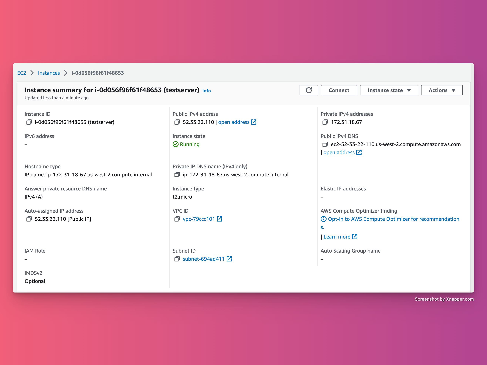

# How to Configure NGINX on Ubuntu to Run a NodeJS Web Server

|                                                                 |
| :-----------------------------------------------------------------------------------------------------------------: |
| *Photo by [Gabriel Heinzer](https://unsplash.com/@6heinz3r) on [Unsplash](https://unsplash.com/photos/xbEVM6oJ1Fs)* |

In this tutorial, we will learn how to configure [NGINX](https://www.nginx.com/) on Ubuntu to run a NodeJS web server. NGINX  is a popular web server that is used to serve web content. It is fast, reliable, and secure. It can  also be used as a reverse proxy server for HTTP, HTTPS, and other protocols.

You might require the above setup while trying to run a web server on an [AWS EC2 instance](https://aws.amazon.com/pm/ec2).

## Prerequisites

Before you start, you'll need the following:

* A Ubuntu server with an SSH access
* NGINX installed
* Node.js installed

## Step 1: Create a Node.js Application

First, create a sample Node.js application that will serve as the basis of your Node.js web server.

Create a new file called `app.js` and add the following code:

```js
const http = require('http');
const port = 3000;

const requestHandler = (request, response) => {
    console.log(request.url);
    response.end('Hello Node.js Server!');
}

const server = http.createServer(requestHandler);

server.listen(port, (err) => {
    if (err) {
        return console.log('something bad happened', err);
    }

    console.log(`server is listening on ${port}`);
});
```

Save the file and start the application by running the following command:

```bash
node app.js
```

You should see the following output:

```bash
server is listening on 3000
```

## Step 2: Configure NGINX

Now, you need to configure NGINX to proxy requests to your Node.js application. To do this, open the NGINX configuration file in a text editor:

```bash
sudo nano /etc/nginx/sites-available/default
```

Add the following code to the `server` block of the configuration file:

```conf
location / {
    proxy_pass http://localhost:3000;
    proxy_http_version 1.1;
    proxy_set_header Upgrade $http_upgrade;
    proxy_set_header Connection 'upgrade';
    proxy_set_header Host $host;
    proxy_cache_bypass $http_upgrade;
}
```

Save and close the file.

## Step 3: Restart NGINX

Finally, restart the NGINX service to apply the changes you have made:

```bat
sudo systemctl restart nginx
```

## Test the Node.js Application

To test the Node.js application, open your web browser and access the URL `http://your_server_ip`. You should see the following output:

```ini
Hello Node.js Server!
```

Note: If you are using an AWS EC2 instance, you can find the server IP address on the EC2 instance dashboard. The screen



With this, you have successfully configured NGINX on Ubuntu to run a Node.js web server.
