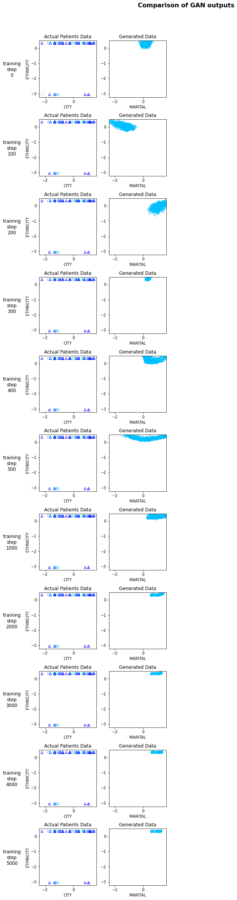

In this post, we will see how to generate tabular synthetic data using Generative adversarial networks(GANs). The goal is to generate synthetic data that is similar to the actual data in terms of statistics and demographics. 

## Introduction

It is important to ensure data privacy while publicly sharing information that contains sensitive information. There are numerous ways to tackle it and in this post we will use neural networks to generate synthetic data whose statistical features match the actual data. 

We would be working with the Synthea dataset which is publicly available. Using the patients data from this dataset, we will try to generate synthetic data. 

https://synthetichealth.github.io/synthea/

## Data Preprocessing

Firstly, download the publicly available synthea dataset and unzip it. 

 

### Remove unnecessary columns and encode all data

Next, read patients data and remove fields such as id, date, SSN, name etc. Note, that we are trying to generate synthetic data which can be used to train our deep learning models for some other tasks. For such a model, we don't require fields like id, date, SSN etc. 



    Index(['MARITAL', 'RACE', 'ETHNICITY', 'GENDER', 'BIRTHPLACE', 'CITY', 'STATE',
           'COUNTY', 'ZIP', 'HEALTHCARE_EXPENSES', 'HEALTHCARE_COVERAGE'],
          dtype='object')

Next, we will encode all [categorical features](https://en.wikipedia.org/wiki/Categorical_variable) to integer values. We are simply encoding the features to numerical values and are not using one hot encoding as its not required for GANs. 



<table border="1" class="dataframe">
  <thead>
    <tr style="text-align: right;">
      <th></th>
      <th>MARITAL</th>
      <th>RACE</th>
      <th>ETHNICITY</th>
      <th>GENDER</th>
      <th>BIRTHPLACE</th>
      <th>CITY</th>
      <th>STATE</th>
      <th>COUNTY</th>
      <th>ZIP</th>
      <th>HEALTHCARE_EXPENSES</th>
      <th>HEALTHCARE_COVERAGE</th>
    </tr>
  </thead>
  <tbody>
    <tr>
      <th>0</th>
      <td>0</td>
      <td>4</td>
      <td>0</td>
      <td>1</td>
      <td>136</td>
      <td>42</td>
      <td>0</td>
      <td>6</td>
      <td>2</td>
      <td>271227.08</td>
      <td>1334.88</td>
    </tr>
    <tr>
      <th>1</th>
      <td>0</td>
      <td>4</td>
      <td>1</td>
      <td>1</td>
      <td>61</td>
      <td>186</td>
      <td>0</td>
      <td>8</td>
      <td>132</td>
      <td>793946.01</td>
      <td>3204.49</td>
    </tr>
    <tr>
      <th>2</th>
      <td>0</td>
      <td>4</td>
      <td>1</td>
      <td>1</td>
      <td>236</td>
      <td>42</td>
      <td>0</td>
      <td>6</td>
      <td>3</td>
      <td>574111.90</td>
      <td>2606.40</td>
    </tr>
    <tr>
      <th>3</th>
      <td>0</td>
      <td>4</td>
      <td>1</td>
      <td>0</td>
      <td>291</td>
      <td>110</td>
      <td>0</td>
      <td>8</td>
      <td>68</td>
      <td>935630.30</td>
      <td>8756.19</td>
    </tr>
    <tr>
      <th>4</th>
      <td>-1</td>
      <td>4</td>
      <td>1</td>
      <td>1</td>
      <td>189</td>
      <td>24</td>
      <td>0</td>
      <td>12</td>
      <td>125</td>
      <td>598763.07</td>
      <td>3772.20</td>
    </tr>
  </tbody>
</table>

Next, we will encode all [continious features](https://en.wikipedia.org/wiki/Continuous_or_discrete_variable?oldformat=true) to equally sized bins. First, lets find the minimum and maximum values for `HEALTHCARE_EXPENSES` and `HEALTHCARE_COVERAGE` and then create bins based on these values. 



    Min and max healthcare expense 1822.1600000000005 2145924.400000002
    Min and max healthcare coverage 0.0 927873.5300000022

Now, we encode `HEALTHCARE_EXPENSES` and `HEALTHCARE_COVERAGE` into bins using the `pd.cut` method. We use numpy's `linspace` method to create equally sized bins. 



### Transform the data

Next, we apply `PowerTransformer` on all the fields to get a Gaussian distribution for the data. 



           MARITAL      RACE  ...  HEALTHCARE_EXPENSES  HEALTHCARE_COVERAGE
    0     0.334507  0.461541  ...            -0.819522            -0.187952
    1     0.334507  0.461541  ...             0.259373            -0.187952
    2     0.334507  0.461541  ...            -0.111865            -0.187952
    3     0.334507  0.461541  ...             0.426979            -0.187952
    4    -1.275676  0.461541  ...            -0.111865            -0.187952
    ...        ...       ...  ...                  ...                  ...
    1166  0.334507 -2.207146  ...             1.398831            -0.187952
    1167  1.773476  0.461541  ...             0.585251            -0.187952
    1168  1.773476  0.461541  ...             1.275817             5.320497
    1169  0.334507  0.461541  ...             1.016430            -0.187952
    1170  0.334507  0.461541  ...             1.275817            -0.187952
    
    [1171 rows x 11 columns]

    /usr/local/lib/python3.6/dist-packages/sklearn/preprocessing/_data.py:2982: RuntimeWarning: divide by zero encountered in log
      loglike = -n_samples / 2 * np.log(x_trans.var())

## Train the Model

Next, lets define the neural network for generating synthetic data. We will be using a [GAN](https://www.wikiwand.com/en/Generative_adversarial_network) network that comprises of an generator and discriminator that tries to beat each other and in the process learns the vector embedding for the data. 

The model was taken from a [Github repository](https://github.com/ydataai/gan-playground) where it is used to generate synthetic data on credit card fraud data. 



Next, lets define the training parameters for the GAN network. We would be using a batch size of 32 and train it for 5000 epochs.





    11



    mkdir: cannot create directory ‘model’: File exists

Finally, let's run the training and see if the model is able to learn something. 



    Streaming output truncated to the last 5000 lines.
    generated_data
    101 [D loss: 0.324169, acc.: 85.94%] [G loss: 2.549267]
    .
    .
    .
    4993 [D loss: 0.150710, acc.: 95.31%] [G loss: 2.865143]
    4994 [D loss: 0.159454, acc.: 95.31%] [G loss: 2.886763]
    4995 [D loss: 0.159046, acc.: 95.31%] [G loss: 2.640226]
    4996 [D loss: 0.150796, acc.: 95.31%] [G loss: 2.868319]
    4997 [D loss: 0.170520, acc.: 95.31%] [G loss: 2.697939]
    4998 [D loss: 0.161605, acc.: 95.31%] [G loss: 2.601780]
    4999 [D loss: 0.156147, acc.: 95.31%] [G loss: 2.719781]
    5000 [D loss: 0.164568, acc.: 95.31%] [G loss: 2.826339]
    WARNING:tensorflow:Model was constructed with shape (32, 32) for input Tensor("input_1:0", shape=(32, 32), dtype=float32), but it was called on an input with incompatible shape (432, 32).
    generated_data

After, 5000 epochs the models shows a training accuracy of 95.31% which sounds quite impressive. 



    mkdir: cannot create directory ‘model/gan’: File exists
    mkdir: cannot create directory ‘model/gan/saved’: File exists



Let's take a look at the Generator and Discriminator models. 



    Model: "model"
    _________________________________________________________________
    Layer (type)                 Output Shape              Param #   
    =================================================================
    input_1 (InputLayer)         [(32, 32)]                0         
    _________________________________________________________________
    dense (Dense)                (32, 128)                 4224      
    _________________________________________________________________
    dense_1 (Dense)              (32, 256)                 33024     
    _________________________________________________________________
    dense_2 (Dense)              (32, 512)                 131584    
    _________________________________________________________________
    dense_3 (Dense)              (32, 11)                  5643      
    =================================================================
    Total params: 174,475
    Trainable params: 174,475
    Non-trainable params: 0
    _________________________________________________________________



    Model: "model_1"
    _________________________________________________________________
    Layer (type)                 Output Shape              Param #   
    =================================================================
    input_2 (InputLayer)         [(32, 11)]                0         
    _________________________________________________________________
    dense_4 (Dense)              (32, 512)                 6144      
    _________________________________________________________________
    dropout (Dropout)            (32, 512)                 0         
    _________________________________________________________________
    dense_5 (Dense)              (32, 256)                 131328    
    _________________________________________________________________
    dropout_1 (Dropout)          (32, 256)                 0         
    _________________________________________________________________
    dense_6 (Dense)              (32, 128)                 32896     
    _________________________________________________________________
    dense_7 (Dense)              (32, 1)                   129       
    =================================================================
    Total params: 170,497
    Trainable params: 0
    Non-trainable params: 170,497
    _________________________________________________________________

## Evaluation

Now, that we have trained the model let's see if the generated data is similar to the actual data. 

We plot the generated data for some of the model steps and see how the plot for the generated data changes as the networks learns the embedding more accurately. 





    No handles with labels found to put in legend.

Now let's try to do a feature by feature comparision between the generated data and the actual data. We will use python's `table_evaluator` library to compare the features. 





    Index(['MARITAL', 'RACE', 'ETHNICITY', 'GENDER', 'BIRTHPLACE', 'CITY', 'STATE',
           'COUNTY', 'ZIP', 'HEALTHCARE_EXPENSES', 'HEALTHCARE_COVERAGE'],
          dtype='object')
    (1171, 11) (492, 11)

We call the `visual_evaluation` method to compare the actual date(`df`) and the generated data(`gen_df`).



    1171 492

    /usr/local/lib/python3.6/dist-packages/seaborn/distributions.py:283: UserWarning: Data must have variance to compute a kernel density estimate.
      warnings.warn(msg, UserWarning)

## Conclusion

Some of the features in the syntehtic data match closely with actual data but there are some other features which were not learnt perfectly by the model. We can keep playing with the model and its hyperparameters to improve the model further. 

This post demonstrates that its fairly simply to use GANs to generate synthetic data where the actual data is sensitive in nature and can't be shared publicly.
