In this notebook I am going to re-implement YOLOV2 as described in the paper [YOLO9000: Better, Faster, Stronger](https://arxiv.org/abs/1612.08242). The goal is to replicate the model as described in the paper and train it on the [VOC 2012](http://host.robots.ox.ac.uk/pascal/VOC/voc2012/) dataset. 

## Introduction

Most of the code, in this notbook comes from a series of blog posts by Yumi. I just followed his posts to get things working. The original blog post uses Tensorflow 1.x so I had to change a few things to make it work but most of the code remains the same. I am linking all his blog posts here, and I highly recommend taking a look at it as it explains everything in much more detail.

### Yumi's Blog Posts with explanation

* [Part 1 Object Detection using YOLOv2 on Pascal VOC2012 - anchor box clustering](https://fairyonice.github.io/Part_1_Object_Detection_with_Yolo_for_VOC_2014_data_anchor_box_clustering.html)
* [Part 2 Object Detection using YOLOv2 on Pascal VOC2012 - input and output encoding](https://fairyonice.github.io/Part%202_Object_Detection_with_Yolo_using_VOC_2014_data_input_and_output_encoding.html)
* [Part 3 Object Detection using YOLOv2 on Pascal VOC2012 - model](https://fairyonice.github.io/Part_3_Object_Detection_with_Yolo_using_VOC_2012_data_model.html)
* [Part 4 Object Detection using YOLOv2 on Pascal VOC2012 - loss](https://fairyonice.github.io/Part_4_Object_Detection_with_Yolo_using_VOC_2012_data_loss.html)
* [Part 5 Object Detection using YOLOv2 on Pascal VOC2012 - training](https://fairyonice.github.io/Part_5_Object_Detection_with_Yolo_using_VOC_2012_data_training.html)
* [Part 6 Object Detection using YOLOv2 on Pascal VOC 2012 data - inference on image](https://fairyonice.github.io/Part_6_Object_Detection_with_Yolo_using_VOC_2012_data_inference_image.html)

### Google colab with end to end training and evaluation on VOC 2012

I followed Yumi's blogs to replicate YOLOV2 for VOC 2012 dataset. If you are looking for a consolidated python notebook with  everything working, you can clone this Google Colab notebook. 

https://colab.research.google.com/drive/14mPj3NYg_lJwWCRclzgPzdpKXoQutxUb?usp=sharing





    Drive already mounted at /content/gdrive; to attempt to forcibly remount, call drive.mount("/content/gdrive", force_remount=True).

## Data Preprocessing

I would be using [VOC 2012](http://host.robots.ox.ac.uk/pascal/VOC/voc2012/) dataset as its size is manageable so it would be easy to run it using Google Colab. 

First, I download and extract the dataset. 



    --2020-07-06 20:57:53--  http://host.robots.ox.ac.uk/pascal/VOC/voc2012/VOCtrainval_11-May-2012.tar
    Resolving host.robots.ox.ac.uk (host.robots.ox.ac.uk)... 129.67.94.152
    Connecting to host.robots.ox.ac.uk (host.robots.ox.ac.uk)|129.67.94.152|:80... connected.
    HTTP request sent, awaiting response... 200 OK
    Length: 1999639040 (1.9G) [application/x-tar]
    Saving to: ‘VOCtrainval_11-May-2012.tar.1’
    
    VOCtrainval_11-May- 100%[===================>]   1.86G  9.38MB/s    in 3m 35s  
    
    2020-07-06 21:01:28 (8.88 MB/s) - ‘VOCtrainval_11-May-2012.tar.1’ saved [1999639040/1999639040]
    



Next, we define a function that parses the annotations from the XML files and stores it in an array. 



We prepare the arrays with `training_image` and `seen_train_labels` for the whole dataset. 

As opposed to YOLOV1, YOLOV2 uses K-means clustering to find the best anchor box sizes for the given dataset. 

The `ANCHORS` defined below are taken from the following blog: 

[Part 1 Object Detection using YOLOv2 on Pascal VOC2012 - anchor box clustering](https://fairyonice.github.io/Part_1_Object_Detection_with_Yolo_for_VOC_2014_data_anchor_box_clustering.html).

Instead of rerunning the K-means algorithm again, we use the `ANCHORS` obtained by [Yumi](https://fairyonice.github.io/) as it is.  
 



    N train = 17125

Next, we define a `ImageReader` class to process an image. It takes in an image and returns the resized image and all the objects in the image. 



Here's a sample usage of the `ImageReader` class. 



    ******************************
    Input
      object: [{'name': 'person', 'xmin': 174, 'ymin': 101, 'xmax': 349, 'ymax': 351}]
      filename: VOCdevkit/VOC2012/JPEGImages/2007_000027.jpg
      width: 486
      height: 500
    ******************************
    Output
              [{'name': 'person', 'xmin': 148, 'ymin': 84, 'xmax': 298, 'ymax': 292}]

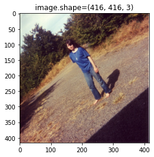

Next, we define `BestAnchorBoxFinder` which finds the best anchor box for a particular object. This is done by finding the anchor box with the highest IOU(Intersection over Union) with the bounding box of the object. 



Here's a sample usage of the `BestAnchorBoxFinder` class. 



    ................................................................................
    The three example anchor boxes:
    anchor box index=0, w=0.08285376, h=0.13705531
    anchor box index=1, w=0.20850361, h=0.39420716
    anchor box index=2, w=0.80552421, h=0.77665105
    anchor box index=3, w=0.42194719, h=0.62385487
    ................................................................................
    Allocate bounding box of various width and height into the three anchor boxes:
    bounding box (w = 0.1, h = 0.1) --> best anchor box index = 0, iou = 0.63
    bounding box (w = 0.1, h = 0.3) --> best anchor box index = 0, iou = 0.38
    bounding box (w = 0.1, h = 0.5) --> best anchor box index = 1, iou = 0.42
    bounding box (w = 0.1, h = 0.7) --> best anchor box index = 1, iou = 0.35
    bounding box (w = 0.3, h = 0.1) --> best anchor box index = 0, iou = 0.25
    bounding box (w = 0.3, h = 0.3) --> best anchor box index = 1, iou = 0.57
    bounding box (w = 0.3, h = 0.5) --> best anchor box index = 3, iou = 0.57
    bounding box (w = 0.3, h = 0.7) --> best anchor box index = 3, iou = 0.65
    bounding box (w = 0.5, h = 0.1) --> best anchor box index = 1, iou = 0.19
    bounding box (w = 0.5, h = 0.3) --> best anchor box index = 3, iou = 0.44
    bounding box (w = 0.5, h = 0.5) --> best anchor box index = 3, iou = 0.70
    bounding box (w = 0.5, h = 0.7) --> best anchor box index = 3, iou = 0.75
    bounding box (w = 0.7, h = 0.1) --> best anchor box index = 1, iou = 0.16
    bounding box (w = 0.7, h = 0.3) --> best anchor box index = 3, iou = 0.37
    bounding box (w = 0.7, h = 0.5) --> best anchor box index = 2, iou = 0.56
    bounding box (w = 0.7, h = 0.7) --> best anchor box index = 2, iou = 0.78





    cebter_x abd cebter_w should range between 0 and 13
    cebter_y abd cebter_h should range between 0 and 13
    center_x = 07.031 range between 0 and 13
    center_y = 05.906 range between 0 and 13
    center_w = 04.688 range between 0 and 13
    center_h = 06.562 range between 0 and 13

Next, we define a custom Batch generator to get a batch of 16 images and its corresponding bounding boxes.





    array([ 1.07709888,  1.78171903,  2.71054693,  5.12469308, 10.47181473,
           10.09646365,  5.48531347,  8.11011331])



    x_batch: (BATCH_SIZE, IMAGE_H, IMAGE_W, N channels)           = (16, 416, 416, 3)
    y_batch: (BATCH_SIZE, GRID_H, GRID_W, BOX, 4 + 1 + N classes) = (16, 13, 13, 4, 25)
    b_batch: (BATCH_SIZE, 1, 1, 1, TRUE_BOX_BUFFER, 4)            = (16, 1, 1, 1, 50, 4)



    igrid_h=11,igrid_w=06,iAnchor=00, person



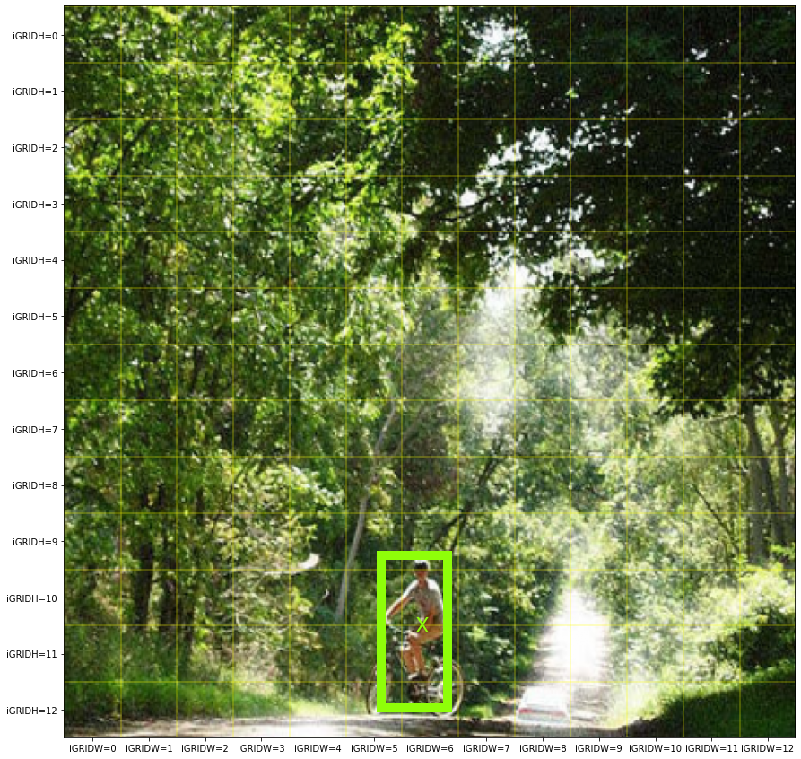



    ------------------------------
    igrid_h=07,igrid_w=05,iAnchor=03, person
    igrid_h=08,igrid_w=05,iAnchor=03, person
    igrid_h=09,igrid_w=05,iAnchor=02, sofa

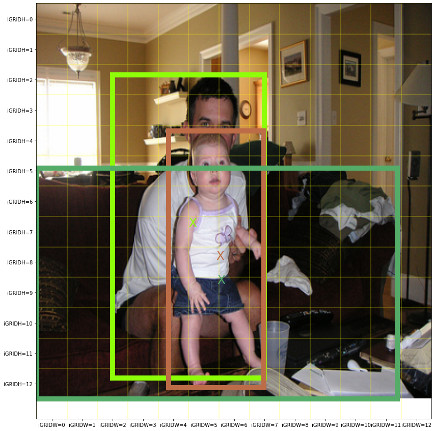

    ------------------------------
    igrid_h=08,igrid_w=06,iAnchor=02, bird

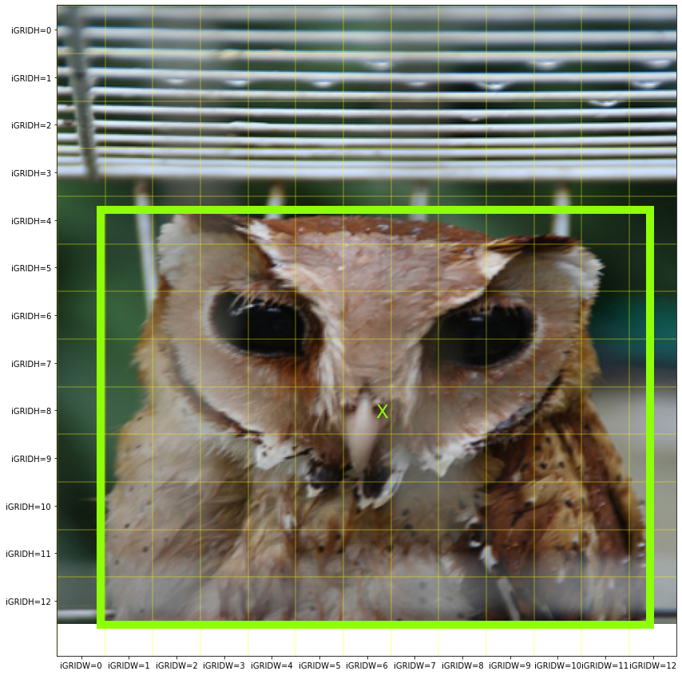

    ------------------------------
    igrid_h=09,igrid_w=08,iAnchor=02, sofa

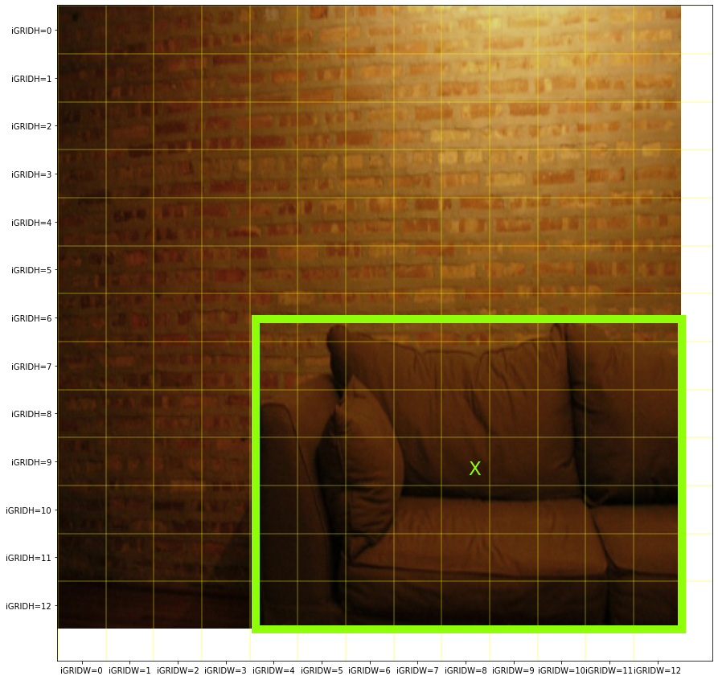

    ------------------------------
    igrid_h=05,igrid_w=06,iAnchor=02, dog

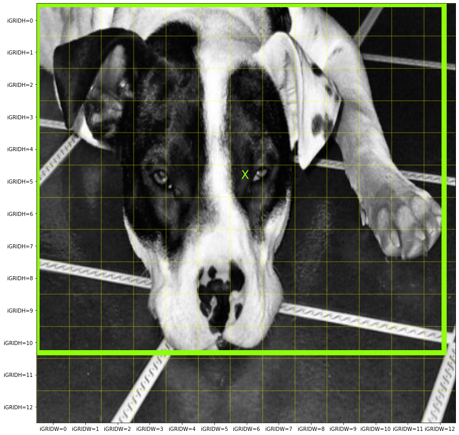

    ------------------------------
    igrid_h=06,igrid_w=06,iAnchor=02, car

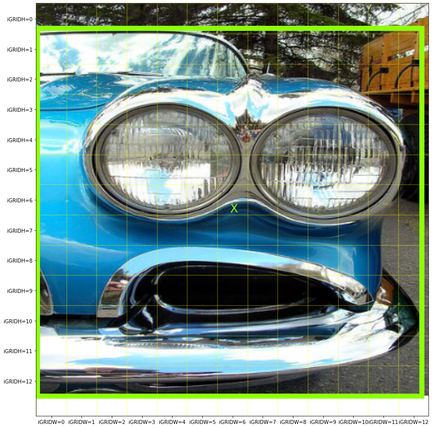

Next, I am adding a function to prepare the input and the output. The input is a (448, 448, 3) image and the output is a (7, 7, 30) tensor. The output is based on S x S x (B * 5 +C). 

S X S is the number of grids
B is the number of bounding boxes per grid
C is the number of predictions per grid

## Training the model

Next, I am defining a custom generator that returns a batch of input and outputs. 

Next, we create instances of the generator for our training and validation sets. 

### Define a custom output layer

We need to reshape the output from the model so we define a custom Keras layer for it. 

### Defining the YOLO model. 

Next, we define the model as described in the original paper. 



    Model: "model_1"
    __________________________________________________________________________________________________
    Layer (type)                    Output Shape         Param #     Connected to                     
    ==================================================================================================
    input_3 (InputLayer)            [(None, 416, 416, 3) 0                                            
    __________________________________________________________________________________________________
    conv_1 (Conv2D)                 (None, 416, 416, 32) 864         input_3[0][0]                    
    __________________________________________________________________________________________________
    norm_1 (BatchNormalization)     (None, 416, 416, 32) 128         conv_1[0][0]                     
    __________________________________________________________________________________________________
    leaky_re_lu_22 (LeakyReLU)      (None, 416, 416, 32) 0           norm_1[0][0]                     
    __________________________________________________________________________________________________
    max_pooling2d_5 (MaxPooling2D)  (None, 208, 208, 32) 0           leaky_re_lu_22[0][0]             
    __________________________________________________________________________________________________
    conv_2 (Conv2D)                 (None, 208, 208, 64) 18432       max_pooling2d_5[0][0]            
    __________________________________________________________________________________________________
    norm_2 (BatchNormalization)     (None, 208, 208, 64) 256         conv_2[0][0]                     
    __________________________________________________________________________________________________
    leaky_re_lu_23 (LeakyReLU)      (None, 208, 208, 64) 0           norm_2[0][0]                     
    __________________________________________________________________________________________________
    max_pooling2d_6 (MaxPooling2D)  (None, 104, 104, 64) 0           leaky_re_lu_23[0][0]             
    __________________________________________________________________________________________________
    conv_3 (Conv2D)                 (None, 104, 104, 128 73728       max_pooling2d_6[0][0]            
    __________________________________________________________________________________________________
    norm_3 (BatchNormalization)     (None, 104, 104, 128 512         conv_3[0][0]                     
    __________________________________________________________________________________________________
    leaky_re_lu_24 (LeakyReLU)      (None, 104, 104, 128 0           norm_3[0][0]                     
    __________________________________________________________________________________________________
    conv_4 (Conv2D)                 (None, 104, 104, 64) 8192        leaky_re_lu_24[0][0]             
    __________________________________________________________________________________________________
    norm_4 (BatchNormalization)     (None, 104, 104, 64) 256         conv_4[0][0]                     
    __________________________________________________________________________________________________
    leaky_re_lu_25 (LeakyReLU)      (None, 104, 104, 64) 0           norm_4[0][0]                     
    __________________________________________________________________________________________________
    conv_5 (Conv2D)                 (None, 104, 104, 128 73728       leaky_re_lu_25[0][0]             
    __________________________________________________________________________________________________
    norm_5 (BatchNormalization)     (None, 104, 104, 128 512         conv_5[0][0]                     
    __________________________________________________________________________________________________
    leaky_re_lu_26 (LeakyReLU)      (None, 104, 104, 128 0           norm_5[0][0]                     
    __________________________________________________________________________________________________
    max_pooling2d_7 (MaxPooling2D)  (None, 52, 52, 128)  0           leaky_re_lu_26[0][0]             
    __________________________________________________________________________________________________
    conv_6 (Conv2D)                 (None, 52, 52, 256)  294912      max_pooling2d_7[0][0]            
    __________________________________________________________________________________________________
    norm_6 (BatchNormalization)     (None, 52, 52, 256)  1024        conv_6[0][0]                     
    __________________________________________________________________________________________________
    leaky_re_lu_27 (LeakyReLU)      (None, 52, 52, 256)  0           norm_6[0][0]                     
    __________________________________________________________________________________________________
    conv_7 (Conv2D)                 (None, 52, 52, 128)  32768       leaky_re_lu_27[0][0]             
    __________________________________________________________________________________________________
    norm_7 (BatchNormalization)     (None, 52, 52, 128)  512         conv_7[0][0]                     
    __________________________________________________________________________________________________
    leaky_re_lu_28 (LeakyReLU)      (None, 52, 52, 128)  0           norm_7[0][0]                     
    __________________________________________________________________________________________________
    conv_8 (Conv2D)                 (None, 52, 52, 256)  294912      leaky_re_lu_28[0][0]             
    __________________________________________________________________________________________________
    norm_8 (BatchNormalization)     (None, 52, 52, 256)  1024        conv_8[0][0]                     
    __________________________________________________________________________________________________
    leaky_re_lu_29 (LeakyReLU)      (None, 52, 52, 256)  0           norm_8[0][0]                     
    __________________________________________________________________________________________________
    max_pooling2d_8 (MaxPooling2D)  (None, 26, 26, 256)  0           leaky_re_lu_29[0][0]             
    __________________________________________________________________________________________________
    conv_9 (Conv2D)                 (None, 26, 26, 512)  1179648     max_pooling2d_8[0][0]            
    __________________________________________________________________________________________________
    norm_9 (BatchNormalization)     (None, 26, 26, 512)  2048        conv_9[0][0]                     
    __________________________________________________________________________________________________
    leaky_re_lu_30 (LeakyReLU)      (None, 26, 26, 512)  0           norm_9[0][0]                     
    __________________________________________________________________________________________________
    conv_10 (Conv2D)                (None, 26, 26, 256)  131072      leaky_re_lu_30[0][0]             
    __________________________________________________________________________________________________
    norm_10 (BatchNormalization)    (None, 26, 26, 256)  1024        conv_10[0][0]                    
    __________________________________________________________________________________________________
    leaky_re_lu_31 (LeakyReLU)      (None, 26, 26, 256)  0           norm_10[0][0]                    
    __________________________________________________________________________________________________
    conv_11 (Conv2D)                (None, 26, 26, 512)  1179648     leaky_re_lu_31[0][0]             
    __________________________________________________________________________________________________
    norm_11 (BatchNormalization)    (None, 26, 26, 512)  2048        conv_11[0][0]                    
    __________________________________________________________________________________________________
    leaky_re_lu_32 (LeakyReLU)      (None, 26, 26, 512)  0           norm_11[0][0]                    
    __________________________________________________________________________________________________
    conv_12 (Conv2D)                (None, 26, 26, 256)  131072      leaky_re_lu_32[0][0]             
    __________________________________________________________________________________________________
    norm_12 (BatchNormalization)    (None, 26, 26, 256)  1024        conv_12[0][0]                    
    __________________________________________________________________________________________________
    leaky_re_lu_33 (LeakyReLU)      (None, 26, 26, 256)  0           norm_12[0][0]                    
    __________________________________________________________________________________________________
    conv_13 (Conv2D)                (None, 26, 26, 512)  1179648     leaky_re_lu_33[0][0]             
    __________________________________________________________________________________________________
    norm_13 (BatchNormalization)    (None, 26, 26, 512)  2048        conv_13[0][0]                    
    __________________________________________________________________________________________________
    leaky_re_lu_34 (LeakyReLU)      (None, 26, 26, 512)  0           norm_13[0][0]                    
    __________________________________________________________________________________________________
    max_pooling2d_9 (MaxPooling2D)  (None, 13, 13, 512)  0           leaky_re_lu_34[0][0]             
    __________________________________________________________________________________________________
    conv_14 (Conv2D)                (None, 13, 13, 1024) 4718592     max_pooling2d_9[0][0]            
    __________________________________________________________________________________________________
    norm_14 (BatchNormalization)    (None, 13, 13, 1024) 4096        conv_14[0][0]                    
    __________________________________________________________________________________________________
    leaky_re_lu_35 (LeakyReLU)      (None, 13, 13, 1024) 0           norm_14[0][0]                    
    __________________________________________________________________________________________________
    conv_15 (Conv2D)                (None, 13, 13, 512)  524288      leaky_re_lu_35[0][0]             
    __________________________________________________________________________________________________
    norm_15 (BatchNormalization)    (None, 13, 13, 512)  2048        conv_15[0][0]                    
    __________________________________________________________________________________________________
    leaky_re_lu_36 (LeakyReLU)      (None, 13, 13, 512)  0           norm_15[0][0]                    
    __________________________________________________________________________________________________
    conv_16 (Conv2D)                (None, 13, 13, 1024) 4718592     leaky_re_lu_36[0][0]             
    __________________________________________________________________________________________________
    norm_16 (BatchNormalization)    (None, 13, 13, 1024) 4096        conv_16[0][0]                    
    __________________________________________________________________________________________________
    leaky_re_lu_37 (LeakyReLU)      (None, 13, 13, 1024) 0           norm_16[0][0]                    
    __________________________________________________________________________________________________
    conv_17 (Conv2D)                (None, 13, 13, 512)  524288      leaky_re_lu_37[0][0]             
    __________________________________________________________________________________________________
    norm_17 (BatchNormalization)    (None, 13, 13, 512)  2048        conv_17[0][0]                    
    __________________________________________________________________________________________________
    leaky_re_lu_38 (LeakyReLU)      (None, 13, 13, 512)  0           norm_17[0][0]                    
    __________________________________________________________________________________________________
    conv_18 (Conv2D)                (None, 13, 13, 1024) 4718592     leaky_re_lu_38[0][0]             
    __________________________________________________________________________________________________
    norm_18 (BatchNormalization)    (None, 13, 13, 1024) 4096        conv_18[0][0]                    
    __________________________________________________________________________________________________
    leaky_re_lu_39 (LeakyReLU)      (None, 13, 13, 1024) 0           norm_18[0][0]                    
    __________________________________________________________________________________________________
    conv_19 (Conv2D)                (None, 13, 13, 1024) 9437184     leaky_re_lu_39[0][0]             
    __________________________________________________________________________________________________
    norm_19 (BatchNormalization)    (None, 13, 13, 1024) 4096        conv_19[0][0]                    
    __________________________________________________________________________________________________
    conv_21 (Conv2D)                (None, 26, 26, 64)   32768       leaky_re_lu_34[0][0]             
    __________________________________________________________________________________________________
    leaky_re_lu_40 (LeakyReLU)      (None, 13, 13, 1024) 0           norm_19[0][0]                    
    __________________________________________________________________________________________________
    norm_21 (BatchNormalization)    (None, 26, 26, 64)   256         conv_21[0][0]                    
    __________________________________________________________________________________________________
    conv_20 (Conv2D)                (None, 13, 13, 1024) 9437184     leaky_re_lu_40[0][0]             
    __________________________________________________________________________________________________
    leaky_re_lu_42 (LeakyReLU)      (None, 26, 26, 64)   0           norm_21[0][0]                    
    __________________________________________________________________________________________________
    norm_20 (BatchNormalization)    (None, 13, 13, 1024) 4096        conv_20[0][0]                    
    __________________________________________________________________________________________________
    lambda_2 (Lambda)               (None, 13, 13, 256)  0           leaky_re_lu_42[0][0]             
    __________________________________________________________________________________________________
    leaky_re_lu_41 (LeakyReLU)      (None, 13, 13, 1024) 0           norm_20[0][0]                    
    __________________________________________________________________________________________________
    concatenate_1 (Concatenate)     (None, 13, 13, 1280) 0           lambda_2[0][0]                   
                                                                     leaky_re_lu_41[0][0]             
    __________________________________________________________________________________________________
    conv_22 (Conv2D)                (None, 13, 13, 1024) 11796480    concatenate_1[0][0]              
    __________________________________________________________________________________________________
    norm_22 (BatchNormalization)    (None, 13, 13, 1024) 4096        conv_22[0][0]                    
    __________________________________________________________________________________________________
    leaky_re_lu_43 (LeakyReLU)      (None, 13, 13, 1024) 0           norm_22[0][0]                    
    __________________________________________________________________________________________________
    conv_23 (Conv2D)                (None, 13, 13, 100)  102500      leaky_re_lu_43[0][0]             
    __________________________________________________________________________________________________
    reshape_1 (Reshape)             (None, 13, 13, 4, 25 0           conv_23[0][0]                    
    __________________________________________________________________________________________________
    input_4 (InputLayer)            [(None, 1, 1, 1, 50, 0                                            
    __________________________________________________________________________________________________
    lambda_3 (Lambda)               (None, 13, 13, 4, 25 0           reshape_1[0][0]                  
                                                                     input_4[0][0]                    
    ==================================================================================================
    Total params: 50,650,436
    Trainable params: 50,629,764
    Non-trainable params: 20,672
    __________________________________________________________________________________________________

Next, we download the pre-trained weights for YOLO V2. 



    --2020-07-06 21:02:41--  https://pjreddie.com/media/files/yolov2.weights
    Resolving pjreddie.com (pjreddie.com)... 128.208.4.108
    Connecting to pjreddie.com (pjreddie.com)|128.208.4.108|:443... connected.
    HTTP request sent, awaiting response... 200 OK
    Length: 203934260 (194M) [application/octet-stream]
    Saving to: ‘yolov2.weights.1’
    
    yolov2.weights.1    100%[===================>] 194.49M   867KB/s    in 3m 6s   
    
    2020-07-06 21:05:47 (1.05 MB/s) - ‘yolov2.weights.1’ saved [203934260/203934260]
    



    all_weights.shape = (50983565,)





### Define a custom learning rate scheduler

The paper uses different learning rates for different epochs. So we define a custom Callback function for the learning rate. 



### Define the loss function

Next, we would be defining a custom loss function to be used in the model. Take a look at this blog post to understand more about the [loss function used in YOLO](https://fairyonice.github.io/Part_4_Object_Detection_with_Yolo_using_VOC_2012_data_loss.html). 

I understood the loss function but didn't implement it on my own. I took the implementation as it is from the above [blog post](https://fairyonice.github.io/Part_4_Object_Detection_with_Yolo_using_VOC_2012_data_loss.html). 

The original blog post was using Tensorflow 1.x so I had to update some of the code to make it run it on Tensorflow 2.x. 











    ******************************
    prepare inputs
    y_pred before scaling = (16, 13, 13, 4, 25)
    ******************************
    define tensor graph
    ******************************
    ouput
    ******************************
    
    pred_box_xy (16, 13, 13, 4, 2)
      bounding box x at iGRID_W=00 MIN= 0.45, MAX= 0.55
      bounding box x at iGRID_W=01 MIN= 1.45, MAX= 1.54
      bounding box x at iGRID_W=02 MIN= 2.45, MAX= 2.55
      bounding box x at iGRID_W=03 MIN= 3.45, MAX= 3.55
      bounding box x at iGRID_W=04 MIN= 4.45, MAX= 4.55
      bounding box x at iGRID_W=05 MIN= 5.45, MAX= 5.55
      bounding box x at iGRID_W=06 MIN= 6.46, MAX= 6.55
      bounding box x at iGRID_W=07 MIN= 7.45, MAX= 7.55
      bounding box x at iGRID_W=08 MIN= 8.46, MAX= 8.55
      bounding box x at iGRID_W=09 MIN= 9.44, MAX= 9.55
      bounding box x at iGRID_W=10 MIN=10.46, MAX=10.55
      bounding box x at iGRID_W=11 MIN=11.46, MAX=11.55
      bounding box x at iGRID_W=12 MIN=12.45, MAX=12.55
      bounding box y at iGRID_H=00 MIN= 0.45, MAX= 0.55
      bounding box y at iGRID_H=01 MIN= 1.45, MAX= 1.54
      bounding box y at iGRID_H=02 MIN= 2.46, MAX= 2.54
      bounding box y at iGRID_H=03 MIN= 3.45, MAX= 3.55
      bounding box y at iGRID_H=04 MIN= 4.45, MAX= 4.54
      bounding box y at iGRID_H=05 MIN= 5.45, MAX= 5.54
      bounding box y at iGRID_H=06 MIN= 6.45, MAX= 6.55
      bounding box y at iGRID_H=07 MIN= 7.45, MAX= 7.55
      bounding box y at iGRID_H=08 MIN= 8.46, MAX= 8.54
      bounding box y at iGRID_H=09 MIN= 9.46, MAX= 9.55
      bounding box y at iGRID_H=10 MIN=10.45, MAX=10.54
      bounding box y at iGRID_H=11 MIN=11.46, MAX=11.54
      bounding box y at iGRID_H=12 MIN=12.45, MAX=12.54
    
    pred_box_wh (16, 13, 13, 4, 2)
      bounding box width  MIN= 0.88, MAX=12.49
      bounding box height MIN= 1.46, MAX=12.64
    
    pred_box_conf (16, 13, 13, 4)
      confidence  MIN= 0.45, MAX= 0.56
    
    pred_box_class (16, 13, 13, 4, 20)
      class probability MIN=-0.26, MAX= 0.28

We extract the ground truth. 





    Input y_batch = (16, 13, 13, 4, 25)
    ******************************
    ouput
    ******************************
    
    true_box_xy (16, 13, 13, 4, 2)
      bounding box x at iGRID_W=01 MIN= 1.56, MAX= 1.56
      bounding box x at iGRID_W=02 MIN= 2.36, MAX= 2.36
      bounding box x at iGRID_W=03 MIN= 3.09, MAX= 3.41
      bounding box x at iGRID_W=05 MIN= 5.00, MAX= 5.94
      bounding box x at iGRID_W=06 MIN= 6.22, MAX= 6.67
      bounding box x at iGRID_W=07 MIN= 7.66, MAX= 7.66
      bounding box x at iGRID_W=08 MIN= 8.56, MAX= 8.86
      bounding box x at iGRID_W=09 MIN= 9.09, MAX= 9.39
      bounding box y at iGRID_H=01 MIN= 1.58, MAX= 1.58
      bounding box y at iGRID_H=05 MIN= 5.34, MAX= 5.42
      bounding box y at iGRID_H=06 MIN= 6.50, MAX= 6.91
      bounding box y at iGRID_H=07 MIN= 7.02, MAX= 7.38
      bounding box y at iGRID_H=08 MIN= 8.08, MAX= 8.64
      bounding box y at iGRID_H=09 MIN= 9.20, MAX= 9.88
      bounding box y at iGRID_H=10 MIN=10.14, MAX=10.36
      bounding box y at iGRID_H=11 MIN=11.11, MAX=11.42
    
    true_box_wh (16, 13, 13, 4, 2)
      bounding box width  MIN= 0.00, MAX=12.97
      bounding box height MIN= 0.00, MAX=13.00
    
    true_box_conf (16, 13, 13, 4)
      confidence, unique value = [0. 1.]
    
    true_box_class (16, 13, 13, 4)
      class index, unique value = [ 0  2  6  7  8 11 14 15 17 19]





    ******************************
    ouput
    ******************************
    loss_xywh = 4.148





    ******************************
    ouput
    ******************************
    loss_class = 3.018





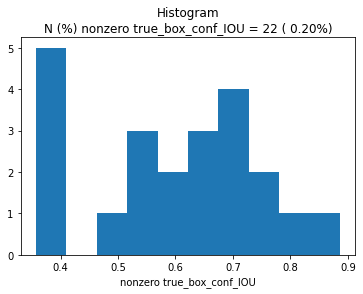

















    float64 float64
    loss tf.Tensor(7.290645, shape=(), dtype=float32)

### Add a callback for saving the weights

Next, I define a callback to keep saving the best weights. 

### Compile the model

Finally, I compile the model using the custom loss function that was defined above. 



    WARNING:tensorflow:`period` argument is deprecated. Please use `save_freq` to specify the frequency in number of batches seen.

### Train the model

Now that we have everything setup, we will call `model.fit` to train the model for 135 epochs. 



    Epoch 1/50
    1071/1071 [==============================] - ETA: 0s - loss: 0.0836
    .
    .
    .
    Epoch 00011: loss did not improve from 0.04997
    1071/1071 [==============================] - 287s 268ms/step - loss: 0.0612
    Epoch 00011: early stopping

    <tensorflow.python.keras.callbacks.History at 0x7f0494d50940>

## Evaluation

Now, that we have trained our model, lets use it to predict the class labels and bounding boxes for a few images. 

Lets pass an image and see the prediction for the image. 





    (416, 416, 3)
    (1, 416, 416, 3)
    (1, 13, 13, 4, 25)

Note, that the `y_pred` needs to be scaled up. So we define a class called `OutputRescaler` for it. 



Let's try out the `OutputRescaler` class.



Also, lets define a method to find bounding boxes with high confidence probability.



Let's try out the above function and see if it works. 



    obj_threshold=0.015
    In total, YOLO can produce GRID_H * GRID_W * BOX = 676 bounding boxes 
    I found 20 bounding boxes with top class probability > 0.015
    
    obj_threshold=0.03
    In total, YOLO can produce GRID_H * GRID_W * BOX = 676 bounding boxes 
    I found 12 bounding boxes with top class probability > 0.03

Also, next we define a function to draw bounding boxes on the image. 



    Plot with low object threshold
    person     0.082 xmin= 183,ymin=  39,xmax= 292,ymax= 276
    person     0.090 xmin= 181,ymin=  25,xmax= 291,ymax= 293
    person     0.033 xmin= 180,ymin=  43,xmax= 251,ymax= 299
    person     0.518 xmin= 186,ymin=  26,xmax= 286,ymax= 314
    person     0.865 xmin= 178,ymin=  31,xmax= 291,ymax= 312
    person     0.027 xmin= 179,ymin=  27,xmax= 344,ymax= 304
    bicycle    0.017 xmin=  85,ymin= 180,xmax= 141,ymax= 237
    bicycle    0.045 xmin=  62,ymin= 144,xmax= 174,ymax= 260

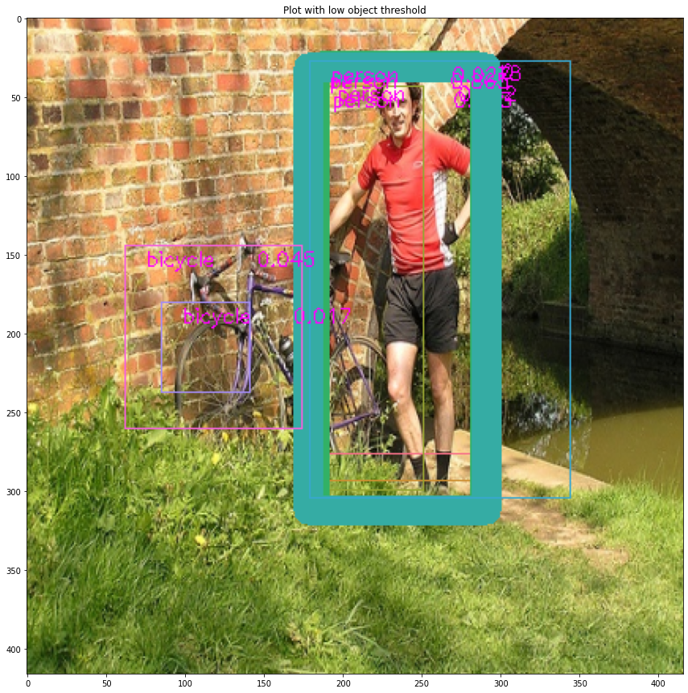

    Plot with high object threshold
    person     0.082 xmin= 183,ymin=  39,xmax= 292,ymax= 276
    person     0.090 xmin= 181,ymin=  25,xmax= 291,ymax= 293
    person     0.033 xmin= 180,ymin=  43,xmax= 251,ymax= 299
    person     0.518 xmin= 186,ymin=  26,xmax= 286,ymax= 314
    person     0.865 xmin= 178,ymin=  31,xmax= 291,ymax= 312
    bicycle    0.045 xmin=  62,ymin= 144,xmax= 174,ymax= 260
    bicycle    0.368 xmin=  76,ymin= 135,xmax= 219,ymax= 283
    bicycle    0.315 xmin=  68,ymin= 132,xmax= 235,ymax= 289

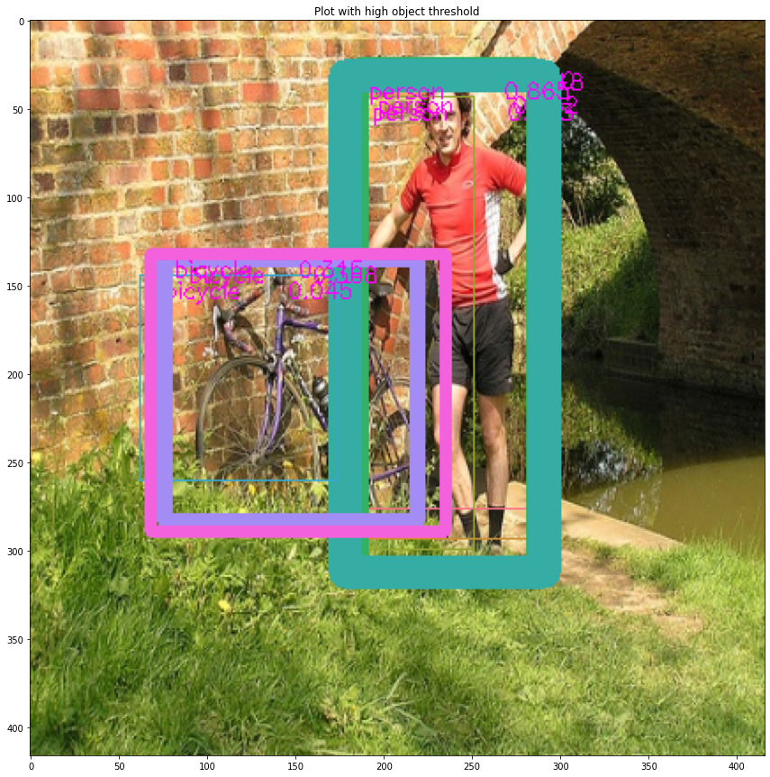

Notice, that each object has multiple bounding boxes around it. So we define a function to apply non max suppression that chooes the bounding box with the highest IOU. 



Lets use the above function to see if it reduces the number of bounding boxes. 



    2 final number of boxes



    bicycle    0.368 xmin=  76,ymin= 135,xmax= 219,ymax= 283
    person     0.865 xmin= 178,ymin=  31,xmax= 291,ymax= 312

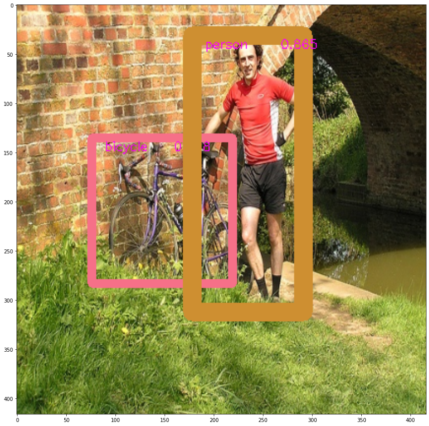

Next, lets have some fun by evaluating more images and see the results. 





    bird       0.070 xmin= 249,ymin=  47,xmax= 416,ymax= 406
    bird       0.070 xmin= 249,ymin=  47,xmax= 416,ymax= 406
    bird       0.070 xmin= 249,ymin=  47,xmax= 416,ymax= 406
    bottle     0.274 xmin= 250,ymin=  23,xmax= 416,ymax= 403
    bird       0.070 xmin= 249,ymin=  47,xmax= 416,ymax= 406
    chair      0.030 xmin= 265,ymin= 373,xmax= 394,ymax= 410
    bottle     0.274 xmin= 250,ymin=  23,xmax= 416,ymax= 403
    chair      0.030 xmin= 265,ymin= 373,xmax= 394,ymax= 410

    chair      0.851 xmin= 272,ymin= 179,xmax= 416,ymax= 405
    chair      0.312 xmin= 340,ymin=   3,xmax= 408,ymax=  49
    chair      0.312 xmin= 340,ymin=   3,xmax= 408,ymax=  49
    chair      0.851 xmin= 272,ymin= 179,xmax= 416,ymax= 405
    chair      0.312 xmin= 340,ymin=   3,xmax= 408,ymax=  49
    chair      0.312 xmin= 340,ymin=   3,xmax= 408,ymax=  49
    chair      0.312 xmin= 340,ymin=   3,xmax= 408,ymax=  49
    chair      0.312 xmin= 340,ymin=   3,xmax= 408,ymax=  49

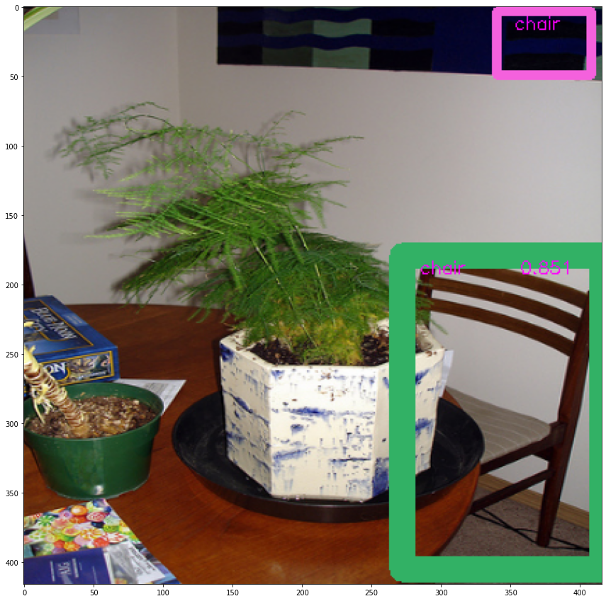

## Conclusion

It was a good exercise to implement YOLO V2 from scratch and understand various nuances of writing a model from scratch. This implementation won't achieve the same accuracy as what was described in the paper since we have skipped the pretraining step. 
