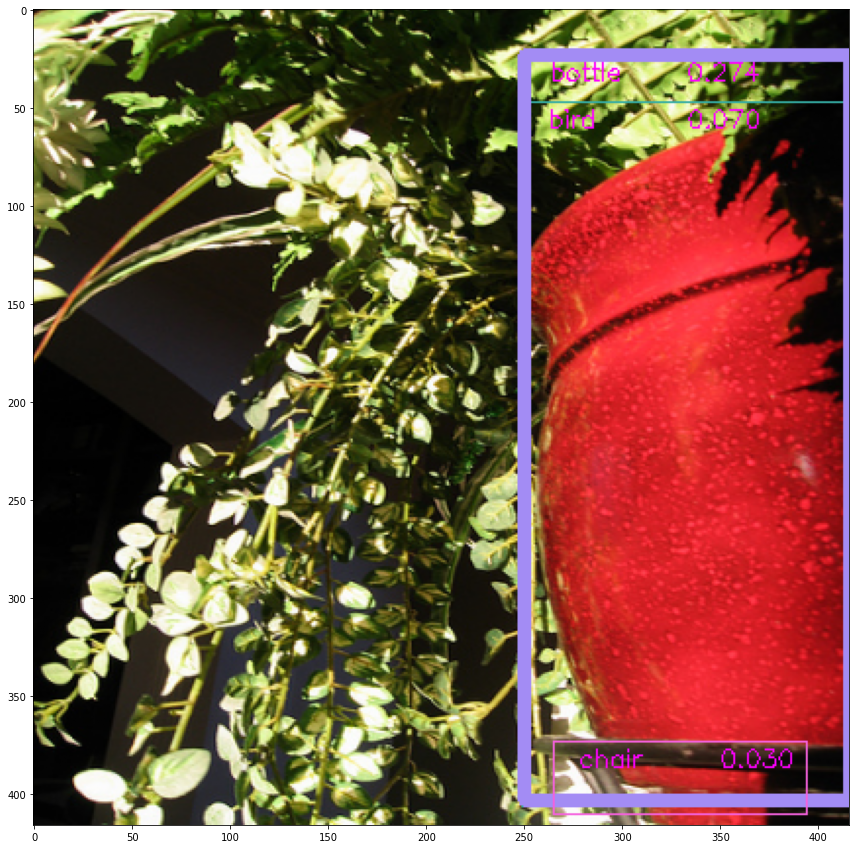

# Implementing YOLOV2 from using Tensorflow 2.0


In this notebook I am going to re-implement YOLOV2 as described in the paper [YOLO9000: Better, Faster, Stronger](https://arxiv.org/abs/1612.08242). The goal is to replicate the model as described in the paper and train it on the [VOC 2012](http://host.robots.ox.ac.uk/pascal/VOC/voc2012/) dataset. 

## Introduction

Most of the code, in this notbook comes from a series of blog posts by Yumi. I just followed his posts to get things working. The original blog post uses Tensorflow 1.x so I had to change a few things to make it work but most of the code remains the same. I am linking all his blog posts here, and I highly recommend taking a look at it as it explains everything in much more detail.

### Yumi's Blog Posts with explanation

* [Part 1 Object Detection using YOLOv2 on Pascal VOC2012 - anchor box clustering](https://fairyonice.github.io/Part_1_Object_Detection_with_Yolo_for_VOC_2014_data_anchor_box_clustering.html)
* [Part 2 Object Detection using YOLOv2 on Pascal VOC2012 - input and output encoding](https://fairyonice.github.io/Part%202_Object_Detection_with_Yolo_using_VOC_2014_data_input_and_output_encoding.html)
* [Part 3 Object Detection using YOLOv2 on Pascal VOC2012 - model](https://fairyonice.github.io/Part_3_Object_Detection_with_Yolo_using_VOC_2012_data_model.html)
* [Part 4 Object Detection using YOLOv2 on Pascal VOC2012 - loss](https://fairyonice.github.io/Part_4_Object_Detection_with_Yolo_using_VOC_2012_data_loss.html)
* [Part 5 Object Detection using YOLOv2 on Pascal VOC2012 - training](https://fairyonice.github.io/Part_5_Object_Detection_with_Yolo_using_VOC_2012_data_training.html)
* [Part 6 Object Detection using YOLOv2 on Pascal VOC 2012 data - inference on image](https://fairyonice.github.io/Part_6_Object_Detection_with_Yolo_using_VOC_2012_data_inference_image.html)

### Google colab with end to end training and evaluation on VOC 2012

I followed Yumi's blogs to replicate YOLOV2 for VOC 2012 dataset. If you are looking for a consolidated python notebook with  everything working, you can clone this Google Colab notebook. 

https://colab.research.google.com/drive/14mPj3NYg_lJwWCRclzgPzdpKXoQutxUb?usp=sharing


```
import tensorflow as tf
import matplotlib.pyplot as plt    # for plotting the images
%matplotlib inline
```


```
from google.colab import drive
drive.mount('/content/gdrive')
```

    Drive already mounted at /content/gdrive; to attempt to forcibly remount, call drive.mount("/content/gdrive", force_remount=True).


## Data Preprocessing

I would be using [VOC 2012](http://host.robots.ox.ac.uk/pascal/VOC/voc2012/) dataset as its size is manageable so it would be easy to run it using Google Colab. 

First, I download and extract the dataset. 


```
!wget http://host.robots.ox.ac.uk/pascal/VOC/voc2012/VOCtrainval_11-May-2012.tar
```

    --2020-07-06 20:57:53--  http://host.robots.ox.ac.uk/pascal/VOC/voc2012/VOCtrainval_11-May-2012.tar
    Resolving host.robots.ox.ac.uk (host.robots.ox.ac.uk)... 129.67.94.152
    Connecting to host.robots.ox.ac.uk (host.robots.ox.ac.uk)|129.67.94.152|:80... connected.
    HTTP request sent, awaiting response... 200 OK
    Length: 1999639040 (1.9G) [application/x-tar]
    Saving to: ‘VOCtrainval_11-May-2012.tar.1’
    
    VOCtrainval_11-May- 100%[===================>]   1.86G  9.38MB/s    in 3m 35s  
    
    2020-07-06 21:01:28 (8.88 MB/s) - ‘VOCtrainval_11-May-2012.tar.1’ saved [1999639040/1999639040]
    


```
!tar xvf VOCtrainval_11-May-2012.tar
```

Next, we define a function that parses the annotations from the XML files and stores it in an array. 


```
import os
import xml.etree.ElementTree as ET

def parse_annotation(ann_dir, img_dir, labels=[]):
    all_imgs = []
    seen_labels = {}
    
    for ann in sorted(os.listdir(ann_dir)):
        if "xml" not in ann:
            continue
        img = {'object':[]}

        tree = ET.parse(ann_dir + ann)
        
        for elem in tree.iter():
            if 'filename' in elem.tag:
                path_to_image = img_dir + elem.text
                img['filename'] = path_to_image
                ## make sure that the image exists:
                if not os.path.exists(path_to_image):
                    assert False, "file does not exist!\n{}".format(path_to_image)
            if 'width' in elem.tag:
                img['width'] = int(elem.text)
            if 'height' in elem.tag:
                img['height'] = int(elem.text)
            if 'object' in elem.tag or 'part' in elem.tag:
                obj = {}
                
                for attr in list(elem):
                    if 'name' in attr.tag:
                        obj['name'] = attr.text
                        if len(labels) > 0 and obj['name'] not in labels:
                            break
                        else:
                            img['object'] += [obj]
                        if obj['name'] in seen_labels:
                            seen_labels[obj['name']] += 1
                        else:
                            seen_labels[obj['name']]  = 1
                            
                    if 'bndbox' in attr.tag:
                        for dim in list(attr):
                            if 'xmin' in dim.tag:
                                obj['xmin'] = int(round(float(dim.text)))
                            if 'ymin' in dim.tag:
                                obj['ymin'] = int(round(float(dim.text)))
                            if 'xmax' in dim.tag:
                                obj['xmax'] = int(round(float(dim.text)))
                            if 'ymax' in dim.tag:
                                obj['ymax'] = int(round(float(dim.text)))

        if len(img['object']) > 0:
            all_imgs += [img]
                        
    return all_imgs, seen_labels
```

We prepare the arrays with `training_image` and `seen_train_labels` for the whole dataset. 

As opposed to YOLOV1, YOLOV2 uses K-means clustering to find the best anchor box sizes for the given dataset. 

The `ANCHORS` defined below are taken from the following blog: 

[Part 1 Object Detection using YOLOv2 on Pascal VOC2012 - anchor box clustering](https://fairyonice.github.io/Part_1_Object_Detection_with_Yolo_for_VOC_2014_data_anchor_box_clustering.html).

Instead of rerunning the K-means algorithm again, we use the `ANCHORS` obtained by [Yumi](https://fairyonice.github.io/) as it is.  
 


```
import numpy as np
## Parse annotations 
train_image_folder = "VOCdevkit/VOC2012/JPEGImages/"
train_annot_folder = "VOCdevkit/VOC2012/Annotations/"

ANCHORS = np.array([1.07709888,  1.78171903,  # anchor box 1, width , height
                    2.71054693,  5.12469308,  # anchor box 2, width,  height
                   10.47181473, 10.09646365,  # anchor box 3, width,  height
                    5.48531347,  8.11011331]) # anchor box 4, width,  height

LABELS = ['aeroplane',  'bicycle', 'bird',  'boat',      'bottle', 
          'bus',        'car',      'cat',  'chair',     'cow',
          'diningtable','dog',    'horse',  'motorbike', 'person',
          'pottedplant','sheep',  'sofa',   'train',   'tvmonitor']

train_image, seen_train_labels = parse_annotation(train_annot_folder,train_image_folder, labels=LABELS)
print("N train = {}".format(len(train_image)))
```

    N train = 17125


Next, we define a `ImageReader` class to process an image. It takes in an image and returns the resized image and all the objects in the image. 


```
import copy
import cv2 

class ImageReader(object):
    def __init__(self,IMAGE_H,IMAGE_W, norm=None):
        self.IMAGE_H = IMAGE_H
        self.IMAGE_W = IMAGE_W
        self.norm    = norm
        
    def encode_core(self,image, reorder_rgb=True):     
        image = cv2.resize(image, (self.IMAGE_H, self.IMAGE_W))
        if reorder_rgb:
            image = image[:,:,::-1]
        if self.norm is not None:
            image = self.norm(image)
        return(image)
    
    def fit(self,train_instance):
        '''
        read in and resize the image, annotations are resized accordingly.
        
        -- Input -- 
        
        train_instance : dictionary containing filename, height, width and object
        
        {'filename': 'ObjectDetectionRCNN/VOCdevkit/VOC2012/JPEGImages/2008_000054.jpg',
         'height':   333,
         'width':    500,
         'object': [{'name': 'bird',
                     'xmax': 318,
                     'xmin': 284,
                     'ymax': 184,
                     'ymin': 100},
                    {'name': 'bird', 
                     'xmax': 198, 
                     'xmin': 112, 
                     'ymax': 209, 
                     'ymin': 146}]
        }
        
        '''
        if not isinstance(train_instance,dict):
            train_instance = {'filename':train_instance}
                
        image_name = train_instance['filename']
        image = cv2.imread(image_name)
        h, w, c = image.shape
        if image is None: print('Cannot find ', image_name)
      
        image = self.encode_core(image, reorder_rgb=True)
            
        if "object" in train_instance.keys():
            
            all_objs = copy.deepcopy(train_instance['object'])     

            # fix object's position and size
            for obj in all_objs:
                for attr in ['xmin', 'xmax']:
                    obj[attr] = int(obj[attr] * float(self.IMAGE_W) / w)
                    obj[attr] = max(min(obj[attr], self.IMAGE_W), 0)

                for attr in ['ymin', 'ymax']:
                    obj[attr] = int(obj[attr] * float(self.IMAGE_H) / h)
                    obj[attr] = max(min(obj[attr], self.IMAGE_H), 0)
        else:
            return image
        return image, all_objs
```

Here's a sample usage of the `ImageReader` class. 


```
def normalize(image):
    return image / 255.

print("*"*30)
print("Input")
timage = train_image[0]
for key, v in timage.items():
    print("  {}: {}".format(key,v))
print("*"*30)
print("Output")
inputEncoder = ImageReader(IMAGE_H=416,IMAGE_W=416, norm=normalize)
image, all_objs = inputEncoder.fit(timage)
print("          {}".format(all_objs))
plt.imshow(image)
plt.title("image.shape={}".format(image.shape))
plt.show()
```

    ******************************
    Input
      object: [{'name': 'person', 'xmin': 174, 'ymin': 101, 'xmax': 349, 'ymax': 351}]
      filename: VOCdevkit/VOC2012/JPEGImages/2007_000027.jpg
      width: 486
      height: 500
    ******************************
    Output
              [{'name': 'person', 'xmin': 148, 'ymin': 84, 'xmax': 298, 'ymax': 292}]


Next, we define `BestAnchorBoxFinder` which finds the best anchor box for a particular object. This is done by finding the anchor box with the highest IOU(Intersection over Union) with the bounding box of the object. 


```
class BestAnchorBoxFinder(object):
    def __init__(self, ANCHORS):
        '''
        ANCHORS: a np.array of even number length e.g.
        
        _ANCHORS = [4,2, ##  width=4, height=2,  flat large anchor box
                    2,4, ##  width=2, height=4,  tall large anchor box
                    1,1] ##  width=1, height=1,  small anchor box
        '''
        self.anchors = [BoundBox(0, 0, ANCHORS[2*i], ANCHORS[2*i+1]) 
                        for i in range(int(len(ANCHORS)//2))]
        
    def _interval_overlap(self,interval_a, interval_b):
        x1, x2 = interval_a
        x3, x4 = interval_b
        if x3 < x1:
            if x4 < x1:
                return 0
            else:
                return min(x2,x4) - x1
        else:
            if x2 < x3:
                 return 0
            else:
                return min(x2,x4) - x3  

    def bbox_iou(self,box1, box2):
        intersect_w = self._interval_overlap([box1.xmin, box1.xmax], [box2.xmin, box2.xmax])
        intersect_h = self._interval_overlap([box1.ymin, box1.ymax], [box2.ymin, box2.ymax])  

        intersect = intersect_w * intersect_h

        w1, h1 = box1.xmax-box1.xmin, box1.ymax-box1.ymin
        w2, h2 = box2.xmax-box2.xmin, box2.ymax-box2.ymin

        union = w1*h1 + w2*h2 - intersect

        return float(intersect) / union
    
    def find(self,center_w, center_h):
        # find the anchor that best predicts this box
        best_anchor = -1
        max_iou     = -1
        # each Anchor box is specialized to have a certain shape.
        # e.g., flat large rectangle, or small square
        shifted_box = BoundBox(0, 0,center_w, center_h)
        ##  For given object, find the best anchor box!
        for i in range(len(self.anchors)): ## run through each anchor box
            anchor = self.anchors[i]
            iou    = self.bbox_iou(shifted_box, anchor)
            if max_iou < iou:
                best_anchor = i
                max_iou     = iou
        return(best_anchor,max_iou)    
    
    
class BoundBox:
    def __init__(self, xmin, ymin, xmax, ymax, confidence=None,classes=None):
        self.xmin, self.ymin = xmin, ymin
        self.xmax, self.ymax = xmax, ymax
        ## the code below are used during inference
        # probability
        self.confidence      = confidence
        # class probaiblities [c1, c2, .. cNclass]
        self.set_class(classes)
        
    def set_class(self,classes):
        self.classes = classes
        self.label   = np.argmax(self.classes) 
        
    def get_label(self):  
        return(self.label)
    
    def get_score(self):
        return(self.classes[self.label])
```

Here's a sample usage of the `BestAnchorBoxFinder` class. 


```
# Anchor box width and height found in https://fairyonice.github.io/Part_1_Object_Detection_with_Yolo_for_VOC_2014_data_anchor_box_clustering.html
_ANCHORS01 = np.array([0.08285376, 0.13705531,
                       0.20850361, 0.39420716,
                       0.80552421, 0.77665105,
                       0.42194719, 0.62385487])
print(".."*40)
print("The three example anchor boxes:")
count = 0
for i in range(0,len(_ANCHORS01),2):
    print("anchor box index={}, w={}, h={}".format(count,_ANCHORS01[i],_ANCHORS01[i+1]))
    count += 1
print(".."*40)   
print("Allocate bounding box of various width and height into the three anchor boxes:")  
babf = BestAnchorBoxFinder(_ANCHORS01)
for w in range(1,9,2):
    w /= 10.
    for h in range(1,9,2):
        h /= 10.
        best_anchor,max_iou = babf.find(w,h)
        print("bounding box (w = {}, h = {}) --> best anchor box index = {}, iou = {:03.2f}".format(
            w,h,best_anchor,max_iou))
```

    ................................................................................
    The three example anchor boxes:
    anchor box index=0, w=0.08285376, h=0.13705531
    anchor box index=1, w=0.20850361, h=0.39420716
    anchor box index=2, w=0.80552421, h=0.77665105
    anchor box index=3, w=0.42194719, h=0.62385487
    ................................................................................
    Allocate bounding box of various width and height into the three anchor boxes:
    bounding box (w = 0.1, h = 0.1) --> best anchor box index = 0, iou = 0.63
    bounding box (w = 0.1, h = 0.3) --> best anchor box index = 0, iou = 0.38
    bounding box (w = 0.1, h = 0.5) --> best anchor box index = 1, iou = 0.42
    bounding box (w = 0.1, h = 0.7) --> best anchor box index = 1, iou = 0.35
    bounding box (w = 0.3, h = 0.1) --> best anchor box index = 0, iou = 0.25
    bounding box (w = 0.3, h = 0.3) --> best anchor box index = 1, iou = 0.57
    bounding box (w = 0.3, h = 0.5) --> best anchor box index = 3, iou = 0.57
    bounding box (w = 0.3, h = 0.7) --> best anchor box index = 3, iou = 0.65
    bounding box (w = 0.5, h = 0.1) --> best anchor box index = 1, iou = 0.19
    bounding box (w = 0.5, h = 0.3) --> best anchor box index = 3, iou = 0.44
    bounding box (w = 0.5, h = 0.5) --> best anchor box index = 3, iou = 0.70
    bounding box (w = 0.5, h = 0.7) --> best anchor box index = 3, iou = 0.75
    bounding box (w = 0.7, h = 0.1) --> best anchor box index = 1, iou = 0.16
    bounding box (w = 0.7, h = 0.3) --> best anchor box index = 3, iou = 0.37
    bounding box (w = 0.7, h = 0.5) --> best anchor box index = 2, iou = 0.56
    bounding box (w = 0.7, h = 0.7) --> best anchor box index = 2, iou = 0.78


```
def rescale_centerxy(obj,config):
    '''
    obj:     dictionary containing xmin, xmax, ymin, ymax
    config : dictionary containing IMAGE_W, GRID_W, IMAGE_H and GRID_H
    '''
    center_x = .5*(obj['xmin'] + obj['xmax'])
    center_x = center_x / (float(config['IMAGE_W']) / config['GRID_W'])
    center_y = .5*(obj['ymin'] + obj['ymax'])
    center_y = center_y / (float(config['IMAGE_H']) / config['GRID_H'])
    return(center_x,center_y)

def rescale_cebterwh(obj,config):
    '''
    obj:     dictionary containing xmin, xmax, ymin, ymax
    config : dictionary containing IMAGE_W, GRID_W, IMAGE_H and GRID_H
    '''    
    # unit: grid cell
    center_w = (obj['xmax'] - obj['xmin']) / (float(config['IMAGE_W']) / config['GRID_W']) 
    # unit: grid cell
    center_h = (obj['ymax'] - obj['ymin']) / (float(config['IMAGE_H']) / config['GRID_H']) 
    return(center_w,center_h)
```


```
obj    = {'xmin': 150, 'ymin': 84, 'xmax': 300, 'ymax': 294}
config = {"IMAGE_W":416,"IMAGE_H":416,"GRID_W":13,"GRID_H":13}
center_x, center_y = rescale_centerxy(obj,config)
center_w, center_h = rescale_cebterwh(obj,config)

print("cebter_x abd cebter_w should range between 0 and {}".format(config["GRID_W"]))
print("cebter_y abd cebter_h should range between 0 and {}".format(config["GRID_H"]))

print("center_x = {:06.3f} range between 0 and {}".format(center_x, config["GRID_W"]))
print("center_y = {:06.3f} range between 0 and {}".format(center_y, config["GRID_H"]))
print("center_w = {:06.3f} range between 0 and {}".format(center_w, config["GRID_W"]))
print("center_h = {:06.3f} range between 0 and {}".format(center_h, config["GRID_H"]))
```

    cebter_x abd cebter_w should range between 0 and 13
    cebter_y abd cebter_h should range between 0 and 13
    center_x = 07.031 range between 0 and 13
    center_y = 05.906 range between 0 and 13
    center_w = 04.688 range between 0 and 13
    center_h = 06.562 range between 0 and 13


Next, we define a custom Batch generator to get a batch of 16 images and its corresponding bounding boxes.


```
from tensorflow.keras.utils import Sequence

class SimpleBatchGenerator(Sequence):
    def __init__(self, images, config, norm=None, shuffle=True):
        '''
        config : dictionary containing necessary hyper parameters for traning. e.g., 
            {
            'IMAGE_H'         : 416, 
            'IMAGE_W'         : 416,
            'GRID_H'          : 13,  
            'GRID_W'          : 13,
            'LABELS'          : ['aeroplane',  'bicycle', 'bird',  'boat',      'bottle', 
                                  'bus',        'car',      'cat',  'chair',     'cow',
                                  'diningtable','dog',    'horse',  'motorbike', 'person',
                                  'pottedplant','sheep',  'sofa',   'train',   'tvmonitor'],
            'ANCHORS'         : array([ 1.07709888,   1.78171903,  
                                        2.71054693,   5.12469308, 
                                        10.47181473, 10.09646365,  
                                        5.48531347,   8.11011331]),
            'BATCH_SIZE'      : 16,
            'TRUE_BOX_BUFFER' : 50,
            }
        
        '''
        self.config = config
        self.config["BOX"] = int(len(self.config['ANCHORS'])/2)
        self.config["CLASS"] = len(self.config['LABELS'])
        self.images = images
        self.bestAnchorBoxFinder = BestAnchorBoxFinder(config['ANCHORS'])
        self.imageReader = ImageReader(config['IMAGE_H'],config['IMAGE_W'],norm=norm)
        self.shuffle = shuffle
        if self.shuffle: 
            np.random.shuffle(self.images)
            
    def __len__(self):
        return int(np.ceil(float(len(self.images))/self.config['BATCH_SIZE']))  
    
    def __getitem__(self, idx):
        '''
        == input == 
        
        idx : non-negative integer value e.g., 0
        
        == output ==
        
        x_batch: The numpy array of shape  (BATCH_SIZE, IMAGE_H, IMAGE_W, N channels).
            
            x_batch[iframe,:,:,:] contains a iframeth frame of size  (IMAGE_H,IMAGE_W).
            
        y_batch:

            The numpy array of shape  (BATCH_SIZE, GRID_H, GRID_W, BOX, 4 + 1 + N classes). 
            BOX = The number of anchor boxes.

            y_batch[iframe,igrid_h,igrid_w,ianchor,:4] contains (center_x,center_y,center_w,center_h) 
            of ianchorth anchor at  grid cell=(igrid_h,igrid_w) if the object exists in 
            this (grid cell, anchor) pair, else they simply contain 0.

            y_batch[iframe,igrid_h,igrid_w,ianchor,4] contains 1 if the object exists in this 
            (grid cell, anchor) pair, else it contains 0.

            y_batch[iframe,igrid_h,igrid_w,ianchor,5 + iclass] contains 1 if the iclass^th 
            class object exists in this (grid cell, anchor) pair, else it contains 0.


        b_batch:

            The numpy array of shape (BATCH_SIZE, 1, 1, 1, TRUE_BOX_BUFFER, 4).

            b_batch[iframe,1,1,1,ibuffer,ianchor,:] contains ibufferth object's 
            (center_x,center_y,center_w,center_h) in iframeth frame.

            If ibuffer > N objects in iframeth frame, then the values are simply 0.

            TRUE_BOX_BUFFER has to be some large number, so that the frame with the 
            biggest number of objects can also record all objects.

            The order of the objects do not matter.

            This is just a hack to easily calculate loss. 
        
        '''
        l_bound = idx*self.config['BATCH_SIZE']
        r_bound = (idx+1)*self.config['BATCH_SIZE']

        if r_bound > len(self.images):
            r_bound = len(self.images)
            l_bound = r_bound - self.config['BATCH_SIZE']

        instance_count = 0
        
        ## prepare empty storage space: this will be output
        x_batch = np.zeros((r_bound - l_bound, self.config['IMAGE_H'], self.config['IMAGE_W'], 3))                         # input images
        b_batch = np.zeros((r_bound - l_bound, 1     , 1     , 1    ,  self.config['TRUE_BOX_BUFFER'], 4))   # list of self.config['TRUE_self.config['BOX']_BUFFER'] GT boxes
        y_batch = np.zeros((r_bound - l_bound, self.config['GRID_H'],  self.config['GRID_W'], self.config['BOX'], 4+1+len(self.config['LABELS'])))                # desired network output

        for train_instance in self.images[l_bound:r_bound]:
            # augment input image and fix object's position and size
            img, all_objs = self.imageReader.fit(train_instance)
            
            # construct output from object's x, y, w, h
            true_box_index = 0
            
            for obj in all_objs:
                if obj['xmax'] > obj['xmin'] and obj['ymax'] > obj['ymin'] and obj['name'] in self.config['LABELS']:
                    center_x, center_y = rescale_centerxy(obj,self.config)
                    
                    grid_x = int(np.floor(center_x))
                    grid_y = int(np.floor(center_y))

                    if grid_x < self.config['GRID_W'] and grid_y < self.config['GRID_H']:
                        obj_indx  = self.config['LABELS'].index(obj['name'])
                        center_w, center_h = rescale_cebterwh(obj,self.config)
                        box = [center_x, center_y, center_w, center_h]
                        best_anchor,max_iou = self.bestAnchorBoxFinder.find(center_w, center_h)
                                
                        # assign ground truth x, y, w, h, confidence and class probs to y_batch
                        # it could happen that the same grid cell contain 2 similar shape objects
                        # as a result the same anchor box is selected as the best anchor box by the multiple objects
                        # in such ase, the object is over written
                        y_batch[instance_count, grid_y, grid_x, best_anchor, 0:4] = box # center_x, center_y, w, h
                        y_batch[instance_count, grid_y, grid_x, best_anchor, 4  ] = 1. # ground truth confidence is 1
                        y_batch[instance_count, grid_y, grid_x, best_anchor, 5+obj_indx] = 1 # class probability of the object
                        
                        # assign the true box to b_batch
                        b_batch[instance_count, 0, 0, 0, true_box_index] = box
                        
                        true_box_index += 1
                        true_box_index = true_box_index % self.config['TRUE_BOX_BUFFER']
                            
            x_batch[instance_count] = img
            # increase instance counter in current batch
            instance_count += 1  
        return [x_batch, b_batch], y_batch

    def on_epoch_end(self):
        if self.shuffle: 
            np.random.shuffle(self.images)
```


```
GRID_H,  GRID_W  = 13 , 13
ANCHORS          = _ANCHORS01
ANCHORS[::2]     = ANCHORS[::2]*GRID_W  
ANCHORS[1::2]    = ANCHORS[1::2]*GRID_H  
ANCHORS
```


    array([ 1.07709888,  1.78171903,  2.71054693,  5.12469308, 10.47181473,
           10.09646365,  5.48531347,  8.11011331])


```
IMAGE_H, IMAGE_W = 416, 416
BATCH_SIZE       = 16
TRUE_BOX_BUFFER  = 50
BOX = int(len(ANCHORS)/2)
CLASS = len(LABELS)

generator_config = {
    'IMAGE_H'         : IMAGE_H, 
    'IMAGE_W'         : IMAGE_W,
    'GRID_H'          : GRID_H,  
    'GRID_W'          : GRID_W,
    'BOX'             : BOX,
    'LABELS'          : LABELS,
    'ANCHORS'         : ANCHORS,
    'BATCH_SIZE'      : BATCH_SIZE,
    'TRUE_BOX_BUFFER' : TRUE_BOX_BUFFER,
}


train_batch_generator = SimpleBatchGenerator(train_image, generator_config,
                                             norm=normalize, shuffle=True)

[x_batch,b_batch],y_batch = train_batch_generator.__getitem__(idx=3)
print("x_batch: (BATCH_SIZE, IMAGE_H, IMAGE_W, N channels)           = {}".format(x_batch.shape))
print("y_batch: (BATCH_SIZE, GRID_H, GRID_W, BOX, 4 + 1 + N classes) = {}".format(y_batch.shape))
print("b_batch: (BATCH_SIZE, 1, 1, 1, TRUE_BOX_BUFFER, 4)            = {}".format(b_batch.shape))
```

    x_batch: (BATCH_SIZE, IMAGE_H, IMAGE_W, N channels)           = (16, 416, 416, 3)
    y_batch: (BATCH_SIZE, GRID_H, GRID_W, BOX, 4 + 1 + N classes) = (16, 13, 13, 4, 25)
    b_batch: (BATCH_SIZE, 1, 1, 1, TRUE_BOX_BUFFER, 4)            = (16, 1, 1, 1, 50, 4)


```
iframe= 1
def check_object_in_grid_anchor_pair(irow):
    for igrid_h in range(generator_config["GRID_H"]):
        for igrid_w in range(generator_config["GRID_W"]):
            for ianchor in range(generator_config["BOX"]):
                vec = y_batch[irow,igrid_h,igrid_w,ianchor,:]
                C = vec[4] ## ground truth confidence
                if C == 1:
                    class_nm = np.array(LABELS)[np.where(vec[5:])]
                    assert len(class_nm) == 1
                    print("igrid_h={:02.0f},igrid_w={:02.0f},iAnchor={:02.0f}, {}".format(
                        igrid_h,igrid_w,ianchor,class_nm[0]))
check_object_in_grid_anchor_pair(iframe)
```

    igrid_h=11,igrid_w=06,iAnchor=00, person


```
def plot_image_with_grid_cell_partition(irow):
    img = x_batch[irow]
    plt.figure(figsize=(15,15))
    plt.imshow(img)
    for wh in ["W","H"]:
        GRID_       = generator_config["GRID_"  + wh] ## 13
        IMAGE_      = generator_config["IMAGE_" + wh] ## 416
        if wh == "W":
            pltax   = plt.axvline
            plttick = plt.xticks
        else:
            pltax   = plt.axhline
            plttick = plt.yticks
            
        for count in range(GRID_):
            l = IMAGE_*count/GRID_
            pltax(l,color="yellow",alpha=0.3) 
        plttick([(i + 0.5)*IMAGE_/GRID_ for i in range(GRID_)],
                ["iGRID{}={}".format(wh,i) for i in range(GRID_)])

def plot_grid(irow):
    import seaborn as sns
    color_palette = list(sns.xkcd_rgb.values())
    iobj = 0
    for igrid_h in range(generator_config["GRID_H"]):
        for igrid_w in range(generator_config["GRID_W"]):
            for ianchor in range(generator_config["BOX"]):
                vec = y_batch[irow,igrid_h,igrid_w,ianchor,:]
                C = vec[4] ## ground truth confidence
                if C == 1:
                    class_nm = np.array(LABELS)[np.where(vec[5:])]
                    x, y, w, h = vec[:4]
                    multx = generator_config["IMAGE_W"]/generator_config["GRID_W"]
                    multy = generator_config["IMAGE_H"]/generator_config["GRID_H"]
                    c = color_palette[iobj]
                    iobj += 1
                    xmin = x - 0.5*w
                    ymin = y - 0.5*h
                    xmax = x + 0.5*w
                    ymax = y + 0.5*h
                    # center
                    plt.text(x*multx,y*multy,
                             "X",color=c,fontsize=23)
                    plt.plot(np.array([xmin,xmin])*multx,
                             np.array([ymin,ymax])*multy,color=c,linewidth=10)
                    plt.plot(np.array([xmin,xmax])*multx,
                             np.array([ymin,ymin])*multy,color=c,linewidth=10)
                    plt.plot(np.array([xmax,xmax])*multx,
                             np.array([ymax,ymin])*multy,color=c,linewidth=10)  
                    plt.plot(np.array([xmin,xmax])*multx,
                             np.array([ymax,ymax])*multy,color=c,linewidth=10)

plot_image_with_grid_cell_partition(iframe)
plot_grid(iframe)
plt.show()
```


```
for irow in range(5, 10):
    print("-"*30)
    check_object_in_grid_anchor_pair(irow)
    plot_image_with_grid_cell_partition(irow)
    plot_grid(irow)
    plt.show()
```

    ------------------------------
    igrid_h=07,igrid_w=05,iAnchor=03, person
    igrid_h=08,igrid_w=05,iAnchor=03, person
    igrid_h=09,igrid_w=05,iAnchor=02, sofa


    ------------------------------
    igrid_h=08,igrid_w=06,iAnchor=02, bird


    ------------------------------
    igrid_h=09,igrid_w=08,iAnchor=02, sofa


    ------------------------------
    igrid_h=05,igrid_w=06,iAnchor=02, dog


    ------------------------------
    igrid_h=06,igrid_w=06,iAnchor=02, car


Next, I am adding a function to prepare the input and the output. The input is a (448, 448, 3) image and the output is a (7, 7, 30) tensor. The output is based on S x S x (B * 5 +C). 

S X S is the number of grids
B is the number of bounding boxes per grid
C is the number of predictions per grid

## Training the model

Next, I am defining a custom generator that returns a batch of input and outputs. 

Next, we create instances of the generator for our training and validation sets. 

### Define a custom output layer

We need to reshape the output from the model so we define a custom Keras layer for it. 

### Defining the YOLO model. 

Next, we define the model as described in the original paper. 


```
from tensorflow.keras.models import Sequential, Model
from tensorflow.keras.layers import Reshape, Activation, Conv2D, Input, MaxPooling2D, BatchNormalization, Flatten, Dense, Lambda, LeakyReLU, concatenate
from tensorflow.keras.callbacks import EarlyStopping, ModelCheckpoint, TensorBoard
from tensorflow.keras.optimizers import SGD, Adam, RMSprop
import tensorflow.keras.backend as K
import tensorflow as tf

# the function to implement the orgnization layer (thanks to github.com/allanzelener/YAD2K)
def space_to_depth_x2(x):
    return tf.nn.space_to_depth(x, block_size=2)

input_image = Input(shape=(IMAGE_H, IMAGE_W, 3))
true_boxes  = Input(shape=(1, 1, 1, TRUE_BOX_BUFFER , 4))

# Layer 1
x = Conv2D(32, (3,3), strides=(1,1), padding='same', name='conv_1', use_bias=False)(input_image)
x = BatchNormalization(name='norm_1')(x)
x = LeakyReLU(alpha=0.1)(x)
x = MaxPooling2D(pool_size=(2, 2))(x)

# Layer 2
x = Conv2D(64, (3,3), strides=(1,1), padding='same', name='conv_2', use_bias=False)(x)
x = BatchNormalization(name='norm_2')(x)
x = LeakyReLU(alpha=0.1)(x)
x = MaxPooling2D(pool_size=(2, 2))(x)

# Layer 3
x = Conv2D(128, (3,3), strides=(1,1), padding='same', name='conv_3', use_bias=False)(x)
x = BatchNormalization(name='norm_3')(x)
x = LeakyReLU(alpha=0.1)(x)

# Layer 4
x = Conv2D(64, (1,1), strides=(1,1), padding='same', name='conv_4', use_bias=False)(x)
x = BatchNormalization(name='norm_4')(x)
x = LeakyReLU(alpha=0.1)(x)

# Layer 5
x = Conv2D(128, (3,3), strides=(1,1), padding='same', name='conv_5', use_bias=False)(x)
x = BatchNormalization(name='norm_5')(x)
x = LeakyReLU(alpha=0.1)(x)
x = MaxPooling2D(pool_size=(2, 2))(x)

# Layer 6
x = Conv2D(256, (3,3), strides=(1,1), padding='same', name='conv_6', use_bias=False)(x)
x = BatchNormalization(name='norm_6')(x)
x = LeakyReLU(alpha=0.1)(x)

# Layer 7
x = Conv2D(128, (1,1), strides=(1,1), padding='same', name='conv_7', use_bias=False)(x)
x = BatchNormalization(name='norm_7')(x)
x = LeakyReLU(alpha=0.1)(x)

# Layer 8
x = Conv2D(256, (3,3), strides=(1,1), padding='same', name='conv_8', use_bias=False)(x)
x = BatchNormalization(name='norm_8')(x)
x = LeakyReLU(alpha=0.1)(x)
x = MaxPooling2D(pool_size=(2, 2))(x)

# Layer 9
x = Conv2D(512, (3,3), strides=(1,1), padding='same', name='conv_9', use_bias=False)(x)
x = BatchNormalization(name='norm_9')(x)
x = LeakyReLU(alpha=0.1)(x)

# Layer 10
x = Conv2D(256, (1,1), strides=(1,1), padding='same', name='conv_10', use_bias=False)(x)
x = BatchNormalization(name='norm_10')(x)
x = LeakyReLU(alpha=0.1)(x)

# Layer 11
x = Conv2D(512, (3,3), strides=(1,1), padding='same', name='conv_11', use_bias=False)(x)
x = BatchNormalization(name='norm_11')(x)
x = LeakyReLU(alpha=0.1)(x)

# Layer 12
x = Conv2D(256, (1,1), strides=(1,1), padding='same', name='conv_12', use_bias=False)(x)
x = BatchNormalization(name='norm_12')(x)
x = LeakyReLU(alpha=0.1)(x)

# Layer 13
x = Conv2D(512, (3,3), strides=(1,1), padding='same', name='conv_13', use_bias=False)(x)
x = BatchNormalization(name='norm_13')(x)
x = LeakyReLU(alpha=0.1)(x)

skip_connection = x

x = MaxPooling2D(pool_size=(2, 2))(x)

# Layer 14
x = Conv2D(1024, (3,3), strides=(1,1), padding='same', name='conv_14', use_bias=False)(x)
x = BatchNormalization(name='norm_14')(x)
x = LeakyReLU(alpha=0.1)(x)

# Layer 15
x = Conv2D(512, (1,1), strides=(1,1), padding='same', name='conv_15', use_bias=False)(x)
x = BatchNormalization(name='norm_15')(x)
x = LeakyReLU(alpha=0.1)(x)

# Layer 16
x = Conv2D(1024, (3,3), strides=(1,1), padding='same', name='conv_16', use_bias=False)(x)
x = BatchNormalization(name='norm_16')(x)
x = LeakyReLU(alpha=0.1)(x)

# Layer 17
x = Conv2D(512, (1,1), strides=(1,1), padding='same', name='conv_17', use_bias=False)(x)
x = BatchNormalization(name='norm_17')(x)
x = LeakyReLU(alpha=0.1)(x)

# Layer 18
x = Conv2D(1024, (3,3), strides=(1,1), padding='same', name='conv_18', use_bias=False)(x)
x = BatchNormalization(name='norm_18')(x)
x = LeakyReLU(alpha=0.1)(x)

# Layer 19
x = Conv2D(1024, (3,3), strides=(1,1), padding='same', name='conv_19', use_bias=False)(x)
x = BatchNormalization(name='norm_19')(x)
x = LeakyReLU(alpha=0.1)(x)

# Layer 20
x = Conv2D(1024, (3,3), strides=(1,1), padding='same', name='conv_20', use_bias=False)(x)
x = BatchNormalization(name='norm_20')(x)
x = LeakyReLU(alpha=0.1)(x)

# Layer 21
skip_connection = Conv2D(64, (1,1), strides=(1,1), padding='same', name='conv_21', use_bias=False)(skip_connection)
skip_connection = BatchNormalization(name='norm_21')(skip_connection)
skip_connection = LeakyReLU(alpha=0.1)(skip_connection)
skip_connection = Lambda(space_to_depth_x2)(skip_connection)

x = concatenate([skip_connection, x])

# Layer 22
x = Conv2D(1024, (3,3), strides=(1,1), padding='same', name='conv_22', use_bias=False)(x)
x = BatchNormalization(name='norm_22')(x)
x = LeakyReLU(alpha=0.1)(x)

# Layer 23
x = Conv2D(BOX * (4 + 1 + CLASS), (1,1), strides=(1,1), padding='same', name='conv_23')(x)
output = Reshape((GRID_H, GRID_W, BOX, 4 + 1 + CLASS))(x)

# small hack to allow true_boxes to be registered when Keras build the model 
# for more information: https://github.com/fchollet/keras/issues/2790
output = Lambda(lambda args: args[0])([output, true_boxes])

model = Model([input_image, true_boxes], output)
model.summary()
```

    Model: "model_1"
    __________________________________________________________________________________________________
    Layer (type)                    Output Shape         Param #     Connected to                     
    ==================================================================================================
    input_3 (InputLayer)            [(None, 416, 416, 3) 0                                            
    __________________________________________________________________________________________________
    conv_1 (Conv2D)                 (None, 416, 416, 32) 864         input_3[0][0]                    
    __________________________________________________________________________________________________
    norm_1 (BatchNormalization)     (None, 416, 416, 32) 128         conv_1[0][0]                     
    __________________________________________________________________________________________________
    leaky_re_lu_22 (LeakyReLU)      (None, 416, 416, 32) 0           norm_1[0][0]                     
    __________________________________________________________________________________________________
    max_pooling2d_5 (MaxPooling2D)  (None, 208, 208, 32) 0           leaky_re_lu_22[0][0]             
    __________________________________________________________________________________________________
    conv_2 (Conv2D)                 (None, 208, 208, 64) 18432       max_pooling2d_5[0][0]            
    __________________________________________________________________________________________________
    norm_2 (BatchNormalization)     (None, 208, 208, 64) 256         conv_2[0][0]                     
    __________________________________________________________________________________________________
    leaky_re_lu_23 (LeakyReLU)      (None, 208, 208, 64) 0           norm_2[0][0]                     
    __________________________________________________________________________________________________
    max_pooling2d_6 (MaxPooling2D)  (None, 104, 104, 64) 0           leaky_re_lu_23[0][0]             
    __________________________________________________________________________________________________
    conv_3 (Conv2D)                 (None, 104, 104, 128 73728       max_pooling2d_6[0][0]            
    __________________________________________________________________________________________________
    norm_3 (BatchNormalization)     (None, 104, 104, 128 512         conv_3[0][0]                     
    __________________________________________________________________________________________________
    leaky_re_lu_24 (LeakyReLU)      (None, 104, 104, 128 0           norm_3[0][0]                     
    __________________________________________________________________________________________________
    conv_4 (Conv2D)                 (None, 104, 104, 64) 8192        leaky_re_lu_24[0][0]             
    __________________________________________________________________________________________________
    norm_4 (BatchNormalization)     (None, 104, 104, 64) 256         conv_4[0][0]                     
    __________________________________________________________________________________________________
    leaky_re_lu_25 (LeakyReLU)      (None, 104, 104, 64) 0           norm_4[0][0]                     
    __________________________________________________________________________________________________
    conv_5 (Conv2D)                 (None, 104, 104, 128 73728       leaky_re_lu_25[0][0]             
    __________________________________________________________________________________________________
    norm_5 (BatchNormalization)     (None, 104, 104, 128 512         conv_5[0][0]                     
    __________________________________________________________________________________________________
    leaky_re_lu_26 (LeakyReLU)      (None, 104, 104, 128 0           norm_5[0][0]                     
    __________________________________________________________________________________________________
    max_pooling2d_7 (MaxPooling2D)  (None, 52, 52, 128)  0           leaky_re_lu_26[0][0]             
    __________________________________________________________________________________________________
    conv_6 (Conv2D)                 (None, 52, 52, 256)  294912      max_pooling2d_7[0][0]            
    __________________________________________________________________________________________________
    norm_6 (BatchNormalization)     (None, 52, 52, 256)  1024        conv_6[0][0]                     
    __________________________________________________________________________________________________
    leaky_re_lu_27 (LeakyReLU)      (None, 52, 52, 256)  0           norm_6[0][0]                     
    __________________________________________________________________________________________________
    conv_7 (Conv2D)                 (None, 52, 52, 128)  32768       leaky_re_lu_27[0][0]             
    __________________________________________________________________________________________________
    norm_7 (BatchNormalization)     (None, 52, 52, 128)  512         conv_7[0][0]                     
    __________________________________________________________________________________________________
    leaky_re_lu_28 (LeakyReLU)      (None, 52, 52, 128)  0           norm_7[0][0]                     
    __________________________________________________________________________________________________
    conv_8 (Conv2D)                 (None, 52, 52, 256)  294912      leaky_re_lu_28[0][0]             
    __________________________________________________________________________________________________
    norm_8 (BatchNormalization)     (None, 52, 52, 256)  1024        conv_8[0][0]                     
    __________________________________________________________________________________________________
    leaky_re_lu_29 (LeakyReLU)      (None, 52, 52, 256)  0           norm_8[0][0]                     
    __________________________________________________________________________________________________
    max_pooling2d_8 (MaxPooling2D)  (None, 26, 26, 256)  0           leaky_re_lu_29[0][0]             
    __________________________________________________________________________________________________
    conv_9 (Conv2D)                 (None, 26, 26, 512)  1179648     max_pooling2d_8[0][0]            
    __________________________________________________________________________________________________
    norm_9 (BatchNormalization)     (None, 26, 26, 512)  2048        conv_9[0][0]                     
    __________________________________________________________________________________________________
    leaky_re_lu_30 (LeakyReLU)      (None, 26, 26, 512)  0           norm_9[0][0]                     
    __________________________________________________________________________________________________
    conv_10 (Conv2D)                (None, 26, 26, 256)  131072      leaky_re_lu_30[0][0]             
    __________________________________________________________________________________________________
    norm_10 (BatchNormalization)    (None, 26, 26, 256)  1024        conv_10[0][0]                    
    __________________________________________________________________________________________________
    leaky_re_lu_31 (LeakyReLU)      (None, 26, 26, 256)  0           norm_10[0][0]                    
    __________________________________________________________________________________________________
    conv_11 (Conv2D)                (None, 26, 26, 512)  1179648     leaky_re_lu_31[0][0]             
    __________________________________________________________________________________________________
    norm_11 (BatchNormalization)    (None, 26, 26, 512)  2048        conv_11[0][0]                    
    __________________________________________________________________________________________________
    leaky_re_lu_32 (LeakyReLU)      (None, 26, 26, 512)  0           norm_11[0][0]                    
    __________________________________________________________________________________________________
    conv_12 (Conv2D)                (None, 26, 26, 256)  131072      leaky_re_lu_32[0][0]             
    __________________________________________________________________________________________________
    norm_12 (BatchNormalization)    (None, 26, 26, 256)  1024        conv_12[0][0]                    
    __________________________________________________________________________________________________
    leaky_re_lu_33 (LeakyReLU)      (None, 26, 26, 256)  0           norm_12[0][0]                    
    __________________________________________________________________________________________________
    conv_13 (Conv2D)                (None, 26, 26, 512)  1179648     leaky_re_lu_33[0][0]             
    __________________________________________________________________________________________________
    norm_13 (BatchNormalization)    (None, 26, 26, 512)  2048        conv_13[0][0]                    
    __________________________________________________________________________________________________
    leaky_re_lu_34 (LeakyReLU)      (None, 26, 26, 512)  0           norm_13[0][0]                    
    __________________________________________________________________________________________________
    max_pooling2d_9 (MaxPooling2D)  (None, 13, 13, 512)  0           leaky_re_lu_34[0][0]             
    __________________________________________________________________________________________________
    conv_14 (Conv2D)                (None, 13, 13, 1024) 4718592     max_pooling2d_9[0][0]            
    __________________________________________________________________________________________________
    norm_14 (BatchNormalization)    (None, 13, 13, 1024) 4096        conv_14[0][0]                    
    __________________________________________________________________________________________________
    leaky_re_lu_35 (LeakyReLU)      (None, 13, 13, 1024) 0           norm_14[0][0]                    
    __________________________________________________________________________________________________
    conv_15 (Conv2D)                (None, 13, 13, 512)  524288      leaky_re_lu_35[0][0]             
    __________________________________________________________________________________________________
    norm_15 (BatchNormalization)    (None, 13, 13, 512)  2048        conv_15[0][0]                    
    __________________________________________________________________________________________________
    leaky_re_lu_36 (LeakyReLU)      (None, 13, 13, 512)  0           norm_15[0][0]                    
    __________________________________________________________________________________________________
    conv_16 (Conv2D)                (None, 13, 13, 1024) 4718592     leaky_re_lu_36[0][0]             
    __________________________________________________________________________________________________
    norm_16 (BatchNormalization)    (None, 13, 13, 1024) 4096        conv_16[0][0]                    
    __________________________________________________________________________________________________
    leaky_re_lu_37 (LeakyReLU)      (None, 13, 13, 1024) 0           norm_16[0][0]                    
    __________________________________________________________________________________________________
    conv_17 (Conv2D)                (None, 13, 13, 512)  524288      leaky_re_lu_37[0][0]             
    __________________________________________________________________________________________________
    norm_17 (BatchNormalization)    (None, 13, 13, 512)  2048        conv_17[0][0]                    
    __________________________________________________________________________________________________
    leaky_re_lu_38 (LeakyReLU)      (None, 13, 13, 512)  0           norm_17[0][0]                    
    __________________________________________________________________________________________________
    conv_18 (Conv2D)                (None, 13, 13, 1024) 4718592     leaky_re_lu_38[0][0]             
    __________________________________________________________________________________________________
    norm_18 (BatchNormalization)    (None, 13, 13, 1024) 4096        conv_18[0][0]                    
    __________________________________________________________________________________________________
    leaky_re_lu_39 (LeakyReLU)      (None, 13, 13, 1024) 0           norm_18[0][0]                    
    __________________________________________________________________________________________________
    conv_19 (Conv2D)                (None, 13, 13, 1024) 9437184     leaky_re_lu_39[0][0]             
    __________________________________________________________________________________________________
    norm_19 (BatchNormalization)    (None, 13, 13, 1024) 4096        conv_19[0][0]                    
    __________________________________________________________________________________________________
    conv_21 (Conv2D)                (None, 26, 26, 64)   32768       leaky_re_lu_34[0][0]             
    __________________________________________________________________________________________________
    leaky_re_lu_40 (LeakyReLU)      (None, 13, 13, 1024) 0           norm_19[0][0]                    
    __________________________________________________________________________________________________
    norm_21 (BatchNormalization)    (None, 26, 26, 64)   256         conv_21[0][0]                    
    __________________________________________________________________________________________________
    conv_20 (Conv2D)                (None, 13, 13, 1024) 9437184     leaky_re_lu_40[0][0]             
    __________________________________________________________________________________________________
    leaky_re_lu_42 (LeakyReLU)      (None, 26, 26, 64)   0           norm_21[0][0]                    
    __________________________________________________________________________________________________
    norm_20 (BatchNormalization)    (None, 13, 13, 1024) 4096        conv_20[0][0]                    
    __________________________________________________________________________________________________
    lambda_2 (Lambda)               (None, 13, 13, 256)  0           leaky_re_lu_42[0][0]             
    __________________________________________________________________________________________________
    leaky_re_lu_41 (LeakyReLU)      (None, 13, 13, 1024) 0           norm_20[0][0]                    
    __________________________________________________________________________________________________
    concatenate_1 (Concatenate)     (None, 13, 13, 1280) 0           lambda_2[0][0]                   
                                                                     leaky_re_lu_41[0][0]             
    __________________________________________________________________________________________________
    conv_22 (Conv2D)                (None, 13, 13, 1024) 11796480    concatenate_1[0][0]              
    __________________________________________________________________________________________________
    norm_22 (BatchNormalization)    (None, 13, 13, 1024) 4096        conv_22[0][0]                    
    __________________________________________________________________________________________________
    leaky_re_lu_43 (LeakyReLU)      (None, 13, 13, 1024) 0           norm_22[0][0]                    
    __________________________________________________________________________________________________
    conv_23 (Conv2D)                (None, 13, 13, 100)  102500      leaky_re_lu_43[0][0]             
    __________________________________________________________________________________________________
    reshape_1 (Reshape)             (None, 13, 13, 4, 25 0           conv_23[0][0]                    
    __________________________________________________________________________________________________
    input_4 (InputLayer)            [(None, 1, 1, 1, 50, 0                                            
    __________________________________________________________________________________________________
    lambda_3 (Lambda)               (None, 13, 13, 4, 25 0           reshape_1[0][0]                  
                                                                     input_4[0][0]                    
    ==================================================================================================
    Total params: 50,650,436
    Trainable params: 50,629,764
    Non-trainable params: 20,672
    __________________________________________________________________________________________________


Next, we download the pre-trained weights for YOLO V2. 


```
!wget https://pjreddie.com/media/files/yolov2.weights
```

    --2020-07-06 21:02:41--  https://pjreddie.com/media/files/yolov2.weights
    Resolving pjreddie.com (pjreddie.com)... 128.208.4.108
    Connecting to pjreddie.com (pjreddie.com)|128.208.4.108|:443... connected.
    HTTP request sent, awaiting response... 200 OK
    Length: 203934260 (194M) [application/octet-stream]
    Saving to: ‘yolov2.weights.1’
    
    yolov2.weights.1    100%[===================>] 194.49M   867KB/s    in 3m 6s   
    
    2020-07-06 21:05:47 (1.05 MB/s) - ‘yolov2.weights.1’ saved [203934260/203934260]
    


```
path_to_weight = "./yolov2.weights"

class WeightReader:
    def __init__(self, weight_file):
        self.offset = 4
        self.all_weights = np.fromfile(weight_file, dtype='float32')
        
    def read_bytes(self, size):
        self.offset = self.offset + size
        return self.all_weights[self.offset-size:self.offset]
    
    def reset(self):
        self.offset = 4
                
weight_reader = WeightReader(path_to_weight)
print("all_weights.shape = {}".format(weight_reader.all_weights.shape))
```

    all_weights.shape = (50983565,)


```
weight_reader.reset()
nb_conv = 23

for i in range(1, nb_conv+1):
    conv_layer = model.get_layer('conv_' + str(i))
    
    if i < nb_conv:
        norm_layer = model.get_layer('norm_' + str(i))
        
        size = np.prod(norm_layer.get_weights()[0].shape)

        beta  = weight_reader.read_bytes(size)
        gamma = weight_reader.read_bytes(size)
        mean  = weight_reader.read_bytes(size)
        var   = weight_reader.read_bytes(size)

        weights = norm_layer.set_weights([gamma, beta, mean, var])       
        
    if len(conv_layer.get_weights()) > 1:
        bias   = weight_reader.read_bytes(np.prod(conv_layer.get_weights()[1].shape))
        kernel = weight_reader.read_bytes(np.prod(conv_layer.get_weights()[0].shape))
        kernel = kernel.reshape(list(reversed(conv_layer.get_weights()[0].shape)))
        kernel = kernel.transpose([2,3,1,0])
        conv_layer.set_weights([kernel, bias])
    else:
        kernel = weight_reader.read_bytes(np.prod(conv_layer.get_weights()[0].shape))
        kernel = kernel.reshape(list(reversed(conv_layer.get_weights()[0].shape)))
        kernel = kernel.transpose([2,3,1,0])
        conv_layer.set_weights([kernel])
```


```
layer   = model.layers[-4] # the last convolutional layer
weights = layer.get_weights()

new_kernel = np.random.normal(size=weights[0].shape)/(GRID_H*GRID_W)
new_bias   = np.random.normal(size=weights[1].shape)/(GRID_H*GRID_W)

layer.set_weights([new_kernel, new_bias])
```

### Define a custom learning rate scheduler

The paper uses different learning rates for different epochs. So we define a custom Callback function for the learning rate. 


```
from tensorflow import keras

class CustomLearningRateScheduler(keras.callbacks.Callback):
    def __init__(self, schedule):
        super(CustomLearningRateScheduler, self).__init__()
        self.schedule = schedule

    def on_epoch_begin(self, epoch, logs=None):
        if not hasattr(self.model.optimizer, "lr"):
            raise ValueError('Optimizer must have a "lr" attribute.')
        # Get the current learning rate from model's optimizer.
        lr = float(tf.keras.backend.get_value(self.model.optimizer.learning_rate))
        # Call schedule function to get the scheduled learning rate.
        scheduled_lr = self.schedule(epoch, lr)
        # Set the value back to the optimizer before this epoch starts
        tf.keras.backend.set_value(self.model.optimizer.lr, scheduled_lr)
        print("\nEpoch %05d: Learning rate is %6.4f." % (epoch, scheduled_lr))


LR_SCHEDULE = [
    # (epoch to start, learning rate) tuples
    (0, 0.01),
    (75, 0.001),
    (105, 0.0001),
]


def lr_schedule(epoch, lr):
    """Helper function to retrieve the scheduled learning rate based on epoch."""
    if epoch < LR_SCHEDULE[0][0] or epoch > LR_SCHEDULE[-1][0]:
        return lr
    for i in range(len(LR_SCHEDULE)):
        if epoch == LR_SCHEDULE[i][0]:
            return LR_SCHEDULE[i][1]
    return lr
```

### Define the loss function

Next, we would be defining a custom loss function to be used in the model. Take a look at this blog post to understand more about the [loss function used in YOLO](https://fairyonice.github.io/Part_4_Object_Detection_with_Yolo_using_VOC_2012_data_loss.html). 

I understood the loss function but didn't implement it on my own. I took the implementation as it is from the above [blog post](https://fairyonice.github.io/Part_4_Object_Detection_with_Yolo_using_VOC_2012_data_loss.html). 

The original blog post was using Tensorflow 1.x so I had to update some of the code to make it run it on Tensorflow 2.x. 


```
LAMBDA_NO_OBJECT = 1.0
LAMBDA_OBJECT    = 5.0
LAMBDA_COORD     = 1.0
LAMBDA_CLASS     = 1.0
```


```
def get_cell_grid(GRID_W,GRID_H,BATCH_SIZE,BOX): 
    '''
    Helper function to assure that the bounding box x and y are in the grid cell scale
    == output == 
    for any i=0,1..,batch size - 1
    output[i,5,3,:,:] = array([[3., 5.],
                               [3., 5.],
                               [3., 5.]], dtype=float32)
    '''
    ## cell_x.shape = (1, 13, 13, 1, 1)
    ## cell_x[:,i,j,:] = [[[j]]]
    cell_x = tf.cast(tf.reshape(tf.tile(tf.range(GRID_W), [GRID_H]), (1, GRID_H, GRID_W, 1, 1)), tf.float32)
    ## cell_y.shape = (1, 13, 13, 1, 1)
    ## cell_y[:,i,j,:] = [[[i]]]
    cell_y = tf.transpose(cell_x, (0,2,1,3,4))
    ## cell_gird.shape = (16, 13, 13, 5, 2)
    ## for any n, k, i, j
    ##    cell_grid[n, i, j, anchor, k] = j when k = 0
    ## for any n, k, i, j
    ##    cell_grid[n, i, j, anchor, k] = i when k = 1    
    cell_grid = tf.tile(tf.concat([cell_x,cell_y], -1), [BATCH_SIZE, 1, 1, BOX, 1])
    return(cell_grid) 
```


```
def adjust_scale_prediction(y_pred, cell_grid, ANCHORS):    
    """
        Adjust prediction
        
        == input ==
        
        y_pred : takes any real values
                 tensor of shape = (N batch, NGrid h, NGrid w, NAnchor, 4 + 1 + N class)
        
        ANCHORS : list containing width and height specializaiton of anchor box
        == output ==
        
        pred_box_xy : shape = (N batch, N grid x, N grid y, N anchor, 2), contianing [center_y, center_x] rangining [0,0]x[grid_H-1,grid_W-1]
          pred_box_xy[irow,igrid_h,igrid_w,ianchor,0] =  center_x
          pred_box_xy[irow,igrid_h,igrid_w,ianchor,1] =  center_1
          
          calculation process:
          tf.sigmoid(y_pred[...,:2]) : takes values between 0 and 1
          tf.sigmoid(y_pred[...,:2]) + cell_grid : takes values between 0 and grid_W - 1 for x coordinate 
                                                   takes values between 0 and grid_H - 1 for y coordinate 
                                                   
        pred_Box_wh : shape = (N batch, N grid h, N grid w, N anchor, 2), containing width and height, rangining [0,0]x[grid_H-1,grid_W-1]
        
        pred_box_conf : shape = (N batch, N grid h, N grid w, N anchor, 1), containing confidence to range between 0 and 1
        
        pred_box_class : shape = (N batch, N grid h, N grid w, N anchor, N class), containing 
    """
    BOX = int(len(ANCHORS)/2)
    ## cell_grid is of the shape of 
    
    ### adjust x and y  
    # the bounding box bx and by are rescaled to range between 0 and 1 for given gird.
    # Since there are BOX x BOX grids, we rescale each bx and by to range between 0 to BOX + 1
    pred_box_xy = tf.sigmoid(y_pred[..., :2]) + cell_grid # bx, by
    
    ### adjust w and h
    # exp to make width and height positive
    # rescale each grid to make some anchor "good" at representing certain shape of bounding box 
    pred_box_wh = tf.exp(y_pred[..., 2:4]) * np.reshape(ANCHORS,[1,1,1,BOX,2]) # bw, bh

    ### adjust confidence 
    pred_box_conf = tf.sigmoid(y_pred[..., 4])# prob bb

    ### adjust class probabilities 
    pred_box_class = y_pred[..., 5:] # prC1, prC2, ..., prC20
    
    return(pred_box_xy,pred_box_wh,pred_box_conf,pred_box_class)
```


```
def print_min_max(vec,title):
  try:
    print("{} MIN={:5.2f}, MAX={:5.2f}".format(
        title,np.min(vec),np.max(vec)))
  except ValueError:  #raised if `y` is empty.
      pass
```


```
print("*"*30)
print("prepare inputs")
GRID_W = 13 
GRID_H = 13 
BOX    = int(len(ANCHORS)/2)
CLASS = len(LABELS)
size   = BATCH_SIZE*GRID_W*GRID_H*BOX*(4 + 1 + CLASS)
y_pred = np.random.normal(size=size,scale = 10/(GRID_H*GRID_W)) 
y_pred = y_pred.reshape(BATCH_SIZE,GRID_H,GRID_W,BOX,4 + 1 + CLASS)
print("y_pred before scaling = {}".format(y_pred.shape))

print("*"*30)
print("define tensor graph")
y_pred_tf = tf.constant(y_pred,dtype="float32")
cell_grid = get_cell_grid(GRID_W,GRID_H,BATCH_SIZE,BOX)
(pred_box_xy,   pred_box_wh, pred_box_conf, pred_box_class) = adjust_scale_prediction(y_pred_tf, 
                                                                cell_grid, 
                                                                ANCHORS)
print("*"*30 + "\nouput\n" + "*"*30) 

print("\npred_box_xy {}".format(pred_box_xy.shape)) 

for igrid_w in range(pred_box_xy.shape[2]):
        print_min_max(pred_box_xy[:,:,igrid_w,:,0],
                      "  bounding box x at iGRID_W={:02.0f}".format(igrid_w))
for igrid_h in range(pred_box_xy.shape[1]):
    print_min_max(pred_box_xy[:,igrid_h,:,:,1],
                  "  bounding box y at iGRID_H={:02.0f}".format(igrid_h)) 
    
print("\npred_box_wh {}".format(pred_box_wh.shape))
print_min_max(pred_box_wh[:,:,:,:,0],"  bounding box width ") 
print_min_max(pred_box_wh[:,:,:,:,1],"  bounding box height") 
    
print("\npred_box_conf {}".format(pred_box_conf.shape))
print_min_max(pred_box_conf,"  confidence ") 

print("\npred_box_class {}".format(pred_box_class.shape))
print_min_max(pred_box_class,"  class probability") 
```

    ******************************
    prepare inputs
    y_pred before scaling = (16, 13, 13, 4, 25)
    ******************************
    define tensor graph
    ******************************
    ouput
    ******************************
    
    pred_box_xy (16, 13, 13, 4, 2)
      bounding box x at iGRID_W=00 MIN= 0.45, MAX= 0.55
      bounding box x at iGRID_W=01 MIN= 1.45, MAX= 1.54
      bounding box x at iGRID_W=02 MIN= 2.45, MAX= 2.55
      bounding box x at iGRID_W=03 MIN= 3.45, MAX= 3.55
      bounding box x at iGRID_W=04 MIN= 4.45, MAX= 4.55
      bounding box x at iGRID_W=05 MIN= 5.45, MAX= 5.55
      bounding box x at iGRID_W=06 MIN= 6.46, MAX= 6.55
      bounding box x at iGRID_W=07 MIN= 7.45, MAX= 7.55
      bounding box x at iGRID_W=08 MIN= 8.46, MAX= 8.55
      bounding box x at iGRID_W=09 MIN= 9.44, MAX= 9.55
      bounding box x at iGRID_W=10 MIN=10.46, MAX=10.55
      bounding box x at iGRID_W=11 MIN=11.46, MAX=11.55
      bounding box x at iGRID_W=12 MIN=12.45, MAX=12.55
      bounding box y at iGRID_H=00 MIN= 0.45, MAX= 0.55
      bounding box y at iGRID_H=01 MIN= 1.45, MAX= 1.54
      bounding box y at iGRID_H=02 MIN= 2.46, MAX= 2.54
      bounding box y at iGRID_H=03 MIN= 3.45, MAX= 3.55
      bounding box y at iGRID_H=04 MIN= 4.45, MAX= 4.54
      bounding box y at iGRID_H=05 MIN= 5.45, MAX= 5.54
      bounding box y at iGRID_H=06 MIN= 6.45, MAX= 6.55
      bounding box y at iGRID_H=07 MIN= 7.45, MAX= 7.55
      bounding box y at iGRID_H=08 MIN= 8.46, MAX= 8.54
      bounding box y at iGRID_H=09 MIN= 9.46, MAX= 9.55
      bounding box y at iGRID_H=10 MIN=10.45, MAX=10.54
      bounding box y at iGRID_H=11 MIN=11.46, MAX=11.54
      bounding box y at iGRID_H=12 MIN=12.45, MAX=12.54
    
    pred_box_wh (16, 13, 13, 4, 2)
      bounding box width  MIN= 0.88, MAX=12.49
      bounding box height MIN= 1.46, MAX=12.64
    
    pred_box_conf (16, 13, 13, 4)
      confidence  MIN= 0.45, MAX= 0.56
    
    pred_box_class (16, 13, 13, 4, 20)
      class probability MIN=-0.26, MAX= 0.28


We extract the ground truth. 


```
def extract_ground_truth(y_true):    
    true_box_xy    = y_true[..., 0:2] # bounding box x, y coordinate in grid cell scale 
    true_box_wh    = y_true[..., 2:4] # number of cells accross, horizontally and vertically
    true_box_conf  = y_true[...,4]    # confidence 
    true_box_class = tf.argmax(y_true[..., 5:], -1)
    return(true_box_xy, true_box_wh, true_box_conf, true_box_class)
```


```
# y_batch is the output of the simpleBatchGenerator.fit()
print("Input y_batch = {}".format(y_batch.shape))

y_batch_tf = tf.constant(y_batch,dtype="float32")
(true_box_xy, true_box_wh, 
         true_box_conf, true_box_class) = extract_ground_truth(y_batch_tf)

print("*"*30 + "\nouput\n" + "*"*30) 

print("\ntrue_box_xy {}".format(true_box_xy.shape))        
for igrid_w in range(true_box_xy.shape[2]):
    vec  = true_box_xy[:,:,igrid_w,:,0]
    pick = true_box_conf[:,:,igrid_w,:] == 1 ## only pick C_ij = 1
    print_min_max(vec[pick],"  bounding box x at iGRID_W={:02.0f}".format(igrid_w))
    
for igrid_h in range(true_box_xy.shape[1]):
    vec  = true_box_xy[:,igrid_h,:,:,1]
    pick = true_box_conf[:,igrid_h,:,:] == 1 ## only pick C_ij = 1
    print_min_max(vec[pick],"  bounding box y at iGRID_H={:02.0f}".format(igrid_h)) 
    
print("\ntrue_box_wh {}".format(true_box_wh.shape))
print_min_max(true_box_wh[:,:,:,:,0],"  bounding box width ") 
print_min_max(true_box_wh[:,:,:,:,1],"  bounding box height") 
    
print("\ntrue_box_conf {}".format(true_box_conf.shape))
print("  confidence, unique value = {}".format(np.unique(true_box_conf))) 

print("\ntrue_box_class {}".format(true_box_class.shape))
print("  class index, unique value = {}".format(np.unique(true_box_class)) )
```

    Input y_batch = (16, 13, 13, 4, 25)
    ******************************
    ouput
    ******************************
    
    true_box_xy (16, 13, 13, 4, 2)
      bounding box x at iGRID_W=01 MIN= 1.56, MAX= 1.56
      bounding box x at iGRID_W=02 MIN= 2.36, MAX= 2.36
      bounding box x at iGRID_W=03 MIN= 3.09, MAX= 3.41
      bounding box x at iGRID_W=05 MIN= 5.00, MAX= 5.94
      bounding box x at iGRID_W=06 MIN= 6.22, MAX= 6.67
      bounding box x at iGRID_W=07 MIN= 7.66, MAX= 7.66
      bounding box x at iGRID_W=08 MIN= 8.56, MAX= 8.86
      bounding box x at iGRID_W=09 MIN= 9.09, MAX= 9.39
      bounding box y at iGRID_H=01 MIN= 1.58, MAX= 1.58
      bounding box y at iGRID_H=05 MIN= 5.34, MAX= 5.42
      bounding box y at iGRID_H=06 MIN= 6.50, MAX= 6.91
      bounding box y at iGRID_H=07 MIN= 7.02, MAX= 7.38
      bounding box y at iGRID_H=08 MIN= 8.08, MAX= 8.64
      bounding box y at iGRID_H=09 MIN= 9.20, MAX= 9.88
      bounding box y at iGRID_H=10 MIN=10.14, MAX=10.36
      bounding box y at iGRID_H=11 MIN=11.11, MAX=11.42
    
    true_box_wh (16, 13, 13, 4, 2)
      bounding box width  MIN= 0.00, MAX=12.97
      bounding box height MIN= 0.00, MAX=13.00
    
    true_box_conf (16, 13, 13, 4)
      confidence, unique value = [0. 1.]
    
    true_box_class (16, 13, 13, 4)
      class index, unique value = [ 0  2  6  7  8 11 14 15 17 19]


```
def calc_loss_xywh(true_box_conf, COORD_SCALE, true_box_xy, pred_box_xy, true_box_wh, pred_box_wh): 
    coord_mask  = tf.expand_dims(true_box_conf, axis=-1) * LAMBDA_COORD 
    nb_coord_box = tf.reduce_sum(tf.cast(coord_mask > 0.0, tf.float32))

    loss_xy = tf.reduce_sum(tf.square(true_box_xy-pred_box_xy) * coord_mask) / (nb_coord_box + 1e-6) / 2.
    loss_wh = tf.reduce_sum(tf.square(true_box_wh-pred_box_wh) * coord_mask) / (nb_coord_box + 1e-6) / 2.

    return (loss_xy + loss_wh, coord_mask)
```


```
LAMBDA_COORD = 1
loss_xywh, coord_mask  = calc_loss_xywh(true_box_conf, LAMBDA_COORD, true_box_xy, pred_box_xy,true_box_wh, pred_box_wh)

print("*"*30 + "\nouput\n" + "*"*30)

print("loss_xywh = {:4.3f}".format(loss_xywh))
```

    ******************************
    ouput
    ******************************
    loss_xywh = 4.148


```
def calc_loss_class(true_box_conf,CLASS_SCALE, true_box_class,pred_box_class):
    '''
    == input ==    
    true_box_conf  : tensor of shape (N batch, N grid h, N grid w, N anchor)
    true_box_class : tensor of shape (N batch, N grid h, N grid w, N anchor), containing class index
    pred_box_class : tensor of shape (N batch, N grid h, N grid w, N anchor, N class)
    CLASS_SCALE    : 1.0
    
    == output ==  
    class_mask
    if object exists in this (grid_cell, anchor) pair and the class object receive nonzero weight
        class_mask[iframe,igridy,igridx,ianchor] = 1 
    else: 
        0 
    '''   
    class_mask   = true_box_conf  * CLASS_SCALE ## L_{i,j}^obj * lambda_class
    
    nb_class_box = tf.reduce_sum(tf.cast(class_mask > 0.0, tf.float32))
    loss_class   = tf.nn.sparse_softmax_cross_entropy_with_logits(labels = true_box_class, 
                                                                  logits = pred_box_class)
    loss_class   = tf.reduce_sum(loss_class * class_mask) / (nb_class_box + 1e-6)   
    return(loss_class)
```


```
LAMBDA_CLASS   = 1
loss_class  = calc_loss_class(true_box_conf,LAMBDA_CLASS,
                                 true_box_class,pred_box_class)
print("*"*30 + "\nouput\n" + "*"*30) 
print("loss_class = {:4.3f}".format(loss_class))
```

    ******************************
    ouput
    ******************************
    loss_class = 3.018


```
def get_intersect_area(true_xy,true_wh,
                       pred_xy,pred_wh):
    '''
    == INPUT ==
    true_xy,pred_xy, true_wh and pred_wh must have the same shape length

    p1 : pred_mins = (px1,py1)
    p2 : pred_maxs = (px2,py2)
    t1 : true_mins = (tx1,ty1) 
    t2 : true_maxs = (tx2,ty2) 
                 p1______________________ 
                 |      t1___________   |
                 |       |           |  |
                 |_______|___________|__|p2 
                         |           |rmax
                         |___________|
                                      t2
    intersect_mins : rmin = t1  = (tx1,ty1)
    intersect_maxs : rmax = (rmaxx,rmaxy)
    intersect_wh   : (rmaxx - tx1, rmaxy - ty1)
        
    '''
    true_wh_half = true_wh / 2.
    true_mins    = true_xy - true_wh_half
    true_maxes   = true_xy + true_wh_half
    
    pred_wh_half = pred_wh / 2.
    pred_mins    = pred_xy - pred_wh_half
    pred_maxes   = pred_xy + pred_wh_half    
    
    intersect_mins  = tf.maximum(pred_mins,  true_mins)
    intersect_maxes = tf.minimum(pred_maxes, true_maxes)
    intersect_wh    = tf.maximum(intersect_maxes - intersect_mins, 0.)
    intersect_areas = intersect_wh[..., 0] * intersect_wh[..., 1]
    
    true_areas = true_wh[..., 0] * true_wh[..., 1]
    pred_areas = pred_wh[..., 0] * pred_wh[..., 1]

    union_areas = pred_areas + true_areas - intersect_areas
    iou_scores  = tf.truediv(intersect_areas, union_areas)    
    return(iou_scores)

def calc_IOU_pred_true_assigned(true_box_conf,
                                true_box_xy, true_box_wh,
                                pred_box_xy,  pred_box_wh):
    ''' 
    == input ==
    
    true_box_conf : tensor of shape (N batch, N grid h, N grid w, N anchor )
    true_box_xy   : tensor of shape (N batch, N grid h, N grid w, N anchor , 2)
    true_box_wh   : tensor of shape (N batch, N grid h, N grid w, N anchor , 2)
    pred_box_xy   : tensor of shape (N batch, N grid h, N grid w, N anchor , 2)
    pred_box_wh   : tensor of shape (N batch, N grid h, N grid w, N anchor , 2)
        
    == output ==
    
    true_box_conf : tensor of shape (N batch, N grid h, N grid w, N anchor)
    
    true_box_conf value depends on the predicted values 
    true_box_conf = IOU_{true,pred} if objecte exist in this anchor else 0
    '''
    iou_scores        =  get_intersect_area(true_box_xy,true_box_wh,
                                            pred_box_xy,pred_box_wh)
    true_box_conf_IOU = iou_scores * true_box_conf
    return(true_box_conf_IOU)
```


```
true_box_conf_IOU = calc_IOU_pred_true_assigned(
                            true_box_conf,
                            true_box_xy, true_box_wh,
                            pred_box_xy,  pred_box_wh)

print("*"*30 + "\ninput\n" + "*"*30)    
print("true_box_conf = {}".format(true_box_conf))
print("true_box_xy   = {}".format(true_box_xy))
print("true_box_wh   = {}".format(true_box_wh))
print("pred_box_xy   = {}".format(pred_box_xy))
print("pred_box_wh   = {}".format(pred_box_wh))
print("*"*30 + "\nouput\n" + "*"*30) 
print("true_box_conf_IOU.shape = {}".format(true_box_conf_IOU.shape))
vec  = true_box_conf_IOU
pick = vec!=0
vec  = vec[pick]
plt.hist(vec)
plt.title("Histogram\nN (%) nonzero true_box_conf_IOU = {} ({:5.2f}%)".format(np.sum(pick),
                                                             100*np.mean(pick)))
plt.xlabel("nonzero true_box_conf_IOU")
plt.show()
```

    Streaming output truncated to the last 5000 lines.
      [[0. 0. 0. 0.]
       [0. 0. 0. 0.]
       [0. 0. 0. 0.]
       ...
       [0. 0. 0. 0.]
       [0. 0. 0. 0.]
       [0. 0. 0. 0.]]
    
      [[0. 0. 0. 0.]
       [0. 0. 0. 0.]
       [0. 0. 0. 0.]
       ...
       [0. 0. 0. 0.]
       [0. 0. 0. 0.]
       [0. 0. 0. 0.]]
    
      ...
    
      [[0. 0. 0. 0.]
       [0. 0. 0. 0.]
       [0. 0. 0. 0.]
       ...
       [0. 0. 0. 0.]
       [0. 0. 0. 0.]
       [0. 0. 0. 0.]]
    
      [[0. 0. 0. 0.]
       [0. 0. 0. 0.]
       [0. 0. 0. 0.]
       ...
       [0. 0. 0. 0.]
       [0. 0. 0. 0.]
       [0. 0. 0. 0.]]
    
      [[0. 0. 0. 0.]
       [0. 0. 0. 0.]
       [0. 0. 0. 0.]
       ...
       [0. 0. 0. 0.]
       [0. 0. 0. 0.]
       [0. 0. 0. 0.]]]
    
    
     [[[0. 0. 0. 0.]
       [0. 0. 0. 0.]
       [0. 0. 0. 0.]
       ...
       [0. 0. 0. 0.]
       [0. 0. 0. 0.]
       [0. 0. 0. 0.]]
    
      [[0. 0. 0. 0.]
       [0. 0. 0. 0.]
       [0. 0. 0. 0.]
       ...
       [0. 0. 0. 0.]
       [0. 0. 0. 0.]
       [0. 0. 0. 0.]]
    
      [[0. 0. 0. 0.]
       [0. 0. 0. 0.]
       [0. 0. 0. 0.]
       ...
       [0. 0. 0. 0.]
       [0. 0. 0. 0.]
       [0. 0. 0. 0.]]
    
      ...
    
      [[0. 0. 0. 0.]
       [1. 0. 0. 0.]
       [0. 1. 0. 0.]
       ...
       [0. 0. 0. 0.]
       [0. 0. 0. 0.]
       [0. 0. 0. 0.]]
    
      [[0. 0. 0. 0.]
       [0. 0. 0. 0.]
       [0. 0. 0. 0.]
       ...
       [0. 0. 0. 0.]
       [0. 0. 0. 0.]
       [0. 0. 0. 0.]]
    
      [[0. 0. 0. 0.]
       [0. 0. 0. 0.]
       [0. 0. 0. 0.]
       ...
       [0. 0. 0. 0.]
       [0. 0. 0. 0.]
       [0. 0. 0. 0.]]]
    
    
     [[[0. 0. 0. 0.]
       [0. 0. 0. 0.]
       [0. 0. 0. 0.]
       ...
       [0. 0. 0. 0.]
       [0. 0. 0. 0.]
       [0. 0. 0. 0.]]
    
      [[0. 0. 0. 0.]
       [0. 0. 0. 0.]
       [0. 0. 0. 0.]
       ...
       [0. 0. 0. 0.]
       [0. 0. 0. 0.]
       [0. 0. 0. 0.]]
    
      [[0. 0. 0. 0.]
       [0. 0. 0. 0.]
       [0. 0. 0. 0.]
       ...
       [0. 0. 0. 0.]
       [0. 0. 0. 0.]
       [0. 0. 0. 0.]]
    
      ...
    
      [[0. 0. 0. 0.]
       [0. 0. 0. 0.]
       [0. 0. 0. 0.]
       ...
       [0. 0. 0. 0.]
       [0. 0. 0. 0.]
       [0. 0. 0. 0.]]
    
      [[0. 0. 0. 0.]
       [0. 0. 0. 0.]
       [0. 0. 0. 0.]
       ...
       [0. 0. 0. 0.]
       [0. 0. 0. 0.]
       [0. 0. 0. 0.]]
    
      [[0. 0. 0. 0.]
       [0. 0. 0. 0.]
       [0. 0. 0. 0.]
       ...
       [0. 0. 0. 0.]
       [0. 0. 0. 0.]
       [0. 0. 0. 0.]]]]
    true_box_xy   = [[[[[ 0.        0.      ]
        [ 0.        0.      ]
        [ 0.        0.      ]
        [ 0.        0.      ]]
    
       [[ 0.        0.      ]
        [ 0.        0.      ]
        [ 0.        0.      ]
        [ 0.        0.      ]]
    
       [[ 0.        0.      ]
        [ 0.        0.      ]
        [ 0.        0.      ]
        [ 0.        0.      ]]
    
       ...
    
       [[ 0.        0.      ]
        [ 0.        0.      ]
        [ 0.        0.      ]
        [ 0.        0.      ]]
    
       [[ 0.        0.      ]
        [ 0.        0.      ]
        [ 0.        0.      ]
        [ 0.        0.      ]]
    
       [[ 0.        0.      ]
        [ 0.        0.      ]
        [ 0.        0.      ]
        [ 0.        0.      ]]]
    
    
      [[[ 0.        0.      ]
        [ 0.        0.      ]
        [ 0.        0.      ]
        [ 0.        0.      ]]
    
       [[ 0.        0.      ]
        [ 0.        0.      ]
        [ 0.        0.      ]
        [ 0.        0.      ]]
    
       [[ 0.        0.      ]
        [ 0.        0.      ]
        [ 0.        0.      ]
        [ 0.        0.      ]]
    
       ...
    
       [[ 0.        0.      ]
        [ 0.        0.      ]
        [ 0.        0.      ]
        [ 0.        0.      ]]
    
       [[ 0.        0.      ]
        [ 0.        0.      ]
        [ 0.        0.      ]
        [ 0.        0.      ]]
    
       [[ 0.        0.      ]
        [ 0.        0.      ]
        [ 0.        0.      ]
        [ 0.        0.      ]]]
    
    
      [[[ 0.        0.      ]
        [ 0.        0.      ]
        [ 0.        0.      ]
        [ 0.        0.      ]]
    
       [[ 0.        0.      ]
        [ 0.        0.      ]
        [ 0.        0.      ]
        [ 0.        0.      ]]
    
       [[ 0.        0.      ]
        [ 0.        0.      ]
        [ 0.        0.      ]
        [ 0.        0.      ]]
    
       ...
    
       [[ 0.        0.      ]
        [ 0.        0.      ]
        [ 0.        0.      ]
        [ 0.        0.      ]]
    
       [[ 0.        0.      ]
        [ 0.        0.      ]
        [ 0.        0.      ]
        [ 0.        0.      ]]
    
       [[ 0.        0.      ]
        [ 0.        0.      ]
        [ 0.        0.      ]
        [ 0.        0.      ]]]
    
    
      ...
    
    
      [[[ 0.        0.      ]
        [ 0.        0.      ]
        [ 0.        0.      ]
        [ 0.        0.      ]]
    
       [[ 0.        0.      ]
        [ 0.        0.      ]
        [ 0.        0.      ]
        [ 0.        0.      ]]
    
       [[ 0.        0.      ]
        [ 0.        0.      ]
        [ 0.        0.      ]
        [ 0.        0.      ]]
    
       ...
    
       [[ 0.        0.      ]
        [ 0.        0.      ]
        [ 0.        0.      ]
        [ 0.        0.      ]]
    
       [[ 0.        0.      ]
        [ 0.        0.      ]
        [ 0.        0.      ]
        [ 0.        0.      ]]
    
       [[ 0.        0.      ]
        [ 0.        0.      ]
        [ 0.        0.      ]
        [ 0.        0.      ]]]
    
    
      [[[ 0.        0.      ]
        [ 0.        0.      ]
        [ 0.        0.      ]
        [ 0.        0.      ]]
    
       [[ 0.        0.      ]
        [ 0.        0.      ]
        [ 0.        0.      ]
        [ 0.        0.      ]]
    
       [[ 0.        0.      ]
        [ 0.        0.      ]
        [ 0.        0.      ]
        [ 0.        0.      ]]
    
       ...
    
       [[ 0.        0.      ]
        [ 0.        0.      ]
        [ 0.        0.      ]
        [ 0.        0.      ]]
    
       [[ 0.        0.      ]
        [ 0.        0.      ]
        [ 0.        0.      ]
        [ 0.        0.      ]]
    
       [[ 0.        0.      ]
        [ 0.        0.      ]
        [ 0.        0.      ]
        [ 0.        0.      ]]]
    
    
      [[[ 0.        0.      ]
        [ 0.        0.      ]
        [ 0.        0.      ]
        [ 0.        0.      ]]
    
       [[ 0.        0.      ]
        [ 0.        0.      ]
        [ 0.        0.      ]
        [ 0.        0.      ]]
    
       [[ 0.        0.      ]
        [ 0.        0.      ]
        [ 0.        0.      ]
        [ 0.        0.      ]]
    
       ...
    
       [[ 0.        0.      ]
        [ 0.        0.      ]
        [ 0.        0.      ]
        [ 0.        0.      ]]
    
       [[ 0.        0.      ]
        [ 0.        0.      ]
        [ 0.        0.      ]
        [ 0.        0.      ]]
    
       [[ 0.        0.      ]
        [ 0.        0.      ]
        [ 0.        0.      ]
        [ 0.        0.      ]]]]
    
    
    
     [[[[ 0.        0.      ]
        [ 0.        0.      ]
        [ 0.        0.      ]
        [ 0.        0.      ]]
    
       [[ 0.        0.      ]
        [ 0.        0.      ]
        [ 0.        0.      ]
        [ 0.        0.      ]]
    
       [[ 0.        0.      ]
        [ 0.        0.      ]
        [ 0.        0.      ]
        [ 0.        0.      ]]
    
       ...
    
       [[ 0.        0.      ]
        [ 0.        0.      ]
        [ 0.        0.      ]
        [ 0.        0.      ]]
    
       [[ 0.        0.      ]
        [ 0.        0.      ]
        [ 0.        0.      ]
        [ 0.        0.      ]]
    
       [[ 0.        0.      ]
        [ 0.        0.      ]
        [ 0.        0.      ]
        [ 0.        0.      ]]]
    
    
      [[[ 0.        0.      ]
        [ 0.        0.      ]
        [ 0.        0.      ]
        [ 0.        0.      ]]
    
       [[ 0.        0.      ]
        [ 0.        0.      ]
        [ 0.        0.      ]
        [ 0.        0.      ]]
    
       [[ 0.        0.      ]
        [ 0.        0.      ]
        [ 0.        0.      ]
        [ 0.        0.      ]]
    
       ...
    
       [[ 0.        0.      ]
        [ 0.        0.      ]
        [ 0.        0.      ]
        [ 0.        0.      ]]
    
       [[ 0.        0.      ]
        [ 0.        0.      ]
        [ 0.        0.      ]
        [ 0.        0.      ]]
    
       [[ 0.        0.      ]
        [ 0.        0.      ]
        [ 0.        0.      ]
        [ 0.        0.      ]]]
    
    
      [[[ 0.        0.      ]
        [ 0.        0.      ]
        [ 0.        0.      ]
        [ 0.        0.      ]]
    
       [[ 0.        0.      ]
        [ 0.        0.      ]
        [ 0.        0.      ]
        [ 0.        0.      ]]
    
       [[ 0.        0.      ]
        [ 0.        0.      ]
        [ 0.        0.      ]
        [ 0.        0.      ]]
    
       ...
    
       [[ 0.        0.      ]
        [ 0.        0.      ]
        [ 0.        0.      ]
        [ 0.        0.      ]]
    
       [[ 0.        0.      ]
        [ 0.        0.      ]
        [ 0.        0.      ]
        [ 0.        0.      ]]
    
       [[ 0.        0.      ]
        [ 0.        0.      ]
        [ 0.        0.      ]
        [ 0.        0.      ]]]
    
    
      ...
    
    
      [[[ 0.        0.      ]
        [ 0.        0.      ]
        [ 0.        0.      ]
        [ 0.        0.      ]]
    
       [[ 0.        0.      ]
        [ 0.        0.      ]
        [ 0.        0.      ]
        [ 0.        0.      ]]
    
       [[ 0.        0.      ]
        [ 0.        0.      ]
        [ 0.        0.      ]
        [ 0.        0.      ]]
    
       ...
    
       [[ 0.        0.      ]
        [ 0.        0.      ]
        [ 0.        0.      ]
        [ 0.        0.      ]]
    
       [[ 0.        0.      ]
        [ 0.        0.      ]
        [ 0.        0.      ]
        [ 0.        0.      ]]
    
       [[ 0.        0.      ]
        [ 0.        0.      ]
        [ 0.        0.      ]
        [ 0.        0.      ]]]
    
    
      [[[ 0.        0.      ]
        [ 0.        0.      ]
        [ 0.        0.      ]
        [ 0.        0.      ]]
    
       [[ 0.        0.      ]
        [ 0.        0.      ]
        [ 0.        0.      ]
        [ 0.        0.      ]]
    
       [[ 0.        0.      ]
        [ 0.        0.      ]
        [ 0.        0.      ]
        [ 0.        0.      ]]
    
       ...
    
       [[ 0.        0.      ]
        [ 0.        0.      ]
        [ 0.        0.      ]
        [ 0.        0.      ]]
    
       [[ 0.        0.      ]
        [ 0.        0.      ]
        [ 0.        0.      ]
        [ 0.        0.      ]]
    
       [[ 0.        0.      ]
        [ 0.        0.      ]
        [ 0.        0.      ]
        [ 0.        0.      ]]]
    
    
      [[[ 0.        0.      ]
        [ 0.        0.      ]
        [ 0.        0.      ]
        [ 0.        0.      ]]
    
       [[ 0.        0.      ]
        [ 0.        0.      ]
        [ 0.        0.      ]
        [ 0.        0.      ]]
    
       [[ 0.        0.      ]
        [ 0.        0.      ]
        [ 0.        0.      ]
        [ 0.        0.      ]]
    
       ...
    
       [[ 0.        0.      ]
        [ 0.        0.      ]
        [ 0.        0.      ]
        [ 0.        0.      ]]
    
       [[ 0.        0.      ]
        [ 0.        0.      ]
        [ 0.        0.      ]
        [ 0.        0.      ]]
    
       [[ 0.        0.      ]
        [ 0.        0.      ]
        [ 0.        0.      ]
        [ 0.        0.      ]]]]
    
    
    
     [[[[ 0.        0.      ]
        [ 0.        0.      ]
        [ 0.        0.      ]
        [ 0.        0.      ]]
    
       [[ 0.        0.      ]
        [ 0.        0.      ]
        [ 0.        0.      ]
        [ 0.        0.      ]]
    
       [[ 0.        0.      ]
        [ 0.        0.      ]
        [ 0.        0.      ]
        [ 0.        0.      ]]
    
       ...
    
       [[ 0.        0.      ]
        [ 0.        0.      ]
        [ 0.        0.      ]
        [ 0.        0.      ]]
    
       [[ 0.        0.      ]
        [ 0.        0.      ]
        [ 0.        0.      ]
        [ 0.        0.      ]]
    
       [[ 0.        0.      ]
        [ 0.        0.      ]
        [ 0.        0.      ]
        [ 0.        0.      ]]]
    
    
      [[[ 0.        0.      ]
        [ 0.        0.      ]
        [ 0.        0.      ]
        [ 0.        0.      ]]
    
       [[ 0.        0.      ]
        [ 0.        0.      ]
        [ 0.        0.      ]
        [ 0.        0.      ]]
    
       [[ 0.        0.      ]
        [ 0.        0.      ]
        [ 0.        0.      ]
        [ 0.        0.      ]]
    
       ...
    
       [[ 0.        0.      ]
        [ 0.        0.      ]
        [ 0.        0.      ]
        [ 0.        0.      ]]
    
       [[ 0.        0.      ]
        [ 0.        0.      ]
        [ 0.        0.      ]
        [ 0.        0.      ]]
    
       [[ 0.        0.      ]
        [ 0.        0.      ]
        [ 0.        0.      ]
        [ 0.        0.      ]]]
    
    
      [[[ 0.        0.      ]
        [ 0.        0.      ]
        [ 0.        0.      ]
        [ 0.        0.      ]]
    
       [[ 0.        0.      ]
        [ 0.        0.      ]
        [ 0.        0.      ]
        [ 0.        0.      ]]
    
       [[ 0.        0.      ]
        [ 0.        0.      ]
        [ 0.        0.      ]
        [ 0.        0.      ]]
    
       ...
    
       [[ 0.        0.      ]
        [ 0.        0.      ]
        [ 0.        0.      ]
        [ 0.        0.      ]]
    
       [[ 0.        0.      ]
        [ 0.        0.      ]
        [ 0.        0.      ]
        [ 0.        0.      ]]
    
       [[ 0.        0.      ]
        [ 0.        0.      ]
        [ 0.        0.      ]
        [ 0.        0.      ]]]
    
    
      ...
    
    
      [[[ 0.        0.      ]
        [ 0.        0.      ]
        [ 0.        0.      ]
        [ 0.        0.      ]]
    
       [[ 0.        0.      ]
        [ 0.        0.      ]
        [ 0.        0.      ]
        [ 0.        0.      ]]
    
       [[ 0.        0.      ]
        [ 0.        0.      ]
        [ 0.        0.      ]
        [ 0.        0.      ]]
    
       ...
    
       [[ 0.        0.      ]
        [ 0.        0.      ]
        [ 0.        0.      ]
        [ 0.        0.      ]]
    
       [[ 0.        0.      ]
        [ 0.        0.      ]
        [ 0.        0.      ]
        [ 0.        0.      ]]
    
       [[ 0.        0.      ]
        [ 0.        0.      ]
        [ 0.        0.      ]
        [ 0.        0.      ]]]
    
    
      [[[ 0.        0.      ]
        [ 0.        0.      ]
        [ 0.        0.      ]
        [ 0.        0.      ]]
    
       [[ 0.        0.      ]
        [ 0.        0.      ]
        [ 0.        0.      ]
        [ 0.        0.      ]]
    
       [[ 0.        0.      ]
        [ 0.        0.      ]
        [ 0.        0.      ]
        [ 0.        0.      ]]
    
       ...
    
       [[ 0.        0.      ]
        [ 0.        0.      ]
        [ 0.        0.      ]
        [ 0.        0.      ]]
    
       [[ 0.        0.      ]
        [ 0.        0.      ]
        [ 0.        0.      ]
        [ 0.        0.      ]]
    
       [[ 0.        0.      ]
        [ 0.        0.      ]
        [ 0.        0.      ]
        [ 0.        0.      ]]]
    
    
      [[[ 0.        0.      ]
        [ 0.        0.      ]
        [ 0.        0.      ]
        [ 0.        0.      ]]
    
       [[ 0.        0.      ]
        [ 0.        0.      ]
        [ 0.        0.      ]
        [ 0.        0.      ]]
    
       [[ 0.        0.      ]
        [ 0.        0.      ]
        [ 0.        0.      ]
        [ 0.        0.      ]]
    
       ...
    
       [[ 0.        0.      ]
        [ 0.        0.      ]
        [ 0.        0.      ]
        [ 0.        0.      ]]
    
       [[ 0.        0.      ]
        [ 0.        0.      ]
        [ 0.        0.      ]
        [ 0.        0.      ]]
    
       [[ 0.        0.      ]
        [ 0.        0.      ]
        [ 0.        0.      ]
        [ 0.        0.      ]]]]
    
    
    
     ...
    
    
    
     [[[[ 0.        0.      ]
        [ 0.        0.      ]
        [ 0.        0.      ]
        [ 0.        0.      ]]
    
       [[ 0.        0.      ]
        [ 0.        0.      ]
        [ 0.        0.      ]
        [ 0.        0.      ]]
    
       [[ 0.        0.      ]
        [ 0.        0.      ]
        [ 0.        0.      ]
        [ 0.        0.      ]]
    
       ...
    
       [[ 0.        0.      ]
        [ 0.        0.      ]
        [ 0.        0.      ]
        [ 0.        0.      ]]
    
       [[ 0.        0.      ]
        [ 0.        0.      ]
        [ 0.        0.      ]
        [ 0.        0.      ]]
    
       [[ 0.        0.      ]
        [ 0.        0.      ]
        [ 0.        0.      ]
        [ 0.        0.      ]]]
    
    
      [[[ 0.        0.      ]
        [ 0.        0.      ]
        [ 0.        0.      ]
        [ 0.        0.      ]]
    
       [[ 0.        0.      ]
        [ 0.        0.      ]
        [ 0.        0.      ]
        [ 0.        0.      ]]
    
       [[ 0.        0.      ]
        [ 0.        0.      ]
        [ 0.        0.      ]
        [ 0.        0.      ]]
    
       ...
    
       [[ 0.        0.      ]
        [ 0.        0.      ]
        [ 0.        0.      ]
        [ 0.        0.      ]]
    
       [[ 0.        0.      ]
        [ 0.        0.      ]
        [ 0.        0.      ]
        [ 0.        0.      ]]
    
       [[ 0.        0.      ]
        [ 0.        0.      ]
        [ 0.        0.      ]
        [ 0.        0.      ]]]
    
    
      [[[ 0.        0.      ]
        [ 0.        0.      ]
        [ 0.        0.      ]
        [ 0.        0.      ]]
    
       [[ 0.        0.      ]
        [ 0.        0.      ]
        [ 0.        0.      ]
        [ 0.        0.      ]]
    
       [[ 0.        0.      ]
        [ 0.        0.      ]
        [ 0.        0.      ]
        [ 0.        0.      ]]
    
       ...
    
       [[ 0.        0.      ]
        [ 0.        0.      ]
        [ 0.        0.      ]
        [ 0.        0.      ]]
    
       [[ 0.        0.      ]
        [ 0.        0.      ]
        [ 0.        0.      ]
        [ 0.        0.      ]]
    
       [[ 0.        0.      ]
        [ 0.        0.      ]
        [ 0.        0.      ]
        [ 0.        0.      ]]]
    
    
      ...
    
    
      [[[ 0.        0.      ]
        [ 0.        0.      ]
        [ 0.        0.      ]
        [ 0.        0.      ]]
    
       [[ 0.        0.      ]
        [ 0.        0.      ]
        [ 0.        0.      ]
        [ 0.        0.      ]]
    
       [[ 0.        0.      ]
        [ 0.        0.      ]
        [ 0.        0.      ]
        [ 0.        0.      ]]
    
       ...
    
       [[ 0.        0.      ]
        [ 0.        0.      ]
        [ 0.        0.      ]
        [ 0.        0.      ]]
    
       [[ 0.        0.      ]
        [ 0.        0.      ]
        [ 0.        0.      ]
        [ 0.        0.      ]]
    
       [[ 0.        0.      ]
        [ 0.        0.      ]
        [ 0.        0.      ]
        [ 0.        0.      ]]]
    
    
      [[[ 0.        0.      ]
        [ 0.        0.      ]
        [ 0.        0.      ]
        [ 0.        0.      ]]
    
       [[ 0.        0.      ]
        [ 0.        0.      ]
        [ 0.        0.      ]
        [ 0.        0.      ]]
    
       [[ 0.        0.      ]
        [ 0.        0.      ]
        [ 0.        0.      ]
        [ 0.        0.      ]]
    
       ...
    
       [[ 0.        0.      ]
        [ 0.        0.      ]
        [ 0.        0.      ]
        [ 0.        0.      ]]
    
       [[ 0.        0.      ]
        [ 0.        0.      ]
        [ 0.        0.      ]
        [ 0.        0.      ]]
    
       [[ 0.        0.      ]
        [ 0.        0.      ]
        [ 0.        0.      ]
        [ 0.        0.      ]]]
    
    
      [[[ 0.        0.      ]
        [ 0.        0.      ]
        [ 0.        0.      ]
        [ 0.        0.      ]]
    
       [[ 0.        0.      ]
        [ 0.        0.      ]
        [ 0.        0.      ]
        [ 0.        0.      ]]
    
       [[ 0.        0.      ]
        [ 0.        0.      ]
        [ 0.        0.      ]
        [ 0.        0.      ]]
    
       ...
    
       [[ 0.        0.      ]
        [ 0.        0.      ]
        [ 0.        0.      ]
        [ 0.        0.      ]]
    
       [[ 0.        0.      ]
        [ 0.        0.      ]
        [ 0.        0.      ]
        [ 0.        0.      ]]
    
       [[ 0.        0.      ]
        [ 0.        0.      ]
        [ 0.        0.      ]
        [ 0.        0.      ]]]]
    
    
    
     [[[[ 0.        0.      ]
        [ 0.        0.      ]
        [ 0.        0.      ]
        [ 0.        0.      ]]
    
       [[ 0.        0.      ]
        [ 0.        0.      ]
        [ 0.        0.      ]
        [ 0.        0.      ]]
    
       [[ 0.        0.      ]
        [ 0.        0.      ]
        [ 0.        0.      ]
        [ 0.        0.      ]]
    
       ...
    
       [[ 0.        0.      ]
        [ 0.        0.      ]
        [ 0.        0.      ]
        [ 0.        0.      ]]
    
       [[ 0.        0.      ]
        [ 0.        0.      ]
        [ 0.        0.      ]
        [ 0.        0.      ]]
    
       [[ 0.        0.      ]
        [ 0.        0.      ]
        [ 0.        0.      ]
        [ 0.        0.      ]]]
    
    
      [[[ 0.        0.      ]
        [ 0.        0.      ]
        [ 0.        0.      ]
        [ 0.        0.      ]]
    
       [[ 0.        0.      ]
        [ 0.        0.      ]
        [ 0.        0.      ]
        [ 0.        0.      ]]
    
       [[ 0.        0.      ]
        [ 0.        0.      ]
        [ 0.        0.      ]
        [ 0.        0.      ]]
    
       ...
    
       [[ 0.        0.      ]
        [ 0.        0.      ]
        [ 0.        0.      ]
        [ 0.        0.      ]]
    
       [[ 0.        0.      ]
        [ 0.        0.      ]
        [ 0.        0.      ]
        [ 0.        0.      ]]
    
       [[ 0.        0.      ]
        [ 0.        0.      ]
        [ 0.        0.      ]
        [ 0.        0.      ]]]
    
    
      [[[ 0.        0.      ]
        [ 0.        0.      ]
        [ 0.        0.      ]
        [ 0.        0.      ]]
    
       [[ 0.        0.      ]
        [ 0.        0.      ]
        [ 0.        0.      ]
        [ 0.        0.      ]]
    
       [[ 0.        0.      ]
        [ 0.        0.      ]
        [ 0.        0.      ]
        [ 0.        0.      ]]
    
       ...
    
       [[ 0.        0.      ]
        [ 0.        0.      ]
        [ 0.        0.      ]
        [ 0.        0.      ]]
    
       [[ 0.        0.      ]
        [ 0.        0.      ]
        [ 0.        0.      ]
        [ 0.        0.      ]]
    
       [[ 0.        0.      ]
        [ 0.        0.      ]
        [ 0.        0.      ]
        [ 0.        0.      ]]]
    
    
      ...
    
    
      [[[ 0.        0.      ]
        [ 0.        0.      ]
        [ 0.        0.      ]
        [ 0.        0.      ]]
    
       [[ 1.5625   10.359375]
        [ 0.        0.      ]
        [ 0.        0.      ]
        [ 0.        0.      ]]
    
       [[ 0.        0.      ]
        [ 2.359375 10.140625]
        [ 0.        0.      ]
        [ 0.        0.      ]]
    
       ...
    
       [[ 0.        0.      ]
        [ 0.        0.      ]
        [ 0.        0.      ]
        [ 0.        0.      ]]
    
       [[ 0.        0.      ]
        [ 0.        0.      ]
        [ 0.        0.      ]
        [ 0.        0.      ]]
    
       [[ 0.        0.      ]
        [ 0.        0.      ]
        [ 0.        0.      ]
        [ 0.        0.      ]]]
    
    
      [[[ 0.        0.      ]
        [ 0.        0.      ]
        [ 0.        0.      ]
        [ 0.        0.      ]]
    
       [[ 0.        0.      ]
        [ 0.        0.      ]
        [ 0.        0.      ]
        [ 0.        0.      ]]
    
       [[ 0.        0.      ]
        [ 0.        0.      ]
        [ 0.        0.      ]
        [ 0.        0.      ]]
    
       ...
    
       [[ 0.        0.      ]
        [ 0.        0.      ]
        [ 0.        0.      ]
        [ 0.        0.      ]]
    
       [[ 0.        0.      ]
        [ 0.        0.      ]
        [ 0.        0.      ]
        [ 0.        0.      ]]
    
       [[ 0.        0.      ]
        [ 0.        0.      ]
        [ 0.        0.      ]
        [ 0.        0.      ]]]
    
    
      [[[ 0.        0.      ]
        [ 0.        0.      ]
        [ 0.        0.      ]
        [ 0.        0.      ]]
    
       [[ 0.        0.      ]
        [ 0.        0.      ]
        [ 0.        0.      ]
        [ 0.        0.      ]]
    
       [[ 0.        0.      ]
        [ 0.        0.      ]
        [ 0.        0.      ]
        [ 0.        0.      ]]
    
       ...
    
       [[ 0.        0.      ]
        [ 0.        0.      ]
        [ 0.        0.      ]
        [ 0.        0.      ]]
    
       [[ 0.        0.      ]
        [ 0.        0.      ]
        [ 0.        0.      ]
        [ 0.        0.      ]]
    
       [[ 0.        0.      ]
        [ 0.        0.      ]
        [ 0.        0.      ]
        [ 0.        0.      ]]]]
    
    
    
     [[[[ 0.        0.      ]
        [ 0.        0.      ]
        [ 0.        0.      ]
        [ 0.        0.      ]]
    
       [[ 0.        0.      ]
        [ 0.        0.      ]
        [ 0.        0.      ]
        [ 0.        0.      ]]
    
       [[ 0.        0.      ]
        [ 0.        0.      ]
        [ 0.        0.      ]
        [ 0.        0.      ]]
    
       ...
    
       [[ 0.        0.      ]
        [ 0.        0.      ]
        [ 0.        0.      ]
        [ 0.        0.      ]]
    
       [[ 0.        0.      ]
        [ 0.        0.      ]
        [ 0.        0.      ]
        [ 0.        0.      ]]
    
       [[ 0.        0.      ]
        [ 0.        0.      ]
        [ 0.        0.      ]
        [ 0.        0.      ]]]
    
    
      [[[ 0.        0.      ]
        [ 0.        0.      ]
        [ 0.        0.      ]
        [ 0.        0.      ]]
    
       [[ 0.        0.      ]
        [ 0.        0.      ]
        [ 0.        0.      ]
        [ 0.        0.      ]]
    
       [[ 0.        0.      ]
        [ 0.        0.      ]
        [ 0.        0.      ]
        [ 0.        0.      ]]
    
       ...
    
       [[ 0.        0.      ]
        [ 0.        0.      ]
        [ 0.        0.      ]
        [ 0.        0.      ]]
    
       [[ 0.        0.      ]
        [ 0.        0.      ]
        [ 0.        0.      ]
        [ 0.        0.      ]]
    
       [[ 0.        0.      ]
        [ 0.        0.      ]
        [ 0.        0.      ]
        [ 0.        0.      ]]]
    
    
      [[[ 0.        0.      ]
        [ 0.        0.      ]
        [ 0.        0.      ]
        [ 0.        0.      ]]
    
       [[ 0.        0.      ]
        [ 0.        0.      ]
        [ 0.        0.      ]
        [ 0.        0.      ]]
    
       [[ 0.        0.      ]
        [ 0.        0.      ]
        [ 0.        0.      ]
        [ 0.        0.      ]]
    
       ...
    
       [[ 0.        0.      ]
        [ 0.        0.      ]
        [ 0.        0.      ]
        [ 0.        0.      ]]
    
       [[ 0.        0.      ]
        [ 0.        0.      ]
        [ 0.        0.      ]
        [ 0.        0.      ]]
    
       [[ 0.        0.      ]
        [ 0.        0.      ]
        [ 0.        0.      ]
        [ 0.        0.      ]]]
    
    
      ...
    
    
      [[[ 0.        0.      ]
        [ 0.        0.      ]
        [ 0.        0.      ]
        [ 0.        0.      ]]
    
       [[ 0.        0.      ]
        [ 0.        0.      ]
        [ 0.        0.      ]
        [ 0.        0.      ]]
    
       [[ 0.        0.      ]
        [ 0.        0.      ]
        [ 0.        0.      ]
        [ 0.        0.      ]]
    
       ...
    
       [[ 0.        0.      ]
        [ 0.        0.      ]
        [ 0.        0.      ]
        [ 0.        0.      ]]
    
       [[ 0.        0.      ]
        [ 0.        0.      ]
        [ 0.        0.      ]
        [ 0.        0.      ]]
    
       [[ 0.        0.      ]
        [ 0.        0.      ]
        [ 0.        0.      ]
        [ 0.        0.      ]]]
    
    
      [[[ 0.        0.      ]
        [ 0.        0.      ]
        [ 0.        0.      ]
        [ 0.        0.      ]]
    
       [[ 0.        0.      ]
        [ 0.        0.      ]
        [ 0.        0.      ]
        [ 0.        0.      ]]
    
       [[ 0.        0.      ]
        [ 0.        0.      ]
        [ 0.        0.      ]
        [ 0.        0.      ]]
    
       ...
    
       [[ 0.        0.      ]
        [ 0.        0.      ]
        [ 0.        0.      ]
        [ 0.        0.      ]]
    
       [[ 0.        0.      ]
        [ 0.        0.      ]
        [ 0.        0.      ]
        [ 0.        0.      ]]
    
       [[ 0.        0.      ]
        [ 0.        0.      ]
        [ 0.        0.      ]
        [ 0.        0.      ]]]
    
    
      [[[ 0.        0.      ]
        [ 0.        0.      ]
        [ 0.        0.      ]
        [ 0.        0.      ]]
    
       [[ 0.        0.      ]
        [ 0.        0.      ]
        [ 0.        0.      ]
        [ 0.        0.      ]]
    
       [[ 0.        0.      ]
        [ 0.        0.      ]
        [ 0.        0.      ]
        [ 0.        0.      ]]
    
       ...
    
       [[ 0.        0.      ]
        [ 0.        0.      ]
        [ 0.        0.      ]
        [ 0.        0.      ]]
    
       [[ 0.        0.      ]
        [ 0.        0.      ]
        [ 0.        0.      ]
        [ 0.        0.      ]]
    
       [[ 0.        0.      ]
        [ 0.        0.      ]
        [ 0.        0.      ]
        [ 0.        0.      ]]]]]
    true_box_wh   = [[[[[0.      0.     ]
        [0.      0.     ]
        [0.      0.     ]
        [0.      0.     ]]
    
       [[0.      0.     ]
        [0.      0.     ]
        [0.      0.     ]
        [0.      0.     ]]
    
       [[0.      0.     ]
        [0.      0.     ]
        [0.      0.     ]
        [0.      0.     ]]
    
       ...
    
       [[0.      0.     ]
        [0.      0.     ]
        [0.      0.     ]
        [0.      0.     ]]
    
       [[0.      0.     ]
        [0.      0.     ]
        [0.      0.     ]
        [0.      0.     ]]
    
       [[0.      0.     ]
        [0.      0.     ]
        [0.      0.     ]
        [0.      0.     ]]]
    
    
      [[[0.      0.     ]
        [0.      0.     ]
        [0.      0.     ]
        [0.      0.     ]]
    
       [[0.      0.     ]
        [0.      0.     ]
        [0.      0.     ]
        [0.      0.     ]]
    
       [[0.      0.     ]
        [0.      0.     ]
        [0.      0.     ]
        [0.      0.     ]]
    
       ...
    
       [[0.      0.     ]
        [0.      0.     ]
        [0.      0.     ]
        [0.      0.     ]]
    
       [[0.      0.     ]
        [0.      0.     ]
        [0.      0.     ]
        [0.      0.     ]]
    
       [[0.      0.     ]
        [0.      0.     ]
        [0.      0.     ]
        [0.      0.     ]]]
    
    
      [[[0.      0.     ]
        [0.      0.     ]
        [0.      0.     ]
        [0.      0.     ]]
    
       [[0.      0.     ]
        [0.      0.     ]
        [0.      0.     ]
        [0.      0.     ]]
    
       [[0.      0.     ]
        [0.      0.     ]
        [0.      0.     ]
        [0.      0.     ]]
    
       ...
    
       [[0.      0.     ]
        [0.      0.     ]
        [0.      0.     ]
        [0.      0.     ]]
    
       [[0.      0.     ]
        [0.      0.     ]
        [0.      0.     ]
        [0.      0.     ]]
    
       [[0.      0.     ]
        [0.      0.     ]
        [0.      0.     ]
        [0.      0.     ]]]
    
    
      ...
    
    
      [[[0.      0.     ]
        [0.      0.     ]
        [0.      0.     ]
        [0.      0.     ]]
    
       [[0.      0.     ]
        [0.      0.     ]
        [0.      0.     ]
        [0.      0.     ]]
    
       [[0.      0.     ]
        [0.      0.     ]
        [0.      0.     ]
        [0.      0.     ]]
    
       ...
    
       [[0.      0.     ]
        [0.      0.     ]
        [0.      0.     ]
        [0.      0.     ]]
    
       [[0.      0.     ]
        [0.      0.     ]
        [0.      0.     ]
        [0.      0.     ]]
    
       [[0.      0.     ]
        [0.      0.     ]
        [0.      0.     ]
        [0.      0.     ]]]
    
    
      [[[0.      0.     ]
        [0.      0.     ]
        [0.      0.     ]
        [0.      0.     ]]
    
       [[0.      0.     ]
        [0.      0.     ]
        [0.      0.     ]
        [0.      0.     ]]
    
       [[0.      0.     ]
        [0.      0.     ]
        [0.      0.     ]
        [0.      0.     ]]
    
       ...
    
       [[0.      0.     ]
        [0.      0.     ]
        [0.      0.     ]
        [0.      0.     ]]
    
       [[0.      0.     ]
        [0.      0.     ]
        [0.      0.     ]
        [0.      0.     ]]
    
       [[0.      0.     ]
        [0.      0.     ]
        [0.      0.     ]
        [0.      0.     ]]]
    
    
      [[[0.      0.     ]
        [0.      0.     ]
        [0.      0.     ]
        [0.      0.     ]]
    
       [[0.      0.     ]
        [0.      0.     ]
        [0.      0.     ]
        [0.      0.     ]]
    
       [[0.      0.     ]
        [0.      0.     ]
        [0.      0.     ]
        [0.      0.     ]]
    
       ...
    
       [[0.      0.     ]
        [0.      0.     ]
        [0.      0.     ]
        [0.      0.     ]]
    
       [[0.      0.     ]
        [0.      0.     ]
        [0.      0.     ]
        [0.      0.     ]]
    
       [[0.      0.     ]
        [0.      0.     ]
        [0.      0.     ]
        [0.      0.     ]]]]
    
    
    
     [[[[0.      0.     ]
        [0.      0.     ]
        [0.      0.     ]
        [0.      0.     ]]
    
       [[0.      0.     ]
        [0.      0.     ]
        [0.      0.     ]
        [0.      0.     ]]
    
       [[0.      0.     ]
        [0.      0.     ]
        [0.      0.     ]
        [0.      0.     ]]
    
       ...
    
       [[0.      0.     ]
        [0.      0.     ]
        [0.      0.     ]
        [0.      0.     ]]
    
       [[0.      0.     ]
        [0.      0.     ]
        [0.      0.     ]
        [0.      0.     ]]
    
       [[0.      0.     ]
        [0.      0.     ]
        [0.      0.     ]
        [0.      0.     ]]]
    
    
      [[[0.      0.     ]
        [0.      0.     ]
        [0.      0.     ]
        [0.      0.     ]]
    
       [[0.      0.     ]
        [0.      0.     ]
        [0.      0.     ]
        [0.      0.     ]]
    
       [[0.      0.     ]
        [0.      0.     ]
        [0.      0.     ]
        [0.      0.     ]]
    
       ...
    
       [[0.      0.     ]
        [0.      0.     ]
        [0.      0.     ]
        [0.      0.     ]]
    
       [[0.      0.     ]
        [0.      0.     ]
        [0.      0.     ]
        [0.      0.     ]]
    
       [[0.      0.     ]
        [0.      0.     ]
        [0.      0.     ]
        [0.      0.     ]]]
    
    
      [[[0.      0.     ]
        [0.      0.     ]
        [0.      0.     ]
        [0.      0.     ]]
    
       [[0.      0.     ]
        [0.      0.     ]
        [0.      0.     ]
        [0.      0.     ]]
    
       [[0.      0.     ]
        [0.      0.     ]
        [0.      0.     ]
        [0.      0.     ]]
    
       ...
    
       [[0.      0.     ]
        [0.      0.     ]
        [0.      0.     ]
        [0.      0.     ]]
    
       [[0.      0.     ]
        [0.      0.     ]
        [0.      0.     ]
        [0.      0.     ]]
    
       [[0.      0.     ]
        [0.      0.     ]
        [0.      0.     ]
        [0.      0.     ]]]
    
    
      ...
    
    
      [[[0.      0.     ]
        [0.      0.     ]
        [0.      0.     ]
        [0.      0.     ]]
    
       [[0.      0.     ]
        [0.      0.     ]
        [0.      0.     ]
        [0.      0.     ]]
    
       [[0.      0.     ]
        [0.      0.     ]
        [0.      0.     ]
        [0.      0.     ]]
    
       ...
    
       [[0.      0.     ]
        [0.      0.     ]
        [0.      0.     ]
        [0.      0.     ]]
    
       [[0.      0.     ]
        [0.      0.     ]
        [0.      0.     ]
        [0.      0.     ]]
    
       [[0.      0.     ]
        [0.      0.     ]
        [0.      0.     ]
        [0.      0.     ]]]
    
    
      [[[0.      0.     ]
        [0.      0.     ]
        [0.      0.     ]
        [0.      0.     ]]
    
       [[0.      0.     ]
        [0.      0.     ]
        [0.      0.     ]
        [0.      0.     ]]
    
       [[0.      0.     ]
        [0.      0.     ]
        [0.      0.     ]
        [0.      0.     ]]
    
       ...
    
       [[0.      0.     ]
        [0.      0.     ]
        [0.      0.     ]
        [0.      0.     ]]
    
       [[0.      0.     ]
        [0.      0.     ]
        [0.      0.     ]
        [0.      0.     ]]
    
       [[0.      0.     ]
        [0.      0.     ]
        [0.      0.     ]
        [0.      0.     ]]]
    
    
      [[[0.      0.     ]
        [0.      0.     ]
        [0.      0.     ]
        [0.      0.     ]]
    
       [[0.      0.     ]
        [0.      0.     ]
        [0.      0.     ]
        [0.      0.     ]]
    
       [[0.      0.     ]
        [0.      0.     ]
        [0.      0.     ]
        [0.      0.     ]]
    
       ...
    
       [[0.      0.     ]
        [0.      0.     ]
        [0.      0.     ]
        [0.      0.     ]]
    
       [[0.      0.     ]
        [0.      0.     ]
        [0.      0.     ]
        [0.      0.     ]]
    
       [[0.      0.     ]
        [0.      0.     ]
        [0.      0.     ]
        [0.      0.     ]]]]
    
    
    
     [[[[0.      0.     ]
        [0.      0.     ]
        [0.      0.     ]
        [0.      0.     ]]
    
       [[0.      0.     ]
        [0.      0.     ]
        [0.      0.     ]
        [0.      0.     ]]
    
       [[0.      0.     ]
        [0.      0.     ]
        [0.      0.     ]
        [0.      0.     ]]
    
       ...
    
       [[0.      0.     ]
        [0.      0.     ]
        [0.      0.     ]
        [0.      0.     ]]
    
       [[0.      0.     ]
        [0.      0.     ]
        [0.      0.     ]
        [0.      0.     ]]
    
       [[0.      0.     ]
        [0.      0.     ]
        [0.      0.     ]
        [0.      0.     ]]]
    
    
      [[[0.      0.     ]
        [0.      0.     ]
        [0.      0.     ]
        [0.      0.     ]]
    
       [[0.      0.     ]
        [0.      0.     ]
        [0.      0.     ]
        [0.      0.     ]]
    
       [[0.      0.     ]
        [0.      0.     ]
        [0.      0.     ]
        [0.      0.     ]]
    
       ...
    
       [[0.      0.     ]
        [0.      0.     ]
        [0.      0.     ]
        [0.      0.     ]]
    
       [[0.      0.     ]
        [0.      0.     ]
        [0.      0.     ]
        [0.      0.     ]]
    
       [[0.      0.     ]
        [0.      0.     ]
        [0.      0.     ]
        [0.      0.     ]]]
    
    
      [[[0.      0.     ]
        [0.      0.     ]
        [0.      0.     ]
        [0.      0.     ]]
    
       [[0.      0.     ]
        [0.      0.     ]
        [0.      0.     ]
        [0.      0.     ]]
    
       [[0.      0.     ]
        [0.      0.     ]
        [0.      0.     ]
        [0.      0.     ]]
    
       ...
    
       [[0.      0.     ]
        [0.      0.     ]
        [0.      0.     ]
        [0.      0.     ]]
    
       [[0.      0.     ]
        [0.      0.     ]
        [0.      0.     ]
        [0.      0.     ]]
    
       [[0.      0.     ]
        [0.      0.     ]
        [0.      0.     ]
        [0.      0.     ]]]
    
    
      ...
    
    
      [[[0.      0.     ]
        [0.      0.     ]
        [0.      0.     ]
        [0.      0.     ]]
    
       [[0.      0.     ]
        [0.      0.     ]
        [0.      0.     ]
        [0.      0.     ]]
    
       [[0.      0.     ]
        [0.      0.     ]
        [0.      0.     ]
        [0.      0.     ]]
    
       ...
    
       [[0.      0.     ]
        [0.      0.     ]
        [0.      0.     ]
        [0.      0.     ]]
    
       [[0.      0.     ]
        [0.      0.     ]
        [0.      0.     ]
        [0.      0.     ]]
    
       [[0.      0.     ]
        [0.      0.     ]
        [0.      0.     ]
        [0.      0.     ]]]
    
    
      [[[0.      0.     ]
        [0.      0.     ]
        [0.      0.     ]
        [0.      0.     ]]
    
       [[0.      0.     ]
        [0.      0.     ]
        [0.      0.     ]
        [0.      0.     ]]
    
       [[0.      0.     ]
        [0.      0.     ]
        [0.      0.     ]
        [0.      0.     ]]
    
       ...
    
       [[0.      0.     ]
        [0.      0.     ]
        [0.      0.     ]
        [0.      0.     ]]
    
       [[0.      0.     ]
        [0.      0.     ]
        [0.      0.     ]
        [0.      0.     ]]
    
       [[0.      0.     ]
        [0.      0.     ]
        [0.      0.     ]
        [0.      0.     ]]]
    
    
      [[[0.      0.     ]
        [0.      0.     ]
        [0.      0.     ]
        [0.      0.     ]]
    
       [[0.      0.     ]
        [0.      0.     ]
        [0.      0.     ]
        [0.      0.     ]]
    
       [[0.      0.     ]
        [0.      0.     ]
        [0.      0.     ]
        [0.      0.     ]]
    
       ...
    
       [[0.      0.     ]
        [0.      0.     ]
        [0.      0.     ]
        [0.      0.     ]]
    
       [[0.      0.     ]
        [0.      0.     ]
        [0.      0.     ]
        [0.      0.     ]]
    
       [[0.      0.     ]
        [0.      0.     ]
        [0.      0.     ]
        [0.      0.     ]]]]
    
    
    
     ...
    
    
    
     [[[[0.      0.     ]
        [0.      0.     ]
        [0.      0.     ]
        [0.      0.     ]]
    
       [[0.      0.     ]
        [0.      0.     ]
        [0.      0.     ]
        [0.      0.     ]]
    
       [[0.      0.     ]
        [0.      0.     ]
        [0.      0.     ]
        [0.      0.     ]]
    
       ...
    
       [[0.      0.     ]
        [0.      0.     ]
        [0.      0.     ]
        [0.      0.     ]]
    
       [[0.      0.     ]
        [0.      0.     ]
        [0.      0.     ]
        [0.      0.     ]]
    
       [[0.      0.     ]
        [0.      0.     ]
        [0.      0.     ]
        [0.      0.     ]]]
    
    
      [[[0.      0.     ]
        [0.      0.     ]
        [0.      0.     ]
        [0.      0.     ]]
    
       [[0.      0.     ]
        [0.      0.     ]
        [0.      0.     ]
        [0.      0.     ]]
    
       [[0.      0.     ]
        [0.      0.     ]
        [0.      0.     ]
        [0.      0.     ]]
    
       ...
    
       [[0.      0.     ]
        [0.      0.     ]
        [0.      0.     ]
        [0.      0.     ]]
    
       [[0.      0.     ]
        [0.      0.     ]
        [0.      0.     ]
        [0.      0.     ]]
    
       [[0.      0.     ]
        [0.      0.     ]
        [0.      0.     ]
        [0.      0.     ]]]
    
    
      [[[0.      0.     ]
        [0.      0.     ]
        [0.      0.     ]
        [0.      0.     ]]
    
       [[0.      0.     ]
        [0.      0.     ]
        [0.      0.     ]
        [0.      0.     ]]
    
       [[0.      0.     ]
        [0.      0.     ]
        [0.      0.     ]
        [0.      0.     ]]
    
       ...
    
       [[0.      0.     ]
        [0.      0.     ]
        [0.      0.     ]
        [0.      0.     ]]
    
       [[0.      0.     ]
        [0.      0.     ]
        [0.      0.     ]
        [0.      0.     ]]
    
       [[0.      0.     ]
        [0.      0.     ]
        [0.      0.     ]
        [0.      0.     ]]]
    
    
      ...
    
    
      [[[0.      0.     ]
        [0.      0.     ]
        [0.      0.     ]
        [0.      0.     ]]
    
       [[0.      0.     ]
        [0.      0.     ]
        [0.      0.     ]
        [0.      0.     ]]
    
       [[0.      0.     ]
        [0.      0.     ]
        [0.      0.     ]
        [0.      0.     ]]
    
       ...
    
       [[0.      0.     ]
        [0.      0.     ]
        [0.      0.     ]
        [0.      0.     ]]
    
       [[0.      0.     ]
        [0.      0.     ]
        [0.      0.     ]
        [0.      0.     ]]
    
       [[0.      0.     ]
        [0.      0.     ]
        [0.      0.     ]
        [0.      0.     ]]]
    
    
      [[[0.      0.     ]
        [0.      0.     ]
        [0.      0.     ]
        [0.      0.     ]]
    
       [[0.      0.     ]
        [0.      0.     ]
        [0.      0.     ]
        [0.      0.     ]]
    
       [[0.      0.     ]
        [0.      0.     ]
        [0.      0.     ]
        [0.      0.     ]]
    
       ...
    
       [[0.      0.     ]
        [0.      0.     ]
        [0.      0.     ]
        [0.      0.     ]]
    
       [[0.      0.     ]
        [0.      0.     ]
        [0.      0.     ]
        [0.      0.     ]]
    
       [[0.      0.     ]
        [0.      0.     ]
        [0.      0.     ]
        [0.      0.     ]]]
    
    
      [[[0.      0.     ]
        [0.      0.     ]
        [0.      0.     ]
        [0.      0.     ]]
    
       [[0.      0.     ]
        [0.      0.     ]
        [0.      0.     ]
        [0.      0.     ]]
    
       [[0.      0.     ]
        [0.      0.     ]
        [0.      0.     ]
        [0.      0.     ]]
    
       ...
    
       [[0.      0.     ]
        [0.      0.     ]
        [0.      0.     ]
        [0.      0.     ]]
    
       [[0.      0.     ]
        [0.      0.     ]
        [0.      0.     ]
        [0.      0.     ]]
    
       [[0.      0.     ]
        [0.      0.     ]
        [0.      0.     ]
        [0.      0.     ]]]]
    
    
    
     [[[[0.      0.     ]
        [0.      0.     ]
        [0.      0.     ]
        [0.      0.     ]]
    
       [[0.      0.     ]
        [0.      0.     ]
        [0.      0.     ]
        [0.      0.     ]]
    
       [[0.      0.     ]
        [0.      0.     ]
        [0.      0.     ]
        [0.      0.     ]]
    
       ...
    
       [[0.      0.     ]
        [0.      0.     ]
        [0.      0.     ]
        [0.      0.     ]]
    
       [[0.      0.     ]
        [0.      0.     ]
        [0.      0.     ]
        [0.      0.     ]]
    
       [[0.      0.     ]
        [0.      0.     ]
        [0.      0.     ]
        [0.      0.     ]]]
    
    
      [[[0.      0.     ]
        [0.      0.     ]
        [0.      0.     ]
        [0.      0.     ]]
    
       [[0.      0.     ]
        [0.      0.     ]
        [0.      0.     ]
        [0.      0.     ]]
    
       [[0.      0.     ]
        [0.      0.     ]
        [0.      0.     ]
        [0.      0.     ]]
    
       ...
    
       [[0.      0.     ]
        [0.      0.     ]
        [0.      0.     ]
        [0.      0.     ]]
    
       [[0.      0.     ]
        [0.      0.     ]
        [0.      0.     ]
        [0.      0.     ]]
    
       [[0.      0.     ]
        [0.      0.     ]
        [0.      0.     ]
        [0.      0.     ]]]
    
    
      [[[0.      0.     ]
        [0.      0.     ]
        [0.      0.     ]
        [0.      0.     ]]
    
       [[0.      0.     ]
        [0.      0.     ]
        [0.      0.     ]
        [0.      0.     ]]
    
       [[0.      0.     ]
        [0.      0.     ]
        [0.      0.     ]
        [0.      0.     ]]
    
       ...
    
       [[0.      0.     ]
        [0.      0.     ]
        [0.      0.     ]
        [0.      0.     ]]
    
       [[0.      0.     ]
        [0.      0.     ]
        [0.      0.     ]
        [0.      0.     ]]
    
       [[0.      0.     ]
        [0.      0.     ]
        [0.      0.     ]
        [0.      0.     ]]]
    
    
      ...
    
    
      [[[0.      0.     ]
        [0.      0.     ]
        [0.      0.     ]
        [0.      0.     ]]
    
       [[0.8125  2.65625]
        [0.      0.     ]
        [0.      0.     ]
        [0.      0.     ]]
    
       [[0.      0.     ]
        [1.15625 5.71875]
        [0.      0.     ]
        [0.      0.     ]]
    
       ...
    
       [[0.      0.     ]
        [0.      0.     ]
        [0.      0.     ]
        [0.      0.     ]]
    
       [[0.      0.     ]
        [0.      0.     ]
        [0.      0.     ]
        [0.      0.     ]]
    
       [[0.      0.     ]
        [0.      0.     ]
        [0.      0.     ]
        [0.      0.     ]]]
    
    
      [[[0.      0.     ]
        [0.      0.     ]
        [0.      0.     ]
        [0.      0.     ]]
    
       [[0.      0.     ]
        [0.      0.     ]
        [0.      0.     ]
        [0.      0.     ]]
    
       [[0.      0.     ]
        [0.      0.     ]
        [0.      0.     ]
        [0.      0.     ]]
    
       ...
    
       [[0.      0.     ]
        [0.      0.     ]
        [0.      0.     ]
        [0.      0.     ]]
    
       [[0.      0.     ]
        [0.      0.     ]
        [0.      0.     ]
        [0.      0.     ]]
    
       [[0.      0.     ]
        [0.      0.     ]
        [0.      0.     ]
        [0.      0.     ]]]
    
    
      [[[0.      0.     ]
        [0.      0.     ]
        [0.      0.     ]
        [0.      0.     ]]
    
       [[0.      0.     ]
        [0.      0.     ]
        [0.      0.     ]
        [0.      0.     ]]
    
       [[0.      0.     ]
        [0.      0.     ]
        [0.      0.     ]
        [0.      0.     ]]
    
       ...
    
       [[0.      0.     ]
        [0.      0.     ]
        [0.      0.     ]
        [0.      0.     ]]
    
       [[0.      0.     ]
        [0.      0.     ]
        [0.      0.     ]
        [0.      0.     ]]
    
       [[0.      0.     ]
        [0.      0.     ]
        [0.      0.     ]
        [0.      0.     ]]]]
    
    
    
     [[[[0.      0.     ]
        [0.      0.     ]
        [0.      0.     ]
        [0.      0.     ]]
    
       [[0.      0.     ]
        [0.      0.     ]
        [0.      0.     ]
        [0.      0.     ]]
    
       [[0.      0.     ]
        [0.      0.     ]
        [0.      0.     ]
        [0.      0.     ]]
    
       ...
    
       [[0.      0.     ]
        [0.      0.     ]
        [0.      0.     ]
        [0.      0.     ]]
    
       [[0.      0.     ]
        [0.      0.     ]
        [0.      0.     ]
        [0.      0.     ]]
    
       [[0.      0.     ]
        [0.      0.     ]
        [0.      0.     ]
        [0.      0.     ]]]
    
    
      [[[0.      0.     ]
        [0.      0.     ]
        [0.      0.     ]
        [0.      0.     ]]
    
       [[0.      0.     ]
        [0.      0.     ]
        [0.      0.     ]
        [0.      0.     ]]
    
       [[0.      0.     ]
        [0.      0.     ]
        [0.      0.     ]
        [0.      0.     ]]
    
       ...
    
       [[0.      0.     ]
        [0.      0.     ]
        [0.      0.     ]
        [0.      0.     ]]
    
       [[0.      0.     ]
        [0.      0.     ]
        [0.      0.     ]
        [0.      0.     ]]
    
       [[0.      0.     ]
        [0.      0.     ]
        [0.      0.     ]
        [0.      0.     ]]]
    
    
      [[[0.      0.     ]
        [0.      0.     ]
        [0.      0.     ]
        [0.      0.     ]]
    
       [[0.      0.     ]
        [0.      0.     ]
        [0.      0.     ]
        [0.      0.     ]]
    
       [[0.      0.     ]
        [0.      0.     ]
        [0.      0.     ]
        [0.      0.     ]]
    
       ...
    
       [[0.      0.     ]
        [0.      0.     ]
        [0.      0.     ]
        [0.      0.     ]]
    
       [[0.      0.     ]
        [0.      0.     ]
        [0.      0.     ]
        [0.      0.     ]]
    
       [[0.      0.     ]
        [0.      0.     ]
        [0.      0.     ]
        [0.      0.     ]]]
    
    
      ...
    
    
      [[[0.      0.     ]
        [0.      0.     ]
        [0.      0.     ]
        [0.      0.     ]]
    
       [[0.      0.     ]
        [0.      0.     ]
        [0.      0.     ]
        [0.      0.     ]]
    
       [[0.      0.     ]
        [0.      0.     ]
        [0.      0.     ]
        [0.      0.     ]]
    
       ...
    
       [[0.      0.     ]
        [0.      0.     ]
        [0.      0.     ]
        [0.      0.     ]]
    
       [[0.      0.     ]
        [0.      0.     ]
        [0.      0.     ]
        [0.      0.     ]]
    
       [[0.      0.     ]
        [0.      0.     ]
        [0.      0.     ]
        [0.      0.     ]]]
    
    
      [[[0.      0.     ]
        [0.      0.     ]
        [0.      0.     ]
        [0.      0.     ]]
    
       [[0.      0.     ]
        [0.      0.     ]
        [0.      0.     ]
        [0.      0.     ]]
    
       [[0.      0.     ]
        [0.      0.     ]
        [0.      0.     ]
        [0.      0.     ]]
    
       ...
    
       [[0.      0.     ]
        [0.      0.     ]
        [0.      0.     ]
        [0.      0.     ]]
    
       [[0.      0.     ]
        [0.      0.     ]
        [0.      0.     ]
        [0.      0.     ]]
    
       [[0.      0.     ]
        [0.      0.     ]
        [0.      0.     ]
        [0.      0.     ]]]
    
    
      [[[0.      0.     ]
        [0.      0.     ]
        [0.      0.     ]
        [0.      0.     ]]
    
       [[0.      0.     ]
        [0.      0.     ]
        [0.      0.     ]
        [0.      0.     ]]
    
       [[0.      0.     ]
        [0.      0.     ]
        [0.      0.     ]
        [0.      0.     ]]
    
       ...
    
       [[0.      0.     ]
        [0.      0.     ]
        [0.      0.     ]
        [0.      0.     ]]
    
       [[0.      0.     ]
        [0.      0.     ]
        [0.      0.     ]
        [0.      0.     ]]
    
       [[0.      0.     ]
        [0.      0.     ]
        [0.      0.     ]
        [0.      0.     ]]]]]
    pred_box_xy   = [[[[[ 0.49650836  0.49922112]
        [ 0.51051474  0.5160038 ]
        [ 0.49785218  0.5186571 ]
        [ 0.5106167   0.52475476]]
    
       [[ 1.5114034   0.49899268]
        [ 1.4862663   0.48959923]
        [ 1.4948921   0.4783031 ]
        [ 1.475552    0.4855818 ]]
    
       [[ 2.5141273   0.4910663 ]
        [ 2.5162401   0.48045567]
        [ 2.4992769   0.5060529 ]
        [ 2.4843102   0.5054034 ]]
    
       ...
    
       [[10.476303    0.51221347]
        [10.4846      0.5203737 ]
        [10.4842825   0.4985948 ]
        [10.493716    0.518972  ]]
    
       [[11.478351    0.48290375]
        [11.506504    0.48407805]
        [11.4742365   0.47758427]
        [11.475251    0.4689495 ]]
    
       [[12.4952965   0.47542012]
        [12.492986    0.4883843 ]
        [12.47551     0.48904002]
        [12.503572    0.48602942]]]
    
    
      [[[ 0.5049107   1.533009  ]
        [ 0.48699638  1.5224793 ]
        [ 0.4957896   1.5206916 ]
        [ 0.49851596  1.4960917 ]]
    
       [[ 1.4829172   1.5059112 ]
        [ 1.5272076   1.4731905 ]
        [ 1.4920312   1.5090559 ]
        [ 1.4907182   1.5045421 ]]
    
       [[ 2.476031    1.5186777 ]
        [ 2.4964535   1.4812192 ]
        [ 2.4683979   1.4947323 ]
        [ 2.4962227   1.4912595 ]]
    
       ...
    
       [[10.470287    1.5133386 ]
        [10.513193    1.491297  ]
        [10.511906    1.5140529 ]
        [10.499225    1.4822677 ]]
    
       [[11.480673    1.4856837 ]
        [11.5335865   1.4768796 ]
        [11.527145    1.5128168 ]
        [11.498287    1.5291772 ]]
    
       [[12.478933    1.486415  ]
        [12.48826     1.4869416 ]
        [12.507778    1.5072504 ]
        [12.518356    1.5150621 ]]]
    
    
      [[[ 0.48358497  2.517515  ]
        [ 0.51451886  2.4873972 ]
        [ 0.49961966  2.4938984 ]
        [ 0.5220117   2.5124183 ]]
    
       [[ 1.4736702   2.492261  ]
        [ 1.4933711   2.5358708 ]
        [ 1.4913992   2.5017226 ]
        [ 1.51045     2.5098495 ]]
    
       [[ 2.5053806   2.5287242 ]
        [ 2.5048563   2.5113616 ]
        [ 2.4930842   2.5005488 ]
        [ 2.5243428   2.4857435 ]]
    
       ...
    
       [[10.495254    2.5138173 ]
        [10.513365    2.503473  ]
        [10.507704    2.5149164 ]
        [10.502165    2.4848197 ]]
    
       [[11.503806    2.484444  ]
        [11.503171    2.4957833 ]
        [11.480061    2.4937608 ]
        [11.475172    2.506332  ]]
    
       [[12.493582    2.5068154 ]
        [12.471689    2.5158956 ]
        [12.537774    2.497292  ]
        [12.483098    2.4990184 ]]]
    
    
      ...
    
    
      [[[ 0.48245162 10.4838085 ]
        [ 0.51488596 10.500234  ]
        [ 0.48290086 10.518528  ]
        [ 0.5047364  10.461459  ]]
    
       [[ 1.5093889  10.5069895 ]
        [ 1.5048018  10.491159  ]
        [ 1.492292   10.4579    ]
        [ 1.5101216  10.507412  ]]
    
       [[ 2.4936662  10.511907  ]
        [ 2.4940772  10.52023   ]
        [ 2.5105174  10.502163  ]
        [ 2.4713924  10.510415  ]]
    
       ...
    
       [[10.502121   10.525251  ]
        [10.506716   10.492222  ]
        [10.49779    10.510526  ]
        [10.527993   10.470173  ]]
    
       [[11.508556   10.488042  ]
        [11.4865675  10.490175  ]
        [11.48483    10.505923  ]
        [11.512028   10.508932  ]]
    
       [[12.509326   10.508534  ]
        [12.505266   10.487207  ]
        [12.499071   10.495772  ]
        [12.500695   10.494622  ]]]
    
    
      [[[ 0.5177392  11.492003  ]
        [ 0.51861614 11.493423  ]
        [ 0.5143709  11.510047  ]
        [ 0.5190783  11.48711   ]]
    
       [[ 1.5035129  11.486308  ]
        [ 1.5070553  11.497993  ]
        [ 1.5038722  11.480105  ]
        [ 1.4808238  11.485808  ]]
    
       [[ 2.5017679  11.497185  ]
        [ 2.542824   11.485096  ]
        [ 2.5029554  11.481278  ]
        [ 2.5000348  11.505571  ]]
    
       ...
    
       [[10.4992285  11.502369  ]
        [10.500761   11.495307  ]
        [10.514837   11.4727955 ]
        [10.493819   11.503968  ]]
    
       [[11.484214   11.516449  ]
        [11.519656   11.502862  ]
        [11.507162   11.489574  ]
        [11.470865   11.484337  ]]
    
       [[12.509775   11.519159  ]
        [12.489386   11.487985  ]
        [12.4824705  11.514526  ]
        [12.4958935  11.508945  ]]]
    
    
      [[[ 0.5157628  12.513264  ]
        [ 0.5116663  12.50858   ]
        [ 0.50077724 12.504785  ]
        [ 0.53551096 12.49297   ]]
    
       [[ 1.5205946  12.483994  ]
        [ 1.5242949  12.512086  ]
        [ 1.4921751  12.504713  ]
        [ 1.4866595  12.505764  ]]
    
       [[ 2.4919577  12.509446  ]
        [ 2.493375   12.496375  ]
        [ 2.4809108  12.510484  ]
        [ 2.491226   12.518526  ]]
    
       ...
    
       [[10.50512    12.52871   ]
        [10.499135   12.481846  ]
        [10.486984   12.505929  ]
        [10.47273    12.480662  ]]
    
       [[11.459444   12.500217  ]
        [11.5278225  12.515029  ]
        [11.50823    12.506535  ]
        [11.4850645  12.502202  ]]
    
       [[12.5046425  12.513056  ]
        [12.517562   12.513193  ]
        [12.48137    12.513689  ]
        [12.495232   12.497926  ]]]]
    
    
    
     [[[[ 0.48533413  0.50146574]
        [ 0.5064975   0.5020364 ]
        [ 0.5217937   0.49899757]
        [ 0.49689016  0.52237153]]
    
       [[ 1.4869591   0.5033487 ]
        [ 1.4674696   0.51301837]
        [ 1.4937228   0.495232  ]
        [ 1.4872404   0.4752152 ]]
    
       [[ 2.5037408   0.5151502 ]
        [ 2.5020046   0.49277017]
        [ 2.501793    0.4941901 ]
        [ 2.4927344   0.464514  ]]
    
       ...
    
       [[10.48483     0.5227626 ]
        [10.491283    0.47988254]
        [10.497025    0.4983917 ]
        [10.505598    0.51528436]]
    
       [[11.5383      0.4792378 ]
        [11.514487    0.50830287]
        [11.521493    0.4969773 ]
        [11.498821    0.5012262 ]]
    
       [[12.506469    0.49425113]
        [12.50308     0.507801  ]
        [12.498214    0.50107664]
        [12.482445    0.52676886]]]
    
    
      [[[ 0.5250137   1.5223458 ]
        [ 0.49016625  1.4930371 ]
        [ 0.50996244  1.5020381 ]
        [ 0.49026313  1.4832288 ]]
    
       [[ 1.5233574   1.504853  ]
        [ 1.5105672   1.5189707 ]
        [ 1.5017335   1.4985826 ]
        [ 1.5132294   1.4836984 ]]
    
       [[ 2.4935205   1.5345614 ]
        [ 2.5060277   1.5250605 ]
        [ 2.5266747   1.483564  ]
        [ 2.5035884   1.5006847 ]]
    
       ...
    
       [[10.497931    1.4909512 ]
        [10.491109    1.4917638 ]
        [10.5182495   1.5234709 ]
        [10.49486     1.5137037 ]]
    
       [[11.490113    1.4645402 ]
        [11.507588    1.5142436 ]
        [11.510965    1.532029  ]
        [11.530977    1.5317119 ]]
    
       [[12.48958     1.4890027 ]
        [12.519233    1.4913299 ]
        [12.480808    1.4913461 ]
        [12.464585    1.4849342 ]]]
    
    
      [[[ 0.5047218   2.4883957 ]
        [ 0.4995552   2.4871044 ]
        [ 0.5037833   2.4833913 ]
        [ 0.4952714   2.477542  ]]
    
       [[ 1.5203403   2.496367  ]
        [ 1.5037086   2.5183015 ]
        [ 1.5053258   2.515222  ]
        [ 1.512473    2.4831634 ]]
    
       [[ 2.4920838   2.5393822 ]
        [ 2.526347    2.5226865 ]
        [ 2.49264     2.526235  ]
        [ 2.49214     2.489908  ]]
    
       ...
    
       [[10.501051    2.4932082 ]
        [10.513569    2.5166976 ]
        [10.511578    2.5148218 ]
        [10.489675    2.4991405 ]]
    
       [[11.486418    2.4821212 ]
        [11.48812     2.5187879 ]
        [11.505918    2.5068972 ]
        [11.505769    2.4941049 ]]
    
       [[12.481932    2.5272126 ]
        [12.511802    2.491101  ]
        [12.491568    2.5021136 ]
        [12.501358    2.500347  ]]]
    
    
      ...
    
    
      [[[ 0.50209117 10.507975  ]
        [ 0.4839382  10.515826  ]
        [ 0.52078027 10.5034485 ]
        [ 0.4974499  10.508703  ]]
    
       [[ 1.4674056  10.490571  ]
        [ 1.4961379  10.519778  ]
        [ 1.4992664  10.501142  ]
        [ 1.4772152  10.510246  ]]
    
       [[ 2.4956782  10.528281  ]
        [ 2.5136812  10.506354  ]
        [ 2.5007353  10.495365  ]
        [ 2.481621   10.495513  ]]
    
       ...
    
       [[10.515884   10.491245  ]
        [10.494803   10.485679  ]
        [10.495816   10.499085  ]
        [10.48833    10.468773  ]]
    
       [[11.489924   10.528992  ]
        [11.50557    10.517427  ]
        [11.488711   10.500715  ]
        [11.472477   10.511765  ]]
    
       [[12.5225725  10.493797  ]
        [12.518329   10.500997  ]
        [12.474416   10.4853325 ]
        [12.490034   10.509167  ]]]
    
    
      [[[ 0.47807512 11.506846  ]
        [ 0.5024014  11.512437  ]
        [ 0.45470354 11.504768  ]
        [ 0.50335443 11.507751  ]]
    
       [[ 1.5207894  11.469549  ]
        [ 1.5046742  11.506785  ]
        [ 1.5001721  11.497721  ]
        [ 1.4720068  11.524178  ]]
    
       [[ 2.4953198  11.485687  ]
        [ 2.506932   11.526482  ]
        [ 2.4959123  11.513994  ]
        [ 2.5292501  11.505867  ]]
    
       ...
    
       [[10.489278   11.496627  ]
        [10.523806   11.488376  ]
        [10.510735   11.495741  ]
        [10.476969   11.49438   ]]
    
       [[11.476233   11.483297  ]
        [11.495142   11.533052  ]
        [11.499729   11.519062  ]
        [11.484808   11.510122  ]]
    
       [[12.484942   11.519801  ]
        [12.483666   11.49999   ]
        [12.501733   11.492337  ]
        [12.487844   11.487511  ]]]
    
    
      [[[ 0.49050426 12.513532  ]
        [ 0.51205903 12.535198  ]
        [ 0.5350832  12.485134  ]
        [ 0.48205537 12.480848  ]]
    
       [[ 1.5221417  12.50175   ]
        [ 1.5212816  12.492452  ]
        [ 1.5015544  12.510871  ]
        [ 1.5048044  12.495418  ]]
    
       [[ 2.5186148  12.497671  ]
        [ 2.4881217  12.507512  ]
        [ 2.4990406  12.503051  ]
        [ 2.4714344  12.505501  ]]
    
       ...
    
       [[10.505226   12.508196  ]
        [10.50437    12.494892  ]
        [10.487274   12.503918  ]
        [10.513916   12.497851  ]]
    
       [[11.518529   12.523554  ]
        [11.4661875  12.5107155 ]
        [11.511239   12.4903145 ]
        [11.509596   12.494191  ]]
    
       [[12.500665   12.497963  ]
        [12.506821   12.484108  ]
        [12.511653   12.486803  ]
        [12.505648   12.494057  ]]]]
    
    
    
     [[[[ 0.49178508  0.5147269 ]
        [ 0.49606037  0.48517287]
        [ 0.52564377  0.47970515]
        [ 0.4964011   0.50994295]]
    
       [[ 1.4900808   0.4781428 ]
        [ 1.5009296   0.5023531 ]
        [ 1.5235656   0.48297188]
        [ 1.4789662   0.50147843]]
    
       [[ 2.4945014   0.49641082]
        [ 2.5186818   0.5032373 ]
        [ 2.509852    0.50393075]
        [ 2.4828143   0.4941668 ]]
    
       ...
    
       [[10.512118    0.5090645 ]
        [10.528611    0.48606992]
        [10.497758    0.49546653]
        [10.50579     0.46959698]]
    
       [[11.493804    0.49166918]
        [11.474014    0.50606847]
        [11.48429     0.49638882]
        [11.493247    0.5015579 ]]
    
       [[12.498886    0.49639177]
        [12.497655    0.5133711 ]
        [12.502977    0.4908506 ]
        [12.518729    0.48945326]]]
    
    
      [[[ 0.48932666  1.4883345 ]
        [ 0.49482134  1.4781723 ]
        [ 0.47649616  1.4598103 ]
        [ 0.4901483   1.5066502 ]]
    
       [[ 1.5287272   1.4797385 ]
        [ 1.4990098   1.497565  ]
        [ 1.5063907   1.4775105 ]
        [ 1.483479    1.4850599 ]]
    
       [[ 2.4978993   1.4801878 ]
        [ 2.4967587   1.5146047 ]
        [ 2.516132    1.4719872 ]
        [ 2.5057971   1.4944152 ]]
    
       ...
    
       [[10.501294    1.5029143 ]
        [10.484616    1.5053794 ]
        [10.500198    1.5116346 ]
        [10.533116    1.5103219 ]]
    
       [[11.503992    1.4813175 ]
        [11.506176    1.5112821 ]
        [11.526264    1.4989021 ]
        [11.480854    1.5113497 ]]
    
       [[12.507222    1.506731  ]
        [12.51009     1.5082315 ]
        [12.490436    1.4927801 ]
        [12.511118    1.5003166 ]]]
    
    
      [[[ 0.51405454  2.4974005 ]
        [ 0.5020463   2.500375  ]
        [ 0.5082663   2.4889812 ]
        [ 0.48670727  2.5101597 ]]
    
       [[ 1.5004213   2.4858916 ]
        [ 1.5117004   2.4913728 ]
        [ 1.4823902   2.5014374 ]
        [ 1.4786329   2.4931133 ]]
    
       [[ 2.5037026   2.4937837 ]
        [ 2.482545    2.4806576 ]
        [ 2.5228944   2.5209298 ]
        [ 2.505317    2.4922795 ]]
    
       ...
    
       [[10.49946     2.5142992 ]
        [10.515188    2.4919    ]
        [10.500269    2.4848607 ]
        [10.507067    2.4911287 ]]
    
       [[11.493377    2.507027  ]
        [11.522258    2.5187542 ]
        [11.496162    2.4832182 ]
        [11.482721    2.4775577 ]]
    
       [[12.486298    2.509341  ]
        [12.476907    2.4889593 ]
        [12.486881    2.5105798 ]
        [12.510045    2.5043988 ]]]
    
    
      ...
    
    
      [[[ 0.48386478 10.50529   ]
        [ 0.51431865 10.488125  ]
        [ 0.50106263 10.499019  ]
        [ 0.5049683  10.512082  ]]
    
       [[ 1.5101463  10.528924  ]
        [ 1.4650064  10.507492  ]
        [ 1.506952   10.509068  ]
        [ 1.5044817  10.50797   ]]
    
       [[ 2.5088673  10.50871   ]
        [ 2.4688625  10.51454   ]
        [ 2.4933343  10.498685  ]
        [ 2.4731884  10.489029  ]]
    
       ...
    
       [[10.526804   10.485402  ]
        [10.492104   10.513576  ]
        [10.482625   10.520875  ]
        [10.497239   10.476954  ]]
    
       [[11.508541   10.507332  ]
        [11.500465   10.497504  ]
        [11.497315   10.504731  ]
        [11.5048065  10.491996  ]]
    
       [[12.507119   10.486889  ]
        [12.492612   10.493944  ]
        [12.519078   10.53067   ]
        [12.501982   10.488783  ]]]
    
    
      [[[ 0.49682358 11.48862   ]
        [ 0.4898956  11.512213  ]
        [ 0.4907399  11.501274  ]
        [ 0.501094   11.4965    ]]
    
       [[ 1.4816415  11.502246  ]
        [ 1.5029936  11.496839  ]
        [ 1.5151033  11.493269  ]
        [ 1.5115927  11.4977665 ]]
    
       [[ 2.4821706  11.497228  ]
        [ 2.5259295  11.4797    ]
        [ 2.4843898  11.49442   ]
        [ 2.4925385  11.521261  ]]
    
       ...
    
       [[10.487037   11.504692  ]
        [10.508027   11.513059  ]
        [10.524659   11.485848  ]
        [10.473582   11.4887495 ]]
    
       [[11.520031   11.486542  ]
        [11.487819   11.507068  ]
        [11.512142   11.502347  ]
        [11.514886   11.494229  ]]
    
       [[12.49268    11.5102825 ]
        [12.485871   11.505349  ]
        [12.486941   11.479851  ]
        [12.5122795  11.515989  ]]]
    
    
      [[[ 0.51015747 12.477914  ]
        [ 0.5042255  12.505626  ]
        [ 0.49943262 12.477032  ]
        [ 0.49374318 12.491545  ]]
    
       [[ 1.5105119  12.498532  ]
        [ 1.5098205  12.480132  ]
        [ 1.4731687  12.492596  ]
        [ 1.5007249  12.4971285 ]]
    
       [[ 2.51096    12.483803  ]
        [ 2.49025    12.505389  ]
        [ 2.5266166  12.481592  ]
        [ 2.492638   12.492329  ]]
    
       ...
    
       [[10.490053   12.505274  ]
        [10.521307   12.497644  ]
        [10.517048   12.475462  ]
        [10.494965   12.488962  ]]
    
       [[11.504574   12.515484  ]
        [11.523987   12.493997  ]
        [11.483016   12.501209  ]
        [11.509916   12.501288  ]]
    
       [[12.4838915  12.505508  ]
        [12.518652   12.492105  ]
        [12.49751    12.505752  ]
        [12.473589   12.483924  ]]]]
    
    
    
     ...
    
    
    
     [[[[ 0.50248194  0.48304257]
        [ 0.52343595  0.5097719 ]
        [ 0.46349865  0.48763242]
        [ 0.5056113   0.50757116]]
    
       [[ 1.4731054   0.47948417]
        [ 1.5087826   0.5197919 ]
        [ 1.5266933   0.5035194 ]
        [ 1.5138688   0.51063   ]]
    
       [[ 2.4882445   0.49201185]
        [ 2.5026689   0.50939655]
        [ 2.4924843   0.51170796]
        [ 2.5155396   0.47450045]]
    
       ...
    
       [[10.526977    0.50276786]
        [10.509399    0.5204952 ]
        [10.488456    0.48403013]
        [10.511809    0.49597254]]
    
       [[11.498468    0.48989126]
        [11.512286    0.51451373]
        [11.503188    0.51062936]
        [11.491531    0.53711045]]
    
       [[12.502864    0.49743402]
        [12.49955     0.5068136 ]
        [12.494018    0.5030684 ]
        [12.51443     0.49140155]]]
    
    
      [[[ 0.49881133  1.4918131 ]
        [ 0.49844596  1.5080079 ]
        [ 0.5052505   1.5131667 ]
        [ 0.50821036  1.4903111 ]]
    
       [[ 1.524667    1.5236545 ]
        [ 1.4910045   1.5214794 ]
        [ 1.4766672   1.4865208 ]
        [ 1.4978564   1.539283  ]]
    
       [[ 2.548084    1.4761922 ]
        [ 2.4872172   1.4867002 ]
        [ 2.5113637   1.5049325 ]
        [ 2.5084057   1.4979241 ]]
    
       ...
    
       [[10.518045    1.5033693 ]
        [10.487142    1.5007551 ]
        [10.506516    1.5210047 ]
        [10.5210495   1.4971588 ]]
    
       [[11.508339    1.5047332 ]
        [11.512972    1.490797  ]
        [11.49819     1.482172  ]
        [11.476475    1.4945389 ]]
    
       [[12.497255    1.5072145 ]
        [12.505775    1.5062976 ]
        [12.512866    1.4707023 ]
        [12.500875    1.4508493 ]]]
    
    
      [[[ 0.48189366  2.492068  ]
        [ 0.48007074  2.4944434 ]
        [ 0.49141914  2.5133677 ]
        [ 0.5123018   2.5148935 ]]
    
       [[ 1.494149    2.5060833 ]
        [ 1.4846987   2.5156112 ]
        [ 1.4897585   2.488117  ]
        [ 1.4831805   2.4983659 ]]
    
       [[ 2.5265722   2.475428  ]
        [ 2.510511    2.526333  ]
        [ 2.4872353   2.48531   ]
        [ 2.505684    2.495555  ]]
    
       ...
    
       [[10.499799    2.5075805 ]
        [10.551661    2.4918895 ]
        [10.5149145   2.487464  ]
        [10.502396    2.501818  ]]
    
       [[11.50762     2.510642  ]
        [11.495345    2.4780293 ]
        [11.507699    2.506997  ]
        [11.497435    2.5208495 ]]
    
       [[12.5063715   2.50057   ]
        [12.479519    2.4927952 ]
        [12.496642    2.4850116 ]
        [12.486739    2.5019646 ]]]
    
    
      ...
    
    
      [[[ 0.5150107  10.503011  ]
        [ 0.50731367 10.5026    ]
        [ 0.51020694 10.498088  ]
        [ 0.49625975 10.497293  ]]
    
       [[ 1.5246282  10.509027  ]
        [ 1.4786856  10.522166  ]
        [ 1.4904573  10.486521  ]
        [ 1.528663   10.496501  ]]
    
       [[ 2.4757981  10.478265  ]
        [ 2.493995   10.509621  ]
        [ 2.5166779  10.495565  ]
        [ 2.5246296  10.515735  ]]
    
       ...
    
       [[10.480042   10.517954  ]
        [10.491017   10.516102  ]
        [10.486846   10.489451  ]
        [10.504023   10.481644  ]]
    
       [[11.49879    10.502205  ]
        [11.508077   10.479715  ]
        [11.490291   10.485424  ]
        [11.492939   10.495665  ]]
    
       [[12.492816   10.509983  ]
        [12.503507   10.5069685 ]
        [12.514403   10.508471  ]
        [12.520764   10.503106  ]]]
    
    
      [[[ 0.5114264  11.502191  ]
        [ 0.4992091  11.475239  ]
        [ 0.52859867 11.485452  ]
        [ 0.4874555  11.51569   ]]
    
       [[ 1.4988217  11.471754  ]
        [ 1.5022562  11.505302  ]
        [ 1.4992732  11.483427  ]
        [ 1.5079665  11.48413   ]]
    
       [[ 2.4875326  11.498595  ]
        [ 2.4898272  11.50939   ]
        [ 2.4918907  11.483419  ]
        [ 2.5020201  11.498508  ]]
    
       ...
    
       [[10.487805   11.503415  ]
        [10.479751   11.503545  ]
        [10.502726   11.521173  ]
        [10.4951315  11.4770775 ]]
    
       [[11.503237   11.508766  ]
        [11.512602   11.473545  ]
        [11.508138   11.502091  ]
        [11.515931   11.491519  ]]
    
       [[12.5005865  11.521889  ]
        [12.518729   11.481602  ]
        [12.499552   11.5093565 ]
        [12.462121   11.476326  ]]]
    
    
      [[[ 0.48957887 12.520318  ]
        [ 0.49119714 12.496953  ]
        [ 0.507695   12.487071  ]
        [ 0.49681523 12.488425  ]]
    
       [[ 1.5014877  12.497248  ]
        [ 1.5142977  12.502768  ]
        [ 1.4830073  12.512717  ]
        [ 1.5036802  12.505876  ]]
    
       [[ 2.5081162  12.509811  ]
        [ 2.5164766  12.491568  ]
        [ 2.492496   12.496343  ]
        [ 2.481311   12.496632  ]]
    
       ...
    
       [[10.491372   12.491182  ]
        [10.507791   12.497297  ]
        [10.506328   12.505184  ]
        [10.529207   12.49121   ]]
    
       [[11.488272   12.522862  ]
        [11.489605   12.48914   ]
        [11.489934   12.494464  ]
        [11.503348   12.507565  ]]
    
       [[12.490806   12.482033  ]
        [12.503056   12.510641  ]
        [12.4943285  12.504629  ]
        [12.510885   12.491913  ]]]]
    
    
    
     [[[[ 0.4947574   0.5065359 ]
        [ 0.51356894  0.49486914]
        [ 0.5008904   0.5065939 ]
        [ 0.4634581   0.49054214]]
    
       [[ 1.5190858   0.5176838 ]
        [ 1.5129921   0.45643753]
        [ 1.5112412   0.5189924 ]
        [ 1.4766049   0.5026484 ]]
    
       [[ 2.5066187   0.489136  ]
        [ 2.4872105   0.4907021 ]
        [ 2.5031486   0.49814865]
        [ 2.491698    0.4864229 ]]
    
       ...
    
       [[10.50637     0.52870643]
        [10.485231    0.51126677]
        [10.537279    0.4723791 ]
        [10.498093    0.5220306 ]]
    
       [[11.480088    0.49392554]
        [11.503687    0.49195004]
        [11.493711    0.5090344 ]
        [11.525847    0.49629256]]
    
       [[12.491738    0.49799675]
        [12.483569    0.51438767]
        [12.50428     0.5086082 ]
        [12.497156    0.5016882 ]]]
    
    
      [[[ 0.49318725  1.5052218 ]
        [ 0.52153325  1.497677  ]
        [ 0.48879433  1.5142646 ]
        [ 0.52010185  1.4782374 ]]
    
       [[ 1.4905722   1.4892244 ]
        [ 1.4907085   1.5012662 ]
        [ 1.4881667   1.4994943 ]
        [ 1.5040562   1.4940224 ]]
    
       [[ 2.4790668   1.4977992 ]
        [ 2.510872    1.4713237 ]
        [ 2.500999    1.4942126 ]
        [ 2.4769266   1.4644197 ]]
    
       ...
    
       [[10.488021    1.4702005 ]
        [10.495845    1.48578   ]
        [10.519949    1.51224   ]
        [10.514257    1.4978824 ]]
    
       [[11.483443    1.4974896 ]
        [11.473544    1.5242476 ]
        [11.490775    1.4848074 ]
        [11.506926    1.5213964 ]]
    
       [[12.497089    1.5137894 ]
        [12.509108    1.5174077 ]
        [12.515155    1.5247464 ]
        [12.519999    1.4807945 ]]]
    
    
      [[[ 0.48779458  2.4860864 ]
        [ 0.5195832   2.5074878 ]
        [ 0.5117947   2.491307  ]
        [ 0.517583    2.497698  ]]
    
       [[ 1.5159112   2.5322838 ]
        [ 1.4933006   2.507511  ]
        [ 1.4754094   2.479836  ]
        [ 1.48028     2.469487  ]]
    
       [[ 2.4980855   2.4872308 ]
        [ 2.4986598   2.5310712 ]
        [ 2.516575    2.4937644 ]
        [ 2.5191967   2.5039907 ]]
    
       ...
    
       [[10.497298    2.5148368 ]
        [10.508393    2.5219364 ]
        [10.485469    2.4976182 ]
        [10.5054      2.5056353 ]]
    
       [[11.498872    2.465317  ]
        [11.5018015   2.5197227 ]
        [11.514004    2.482937  ]
        [11.516189    2.5048459 ]]
    
       [[12.482091    2.4862576 ]
        [12.498081    2.487153  ]
        [12.479185    2.5095088 ]
        [12.514359    2.5016754 ]]]
    
    
      ...
    
    
      [[[ 0.4960812  10.510135  ]
        [ 0.49766138 10.509645  ]
        [ 0.5045081  10.49567   ]
        [ 0.5088059  10.484259  ]]
    
       [[ 1.5106193  10.503649  ]
        [ 1.48203    10.496787  ]
        [ 1.5086658  10.506816  ]
        [ 1.4872818  10.515617  ]]
    
       [[ 2.5197022  10.463132  ]
        [ 2.5032988  10.513673  ]
        [ 2.5089653  10.502985  ]
        [ 2.5127442  10.489268  ]]
    
       ...
    
       [[10.516411   10.493182  ]
        [10.484201   10.508114  ]
        [10.505596   10.52383   ]
        [10.498758   10.509149  ]]
    
       [[11.477968   10.47999   ]
        [11.519649   10.477182  ]
        [11.489884   10.527459  ]
        [11.50162    10.474956  ]]
    
       [[12.480242   10.482087  ]
        [12.489223   10.532944  ]
        [12.493796   10.4958515 ]
        [12.471732   10.50774   ]]]
    
    
      [[[ 0.4849201  11.536135  ]
        [ 0.4889424  11.472912  ]
        [ 0.5060192  11.528458  ]
        [ 0.4922507  11.502883  ]]
    
       [[ 1.4984796  11.473219  ]
        [ 1.4771622  11.494316  ]
        [ 1.5013665  11.495898  ]
        [ 1.5115845  11.482238  ]]
    
       [[ 2.5026937  11.516962  ]
        [ 2.4889183  11.515006  ]
        [ 2.5044622  11.46952   ]
        [ 2.4952025  11.506026  ]]
    
       ...
    
       [[10.509747   11.49995   ]
        [10.461387   11.5032015 ]
        [10.541576   11.502312  ]
        [10.508038   11.484874  ]]
    
       [[11.469217   11.512369  ]
        [11.496112   11.491854  ]
        [11.5024     11.493171  ]
        [11.501043   11.478841  ]]
    
       [[12.484437   11.493494  ]
        [12.499561   11.51002   ]
        [12.486042   11.514278  ]
        [12.472631   11.485518  ]]]
    
    
      [[[ 0.51529616 12.496068  ]
        [ 0.486813   12.515256  ]
        [ 0.49375203 12.470305  ]
        [ 0.49813777 12.521207  ]]
    
       [[ 1.4972477  12.494225  ]
        [ 1.518176   12.50074   ]
        [ 1.4909276  12.486501  ]
        [ 1.4895569  12.512458  ]]
    
       [[ 2.4757965  12.480735  ]
        [ 2.5071354  12.495334  ]
        [ 2.5119853  12.493423  ]
        [ 2.5132248  12.522083  ]]
    
       ...
    
       [[10.49086    12.49217   ]
        [10.49423    12.512292  ]
        [10.498743   12.499651  ]
        [10.523801   12.505466  ]]
    
       [[11.489298   12.4975195 ]
        [11.504226   12.50666   ]
        [11.486658   12.4867735 ]
        [11.490487   12.50769   ]]
    
       [[12.484272   12.484944  ]
        [12.501442   12.506766  ]
        [12.491787   12.481874  ]
        [12.495675   12.497423  ]]]]
    
    
    
     [[[[ 0.46651563  0.4915263 ]
        [ 0.48836526  0.5047878 ]
        [ 0.502032    0.52546334]
        [ 0.5029507   0.49866948]]
    
       [[ 1.497132    0.50201744]
        [ 1.508457    0.4848347 ]
        [ 1.4801108   0.50006837]
        [ 1.5047195   0.5216248 ]]
    
       [[ 2.4891028   0.52984315]
        [ 2.4905534   0.5206949 ]
        [ 2.4804945   0.52068245]
        [ 2.5260477   0.468311  ]]
    
       ...
    
       [[10.524602    0.48992926]
        [10.532219    0.49810675]
        [10.496977    0.5046241 ]
        [10.5050335   0.5046053 ]]
    
       [[11.499777    0.49955872]
        [11.503816    0.52731264]
        [11.486921    0.48463812]
        [11.499574    0.48457313]]
    
       [[12.498584    0.5006783 ]
        [12.477351    0.50249326]
        [12.514332    0.4981271 ]
        [12.5297165   0.5005414 ]]]
    
    
      [[[ 0.49383575  1.4941391 ]
        [ 0.4964198   1.4851606 ]
        [ 0.5011505   1.5063775 ]
        [ 0.5103158   1.4908881 ]]
    
       [[ 1.485391    1.486697  ]
        [ 1.5072322   1.4934415 ]
        [ 1.503971    1.5057905 ]
        [ 1.5010369   1.4680294 ]]
    
       [[ 2.5233312   1.4990913 ]
        [ 2.459886    1.4968711 ]
        [ 2.4911363   1.5224404 ]
        [ 2.5029504   1.5054004 ]]
    
       ...
    
       [[10.497568    1.5048201 ]
        [10.515099    1.5009451 ]
        [10.509785    1.5149908 ]
        [10.489567    1.4959226 ]]
    
       [[11.516128    1.4985428 ]
        [11.508023    1.496974  ]
        [11.482099    1.4854459 ]
        [11.504215    1.5072633 ]]
    
       [[12.497689    1.484359  ]
        [12.491204    1.5083234 ]
        [12.519382    1.508166  ]
        [12.492313    1.5033392 ]]]
    
    
      [[[ 0.51596016  2.4810493 ]
        [ 0.4808582   2.4824276 ]
        [ 0.49801496  2.489242  ]
        [ 0.51665694  2.5061114 ]]
    
       [[ 1.509558    2.5303571 ]
        [ 1.5006901   2.4966547 ]
        [ 1.470376    2.490448  ]
        [ 1.4908904   2.4973516 ]]
    
       [[ 2.4973156   2.4947028 ]
        [ 2.5113182   2.4825602 ]
        [ 2.5162847   2.502488  ]
        [ 2.507987    2.493062  ]]
    
       ...
    
       [[10.519255    2.527502  ]
        [10.522201    2.4752333 ]
        [10.516641    2.516347  ]
        [10.503787    2.5013366 ]]
    
       [[11.511218    2.5034232 ]
        [11.497804    2.5033674 ]
        [11.4699335   2.4849482 ]
        [11.483555    2.5036283 ]]
    
       [[12.492013    2.495     ]
        [12.532528    2.4793618 ]
        [12.511888    2.500008  ]
        [12.490042    2.5233638 ]]]
    
    
      ...
    
    
      [[[ 0.48820892 10.491138  ]
        [ 0.48310092 10.528652  ]
        [ 0.49983817 10.491022  ]
        [ 0.52242094 10.507648  ]]
    
       [[ 1.501339   10.50127   ]
        [ 1.5006385  10.496056  ]
        [ 1.4907702  10.512966  ]
        [ 1.4877803  10.478923  ]]
    
       [[ 2.4899454  10.499741  ]
        [ 2.4997501  10.495824  ]
        [ 2.5222898  10.484675  ]
        [ 2.4917467  10.50768   ]]
    
       ...
    
       [[10.510593   10.493563  ]
        [10.504786   10.50183   ]
        [10.49809    10.489331  ]
        [10.525385   10.497126  ]]
    
       [[11.489466   10.504376  ]
        [11.516407   10.513638  ]
        [11.469217   10.500067  ]
        [11.471422   10.482233  ]]
    
       [[12.500667   10.5111475 ]
        [12.513854   10.514446  ]
        [12.488886   10.505734  ]
        [12.50045    10.503993  ]]]
    
    
      [[[ 0.4870701  11.486029  ]
        [ 0.46792054 11.519891  ]
        [ 0.51378125 11.481166  ]
        [ 0.4804287  11.495054  ]]
    
       [[ 1.4670775  11.509571  ]
        [ 1.5131798  11.4743595 ]
        [ 1.5054153  11.471459  ]
        [ 1.5222574  11.525893  ]]
    
       [[ 2.51474    11.503416  ]
        [ 2.5022101  11.515619  ]
        [ 2.4905713  11.516335  ]
        [ 2.5031104  11.527782  ]]
    
       ...
    
       [[10.495027   11.496382  ]
        [10.504179   11.514431  ]
        [10.512842   11.504697  ]
        [10.493673   11.502984  ]]
    
       [[11.529325   11.494661  ]
        [11.507964   11.49151   ]
        [11.481904   11.508825  ]
        [11.473813   11.507423  ]]
    
       [[12.506364   11.513265  ]
        [12.509594   11.492409  ]
        [12.486669   11.503143  ]
        [12.500318   11.49584   ]]]
    
    
      [[[ 0.5121523  12.51552   ]
        [ 0.52691025 12.493933  ]
        [ 0.4792656  12.522102  ]
        [ 0.50720847 12.492463  ]]
    
       [[ 1.5139647  12.511503  ]
        [ 1.4796181  12.499517  ]
        [ 1.5104578  12.509316  ]
        [ 1.523595   12.4852495 ]]
    
       [[ 2.4910643  12.482079  ]
        [ 2.5028796  12.496869  ]
        [ 2.5099587  12.501744  ]
        [ 2.471603   12.495441  ]]
    
       ...
    
       [[10.505576   12.503978  ]
        [10.52276    12.475818  ]
        [10.516884   12.497069  ]
        [10.5048275  12.50576   ]]
    
       [[11.497707   12.478801  ]
        [11.490579   12.491933  ]
        [11.506015   12.494063  ]
        [11.510949   12.490728  ]]
    
       [[12.481457   12.509032  ]
        [12.504592   12.519153  ]
        [12.507168   12.473108  ]
        [12.501555   12.491544  ]]]]]
    pred_box_wh   = [[[[[ 1.0940522   1.7493697 ]
        [ 2.4846587   5.159684  ]
        [11.3262      9.877992  ]
        [ 5.535909    7.3616643 ]]
    
       [[ 1.0593654   1.8968408 ]
        [ 2.5314493   4.917827  ]
        [11.162222   10.253838  ]
        [ 5.6090064   7.3168483 ]]
    
       [[ 1.0083022   1.782917  ]
        [ 2.3651814   5.060579  ]
        [10.480399   10.228334  ]
        [ 5.294281    8.678311  ]]
    
       ...
    
       [[ 1.05795     1.6662126 ]
        [ 2.4934897   4.914238  ]
        [10.689441   10.496465  ]
        [ 5.2417507   7.9574842 ]]
    
       [[ 1.0409733   1.79333   ]
        [ 2.7758186   4.4903502 ]
        [12.142879   10.550222  ]
        [ 5.4453344   7.495265  ]]
    
       [[ 1.0092291   1.7774725 ]
        [ 2.8257298   5.272927  ]
        [10.731021    9.674106  ]
        [ 5.1151485   8.115981  ]]]
    
    
      [[[ 1.1173254   1.6403433 ]
        [ 2.8404083   5.4430904 ]
        [10.309258   11.120087  ]
        [ 5.574741    7.861293  ]]
    
       [[ 1.0495086   1.814446  ]
        [ 2.7688878   4.542716  ]
        [12.252919   11.583489  ]
        [ 5.306084    8.795182  ]]
    
       [[ 1.1846645   1.7590282 ]
        [ 2.648343    5.491257  ]
        [ 9.613412   10.244472  ]
        [ 5.778874    7.1583514 ]]
    
       ...
    
       [[ 0.9939791   1.8936061 ]
        [ 2.854898    4.6150713 ]
        [11.221322   10.064111  ]
        [ 5.713245    8.416055  ]]
    
       [[ 1.1376532   1.6920539 ]
        [ 2.466367    4.7499294 ]
        [10.022967    9.244473  ]
        [ 5.566929    7.112314  ]]
    
       [[ 0.9465017   1.7539278 ]
        [ 2.7534099   5.4617586 ]
        [10.613099    9.61311   ]
        [ 5.3727045   8.62554   ]]]
    
    
      [[[ 1.1613785   1.762417  ]
        [ 2.8232336   5.324585  ]
        [10.80349     9.13293   ]
        [ 4.908712    7.7657065 ]]
    
       [[ 1.062807    1.6754016 ]
        [ 2.6978168   4.8670597 ]
        [10.44673    11.23491   ]
        [ 5.070643    8.32207   ]]
    
       [[ 1.1462802   1.7262764 ]
        [ 2.632509    5.520487  ]
        [11.196362   10.606531  ]
        [ 5.501097    9.0707655 ]]
    
       ...
    
       [[ 1.0327088   1.7982166 ]
        [ 2.7817786   5.213708  ]
        [11.560633   10.121957  ]
        [ 5.931411    7.1570945 ]]
    
       [[ 1.0548878   1.6691757 ]
        [ 2.9613214   5.095608  ]
        [10.635396   10.139431  ]
        [ 5.425604    7.6313415 ]]
    
       [[ 1.1627452   1.9368839 ]
        [ 2.8323011   5.512289  ]
        [11.71476     9.864833  ]
        [ 5.454655    8.353829  ]]]
    
    
      ...
    
    
      [[[ 1.0280877   1.7981913 ]
        [ 2.8883615   4.8054714 ]
        [11.854665   10.124389  ]
        [ 6.052154    8.149335  ]]
    
       [[ 1.1744404   1.674507  ]
        [ 3.0059416   4.902426  ]
        [10.788942   10.015879  ]
        [ 5.5239244   8.562787  ]]
    
       [[ 1.0875372   1.7906935 ]
        [ 2.857144    5.270076  ]
        [11.171788   10.383554  ]
        [ 5.8582587   7.743931  ]]
    
       ...
    
       [[ 1.1082004   1.7634559 ]
        [ 2.525769    5.237048  ]
        [10.723009    9.3258    ]
        [ 5.4659634   7.62609   ]]
    
       [[ 1.0231026   1.6725107 ]
        [ 2.5724926   5.0553775 ]
        [10.755689    9.644483  ]
        [ 4.9661856   7.9122677 ]]
    
       [[ 1.0806676   1.7550863 ]
        [ 2.9379504   5.597195  ]
        [11.206332   10.916309  ]
        [ 4.9383006   7.614335  ]]]
    
    
      [[[ 1.0576509   1.6502113 ]
        [ 2.483564    5.14796   ]
        [ 9.97858    11.358016  ]
        [ 5.9632454   7.79723   ]]
    
       [[ 1.1046749   1.7236851 ]
        [ 2.8296683   5.385852  ]
        [ 8.924681   10.044766  ]
        [ 5.3850765   7.3259573 ]]
    
       [[ 0.9519884   1.8977565 ]
        [ 2.8696527   5.007785  ]
        [10.579176    9.84827   ]
        [ 5.210035    8.532298  ]]
    
       ...
    
       [[ 1.0928254   1.73487   ]
        [ 2.6957836   5.089555  ]
        [10.777229    9.701455  ]
        [ 5.590697    8.169203  ]]
    
       [[ 1.0248743   1.7628071 ]
        [ 2.8145742   4.702182  ]
        [11.318121   10.766872  ]
        [ 5.534434    8.617819  ]]
    
       [[ 1.1359333   1.6899807 ]
        [ 2.8564403   5.2427588 ]
        [ 9.885204    8.818205  ]
        [ 4.9277554   8.472155  ]]]
    
    
      [[[ 1.1460565   1.6851128 ]
        [ 2.6957285   4.8959184 ]
        [10.24001     8.942241  ]
        [ 5.2531      7.4005384 ]]
    
       [[ 1.0317992   1.8627396 ]
        [ 2.858927    4.7382226 ]
        [11.177277   10.647487  ]
        [ 5.6155534   8.718047  ]]
    
       [[ 1.026178    1.7415541 ]
        [ 2.7892601   4.8522453 ]
        [10.663729   10.694522  ]
        [ 5.737172    8.606363  ]]
    
       ...
    
       [[ 1.035121    1.6597933 ]
        [ 2.5806932   5.267513  ]
        [ 9.956253    9.537847  ]
        [ 4.9023347   8.280771  ]]
    
       [[ 1.0164624   1.9417194 ]
        [ 2.3688133   5.133555  ]
        [10.0349     10.095226  ]
        [ 5.207246    8.422193  ]]
    
       [[ 1.0560625   1.6522646 ]
        [ 2.6482089   5.1982574 ]
        [10.759206    9.400661  ]
        [ 5.090241    9.920024  ]]]]
    
    
    
     [[[[ 1.0495884   1.8265254 ]
        [ 2.7303677   4.9101596 ]
        [ 9.936895   10.056451  ]
        [ 5.581287    7.872591  ]]
    
       [[ 1.0870351   1.6989352 ]
        [ 2.803442    5.06483   ]
        [10.352968   10.132545  ]
        [ 5.3408837   7.0098677 ]]
    
       [[ 1.1413088   1.7496755 ]
        [ 2.9876251   5.072029  ]
        [10.901519    9.873267  ]
        [ 5.645272    8.225006  ]]
    
       ...
    
       [[ 1.1596987   1.8185577 ]
        [ 2.478385    4.9525476 ]
        [10.200862   11.206526  ]
        [ 5.8263354   8.179426  ]]
    
       [[ 1.0777794   1.885968  ]
        [ 2.8483057   5.231402  ]
        [ 9.170764    9.9074545 ]
        [ 5.339678    7.711014  ]]
    
       [[ 1.0134165   1.8177103 ]
        [ 2.748998    4.8926983 ]
        [ 9.907548   10.318028  ]
        [ 5.479038    7.9928617 ]]]
    
    
      [[[ 1.1887904   2.005759  ]
        [ 2.5794368   5.456022  ]
        [11.082719    9.302189  ]
        [ 5.8154583   8.195071  ]]
    
       [[ 1.2136896   1.7116871 ]
        [ 3.0108085   5.0115466 ]
        [ 9.398644   10.862392  ]
        [ 5.6666903   7.9538846 ]]
    
       [[ 1.0356907   1.8286961 ]
        [ 2.7489161   4.9136133 ]
        [ 9.949327   10.721165  ]
        [ 5.786044    8.752387  ]]
    
       ...
    
       [[ 1.0533284   1.7205715 ]
        [ 2.6578405   4.948048  ]
        [10.645544   10.669087  ]
        [ 6.026114    8.253928  ]]
    
       [[ 1.0791777   1.8063835 ]
        [ 2.5041504   4.4999847 ]
        [11.685454    9.956569  ]
        [ 5.4477425   7.7418017 ]]
    
       [[ 1.2235879   1.7206881 ]
        [ 2.688321    5.0646224 ]
        [ 9.756526   10.62899   ]
        [ 5.934642    7.9703937 ]]]
    
    
      [[[ 1.061308    1.7316062 ]
        [ 2.6003394   5.016441  ]
        [11.033149    9.215449  ]
        [ 5.441097    8.849284  ]]
    
       [[ 1.1105363   1.9287224 ]
        [ 2.5671093   4.8061376 ]
        [10.584173    9.695298  ]
        [ 4.7825775   8.401625  ]]
    
       [[ 1.1362131   1.6763977 ]
        [ 2.8404431   5.2372565 ]
        [10.790234   10.212896  ]
        [ 5.83092     7.686575  ]]
    
       ...
    
       [[ 1.0394686   1.8679153 ]
        [ 2.6678505   4.8374825 ]
        [10.9429455  10.777007  ]
        [ 5.251297    8.507104  ]]
    
       [[ 0.96614105  2.0163252 ]
        [ 2.7736967   5.157796  ]
        [10.281797   10.595456  ]
        [ 5.207208    8.18292   ]]
    
       [[ 1.0120685   1.5912932 ]
        [ 2.5191584   5.649824  ]
        [10.242505   11.08592   ]
        [ 5.4646835   8.074253  ]]]
    
    
      ...
    
    
      [[[ 1.0494415   1.7360337 ]
        [ 2.758614    4.812579  ]
        [10.314804    9.53035   ]
        [ 5.3162713   8.731565  ]]
    
       [[ 0.9960266   1.8164737 ]
        [ 2.6498892   5.0641    ]
        [10.000518    9.948469  ]
        [ 5.3810954   8.913885  ]]
    
       [[ 0.96350974  1.7879521 ]
        [ 2.6195836   5.424218  ]
        [11.161353   10.26808   ]
        [ 5.353562    8.159509  ]]
    
       ...
    
       [[ 1.0848714   1.7576547 ]
        [ 2.58823     4.883867  ]
        [10.859603    9.444057  ]
        [ 5.1889086   7.8922653 ]]
    
       [[ 1.1193208   1.6967993 ]
        [ 2.4641683   4.834446  ]
        [10.251156    9.456996  ]
        [ 5.5137544   8.055398  ]]
    
       [[ 1.1184468   1.6715095 ]
        [ 2.6042225   5.087168  ]
        [10.035305    9.656205  ]
        [ 5.554259    8.2373705 ]]]
    
    
      [[[ 1.1225543   1.7133063 ]
        [ 2.4947267   5.8155684 ]
        [10.152537   10.115869  ]
        [ 5.3241873   7.729734  ]]
    
       [[ 0.9761859   1.8999516 ]
        [ 2.6343186   4.698779  ]
        [10.875248    9.4382715 ]
        [ 5.550971    7.748546  ]]
    
       [[ 1.1976429   1.8832327 ]
        [ 2.912475    5.256851  ]
        [ 9.764477    9.545303  ]
        [ 5.1707015   8.619719  ]]
    
       ...
    
       [[ 1.1052495   1.6345304 ]
        [ 2.6345987   5.170397  ]
        [11.080585    9.815578  ]
        [ 6.11929     8.236624  ]]
    
       [[ 1.0896213   1.8686064 ]
        [ 2.7239857   5.316155  ]
        [10.352151   10.310246  ]
        [ 5.8451004   7.6842256 ]]
    
       [[ 1.1829755   1.7349719 ]
        [ 2.8418503   5.1095133 ]
        [10.841981   11.534893  ]
        [ 5.549181    8.012089  ]]]
    
    
      [[[ 1.0574095   1.6821146 ]
        [ 2.7220273   4.611789  ]
        [10.7855625   9.856393  ]
        [ 5.4078155   7.8607874 ]]
    
       [[ 0.994373    1.6405442 ]
        [ 2.8738248   5.739626  ]
        [ 9.868284    9.329224  ]
        [ 5.5168734   7.819482  ]]
    
       [[ 1.0930105   1.7806058 ]
        [ 2.4919987   4.829366  ]
        [10.877839   10.501652  ]
        [ 5.579686    8.744974  ]]
    
       ...
    
       [[ 1.1741192   1.5933615 ]
        [ 2.676342    5.752036  ]
        [10.441754    9.291476  ]
        [ 4.9968343   7.384028  ]]
    
       [[ 1.0524688   1.7582195 ]
        [ 2.6993928   4.407855  ]
        [10.338568    9.815972  ]
        [ 5.5331273   8.060757  ]]
    
       [[ 1.0649192   1.8392859 ]
        [ 2.7260907   4.677878  ]
        [10.090515   10.676493  ]
        [ 5.7572465   8.411067  ]]]]
    
    
    
     [[[[ 1.0412842   1.9301178 ]
        [ 2.682741    5.7987185 ]
        [10.465031    9.91094   ]
        [ 5.362532    8.815733  ]]
    
       [[ 1.0048463   1.7108225 ]
        [ 2.9463284   4.675772  ]
        [10.404668   10.634987  ]
        [ 5.713816    8.422605  ]]
    
       [[ 1.225023    1.6953604 ]
        [ 2.6038566   4.9425535 ]
        [10.565481    9.589704  ]
        [ 5.4663725   8.118822  ]]
    
       ...
    
       [[ 1.1542367   1.8048747 ]
        [ 2.6780782   5.0606914 ]
        [10.637775   10.009205  ]
        [ 5.432737    8.291392  ]]
    
       [[ 1.1990465   1.7435312 ]
        [ 2.7973702   5.1986094 ]
        [10.204373    9.354229  ]
        [ 5.6155024   7.3607397 ]]
    
       [[ 1.1659056   1.7872697 ]
        [ 2.5892894   5.3825364 ]
        [11.502501   10.617592  ]
        [ 5.136292    8.028936  ]]]
    
    
      [[[ 1.0808758   1.7235502 ]
        [ 2.4328015   4.7763767 ]
        [10.761459    9.533689  ]
        [ 5.4984746   8.620772  ]]
    
       [[ 1.1280078   1.6574583 ]
        [ 2.8304832   5.1939077 ]
        [10.263804   10.522081  ]
        [ 5.101649    8.723672  ]]
    
       [[ 1.0948122   1.8303009 ]
        [ 2.7427182   5.572693  ]
        [10.438893    9.248793  ]
        [ 5.7936816   8.03236   ]]
    
       ...
    
       [[ 1.1300775   1.9802463 ]
        [ 2.8045824   4.7948623 ]
        [10.482137   10.0944    ]
        [ 6.008572    8.9780245 ]]
    
       [[ 1.1835028   1.6754426 ]
        [ 2.8318946   5.586448  ]
        [10.366969   10.099495  ]
        [ 5.517952    8.852244  ]]
    
       [[ 0.99701107  1.7759426 ]
        [ 2.6699965   5.884151  ]
        [ 9.242333    9.893867  ]
        [ 5.9275584   8.53604   ]]]
    
    
      [[[ 1.0675658   1.8950807 ]
        [ 2.734729    5.0788164 ]
        [11.3851185   9.172875  ]
        [ 5.642991    8.595198  ]]
    
       [[ 1.2242551   1.7413679 ]
        [ 2.4557128   5.2791824 ]
        [10.424034    9.289597  ]
        [ 5.48969     8.040941  ]]
    
       [[ 1.0548408   1.7937045 ]
        [ 2.5641263   4.9647593 ]
        [10.468535    9.597794  ]
        [ 5.578552    7.8381634 ]]
    
       ...
    
       [[ 1.1329969   1.7502443 ]
        [ 2.8016038   5.503985  ]
        [10.394543    9.873545  ]
        [ 5.471161    7.664089  ]]
    
       [[ 0.98977757  1.6358554 ]
        [ 2.8974469   5.062011  ]
        [10.837121   10.971862  ]
        [ 5.228873    8.622126  ]]
    
       [[ 1.1434956   1.7091165 ]
        [ 2.7079275   4.779306  ]
        [10.393129    9.472946  ]
        [ 5.770588    8.242758  ]]]
    
    
      ...
    
    
      [[[ 1.0052472   1.7053593 ]
        [ 2.5736244   5.383936  ]
        [11.195401   10.340077  ]
        [ 5.2529244   7.3683867 ]]
    
       [[ 1.105915    1.6987742 ]
        [ 2.6495469   5.563328  ]
        [10.704119    9.978398  ]
        [ 5.0334644   8.486581  ]]
    
       [[ 1.0462264   1.6931692 ]
        [ 2.6486638   4.9749494 ]
        [10.838046   10.869604  ]
        [ 6.170919    7.600211  ]]
    
       ...
    
       [[ 0.98871386  1.7613194 ]
        [ 2.680236    5.4088855 ]
        [10.959595   10.564207  ]
        [ 5.204956    7.9847045 ]]
    
       [[ 1.0955583   1.7674158 ]
        [ 2.6704745   5.109243  ]
        [10.788887   10.654122  ]
        [ 5.520681    8.428548  ]]
    
       [[ 1.0278568   1.8818173 ]
        [ 2.5709217   4.687655  ]
        [11.473077   10.242749  ]
        [ 5.288554    8.363257  ]]]
    
    
      [[[ 1.0309788   1.695312  ]
        [ 2.8273509   5.1404705 ]
        [10.437175   10.445413  ]
        [ 5.7745275   8.464843  ]]
    
       [[ 0.93157774  1.6575843 ]
        [ 2.7076116   4.6267653 ]
        [10.235471    9.992694  ]
        [ 5.5958905   8.138968  ]]
    
       [[ 1.1176459   1.8899683 ]
        [ 2.7052987   5.6917562 ]
        [ 9.832662   10.110142  ]
        [ 5.4480805   7.5007358 ]]
    
       ...
    
       [[ 0.9868471   1.8902338 ]
        [ 2.634318    5.211522  ]
        [10.85076    10.134527  ]
        [ 5.9062166   7.500225  ]]
    
       [[ 1.0471625   1.804404  ]
        [ 2.5601513   5.2439737 ]
        [10.19804    10.616764  ]
        [ 5.867251    9.054708  ]]
    
       [[ 1.2625186   1.7701215 ]
        [ 2.813068    5.5408683 ]
        [11.068409    9.987612  ]
        [ 5.3544383   8.123026  ]]]
    
    
      [[[ 1.0110748   1.7493783 ]
        [ 2.9023132   5.5066314 ]
        [10.823664   10.052006  ]
        [ 5.725174    8.043296  ]]
    
       [[ 1.0336069   1.7204384 ]
        [ 2.671414    4.5721364 ]
        [10.647319    9.450969  ]
        [ 5.3192687   8.975329  ]]
    
       [[ 1.1612076   1.7769526 ]
        [ 3.0318444   5.9168625 ]
        [10.764018   10.460589  ]
        [ 5.0200315   8.09173   ]]
    
       ...
    
       [[ 1.0964825   1.7345525 ]
        [ 2.8204367   5.3939967 ]
        [10.306373    9.180582  ]
        [ 5.436998    8.645613  ]]
    
       [[ 1.1641848   1.9087657 ]
        [ 2.8157113   5.155127  ]
        [10.312822   10.118674  ]
        [ 5.727866    7.569624  ]]
    
       [[ 1.0509732   1.8072543 ]
        [ 2.9928455   4.998842  ]
        [10.88698     9.168229  ]
        [ 5.6062307   7.769718  ]]]]
    
    
    
     ...
    
    
    
     [[[[ 1.141474    2.022659  ]
        [ 2.592907    5.029301  ]
        [10.510367   10.762636  ]
        [ 5.0794196   8.125764  ]]
    
       [[ 1.0610226   1.8607981 ]
        [ 2.5844345   5.357539  ]
        [11.555259    9.579975  ]
        [ 5.6500726   7.7643275 ]]
    
       [[ 1.053313    1.8950739 ]
        [ 2.7907867   5.3299136 ]
        [10.650935    9.570002  ]
        [ 6.1163626   7.491879  ]]
    
       ...
    
       [[ 1.1928      1.5972759 ]
        [ 2.6125886   4.9051723 ]
        [10.492786    9.968709  ]
        [ 5.662865    7.5345917 ]]
    
       [[ 1.0852962   1.8083079 ]
        [ 2.7959785   5.1166673 ]
        [10.480903   10.560958  ]
        [ 5.3509064   7.69811   ]]
    
       [[ 1.0602072   1.6931646 ]
        [ 2.6392677   5.6612406 ]
        [10.289162   10.532705  ]
        [ 5.628578    8.03742   ]]]
    
    
      [[[ 1.033517    1.638273  ]
        [ 2.3088312   5.16679   ]
        [10.521889    9.70108   ]
        [ 5.792659    7.998505  ]]
    
       [[ 1.0186379   1.8196666 ]
        [ 3.032379    5.8455906 ]
        [ 9.585933   11.101557  ]
        [ 5.8939567   7.626094  ]]
    
       [[ 1.0600938   1.6885988 ]
        [ 3.0764203   5.0524592 ]
        [10.718234    9.752958  ]
        [ 6.5198827   7.750698  ]]
    
       ...
    
       [[ 1.0423244   1.6588897 ]
        [ 2.766131    5.3411827 ]
        [ 9.869854    9.581346  ]
        [ 5.486055    7.0441713 ]]
    
       [[ 1.0045538   1.8010316 ]
        [ 2.7800868   5.299508  ]
        [10.713252    9.828223  ]
        [ 5.9910626   8.219376  ]]
    
       [[ 1.1492109   1.8379885 ]
        [ 2.6813846   4.897941  ]
        [10.980578   10.148032  ]
        [ 5.645527    8.200152  ]]]
    
    
      [[[ 1.1396943   1.7234589 ]
        [ 2.8221796   5.3058615 ]
        [10.366451   10.469602  ]
        [ 5.3100634   7.254348  ]]
    
       [[ 1.0892836   1.8901473 ]
        [ 2.458192    5.0291414 ]
        [10.305562   11.362728  ]
        [ 5.1908436   7.7201295 ]]
    
       [[ 1.043011    1.7713158 ]
        [ 2.4942431   4.633389  ]
        [11.179595    9.583701  ]
        [ 5.229085    7.8866653 ]]
    
       ...
    
       [[ 1.0070369   1.6979133 ]
        [ 2.8103604   5.0757484 ]
        [10.500279   10.385176  ]
        [ 5.1229787   7.4971147 ]]
    
       [[ 1.1109428   1.8369699 ]
        [ 2.6892033   5.3954515 ]
        [10.248991    9.44976   ]
        [ 5.9612894   7.9896693 ]]
    
       [[ 1.1164511   1.8442776 ]
        [ 2.823918    5.4854617 ]
        [10.04677    10.708493  ]
        [ 5.338945    8.469501  ]]]
    
    
      ...
    
    
      [[[ 1.0854285   1.9015563 ]
        [ 2.4320724   4.844243  ]
        [10.313953   10.141005  ]
        [ 5.3936276   8.109096  ]]
    
       [[ 1.0432857   1.632331  ]
        [ 2.7702024   5.6493115 ]
        [10.230317   10.568487  ]
        [ 5.4093776   8.71196   ]]
    
       [[ 1.093918    1.7113179 ]
        [ 2.7382195   5.4457145 ]
        [10.46591     9.719237  ]
        [ 5.6927595   7.8488827 ]]
    
       ...
    
       [[ 1.1652536   1.8729877 ]
        [ 2.824523    4.8400245 ]
        [11.049228   10.085822  ]
        [ 5.5313945   7.740292  ]]
    
       [[ 0.98778033  1.9542687 ]
        [ 2.6107998   5.024326  ]
        [10.215236    9.96391   ]
        [ 5.709063    7.8957744 ]]
    
       [[ 1.0076447   2.0153105 ]
        [ 2.566103    5.02518   ]
        [10.535725    9.8718195 ]
        [ 5.5686545   8.521199  ]]]
    
    
      [[[ 1.0869219   1.6920507 ]
        [ 2.8578963   5.0194235 ]
        [10.809477    9.650063  ]
        [ 5.499135    7.8829303 ]]
    
       [[ 1.0810324   1.9840218 ]
        [ 2.7638273   5.082732  ]
        [10.568729   10.304219  ]
        [ 5.5176888   7.191644  ]]
    
       [[ 1.1724374   1.9010648 ]
        [ 2.6793644   5.539618  ]
        [10.660569    9.691787  ]
        [ 4.86083     7.847135  ]]
    
       ...
    
       [[ 1.0420907   1.704128  ]
        [ 2.7608225   4.968549  ]
        [10.787516    9.864627  ]
        [ 6.4012094   7.7292585 ]]
    
       [[ 1.1576914   1.6450056 ]
        [ 2.8825023   5.098707  ]
        [10.008493    9.586926  ]
        [ 6.230722    8.54407   ]]
    
       [[ 1.134061    1.7410674 ]
        [ 2.6315804   5.1544433 ]
        [10.108284   10.21755   ]
        [ 5.289047    8.157328  ]]]
    
    
      [[[ 1.0445607   1.6764612 ]
        [ 2.6252534   5.6442513 ]
        [10.603538   10.391031  ]
        [ 5.3519382   7.973823  ]]
    
       [[ 1.0944273   1.8076847 ]
        [ 2.8786924   5.1432595 ]
        [10.507288    9.900395  ]
        [ 5.28079     8.11757   ]]
    
       [[ 1.1919044   1.8960251 ]
        [ 2.7071087   4.6458387 ]
        [ 9.281088   10.742249  ]
        [ 5.409797    8.649329  ]]
    
       ...
    
       [[ 1.0299889   1.6596179 ]
        [ 2.8973453   5.7673583 ]
        [ 9.713331    9.854878  ]
        [ 5.7836046   8.036565  ]]
    
       [[ 1.0287203   1.7511778 ]
        [ 2.5626605   5.367665  ]
        [10.936771   10.6834755 ]
        [ 5.405621    7.229559  ]]
    
       [[ 0.99527687  1.6796271 ]
        [ 2.7720187   5.2724285 ]
        [10.468766    9.382264  ]
        [ 5.222468    7.826716  ]]]]
    
    
    
     [[[[ 1.0983423   1.7052834 ]
        [ 2.6166437   5.2558627 ]
        [10.25972    10.9914    ]
        [ 5.168526    7.6179404 ]]
    
       [[ 1.0588216   1.7444235 ]
        [ 2.7001162   5.6449447 ]
        [10.506931   10.215524  ]
        [ 5.427433    8.336549  ]]
    
       [[ 1.1429665   1.8219123 ]
        [ 2.8261955   5.0301304 ]
        [10.214876    9.785626  ]
        [ 5.5443225   7.73495   ]]
    
       ...
    
       [[ 1.0600846   1.7612997 ]
        [ 2.6340575   5.142472  ]
        [11.226565   10.751899  ]
        [ 5.6797495   7.8647537 ]]
    
       [[ 1.0547336   1.5296685 ]
        [ 2.8382585   5.1225605 ]
        [10.0254135   9.85556   ]
        [ 5.5412664   8.372003  ]]
    
       [[ 1.118862    1.6763285 ]
        [ 2.5297358   4.795173  ]
        [10.580167   10.258509  ]
        [ 5.280221    8.321409  ]]]
    
    
      [[[ 0.9737946   1.9673557 ]
        [ 2.784979    5.4550295 ]
        [ 9.593303   10.3073015 ]
        [ 5.1367893   8.178808  ]]
    
       [[ 0.9690662   1.8062888 ]
        [ 2.8364794   4.708427  ]
        [10.05678     9.660414  ]
        [ 5.7959623   7.9430346 ]]
    
       [[ 1.1599556   1.815534  ]
        [ 2.6006715   4.8527327 ]
        [10.4766245  10.442228  ]
        [ 5.662695    8.710401  ]]
    
       ...
    
       [[ 1.0925227   1.8536363 ]
        [ 2.5040345   5.2868323 ]
        [10.824837   10.080442  ]
        [ 5.1010165   7.832785  ]]
    
       [[ 1.0306149   1.8898805 ]
        [ 2.7606835   4.876598  ]
        [10.264508    9.865848  ]
        [ 5.351551    8.222672  ]]
    
       [[ 1.1007881   1.6328144 ]
        [ 2.6838121   4.912036  ]
        [10.465237    9.787854  ]
        [ 5.575332    9.114792  ]]]
    
    
      [[[ 1.0683855   1.7844552 ]
        [ 2.7257373   4.8585744 ]
        [ 9.764722    9.64515   ]
        [ 5.2099905   7.709316  ]]
    
       [[ 1.02096     1.7774518 ]
        [ 2.8955734   5.2764187 ]
        [10.00522    10.337294  ]
        [ 5.5428214   7.9090014 ]]
    
       [[ 1.2242153   1.6431649 ]
        [ 2.306449    4.7953873 ]
        [10.676504    9.592165  ]
        [ 5.513509    8.435993  ]]
    
       ...
    
       [[ 1.1573321   1.9073856 ]
        [ 2.5824096   4.702992  ]
        [10.410468   10.307202  ]
        [ 5.4635677   7.9724064 ]]
    
       [[ 1.0538814   1.8270887 ]
        [ 2.8599882   5.687608  ]
        [ 9.926409    9.686352  ]
        [ 5.4003396   8.517196  ]]
    
       [[ 1.1313405   1.7352313 ]
        [ 2.4319327   4.8800244 ]
        [ 9.860757   10.360396  ]
        [ 5.4343314   8.137196  ]]]
    
    
      ...
    
    
      [[[ 1.0390424   1.7597202 ]
        [ 2.382389    5.0292406 ]
        [10.5692005   9.408824  ]
        [ 5.6923585   7.394522  ]]
    
       [[ 1.0684245   1.7091935 ]
        [ 2.7604249   4.8500333 ]
        [ 9.812913    9.775495  ]
        [ 5.3552184   8.542837  ]]
    
       [[ 1.1457515   1.8963405 ]
        [ 3.0029058   4.87306   ]
        [10.543622   10.034854  ]
        [ 5.367461    7.5208154 ]]
    
       ...
    
       [[ 1.1003747   1.9037986 ]
        [ 2.40335     4.974703  ]
        [10.523388    9.144229  ]
        [ 5.736372    8.359831  ]]
    
       [[ 1.1208898   1.6941824 ]
        [ 2.711554    5.4667883 ]
        [10.514717   10.211961  ]
        [ 5.8229856   8.636383  ]]
    
       [[ 1.11107     1.7784817 ]
        [ 2.538517    4.786453  ]
        [10.092249    8.931401  ]
        [ 5.5057335   8.746727  ]]]
    
    
      [[[ 1.1193488   1.6898961 ]
        [ 2.4817173   5.246797  ]
        [10.722143   10.027709  ]
        [ 5.113469    8.751474  ]]
    
       [[ 1.1823002   1.9109759 ]
        [ 2.532386    4.8906026 ]
        [10.169734    9.865279  ]
        [ 5.270637    7.7047863 ]]
    
       [[ 1.0417749   1.926044  ]
        [ 2.6965094   5.4748445 ]
        [ 9.630581    9.943342  ]
        [ 5.667201    8.680373  ]]
    
       ...
    
       [[ 1.0322514   1.8509052 ]
        [ 2.796012    5.500712  ]
        [10.8769     10.301687  ]
        [ 5.260316    7.931377  ]]
    
       [[ 1.0116056   1.6784878 ]
        [ 3.0097857   5.053582  ]
        [10.764898   10.125041  ]
        [ 5.6149225   8.183466  ]]
    
       [[ 1.1102626   1.6965888 ]
        [ 2.9895132   5.3257437 ]
        [11.053499   10.0209255 ]
        [ 5.032328    8.111103  ]]]
    
    
      [[[ 1.0557371   1.8833182 ]
        [ 2.5265956   5.081601  ]
        [10.491729    9.803569  ]
        [ 5.2036767   7.767524  ]]
    
       [[ 1.0410852   1.8530954 ]
        [ 2.723696    5.20305   ]
        [10.459447    9.956119  ]
        [ 5.427636    7.6478047 ]]
    
       [[ 1.0684729   1.6755767 ]
        [ 2.760067    5.066924  ]
        [10.297028   10.096839  ]
        [ 5.3275323   8.15689   ]]
    
       ...
    
       [[ 1.0266775   1.6517831 ]
        [ 2.9057355   4.921886  ]
        [10.182231    9.783257  ]
        [ 5.9132833   7.8601737 ]]
    
       [[ 1.0119531   1.7580569 ]
        [ 2.5860748   5.0622616 ]
        [10.097428   10.437133  ]
        [ 5.1417546   8.212011  ]]
    
       [[ 1.0200111   1.7612976 ]
        [ 2.90191     5.0868044 ]
        [10.687203   10.028805  ]
        [ 5.535884    8.4629545 ]]]]
    
    
    
     [[[[ 1.0979979   1.8360436 ]
        [ 2.5891507   4.963714  ]
        [ 9.773056   10.929702  ]
        [ 5.3521943   7.5150256 ]]
    
       [[ 1.0764259   1.7937309 ]
        [ 2.4970016   5.407955  ]
        [10.485249   10.065463  ]
        [ 4.9772367   8.034049  ]]
    
       [[ 1.1075929   1.5588086 ]
        [ 2.8277972   4.7207837 ]
        [ 9.755463   10.592855  ]
        [ 5.0606003   8.663282  ]]
    
       ...
    
       [[ 0.97189254  1.6862093 ]
        [ 2.5681741   5.714089  ]
        [11.091353    9.838574  ]
        [ 5.364132    8.338378  ]]
    
       [[ 1.179324    1.8326658 ]
        [ 2.846451    5.245842  ]
        [11.142826   10.08474   ]
        [ 5.256583    7.02499   ]]
    
       [[ 1.0815815   1.715477  ]
        [ 2.838324    5.3846965 ]
        [10.294437   10.162213  ]
        [ 5.5127006   8.007708  ]]]
    
    
      [[[ 1.0986078   1.8387729 ]
        [ 2.6455827   5.2292566 ]
        [ 9.860357   10.884614  ]
        [ 5.726243    8.238786  ]]
    
       [[ 1.1426921   1.7611419 ]
        [ 2.5616105   5.6228094 ]
        [11.536204   10.064859  ]
        [ 4.9654      8.602543  ]]
    
       [[ 1.0362898   1.7466129 ]
        [ 2.939032    5.4188085 ]
        [10.741743   10.132557  ]
        [ 5.424708    8.791243  ]]
    
       ...
    
       [[ 1.0938904   1.7461034 ]
        [ 2.9535925   4.949469  ]
        [10.731051   10.420097  ]
        [ 5.0708876   7.288147  ]]
    
       [[ 1.1870077   1.7661779 ]
        [ 2.8919814   5.1487746 ]
        [11.700531   10.951261  ]
        [ 6.094065    8.909455  ]]
    
       [[ 1.0472188   1.7949508 ]
        [ 2.7821546   5.3942356 ]
        [ 9.349905    9.131576  ]
        [ 5.73795     8.8942175 ]]]
    
    
      [[[ 1.1983995   1.8204613 ]
        [ 2.719894    5.4668837 ]
        [10.329308    9.769111  ]
        [ 5.3256106   8.988669  ]]
    
       [[ 1.1143421   1.5678067 ]
        [ 2.7551837   5.469078  ]
        [11.294506    9.877191  ]
        [ 5.296951    7.338878  ]]
    
       [[ 1.1174582   1.7132344 ]
        [ 2.6632135   5.074448  ]
        [10.818044    9.038211  ]
        [ 5.786299    7.726998  ]]
    
       ...
    
       [[ 1.142066    1.7582262 ]
        [ 2.787306    4.7625713 ]
        [11.314846   11.343965  ]
        [ 5.579371    8.086713  ]]
    
       [[ 1.0330539   1.7439593 ]
        [ 2.5518007   5.1569195 ]
        [ 9.984364    9.387037  ]
        [ 5.2180123   8.606068  ]]
    
       [[ 1.0250168   1.9425262 ]
        [ 2.9286196   4.8490553 ]
        [10.059243   10.60059   ]
        [ 5.3150907   8.25469   ]]]
    
    
      ...
    
    
      [[[ 1.1572683   1.7886001 ]
        [ 2.6073935   5.448771  ]
        [10.830342   10.175321  ]
        [ 5.265809    9.008914  ]]
    
       [[ 1.0112865   1.6757168 ]
        [ 3.0992603   5.0701103 ]
        [10.709899    9.9334755 ]
        [ 5.528781    8.358644  ]]
    
       [[ 1.1014751   1.725065  ]
        [ 2.5605218   5.031792  ]
        [11.236977   11.053862  ]
        [ 5.287659    7.984809  ]]
    
       ...
    
       [[ 1.0796729   1.600683  ]
        [ 2.8444448   5.2068    ]
        [ 9.961637   10.553606  ]
        [ 5.269721    7.890796  ]]
    
       [[ 1.0841323   1.7656547 ]
        [ 2.7231953   5.1057377 ]
        [ 9.7113905  11.087778  ]
        [ 5.0500193   7.646004  ]]
    
       [[ 1.1687809   1.6912192 ]
        [ 2.622747    5.503898  ]
        [ 9.453261   10.71197   ]
        [ 5.5221443   8.758376  ]]]
    
    
      [[[ 1.0311232   1.8429126 ]
        [ 2.5053296   4.4915957 ]
        [11.637063    9.905755  ]
        [ 5.468143    7.399202  ]]
    
       [[ 1.0022821   1.7123785 ]
        [ 2.7493575   5.177557  ]
        [10.766795   10.791159  ]
        [ 5.8855934   7.939337  ]]
    
       [[ 1.1067934   1.8520721 ]
        [ 2.708032    5.1721215 ]
        [10.903752   10.020569  ]
        [ 5.5022907   7.9565206 ]]
    
       ...
    
       [[ 1.0245037   1.9924434 ]
        [ 2.8873656   5.2857356 ]
        [10.960654   10.146825  ]
        [ 5.191728    7.5145464 ]]
    
       [[ 1.0036736   1.6838866 ]
        [ 2.7730362   5.325765  ]
        [ 9.426685   10.690251  ]
        [ 5.5751762   7.4459352 ]]
    
       [[ 0.9923999   1.7646375 ]
        [ 2.717297    4.6648026 ]
        [10.917033    9.851144  ]
        [ 5.9699535   7.185487  ]]]
    
    
      [[[ 0.9967186   1.7573384 ]
        [ 2.7119267   5.3373785 ]
        [10.948987   10.322537  ]
        [ 5.24782     8.032599  ]]
    
       [[ 1.0950812   1.8114152 ]
        [ 2.6236033   5.2455635 ]
        [10.407482   10.610495  ]
        [ 5.227705    8.468466  ]]
    
       [[ 0.9810175   1.9002736 ]
        [ 2.534742    5.013167  ]
        [ 9.963927   10.568442  ]
        [ 5.2915597   8.070259  ]]
    
       ...
    
       [[ 1.0781546   1.6329025 ]
        [ 2.9171958   4.814029  ]
        [10.079436    9.343002  ]
        [ 5.698858    8.109845  ]]
    
       [[ 1.0325068   1.8915395 ]
        [ 2.8411918   5.200002  ]
        [10.53099     9.766347  ]
        [ 5.24142     8.366143  ]]
    
       [[ 1.0301108   1.7756158 ]
        [ 2.6736937   5.389606  ]
        [11.366702    9.475959  ]
        [ 5.2946978   8.069459  ]]]]]
    ******************************
    ouput
    ******************************
    true_box_conf_IOU.shape = (16, 13, 13, 4)


```
def calc_IOU_pred_true_best(pred_box_xy,pred_box_wh,true_boxes):   
    '''
    == input ==
    pred_box_xy : tensor of shape (N batch, N grid h, N grid w, N anchor, 2)
    pred_box_wh : tensor of shape (N batch, N grid h, N grid w, N anchor, 2)
    true_boxes  : tensor of shape (N batch, N grid h, N grid w, N anchor, 2)
    
    == output == 
    
    best_ious
    
    for each iframe,
        best_ious[iframe,igridy,igridx,ianchor] contains
        
        the IOU of the object that is most likely included (or best fitted) 
        within the bounded box recorded in (grid_cell, anchor) pair
        
        NOTE: a same object may be contained in multiple (grid_cell, anchor) pair
              from best_ious, you cannot tell how may actual objects are captured as the "best" object
    '''
    true_xy = true_boxes[..., 0:2]           # (N batch, 1, 1, 1, TRUE_BOX_BUFFER, 2)
    true_wh = true_boxes[..., 2:4]           # (N batch, 1, 1, 1, TRUE_BOX_BUFFER, 2)
    
    pred_xy = tf.expand_dims(pred_box_xy, 4) # (N batch, N grid_h, N grid_w, N anchor, 1, 2)
    pred_wh = tf.expand_dims(pred_box_wh, 4) # (N batch, N grid_h, N grid_w, N anchor, 1, 2)
    
    iou_scores  =  get_intersect_area(true_xy,
                                      true_wh,
                                      pred_xy,
                                      pred_wh) # (N batch, N grid_h, N grid_w, N anchor, 50)   

    best_ious = tf.reduce_max(iou_scores, axis=4) # (N batch, N grid_h, N grid_w, N anchor)
    return(best_ious)
```


```
true_boxes = tf.constant(b_batch,dtype="float32")
best_ious = calc_IOU_pred_true_best(pred_box_xy,
                                       pred_box_wh,
                                       true_boxes)
    
print("*"*30 + "\ninput\n" + "*"*30)    
print("true_box_wh   = {}".format(true_box_wh))
print("pred_box_xy   = {}".format(pred_box_xy))
print("pred_box_wh   = {}".format(pred_box_wh))
print("*"*30 + "\nouput\n" + "*"*30) 
print("best_ious.shape = {}".format(best_ious.shape))
vec  = best_ious
pick = vec!=0
vec  = vec[pick]
plt.hist(vec)
plt.title("Histogram\nN (%) nonzero best_ious = {} ({:5.2f}%)".format(np.sum(pick),
                                                             100*np.mean(pick)))
plt.xlabel("nonzero best_ious")
plt.show()
```


```
def get_conf_mask(best_ious, true_box_conf, true_box_conf_IOU,LAMBDA_NO_OBJECT, LAMBDA_OBJECT):    
    '''
    == input == 
    
    best_ious           : tensor of shape (Nbatch, N grid h, N grid w, N anchor)
    true_box_conf       : tensor of shape (Nbatch, N grid h, N grid w, N anchor)
    true_box_conf_IOU   : tensor of shape (Nbatch, N grid h, N grid w, N anchor)
    LAMBDA_NO_OBJECT    : 1.0
    LAMBDA_OBJECT       : 5.0
    
    == output ==
    conf_mask : tensor of shape (Nbatch, N grid h, N grid w, N anchor)
    
    conf_mask[iframe, igridy, igridx, ianchor] = 0
               when there is no object assigned in (grid cell, anchor) pair and the region seems useless i.e. 
               y_true[iframe,igridx,igridy,4] = 0 "and" the predicted region has no object that has IoU > 0.6
               
    conf_mask[iframe, igridy, igridx, ianchor] =  NO_OBJECT_SCALE
               when there is no object assigned in (grid cell, anchor) pair but region seems to include some object
               y_true[iframe,igridx,igridy,4] = 0 "and" the predicted region has some object that has IoU > 0.6
               
    conf_mask[iframe, igridy, igridx, ianchor] =  OBJECT_SCALE
              when there is an object in (grid cell, anchor) pair        
    '''

    conf_mask = tf.cast(best_ious < 0.6, tf.float32) * (1 - true_box_conf) * LAMBDA_NO_OBJECT
    # penalize the confidence of the boxes, which are reponsible for corresponding ground truth box
    conf_mask = conf_mask + true_box_conf_IOU * LAMBDA_OBJECT
    return(conf_mask)
```


```
conf_mask = get_conf_mask(best_ious, 
                             true_box_conf, 
                             true_box_conf_IOU,
                             LAMBDA_NO_OBJECT, 
                             LAMBDA_OBJECT)
print("*"*30 + "\ninput\n" + "*"*30)  
print("best_ious         = {}".format(best_ious)) 
print("true_box_conf     = {}".format(true_box_conf))
print("true_box_conf_IOU = {}".format(true_box_conf_IOU))
print("LAMBDA_NO_OBJECT  = {}".format(LAMBDA_NO_OBJECT)) 
print("LAMBDA_OBJECT     = {}".format(LAMBDA_OBJECT))

print("*"*30 + "\noutput\n" + "*"*30)      
print("conf_mask shape = {}".format(conf_mask.shape))
```


```
def calc_loss_conf(conf_mask,true_box_conf_IOU, pred_box_conf):  
    '''
    == input ==
    
    conf_mask         : tensor of shape (Nbatch, N grid h, N grid w, N anchor)
    true_box_conf_IOU : tensor of shape (Nbatch, N grid h, N grid w, N anchor)
    pred_box_conf     : tensor of shape (Nbatch, N grid h, N grid w, N anchor)
    '''
    # the number of (grid cell, anchor) pair that has an assigned object or
    # that has no assigned object but some objects may be in bounding box.
    # N conf
    nb_conf_box  = tf.reduce_sum(tf.cast(conf_mask  > 0.0, tf.float32))
    loss_conf    = tf.reduce_sum(tf.square(true_box_conf_IOU-pred_box_conf) * conf_mask)  / (nb_conf_box  + 1e-6) / 2.
    return(loss_conf)
```


```
print("*"*30 + "\ninput\n" + "*"*30)  
print("conf_mask         = {}".format(conf_mask)) 
print("true_box_conf_IOU = {}".format(true_box_conf_IOU))
print("pred_box_conf     = {}".format(pred_box_conf))

loss_conf = calc_loss_conf(conf_mask,true_box_conf_IOU, pred_box_conf)
    
print("*"*30 + "\noutput\n" + "*"*30)      
print("loss_conf = {:5.4f}".format(loss_conf))
```


```
def custom_loss(y_true, y_pred):
    '''
    y_true : (N batch, N grid h, N grid w, N anchor, 4 + 1 + N classes)
    y_true[irow, i_gridh, i_gridw, i_anchor, :4] = center_x, center_y, w, h
    
        center_x : The x coordinate center of the bounding box.
                   Rescaled to range between 0 and N gird  w (e.g., ranging between [0,13)
        center_y : The y coordinate center of the bounding box.
                   Rescaled to range between 0 and N gird  h (e.g., ranging between [0,13)
        w        : The width of the bounding box.
                   Rescaled to range between 0 and N gird  w (e.g., ranging between [0,13)
        h        : The height of the bounding box.
                   Rescaled to range between 0 and N gird  h (e.g., ranging between [0,13)
                   
    y_true[irow, i_gridh, i_gridw, i_anchor, 4] = ground truth confidence
        
        ground truth confidence is 1 if object exists in this (anchor box, gird cell) pair
    
    y_true[irow, i_gridh, i_gridw, i_anchor, 5 + iclass] = 1 if the object is in category  else 0
        
    '''
    total_recall = tf.Variable(0.)
    
    # Step 1: Adjust prediction output
    cell_grid   = get_cell_grid(GRID_W,GRID_H,BATCH_SIZE,BOX)
    pred_box_xy, pred_box_wh, pred_box_conf, pred_box_class = adjust_scale_prediction(y_pred,cell_grid,ANCHORS)
    # Step 2: Extract ground truth output
    true_box_xy, true_box_wh, true_box_conf, true_box_class = extract_ground_truth(y_true)
    # Step 3: Calculate loss for the bounding box parameters
    loss_xywh, coord_mask = calc_loss_xywh(true_box_conf,LAMBDA_COORD,
                                           true_box_xy, pred_box_xy,true_box_wh,pred_box_wh)
    # Step 4: Calculate loss for the class probabilities
    loss_class  = calc_loss_class(true_box_conf,LAMBDA_CLASS,
                                   true_box_class,pred_box_class)
    # Step 5: For each (grid cell, anchor) pair, 
    #         calculate the IoU between predicted and ground truth bounding box
    true_box_conf_IOU = calc_IOU_pred_true_assigned(true_box_conf,
                                                    true_box_xy, true_box_wh,
                                                    pred_box_xy, pred_box_wh)
    # Step 6: For each predicted bounded box from (grid cell, anchor box), 
    #         calculate the best IOU, regardless of the ground truth anchor box that each object gets assigned.
    best_ious = calc_IOU_pred_true_best(pred_box_xy,pred_box_wh,true_boxes)
    # Step 7: For each grid cell, calculate the L_{i,j}^{noobj}
    conf_mask = get_conf_mask(best_ious, true_box_conf, true_box_conf_IOU,LAMBDA_NO_OBJECT, LAMBDA_OBJECT)
    # Step 8: Calculate loss for the confidence
    loss_conf = calc_loss_conf(conf_mask,true_box_conf_IOU, pred_box_conf)

    
    loss = loss_xywh + loss_conf + loss_class
    

    
    return loss

```


```

```


```
print(y_batch.dtype, y_pred.dtype)
true_boxes = tf.Variable(np.zeros_like(b_batch), dtype="float32")
loss = custom_loss(y_batch.astype('float32'), y_pred.astype('float32')) 
print('loss', loss)
```

    float64 float64
    loss tf.Tensor(7.290645, shape=(), dtype=float32)


### Add a callback for saving the weights

Next, I define a callback to keep saving the best weights. 

### Compile the model

Finally, I compile the model using the custom loss function that was defined above. 


```
from tensorflow import keras

from tensorflow.keras.callbacks import EarlyStopping, ModelCheckpoint
from tensorflow.keras.optimizers import SGD, Adam, RMSprop

dir_log = "logs/"
try:
    os.makedirs(dir_log)
except:
    pass


generator_config['BATCH_SIZE'] = BATCH_SIZE

early_stop = EarlyStopping(monitor='loss', 
                           min_delta=0.001, 
                           patience=3, 
                           mode='min', 
                           verbose=1)

checkpoint = ModelCheckpoint('/content/gdrive/My Drive/cv_data/yolo_v2/weights_yolo_on_voc2012.h5', 
                             monitor='loss', 
                             verbose=1, 
                             save_best_only=True, 
                             mode='min', 
                             period=1)

optimizer = Adam(lr=0.5e-4, beta_1=0.9, beta_2=0.999, epsilon=1e-08, decay=0.0)
model.compile(loss=custom_loss ,optimizer=optimizer)
```

    WARNING:tensorflow:`period` argument is deprecated. Please use `save_freq` to specify the frequency in number of batches seen.


### Train the model

Now that we have everything setup, we will call `model.fit` to train the model for 135 epochs. 


```
tf.config.experimental_run_functions_eagerly(True)

model.fit_generator(generator        = train_batch_generator, 
                    steps_per_epoch  = len(train_batch_generator), 
                    epochs           = 50, 
                    verbose          = 1,
                    callbacks        = [early_stop, checkpoint], 
                    max_queue_size   = 3)
```

    Epoch 1/50
    1071/1071 [==============================] - ETA: 0s - loss: 0.0836
    Epoch 00001: loss improved from inf to 0.08362, saving model to /content/gdrive/My Drive/cv_data/yolo_v2/weights_yolo_on_voc2012.h5
    1071/1071 [==============================] - 289s 270ms/step - loss: 0.0836
    Epoch 2/50
    1071/1071 [==============================] - ETA: 0s - loss: 0.0799
    Epoch 00002: loss improved from 0.08362 to 0.07989, saving model to /content/gdrive/My Drive/cv_data/yolo_v2/weights_yolo_on_voc2012.h5
    1071/1071 [==============================] - 289s 270ms/step - loss: 0.0799
    Epoch 3/50
    1071/1071 [==============================] - ETA: 0s - loss: 0.0911
    Epoch 00003: loss did not improve from 0.07989
    1071/1071 [==============================] - 287s 268ms/step - loss: 0.0911
    Epoch 4/50
    1071/1071 [==============================] - ETA: 0s - loss: 0.0732
    Epoch 00004: loss improved from 0.07989 to 0.07323, saving model to /content/gdrive/My Drive/cv_data/yolo_v2/weights_yolo_on_voc2012.h5
    1071/1071 [==============================] - 289s 270ms/step - loss: 0.0732
    Epoch 5/50
    1071/1071 [==============================] - ETA: 0s - loss: 0.0634
    Epoch 00005: loss improved from 0.07323 to 0.06339, saving model to /content/gdrive/My Drive/cv_data/yolo_v2/weights_yolo_on_voc2012.h5
    1071/1071 [==============================] - 289s 270ms/step - loss: 0.0634
    Epoch 6/50
    1071/1071 [==============================] - ETA: 0s - loss: 0.0559
    Epoch 00006: loss improved from 0.06339 to 0.05586, saving model to /content/gdrive/My Drive/cv_data/yolo_v2/weights_yolo_on_voc2012.h5
    1071/1071 [==============================] - 289s 270ms/step - loss: 0.0559
    Epoch 7/50
    1071/1071 [==============================] - ETA: 0s - loss: 0.0562
    Epoch 00007: loss did not improve from 0.05586
    1071/1071 [==============================] - 287s 268ms/step - loss: 0.0562
    Epoch 8/50
    1071/1071 [==============================] - ETA: 0s - loss: 0.0500
    Epoch 00008: loss improved from 0.05586 to 0.04997, saving model to /content/gdrive/My Drive/cv_data/yolo_v2/weights_yolo_on_voc2012.h5
    1071/1071 [==============================] - 289s 270ms/step - loss: 0.0500
    Epoch 9/50
    1071/1071 [==============================] - ETA: 0s - loss: 0.0629
    Epoch 00009: loss did not improve from 0.04997
    1071/1071 [==============================] - 287s 268ms/step - loss: 0.0629
    Epoch 10/50
    1071/1071 [==============================] - ETA: 0s - loss: 0.0698
    Epoch 00010: loss did not improve from 0.04997
    1071/1071 [==============================] - 287s 268ms/step - loss: 0.0698
    Epoch 11/50
    1071/1071 [==============================] - ETA: 0s - loss: 0.0612
    Epoch 00011: loss did not improve from 0.04997
    1071/1071 [==============================] - 287s 268ms/step - loss: 0.0612
    Epoch 00011: early stopping


    <tensorflow.python.keras.callbacks.History at 0x7f0494d50940>


## Evaluation

Now, that we have trained our model, lets use it to predict the class labels and bounding boxes for a few images. 

Lets pass an image and see the prediction for the image. 


```
imageReader = ImageReader(IMAGE_H,IMAGE_W=IMAGE_W, norm=lambda image : image / 255.)
out = imageReader.fit(train_image_folder + "/2007_005430.jpg")
```


```
print(out.shape)
X_test = np.expand_dims(out,0)
print(X_test.shape)
# handle the hack input
dummy_array = np.zeros((1,1,1,1,TRUE_BOX_BUFFER,4))
y_pred = model.predict([X_test,dummy_array])
print(y_pred.shape)
```

    (416, 416, 3)
    (1, 416, 416, 3)
    (1, 13, 13, 4, 25)


Note, that the `y_pred` needs to be scaled up. So we define a class called `OutputRescaler` for it. 


```
class OutputRescaler(object):
    def __init__(self,ANCHORS):
        self.ANCHORS = ANCHORS

    def _sigmoid(self, x):
        return 1. / (1. + np.exp(-x))
    def _softmax(self, x, axis=-1, t=-100.):
        x = x - np.max(x)

        if np.min(x) < t:
            x = x/np.min(x)*t

        e_x = np.exp(x)
        return e_x / e_x.sum(axis, keepdims=True)
    def get_shifting_matrix(self,netout):
        
        GRID_H, GRID_W, BOX = netout.shape[:3]
        no = netout[...,0]
        
        ANCHORSw = self.ANCHORS[::2]
        ANCHORSh = self.ANCHORS[1::2]
       
        mat_GRID_W = np.zeros_like(no)
        for igrid_w in range(GRID_W):
            mat_GRID_W[:,igrid_w,:] = igrid_w

        mat_GRID_H = np.zeros_like(no)
        for igrid_h in range(GRID_H):
            mat_GRID_H[igrid_h,:,:] = igrid_h

        mat_ANCHOR_W = np.zeros_like(no)
        for ianchor in range(BOX):    
            mat_ANCHOR_W[:,:,ianchor] = ANCHORSw[ianchor]

        mat_ANCHOR_H = np.zeros_like(no) 
        for ianchor in range(BOX):    
            mat_ANCHOR_H[:,:,ianchor] = ANCHORSh[ianchor]
        return(mat_GRID_W,mat_GRID_H,mat_ANCHOR_W,mat_ANCHOR_H)

    def fit(self, netout):    
        '''
        netout  : np.array of shape (N grid h, N grid w, N anchor, 4 + 1 + N class)
        
        a single image output of model.predict()
        '''
        GRID_H, GRID_W, BOX = netout.shape[:3]
        
        (mat_GRID_W,
         mat_GRID_H,
         mat_ANCHOR_W,
         mat_ANCHOR_H) = self.get_shifting_matrix(netout)


        # bounding box parameters
        netout[..., 0]   = (self._sigmoid(netout[..., 0]) + mat_GRID_W)/GRID_W # x      unit: range between 0 and 1
        netout[..., 1]   = (self._sigmoid(netout[..., 1]) + mat_GRID_H)/GRID_H # y      unit: range between 0 and 1
        netout[..., 2]   = (np.exp(netout[..., 2]) * mat_ANCHOR_W)/GRID_W      # width  unit: range between 0 and 1
        netout[..., 3]   = (np.exp(netout[..., 3]) * mat_ANCHOR_H)/GRID_H      # height unit: range between 0 and 1
        # rescale the confidence to range 0 and 1 
        netout[..., 4]   = self._sigmoid(netout[..., 4])
        expand_conf      = np.expand_dims(netout[...,4],-1) # (N grid h , N grid w, N anchor , 1)
        # rescale the class probability to range between 0 and 1
        # Pr(object class = k) = Pr(object exists) * Pr(object class = k |object exists)
        #                      = Conf * P^c
        netout[..., 5:]  = expand_conf * self._softmax(netout[..., 5:])
        # ignore the class probability if it is less than obj_threshold 
    
        return(netout)
```

Let's try out the `OutputRescaler` class.


```
netout         = y_pred[0]
outputRescaler = OutputRescaler(ANCHORS=ANCHORS)
netout_scale   = outputRescaler.fit(netout)
```

Also, lets define a method to find bounding boxes with high confidence probability.


```
def find_high_class_probability_bbox(netout_scale, obj_threshold):
    '''
    == Input == 
    netout : y_pred[i] np.array of shape (GRID_H, GRID_W, BOX, 4 + 1 + N class)
    
             x, w must be a unit of image width
             y, h must be a unit of image height
             c must be in between 0 and 1
             p^c must be in between 0 and 1
    == Output ==
    
    boxes  : list containing bounding box with Pr(object is in class C) > 0 for at least in one class C 
    
             
    '''
    GRID_H, GRID_W, BOX = netout_scale.shape[:3]
    
    boxes = []
    for row in range(GRID_H):
        for col in range(GRID_W):
            for b in range(BOX):
                # from 4th element onwards are confidence and class classes
                classes = netout_scale[row,col,b,5:]
                
                if np.sum(classes) > 0:
                    # first 4 elements are x, y, w, and h
                    x, y, w, h = netout_scale[row,col,b,:4]
                    confidence = netout_scale[row,col,b,4]
                    box = BoundBox(x-w/2, y-h/2, x+w/2, y+h/2, confidence, classes)
                    if box.get_score() > obj_threshold:
                        boxes.append(box)
    return(boxes)
```

Let's try out the above function and see if it works. 


```
obj_threshold = 0.015
boxes_tiny_threshold = find_high_class_probability_bbox(netout_scale,obj_threshold)
print("obj_threshold={}".format(obj_threshold))
print("In total, YOLO can produce GRID_H * GRID_W * BOX = {} bounding boxes ".format( GRID_H * GRID_W * BOX))
print("I found {} bounding boxes with top class probability > {}".format(len(boxes_tiny_threshold),obj_threshold))

obj_threshold = 0.03
boxes = find_high_class_probability_bbox(netout_scale,obj_threshold)
print("\nobj_threshold={}".format(obj_threshold))
print("In total, YOLO can produce GRID_H * GRID_W * BOX = {} bounding boxes ".format( GRID_H * GRID_W * BOX))
print("I found {} bounding boxes with top class probability > {}".format(len(boxes),obj_threshold))
```

    obj_threshold=0.015
    In total, YOLO can produce GRID_H * GRID_W * BOX = 676 bounding boxes 
    I found 20 bounding boxes with top class probability > 0.015
    
    obj_threshold=0.03
    In total, YOLO can produce GRID_H * GRID_W * BOX = 676 bounding boxes 
    I found 12 bounding boxes with top class probability > 0.03


Also, next we define a function to draw bounding boxes on the image. 


```
import cv2, copy
import seaborn as sns
def draw_boxes(image, boxes, labels, obj_baseline=0.05,verbose=False):
    '''
    image : np.array of shape (N height, N width, 3)
    '''
    def adjust_minmax(c,_max):
        if c < 0:
            c = 0   
        if c > _max:
            c = _max
        return c
    
    image = copy.deepcopy(image)
    image_h, image_w, _ = image.shape
    score_rescaled  = np.array([box.get_score() for box in boxes])
    score_rescaled /= obj_baseline
    
    colors = sns.color_palette("husl", 8)
    for sr, box,color in zip(score_rescaled,boxes, colors):
        xmin = adjust_minmax(int(box.xmin*image_w),image_w)
        ymin = adjust_minmax(int(box.ymin*image_h),image_h)
        xmax = adjust_minmax(int(box.xmax*image_w),image_w)
        ymax = adjust_minmax(int(box.ymax*image_h),image_h)
 
        
        text = "{:10} {:4.3f}".format(labels[box.label], box.get_score())
        if verbose:
            print("{} xmin={:4.0f},ymin={:4.0f},xmax={:4.0f},ymax={:4.0f}".format(text,xmin,ymin,xmax,ymax,text))
        cv2.rectangle(image, 
                      pt1=(xmin,ymin), 
                      pt2=(xmax,ymax), 
                      color=color, 
                      thickness=sr)
        cv2.putText(img       = image, 
                    text      = text, 
                    org       = (xmin+ 13, ymin + 13),
                    fontFace  = cv2.FONT_HERSHEY_SIMPLEX,
                    fontScale = 1e-3 * image_h,
                    color     = (1, 0, 1),
                    thickness = 1)
        
    return image


print("Plot with low object threshold")
ima = draw_boxes(X_test[0],boxes_tiny_threshold,LABELS,verbose=True)
figsize = (15,15)
plt.figure(figsize=figsize)
plt.imshow(ima); 
plt.title("Plot with low object threshold")
plt.show()

print("Plot with high object threshold")
ima = draw_boxes(X_test[0],boxes,LABELS,verbose=True)
figsize = (15,15)
plt.figure(figsize=figsize)
plt.imshow(ima); 
plt.title("Plot with high object threshold")
plt.show()
```

    Plot with low object threshold
    person     0.082 xmin= 183,ymin=  39,xmax= 292,ymax= 276
    person     0.090 xmin= 181,ymin=  25,xmax= 291,ymax= 293
    person     0.033 xmin= 180,ymin=  43,xmax= 251,ymax= 299
    person     0.518 xmin= 186,ymin=  26,xmax= 286,ymax= 314
    person     0.865 xmin= 178,ymin=  31,xmax= 291,ymax= 312
    person     0.027 xmin= 179,ymin=  27,xmax= 344,ymax= 304
    bicycle    0.017 xmin=  85,ymin= 180,xmax= 141,ymax= 237
    bicycle    0.045 xmin=  62,ymin= 144,xmax= 174,ymax= 260


    Plot with high object threshold
    person     0.082 xmin= 183,ymin=  39,xmax= 292,ymax= 276
    person     0.090 xmin= 181,ymin=  25,xmax= 291,ymax= 293
    person     0.033 xmin= 180,ymin=  43,xmax= 251,ymax= 299
    person     0.518 xmin= 186,ymin=  26,xmax= 286,ymax= 314
    person     0.865 xmin= 178,ymin=  31,xmax= 291,ymax= 312
    bicycle    0.045 xmin=  62,ymin= 144,xmax= 174,ymax= 260
    bicycle    0.368 xmin=  76,ymin= 135,xmax= 219,ymax= 283
    bicycle    0.315 xmin=  68,ymin= 132,xmax= 235,ymax= 289


Notice, that each object has multiple bounding boxes around it. So we define a function to apply non max suppression that chooes the bounding box with the highest IOU. 


```
def nonmax_suppression(boxes,iou_threshold,obj_threshold):
    '''
    boxes : list containing "good" BoundBox of a frame
            [BoundBox(),BoundBox(),...]
    '''
    bestAnchorBoxFinder    = BestAnchorBoxFinder([])
    
    CLASS    = len(boxes[0].classes)
    index_boxes = []   
    # suppress non-maximal boxes
    for c in range(CLASS):
        # extract class probabilities of the c^th class from multiple bbox
        class_probability_from_bbxs = [box.classes[c] for box in boxes]

        #sorted_indices[i] contains the i^th largest class probabilities
        sorted_indices = list(reversed(np.argsort( class_probability_from_bbxs)))

        for i in range(len(sorted_indices)):
            index_i = sorted_indices[i]
            
            # if class probability is zero then ignore
            if boxes[index_i].classes[c] == 0:  
                continue
            else:
                index_boxes.append(index_i)
                for j in range(i+1, len(sorted_indices)):
                    index_j = sorted_indices[j]
                    
                    # check if the selected i^th bounding box has high IOU with any of the remaining bbox
                    # if so, the remaining bbox' class probabilities are set to 0.
                    bbox_iou = bestAnchorBoxFinder.bbox_iou(boxes[index_i], boxes[index_j])
                    if bbox_iou >= iou_threshold:
                        classes = boxes[index_j].classes
                        classes[c] = 0
                        boxes[index_j].set_class(classes)
                        
    newboxes = [ boxes[i] for i in index_boxes if boxes[i].get_score() > obj_threshold ]                
    
    return newboxes
```

Lets use the above function to see if it reduces the number of bounding boxes. 


```
iou_threshold = 0.01
final_boxes = nonmax_suppression(boxes,iou_threshold=iou_threshold,obj_threshold=obj_threshold)
print("{} final number of boxes".format(len(final_boxes)))
```

    2 final number of boxes


```
ima = draw_boxes(X_test[0],final_boxes,LABELS,verbose=True)
figsize = (15,15)
plt.figure(figsize=figsize)
plt.imshow(ima); 
plt.show()
```

    bicycle    0.368 xmin=  76,ymin= 135,xmax= 219,ymax= 283
    person     0.865 xmin= 178,ymin=  31,xmax= 291,ymax= 312


Next, lets have some fun by evaluating more images and see the results. 


```
np.random.seed(1)
Nsample   = 2
image_nms = list(np.random.choice(os.listdir(train_image_folder),Nsample))
```


```
outputRescaler = OutputRescaler(ANCHORS=ANCHORS)
imageReader    = ImageReader(IMAGE_H,IMAGE_W=IMAGE_W, norm=lambda image : image / 255.)
X_test         = []
for img_nm in image_nms:
    _path    = os.path.join(train_image_folder,img_nm)
    out      = imageReader.fit(_path)
    X_test.append(out)

X_test = np.array(X_test)

## model
dummy_array    = np.zeros((len(X_test),1,1,1,TRUE_BOX_BUFFER,4))
y_pred         = model.predict([X_test,dummy_array])

for iframe in range(len(y_pred)):
        netout         = y_pred[iframe] 
        netout_scale   = outputRescaler.fit(netout)
        boxes          = find_high_class_probability_bbox(netout_scale,obj_threshold)
        if len(boxes) > 0:
            final_boxes    = nonmax_suppression(boxes,
                                                iou_threshold=iou_threshold,
                                                obj_threshold=obj_threshold)
            ima = draw_boxes(X_test[iframe],final_boxes,LABELS,verbose=True)
            plt.figure(figsize=figsize)
            plt.imshow(ima); 
            plt.show()
```

    bird       0.070 xmin= 249,ymin=  47,xmax= 416,ymax= 406
    bird       0.070 xmin= 249,ymin=  47,xmax= 416,ymax= 406
    bird       0.070 xmin= 249,ymin=  47,xmax= 416,ymax= 406
    bottle     0.274 xmin= 250,ymin=  23,xmax= 416,ymax= 403
    bird       0.070 xmin= 249,ymin=  47,xmax= 416,ymax= 406
    chair      0.030 xmin= 265,ymin= 373,xmax= 394,ymax= 410
    bottle     0.274 xmin= 250,ymin=  23,xmax= 416,ymax= 403
    chair      0.030 xmin= 265,ymin= 373,xmax= 394,ymax= 410





    chair      0.851 xmin= 272,ymin= 179,xmax= 416,ymax= 405
    chair      0.312 xmin= 340,ymin=   3,xmax= 408,ymax=  49
    chair      0.312 xmin= 340,ymin=   3,xmax= 408,ymax=  49
    chair      0.851 xmin= 272,ymin= 179,xmax= 416,ymax= 405
    chair      0.312 xmin= 340,ymin=   3,xmax= 408,ymax=  49
    chair      0.312 xmin= 340,ymin=   3,xmax= 408,ymax=  49
    chair      0.312 xmin= 340,ymin=   3,xmax= 408,ymax=  49
    chair      0.312 xmin= 340,ymin=   3,xmax= 408,ymax=  49


## Conclusion

It was a good exercise to implement YOLO V2 from scratch and understand various nuances of writing a model from scratch. This implementation won't achieve the same accuracy as what was described in the paper since we have skipped the pretraining step. 
