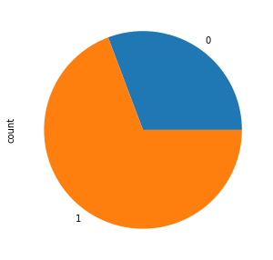

Recently, I worked on an assignment to analyze the data from bikesharing system to predict its demand. In this post, we will see how the given data can be analyzed using statistical machine learning methods. 

The original dataset can be found here on Kaggle. 

https://www.kaggle.com/c/bike-sharing-demand

In this notebook, we would be using a small subset of this dataset and just focus on the methodology. The accuracies can't be expected to be high for such a small subset of the dataset. Feel free to use the complete dataset for your analysis. 

You can download the CSV data used in this noteboot from Google drive.

https://drive.google.com/file/d/1GWbrrsPe6B-0ZKn4Dxd7D8pNvfK6IsQZ/view?usp=sharing





       season month  holiday day_of_week  ...  atemp humidity  windspeed   count
    0  Spring   May        0         Tue  ...   26.0  76.5833   0.118167  6073.0
    1    Fall   Dec        0         Tue  ...   19.0  73.3750   0.174129  6606.0
    2  Spring   Jun        0         Thu  ...   28.0  56.9583   0.253733  7363.0
    3    Fall   Dec        0         Sun  ...    4.0  58.6250   0.169779  2431.0
    4  Summer   Sep        0         Wed  ...   23.0  91.7083   0.097021  1996.0
    
    [5 rows x 11 columns]

## Data Exploration

### Bikeshares for weekend vs weekdays

The plot uses the `workingday` column to get information about weekday or weekend. Clearly lot more bikeshares happen on weekdays as compared to weekends. 

Also, on a more detailed level the factor plot is plotted to see the variations in bikeshares based on the day of the week. 

The factor plot reaffirms our observation from the pie chart and tells us that during weekends Sunday sees the least number of bikeshares. 





### Bikeshares during different weather conditions

The plot below shows that most bikeshares happen when the weather is clear to cloudy. People also seem to be using bikeshares in misty weather conditions. Quite intuitively, the number of bikeshares on a rainy or snowy day is quite less. 



### Bikeshares during different seasons

Firstly a pie chart is plotted for visualizing the number of bikeshares in different seasons. The pie chart doesn't provide a clear picture so next a bar chart is used to get a clearer picture. 

The bar chart shows that most bikeshares happen during Summer while Winter accounts for the least number of bikeshares. 





### Exploring linear non-linear dependencies 

As it is apparent from the plots below, some of the variables have linear dependencies with others while some don't have a linear relationship. 

| Variable      | Linear | Inverse-linear |  Non-Linear |
| ----------- | ----------- |--------- |-----------|
| Temp      | atemp, count |  -      |humidity, windspeed|
| atemp   | temp, count |      - |humidity, windspeed|
| humidity   | - |      windspeed |temp, atemp, count|
| windspeed   | - |      humidity |temp, atemp, count|
| count   | temp, atemp |      - |humidity, windspeed|



Moreover, lets find the correlation between the variables to further analyse the dependencies between variables. 

In the correlation heatmap, the blue shades represent higher level of correlation between the variables. 

Note: `temp`, `atemp` variables show good amount of positive correlation with `count`. 



    Index(['season', 'month', 'holiday', 'day_of_week', 'workingday', 'weather',
           'temp', 'atemp', 'humidity', 'windspeed', 'count'],
          dtype='object')

### Should polynomial transformation be performed?

Clearly not all features exhibit a linear dependency with the predictor variable ie. `count` so it might be worthwhile to try a polynomial transformation and visualize the dependencies again. 

Before that lets do some more data exploration to further improve the data for linear regression. 

## Bikeshares sum and mean plots grouped based on humidity

The idea is to see the variations in bikeshares for different humidity levels and then bin the values into multiple groups. 



    Text(0.5, 1.0, 'Average counts')



## Bikeshares sum and mean plots grouped based on atemp

Similar to humidity, the idea is to see the variations in bikeshares for different atemp levels and then bin the values into multiple groups. 

Moreover, `temp` and `atemp` is compared to see how these values vary. 



    Text(0.5, 1.0, 'Average counts')





<table border="1" class="dataframe">
  <thead>
    <tr style="text-align: right;">
      <th></th>
      <th>temp</th>
      <th>temp_no</th>
    </tr>
  </thead>
  <tbody>
    <tr>
      <th>0</th>
      <td>24.0</td>
      <td>37.0</td>
    </tr>
    <tr>
      <th>1</th>
      <td>15.0</td>
      <td>20.0</td>
    </tr>
    <tr>
      <th>2</th>
      <td>26.0</td>
      <td>48.0</td>
    </tr>
    <tr>
      <th>3</th>
      <td>0.0</td>
      <td>12.0</td>
    </tr>
    <tr>
      <th>4</th>
      <td>23.0</td>
      <td>46.0</td>
    </tr>
    <tr>
      <th>...</th>
      <td>...</td>
      <td>...</td>
    </tr>
    <tr>
      <th>726</th>
      <td>26.0</td>
      <td>48.0</td>
    </tr>
    <tr>
      <th>727</th>
      <td>33.0</td>
      <td>25.0</td>
    </tr>
    <tr>
      <th>728</th>
      <td>30.0</td>
      <td>49.0</td>
    </tr>
    <tr>
      <th>729</th>
      <td>8.0</td>
      <td>17.0</td>
    </tr>
    <tr>
      <th>730</th>
      <td>16.0</td>
      <td>30.0</td>
    </tr>
  </tbody>
</table>

731 rows × 2 columns



    <matplotlib.axes._subplots.AxesSubplot at 0x7fe857347240>



<table border="1" class="dataframe">
  <thead>
    <tr style="text-align: right;">
      <th></th>
      <th>season</th>
      <th>month</th>
      <th>holiday</th>
      <th>day_of_week</th>
      <th>workingday</th>
      <th>weather</th>
      <th>temp</th>
      <th>atemp</th>
      <th>windspeed</th>
      <th>count</th>
      <th>temp_no</th>
      <th>atemp_bin_cold</th>
      <th>atemp_bin_mild</th>
      <th>atemp_bin_warm</th>
      <th>humidity_bin_low</th>
      <th>humidity_bin_medium</th>
      <th>humidity_bin_high</th>
    </tr>
  </thead>
  <tbody>
    <tr>
      <th>0</th>
      <td>Spring</td>
      <td>May</td>
      <td>0</td>
      <td>Tue</td>
      <td>1</td>
      <td>Mist</td>
      <td>24.0</td>
      <td>26.0</td>
      <td>0.118167</td>
      <td>6073.0</td>
      <td>37.0</td>
      <td>0</td>
      <td>1</td>
      <td>0</td>
      <td>0</td>
      <td>0</td>
      <td>1</td>
    </tr>
    <tr>
      <th>1</th>
      <td>Fall</td>
      <td>Dec</td>
      <td>0</td>
      <td>Tue</td>
      <td>1</td>
      <td>Clear to Cloudy</td>
      <td>15.0</td>
      <td>19.0</td>
      <td>0.174129</td>
      <td>6606.0</td>
      <td>20.0</td>
      <td>0</td>
      <td>1</td>
      <td>0</td>
      <td>0</td>
      <td>0</td>
      <td>1</td>
    </tr>
    <tr>
      <th>2</th>
      <td>Spring</td>
      <td>Jun</td>
      <td>0</td>
      <td>Thu</td>
      <td>1</td>
      <td>Clear to Cloudy</td>
      <td>26.0</td>
      <td>28.0</td>
      <td>0.253733</td>
      <td>7363.0</td>
      <td>48.0</td>
      <td>0</td>
      <td>1</td>
      <td>0</td>
      <td>0</td>
      <td>1</td>
      <td>0</td>
    </tr>
    <tr>
      <th>3</th>
      <td>Fall</td>
      <td>Dec</td>
      <td>0</td>
      <td>Sun</td>
      <td>0</td>
      <td>Clear to Cloudy</td>
      <td>0.0</td>
      <td>4.0</td>
      <td>0.169779</td>
      <td>2431.0</td>
      <td>12.0</td>
      <td>0</td>
      <td>0</td>
      <td>0</td>
      <td>0</td>
      <td>1</td>
      <td>0</td>
    </tr>
    <tr>
      <th>4</th>
      <td>Summer</td>
      <td>Sep</td>
      <td>0</td>
      <td>Wed</td>
      <td>1</td>
      <td>Rain/Snow</td>
      <td>23.0</td>
      <td>23.0</td>
      <td>0.097021</td>
      <td>1996.0</td>
      <td>46.0</td>
      <td>0</td>
      <td>1</td>
      <td>0</td>
      <td>0</td>
      <td>0</td>
      <td>1</td>
    </tr>
    <tr>
      <th>...</th>
      <td>...</td>
      <td>...</td>
      <td>...</td>
      <td>...</td>
      <td>...</td>
      <td>...</td>
      <td>...</td>
      <td>...</td>
      <td>...</td>
      <td>...</td>
      <td>...</td>
      <td>...</td>
      <td>...</td>
      <td>...</td>
      <td>...</td>
      <td>...</td>
      <td>...</td>
    </tr>
    <tr>
      <th>726</th>
      <td>Summer</td>
      <td>Sep</td>
      <td>0</td>
      <td>Fri</td>
      <td>1</td>
      <td>Mist</td>
      <td>26.0</td>
      <td>27.0</td>
      <td>0.139929</td>
      <td>4727.0</td>
      <td>48.0</td>
      <td>0</td>
      <td>1</td>
      <td>0</td>
      <td>0</td>
      <td>1</td>
      <td>0</td>
    </tr>
    <tr>
      <th>727</th>
      <td>Summer</td>
      <td>Aug</td>
      <td>0</td>
      <td>Wed</td>
      <td>1</td>
      <td>Clear to Cloudy</td>
      <td>33.0</td>
      <td>32.0</td>
      <td>0.200258</td>
      <td>4780.0</td>
      <td>25.0</td>
      <td>0</td>
      <td>0</td>
      <td>1</td>
      <td>1</td>
      <td>0</td>
      <td>0</td>
    </tr>
    <tr>
      <th>728</th>
      <td>Summer</td>
      <td>Sep</td>
      <td>0</td>
      <td>Sun</td>
      <td>0</td>
      <td>Clear to Cloudy</td>
      <td>30.0</td>
      <td>31.0</td>
      <td>0.206467</td>
      <td>4940.0</td>
      <td>49.0</td>
      <td>0</td>
      <td>0</td>
      <td>1</td>
      <td>0</td>
      <td>0</td>
      <td>1</td>
    </tr>
    <tr>
      <th>729</th>
      <td>Winter</td>
      <td>Jan</td>
      <td>0</td>
      <td>Sun</td>
      <td>0</td>
      <td>Clear to Cloudy</td>
      <td>8.0</td>
      <td>13.0</td>
      <td>0.192167</td>
      <td>2294.0</td>
      <td>17.0</td>
      <td>1</td>
      <td>0</td>
      <td>0</td>
      <td>0</td>
      <td>1</td>
      <td>0</td>
    </tr>
    <tr>
      <th>730</th>
      <td>Spring</td>
      <td>Apr</td>
      <td>0</td>
      <td>Thu</td>
      <td>1</td>
      <td>Clear to Cloudy</td>
      <td>16.0</td>
      <td>20.0</td>
      <td>0.065929</td>
      <td>6565.0</td>
      <td>30.0</td>
      <td>0</td>
      <td>1</td>
      <td>0</td>
      <td>0</td>
      <td>1</td>
      <td>0</td>
    </tr>
  </tbody>
</table>

731 rows × 17 columns

### Encoding categorical variables



       month  holiday  ...  weather_Mist  weather_Rain/Snow
    0      8        0  ...             1                  0
    1      2        0  ...             0                  0
    2      6        0  ...             0                  0
    3      2        0  ...             0                  0
    4     11        0  ...             0                  1
    
    [5 rows x 22 columns]

## Checking for positive/negative correlation & statisitical significance

Some of the variables have negative correlation like windspeed, atemp_bin_cold, humidity_bin_high, season_Winter, weather_Mist, weather_Rain/Snow. Other variables with -ve sign have a very low -ve value and can be safely ignored. 

Similarly, the table shows variables with positive correlation. 



    ------ Positive/negative correlation with predictor variable(count) --------
    month                      0.186275
    holiday                   -0.004103
    day_of_week               -0.045716
    workingday                 0.042159
    temp                       0.516475
    atemp                      0.516624
    windspeed                 -0.195128
    count                      1.000000
    temp_no                    0.429402
    atemp_bin_cold            -0.225357
    atemp_bin_mild             0.388137
    atemp_bin_warm             0.161776
    humidity_bin_low          -0.076209
    humidity_bin_medium        0.201935
    humidity_bin_high         -0.153773
    season_Fall                0.071844
    season_Spring              0.101960
    season_Summer              0.294050
    season_Winter             -0.471729
    weather_Clear to Cloudy    0.219172
    weather_Mist              -0.140658
    weather_Rain/Snow         -0.233985
    Name: count, dtype: float64
    ------------------------------

### Statistical significance

Statistical significance can be measured using P-values. 
- more the number of *(stars) and higher the value, the statistical significance would be higher. 

Note: Statistical significance assumes linear dependencies. 



<table border="1" class="dataframe">
  <thead>
    <tr style="text-align: right;">
      <th></th>
      <th>month</th>
      <th>holiday</th>
      <th>day_of_week</th>
      <th>workingday</th>
      <th>temp</th>
      <th>atemp</th>
      <th>windspeed</th>
      <th>count</th>
      <th>temp_no</th>
      <th>atemp_bin_cold</th>
      <th>atemp_bin_mild</th>
      <th>atemp_bin_warm</th>
      <th>humidity_bin_low</th>
      <th>humidity_bin_medium</th>
      <th>humidity_bin_high</th>
      <th>season_Fall</th>
      <th>season_Spring</th>
      <th>season_Summer</th>
      <th>season_Winter</th>
      <th>weather_Clear to Cloudy</th>
      <th>weather_Mist</th>
      <th>weather_Rain/Snow</th>
    </tr>
  </thead>
  <tbody>
    <tr>
      <th>month</th>
      <td>1.0***</td>
      <td>0.02</td>
      <td>0.01</td>
      <td>-0.01</td>
      <td>0.11***</td>
      <td>0.12***</td>
      <td>-0.12***</td>
      <td>0.19***</td>
      <td>0.15***</td>
      <td>-0.08**</td>
      <td>0.29***</td>
      <td>-0.12***</td>
      <td>-0.16***</td>
      <td>0.03</td>
      <td>0.1***</td>
      <td>0.4***</td>
      <td>-0.11***</td>
      <td>-0.05</td>
      <td>-0.23***</td>
      <td>-0.04</td>
      <td>0.01</td>
      <td>0.06*</td>
    </tr>
    <tr>
      <th>holiday</th>
      <td>0.02</td>
      <td>1.0***</td>
      <td>-0.12***</td>
      <td>-0.25***</td>
      <td>-0.03</td>
      <td>-0.03</td>
      <td>0.01</td>
      <td>-0.0</td>
      <td>-0.02</td>
      <td>0.02</td>
      <td>-0.07*</td>
      <td>0.05</td>
      <td>-0.03</td>
      <td>0.03</td>
      <td>-0.01</td>
      <td>0.02</td>
      <td>-0.02</td>
      <td>-0.03</td>
      <td>0.03</td>
      <td>0.03</td>
      <td>-0.02</td>
      <td>-0.03</td>
    </tr>
    <tr>
      <th>day_of_week</th>
      <td>0.01</td>
      <td>-0.12***</td>
      <td>1.0***</td>
      <td>0.2***</td>
      <td>0.03</td>
      <td>0.03</td>
      <td>0.0</td>
      <td>-0.05</td>
      <td>0.01</td>
      <td>0.01</td>
      <td>0.0</td>
      <td>0.03</td>
      <td>0.02</td>
      <td>-0.03</td>
      <td>0.02</td>
      <td>0.0</td>
      <td>0.0</td>
      <td>0.01</td>
      <td>-0.01</td>
      <td>-0.0</td>
      <td>-0.03</td>
      <td>0.1***</td>
    </tr>
    <tr>
      <th>workingday</th>
      <td>-0.01</td>
      <td>-0.25***</td>
      <td>0.2***</td>
      <td>1.0***</td>
      <td>0.05</td>
      <td>0.05</td>
      <td>-0.02</td>
      <td>0.04</td>
      <td>0.05</td>
      <td>-0.02</td>
      <td>0.06</td>
      <td>0.01</td>
      <td>-0.03</td>
      <td>0.05</td>
      <td>-0.02</td>
      <td>-0.01</td>
      <td>0.01</td>
      <td>0.02</td>
      <td>-0.03</td>
      <td>-0.06</td>
      <td>0.05</td>
      <td>0.03</td>
    </tr>
    <tr>
      <th>temp</th>
      <td>0.11***</td>
      <td>-0.03</td>
      <td>0.03</td>
      <td>0.05</td>
      <td>1.0***</td>
      <td>0.99***</td>
      <td>-0.16***</td>
      <td>0.52***</td>
      <td>0.55***</td>
      <td>-0.47***</td>
      <td>0.47***</td>
      <td>0.58***</td>
      <td>-0.15***</td>
      <td>0.11***</td>
      <td>0.01</td>
      <td>-0.22***</td>
      <td>0.16***</td>
      <td>0.68***</td>
      <td>-0.62***</td>
      <td>0.12***</td>
      <td>-0.1***</td>
      <td>-0.06</td>
    </tr>
    <tr>
      <th>atemp</th>
      <td>0.12***</td>
      <td>-0.03</td>
      <td>0.03</td>
      <td>0.05</td>
      <td>0.99***</td>
      <td>1.0***</td>
      <td>-0.18***</td>
      <td>0.52***</td>
      <td>0.54***</td>
      <td>-0.44***</td>
      <td>0.47***</td>
      <td>0.58***</td>
      <td>-0.17***</td>
      <td>0.12***</td>
      <td>0.01</td>
      <td>-0.21***</td>
      <td>0.16***</td>
      <td>0.66***</td>
      <td>-0.62***</td>
      <td>0.11***</td>
      <td>-0.09**</td>
      <td>-0.07*</td>
    </tr>
    <tr>
      <th>windspeed</th>
      <td>-0.12***</td>
      <td>0.01</td>
      <td>0.0</td>
      <td>-0.02</td>
      <td>-0.16***</td>
      <td>-0.18***</td>
      <td>1.0***</td>
      <td>-0.2***</td>
      <td>-0.13***</td>
      <td>0.09**</td>
      <td>-0.1***</td>
      <td>-0.11***</td>
      <td>0.28***</td>
      <td>-0.13***</td>
      <td>-0.1***</td>
      <td>-0.14***</td>
      <td>0.1***</td>
      <td>-0.14***</td>
      <td>0.18***</td>
      <td>-0.0</td>
      <td>-0.04</td>
      <td>0.12***</td>
    </tr>
    <tr>
      <th>count</th>
      <td>0.19***</td>
      <td>-0.0</td>
      <td>-0.05</td>
      <td>0.04</td>
      <td>0.52***</td>
      <td>0.52***</td>
      <td>-0.2***</td>
      <td>1.0***</td>
      <td>0.43***</td>
      <td>-0.23***</td>
      <td>0.39***</td>
      <td>0.16***</td>
      <td>-0.08**</td>
      <td>0.2***</td>
      <td>-0.15***</td>
      <td>0.07*</td>
      <td>0.1***</td>
      <td>0.29***</td>
      <td>-0.47***</td>
      <td>0.22***</td>
      <td>-0.14***</td>
      <td>-0.23***</td>
    </tr>
    <tr>
      <th>temp_no</th>
      <td>0.15***</td>
      <td>-0.02</td>
      <td>0.01</td>
      <td>0.05</td>
      <td>0.55***</td>
      <td>0.54***</td>
      <td>-0.13***</td>
      <td>0.43***</td>
      <td>1.0***</td>
      <td>-0.17***</td>
      <td>0.5***</td>
      <td>0.07*</td>
      <td>-0.16***</td>
      <td>0.03</td>
      <td>0.11***</td>
      <td>-0.03</td>
      <td>0.19***</td>
      <td>0.29***</td>
      <td>-0.45***</td>
      <td>0.01</td>
      <td>0.0</td>
      <td>-0.03</td>
    </tr>
    <tr>
      <th>atemp_bin_cold</th>
      <td>-0.08**</td>
      <td>0.02</td>
      <td>0.01</td>
      <td>-0.02</td>
      <td>-0.47***</td>
      <td>-0.44***</td>
      <td>0.09**</td>
      <td>-0.23***</td>
      <td>-0.17***</td>
      <td>1.0***</td>
      <td>-0.55***</td>
      <td>-0.29***</td>
      <td>-0.01</td>
      <td>-0.03</td>
      <td>0.04</td>
      <td>0.34***</td>
      <td>-0.08**</td>
      <td>-0.41***</td>
      <td>0.16***</td>
      <td>-0.1***</td>
      <td>0.09**</td>
      <td>0.03</td>
    </tr>
    <tr>
      <th>atemp_bin_mild</th>
      <td>0.29***</td>
      <td>-0.07*</td>
      <td>0.0</td>
      <td>0.06</td>
      <td>0.47***</td>
      <td>0.47***</td>
      <td>-0.1***</td>
      <td>0.39***</td>
      <td>0.5***</td>
      <td>-0.55***</td>
      <td>1.0***</td>
      <td>-0.32***</td>
      <td>-0.1***</td>
      <td>-0.03</td>
      <td>0.12***</td>
      <td>-0.08**</td>
      <td>0.31***</td>
      <td>0.15***</td>
      <td>-0.38***</td>
      <td>-0.0</td>
      <td>0.01</td>
      <td>-0.02</td>
    </tr>
    <tr>
      <th>atemp_bin_warm</th>
      <td>-0.12***</td>
      <td>0.05</td>
      <td>0.03</td>
      <td>0.01</td>
      <td>0.58***</td>
      <td>0.58***</td>
      <td>-0.11***</td>
      <td>0.16***</td>
      <td>0.07*</td>
      <td>-0.29***</td>
      <td>-0.32***</td>
      <td>1.0***</td>
      <td>-0.06</td>
      <td>0.16***</td>
      <td>-0.13***</td>
      <td>-0.23***</td>
      <td>-0.13***</td>
      <td>0.58***</td>
      <td>-0.23***</td>
      <td>0.15***</td>
      <td>-0.13***</td>
      <td>-0.07*</td>
    </tr>
    <tr>
      <th>humidity_bin_low</th>
      <td>-0.16***</td>
      <td>-0.03</td>
      <td>0.02</td>
      <td>-0.03</td>
      <td>-0.15***</td>
      <td>-0.17***</td>
      <td>0.28***</td>
      <td>-0.08**</td>
      <td>-0.16***</td>
      <td>-0.01</td>
      <td>-0.1***</td>
      <td>-0.06</td>
      <td>1.0***</td>
      <td>-0.51***</td>
      <td>-0.25***</td>
      <td>-0.15***</td>
      <td>0.08**</td>
      <td>-0.07*</td>
      <td>0.14***</td>
      <td>0.3***</td>
      <td>-0.28***</td>
      <td>-0.07**</td>
    </tr>
    <tr>
      <th>humidity_bin_medium</th>
      <td>0.03</td>
      <td>0.03</td>
      <td>-0.03</td>
      <td>0.05</td>
      <td>0.11***</td>
      <td>0.12***</td>
      <td>-0.13***</td>
      <td>0.2***</td>
      <td>0.03</td>
      <td>-0.03</td>
      <td>-0.03</td>
      <td>0.16***</td>
      <td>-0.51***</td>
      <td>1.0***</td>
      <td>-0.69***</td>
      <td>0.07**</td>
      <td>-0.12***</td>
      <td>0.11***</td>
      <td>-0.06*</td>
      <td>0.24***</td>
      <td>-0.17***</td>
      <td>-0.2***</td>
    </tr>
    <tr>
      <th>humidity_bin_high</th>
      <td>0.1***</td>
      <td>-0.01</td>
      <td>0.02</td>
      <td>-0.02</td>
      <td>0.01</td>
      <td>0.01</td>
      <td>-0.1***</td>
      <td>-0.15***</td>
      <td>0.11***</td>
      <td>0.04</td>
      <td>0.12***</td>
      <td>-0.13***</td>
      <td>-0.25***</td>
      <td>-0.69***</td>
      <td>1.0***</td>
      <td>0.05</td>
      <td>0.08**</td>
      <td>-0.07*</td>
      <td>-0.06</td>
      <td>-0.52***</td>
      <td>0.43***</td>
      <td>0.27***</td>
    </tr>
    <tr>
      <th>season_Fall</th>
      <td>0.4***</td>
      <td>0.02</td>
      <td>0.0</td>
      <td>-0.01</td>
      <td>-0.22***</td>
      <td>-0.21***</td>
      <td>-0.14***</td>
      <td>0.07*</td>
      <td>-0.03</td>
      <td>0.34***</td>
      <td>-0.08**</td>
      <td>-0.23***</td>
      <td>-0.15***</td>
      <td>0.07**</td>
      <td>0.05</td>
      <td>1.0***</td>
      <td>-0.33***</td>
      <td>-0.33***</td>
      <td>-0.33***</td>
      <td>-0.06*</td>
      <td>0.03</td>
      <td>0.09**</td>
    </tr>
    <tr>
      <th>season_Spring</th>
      <td>-0.11***</td>
      <td>-0.02</td>
      <td>0.0</td>
      <td>0.01</td>
      <td>0.16***</td>
      <td>0.16***</td>
      <td>0.1***</td>
      <td>0.1***</td>
      <td>0.19***</td>
      <td>-0.08**</td>
      <td>0.31***</td>
      <td>-0.13***</td>
      <td>0.08**</td>
      <td>-0.12***</td>
      <td>0.08**</td>
      <td>-0.33***</td>
      <td>1.0***</td>
      <td>-0.34***</td>
      <td>-0.33***</td>
      <td>-0.02</td>
      <td>0.04</td>
      <td>-0.04</td>
    </tr>
    <tr>
      <th>season_Summer</th>
      <td>-0.05</td>
      <td>-0.03</td>
      <td>0.01</td>
      <td>0.02</td>
      <td>0.68***</td>
      <td>0.66***</td>
      <td>-0.14***</td>
      <td>0.29***</td>
      <td>0.29***</td>
      <td>-0.41***</td>
      <td>0.15***</td>
      <td>0.58***</td>
      <td>-0.07*</td>
      <td>0.11***</td>
      <td>-0.07*</td>
      <td>-0.33***</td>
      <td>-0.34***</td>
      <td>1.0***</td>
      <td>-0.34***</td>
      <td>0.11***</td>
      <td>-0.1***</td>
      <td>-0.03</td>
    </tr>
    <tr>
      <th>season_Winter</th>
      <td>-0.23***</td>
      <td>0.03</td>
      <td>-0.01</td>
      <td>-0.03</td>
      <td>-0.62***</td>
      <td>-0.62***</td>
      <td>0.18***</td>
      <td>-0.47***</td>
      <td>-0.45***</td>
      <td>0.16***</td>
      <td>-0.38***</td>
      <td>-0.23***</td>
      <td>0.14***</td>
      <td>-0.06*</td>
      <td>-0.06</td>
      <td>-0.33***</td>
      <td>-0.33***</td>
      <td>-0.34***</td>
      <td>1.0***</td>
      <td>-0.02</td>
      <td>0.03</td>
      <td>-0.02</td>
    </tr>
    <tr>
      <th>weather_Clear to Cloudy</th>
      <td>-0.04</td>
      <td>0.03</td>
      <td>-0.0</td>
      <td>-0.06</td>
      <td>0.12***</td>
      <td>0.11***</td>
      <td>-0.0</td>
      <td>0.22***</td>
      <td>0.01</td>
      <td>-0.1***</td>
      <td>-0.0</td>
      <td>0.15***</td>
      <td>0.3***</td>
      <td>0.24***</td>
      <td>-0.52***</td>
      <td>-0.06*</td>
      <td>-0.02</td>
      <td>0.11***</td>
      <td>-0.02</td>
      <td>1.0***</td>
      <td>-0.94***</td>
      <td>-0.23***</td>
    </tr>
    <tr>
      <th>weather_Mist</th>
      <td>0.01</td>
      <td>-0.02</td>
      <td>-0.03</td>
      <td>0.05</td>
      <td>-0.1***</td>
      <td>-0.09**</td>
      <td>-0.04</td>
      <td>-0.14***</td>
      <td>0.0</td>
      <td>0.09**</td>
      <td>0.01</td>
      <td>-0.13***</td>
      <td>-0.28***</td>
      <td>-0.17***</td>
      <td>0.43***</td>
      <td>0.03</td>
      <td>0.04</td>
      <td>-0.1***</td>
      <td>0.03</td>
      <td>-0.94***</td>
      <td>1.0***</td>
      <td>-0.12***</td>
    </tr>
    <tr>
      <th>weather_Rain/Snow</th>
      <td>0.06*</td>
      <td>-0.03</td>
      <td>0.1***</td>
      <td>0.03</td>
      <td>-0.06</td>
      <td>-0.07*</td>
      <td>0.12***</td>
      <td>-0.23***</td>
      <td>-0.03</td>
      <td>0.03</td>
      <td>-0.02</td>
      <td>-0.07*</td>
      <td>-0.07**</td>
      <td>-0.2***</td>
      <td>0.27***</td>
      <td>0.09**</td>
      <td>-0.04</td>
      <td>-0.03</td>
      <td>-0.02</td>
      <td>-0.23***</td>
      <td>-0.12***</td>
      <td>1.0***</td>
    </tr>
  </tbody>
</table>



<table border="1" class="dataframe">
  <thead>
    <tr style="text-align: right;">
      <th></th>
      <th>Variable</th>
      <th>Correlation &amp; Significance</th>
    </tr>
  </thead>
  <tbody>
    <tr>
      <th>0</th>
      <td>month</td>
      <td>0.19***</td>
    </tr>
    <tr>
      <th>1</th>
      <td>holiday</td>
      <td>-0.0</td>
    </tr>
    <tr>
      <th>2</th>
      <td>day_of_week</td>
      <td>-0.05</td>
    </tr>
    <tr>
      <th>3</th>
      <td>workingday</td>
      <td>0.04</td>
    </tr>
    <tr>
      <th>4</th>
      <td>temp</td>
      <td>0.52***</td>
    </tr>
    <tr>
      <th>5</th>
      <td>atemp</td>
      <td>0.52***</td>
    </tr>
    <tr>
      <th>6</th>
      <td>windspeed</td>
      <td>-0.2***</td>
    </tr>
    <tr>
      <th>7</th>
      <td>count</td>
      <td>1.0***</td>
    </tr>
    <tr>
      <th>8</th>
      <td>temp_no</td>
      <td>0.43***</td>
    </tr>
    <tr>
      <th>9</th>
      <td>atemp_bin_cold</td>
      <td>-0.23***</td>
    </tr>
    <tr>
      <th>10</th>
      <td>atemp_bin_mild</td>
      <td>0.39***</td>
    </tr>
    <tr>
      <th>11</th>
      <td>atemp_bin_warm</td>
      <td>0.16***</td>
    </tr>
    <tr>
      <th>12</th>
      <td>humidity_bin_low</td>
      <td>-0.08**</td>
    </tr>
    <tr>
      <th>13</th>
      <td>humidity_bin_medium</td>
      <td>0.2***</td>
    </tr>
    <tr>
      <th>14</th>
      <td>humidity_bin_high</td>
      <td>-0.15***</td>
    </tr>
    <tr>
      <th>15</th>
      <td>season_Fall</td>
      <td>0.07*</td>
    </tr>
    <tr>
      <th>16</th>
      <td>season_Spring</td>
      <td>0.1***</td>
    </tr>
    <tr>
      <th>17</th>
      <td>season_Summer</td>
      <td>0.29***</td>
    </tr>
    <tr>
      <th>18</th>
      <td>season_Winter</td>
      <td>-0.47***</td>
    </tr>
    <tr>
      <th>19</th>
      <td>weather_Clear to Cloudy</td>
      <td>0.22***</td>
    </tr>
    <tr>
      <th>20</th>
      <td>weather_Mist</td>
      <td>-0.14***</td>
    </tr>
    <tr>
      <th>21</th>
      <td>weather_Rain/Snow</td>
      <td>-0.23***</td>
    </tr>
  </tbody>
</table>



## Linear regression without polynomial transformation





    LinearRegression(copy_X=True, fit_intercept=True, n_jobs=None, normalize=False)



    <matplotlib.axes._subplots.AxesSubplot at 0x7fe851c2a828>



### Evaluating predictions

We can evaluate the predictions using Root mean Squared Log Error (RMSLE)



    R2: 44.029165944830574 %
    RMSE: 0.5088707035845853
    RMSLE: 0.5071272452091635

### Back to polynomial transformation

Now, that we have seen that without polynomial transformation we get a RMSLE score of 0.507 lets try with the polynomial transformation. 



         1  month  ...  weather_Mist weather_Rain/Snow  weather_Rain/Snow^2
    0  1.0    8.0  ...                             0.0                  0.0
    1  1.0    2.0  ...                             0.0                  0.0
    2  1.0    6.0  ...                             0.0                  0.0
    3  1.0    2.0  ...                             0.0                  0.0
    4  1.0   11.0  ...                             0.0                  1.0
    
    [5 rows x 276 columns]





    LinearRegression(copy_X=True, fit_intercept=True, n_jobs=None, normalize=False)



    /usr/local/lib/python3.6/dist-packages/seaborn/distributions.py:2557: FutureWarning: `distplot` is a deprecated function and will be removed in a future version. Please adapt your code to use either `displot` (a figure-level function with similar flexibility) or `histplot` (an axes-level function for histograms).
      warnings.warn(msg, FutureWarning)



    R2: 22.13254677543377 %
    RMSE: 0.6002118212313721
    RMSLE: 0.5991302674566322

### Random forest regressor





    RandomForestRegressor(bootstrap=True, ccp_alpha=0.0, criterion='mse',
                          max_depth=None, max_features='auto', max_leaf_nodes=None,
                          max_samples=None, min_impurity_decrease=0.0,
                          min_impurity_split=None, min_samples_leaf=1,
                          min_samples_split=2, min_weight_fraction_leaf=0.0,
                          n_estimators=100, n_jobs=None, oob_score=False,
                          random_state=None, verbose=0, warm_start=False)



    /usr/local/lib/python3.6/dist-packages/seaborn/distributions.py:2557: FutureWarning: `distplot` is a deprecated function and will be removed in a future version. Please adapt your code to use either `displot` (a figure-level function with similar flexibility) or `histplot` (an axes-level function for histograms).
      warnings.warn(msg, FutureWarning)



    R2: 40.83093585563251 %
    RMSE: 0.5232074381024822
    RMSLE: 0.5214938879406389

## Gradient boosting regressor



    /usr/local/lib/python3.6/dist-packages/seaborn/distributions.py:2557: FutureWarning: `distplot` is a deprecated function and will be removed in a future version. Please adapt your code to use either `displot` (a figure-level function with similar flexibility) or `histplot` (an axes-level function for histograms).
      warnings.warn(msg, FutureWarning)



    R2: 41.92546239525904 %
    RMSE: 0.5183456277546589
    RMSLE: 0.5167765321375696

## XG Boost Regressor



    [06:03:21] WARNING: /workspace/src/objective/regression_obj.cu:152: reg:linear is now deprecated in favor of reg:squarederror.

    /usr/local/lib/python3.6/dist-packages/seaborn/distributions.py:2557: FutureWarning: `distplot` is a deprecated function and will be removed in a future version. Please adapt your code to use either `displot` (a figure-level function with similar flexibility) or `histplot` (an axes-level function for histograms).
      warnings.warn(msg, FutureWarning)



    R2: 35.83080957789135 %
    RMSE: 0.5448661642271247
    RMSLE: 0.5432712054784864

## Conclusion

The results for different models are shown in the table below. Clearly linear regression with polynomial transformation performs the best in terms of RMSE score. 

| Model      | R2 Score(%) | RMSE |  RMSLE |
| ----------- | ----------- |--------- |-----------|
| Linear regression      | 44.02 |  0.508      |0.507|
| Linear regression (polynomial)   | 22.13 |      0.60 |0.59|
| Random forest regressor  | 43.28 |      0.512 |0.510|
| Gradient boosting regressor   | 43.44 |      51.1 |51.0|
| XG Boost regressor   | 25.83 |      0.544 |0.5432|
