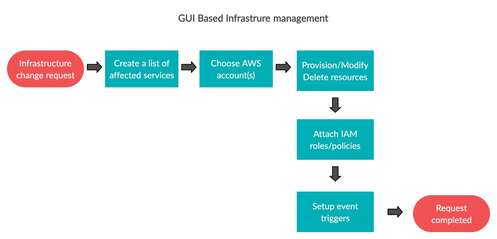
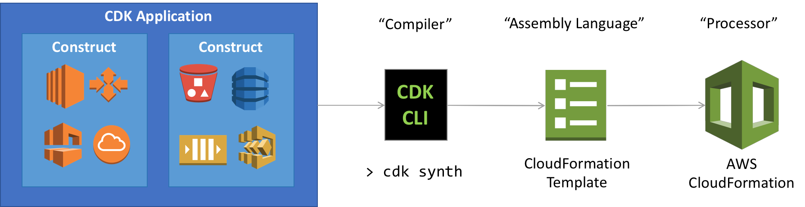
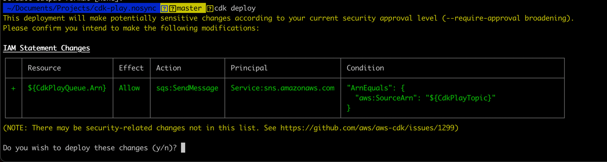

If your application uses just a handful of cloud resources, you can easily manage it using the GUI(Graphical User Interface) based console. As the complexity of your system increases, the underlying infrastructure also grows, and managing it manually becomes a nightmare. Moreover, it's prone to manual errors where a small user error can potentially bring the system into a bad state. In this article, we will focus on AWS and explore efficient ways of programmatically managing the infrastructure. 

# Manual Deployment Workflow

Manual infrastructure deployment management requires a set of steps all of which are prone to errors, especially for larger systems. The diagram below shows a general workflow for manually processing any service request. 

# Benefits of programmatically managing infrastructure

Traditional approaches using manual or script-based deployment are prone to errors. Even if the scripts are stored in a version control system, every step must be documented, and a runbook must be prepared. Since it involves manual intervention, creating new environments can't be executed in a repeatable, reliable, or consistent fashion. Moreover, the run books need to be kept up to date, and a knowledge transfer is required whenever there is a change in personnel. 

Infrastructure as Code(IaC) allows provisioning of resources using declarative programming and enables the use of version control. Infrastructure code should be treated similar to application code, and the same rigor of application code development should be applied to it. Provisioning, orchestration, and deployment of resources should be automated using IaC, and ideally, it should be integrated with the CI/CD (Continuous Integration/Continuous Deployment) pipeline. 
In particular, CDK offers multiple advantages, making it one of the preferred choices for programmatically managing infrastructure. Some of these advantages are discussed below: 

- **Easier cloud onboarding:** CDK lets you leverage your existing skills and tools for building a cloud infrastructure. Developers can use their language of choice and continue using their preferred IDE for writing a CDK app. It also provides various high-level components that can be used to preconfigure cloud resources with proven defaults, helping you build on AWS without needing to be an expert.
- **Faster development process:** With the expressive power of programming languages and features such as objects, loops, and conditions, it can significantly accelerate the development process. Moreover, it is also possible to write unit test cases for the infrastructure components. Having the ability to unit test the infrastructure code is immense and adds to developer confidence while making any changes. 
- **Customizable and shareable:** CDK allows you to extend the existing components to create custom components that meet your organization's security, compliance, and governance requirements. These components can be easily shared around your organization, enabling you to bootstrap new projects with best practices by default rapidly. 
- **No context switching:** You can write your runtime code, define your AWS resources with the same programming language, and continue using the same IDE for runtime code and infrastructure development. Moreover, you can visualize your CDK application stacks and resources with the [AWS Toolkit for VS Code](https://aws.amazon.com/visualstudiocode/). The toolkit provides an integrated experience for developing serverless applications, including getting started guide, step-through debugging, and deploying from the IDE. 
# Introduction to IaC

AWS infrastructure can be provisioned programmatically using either [AWS Cloudformation](https://aws.amazon.com/cloudformation/) templates or using [Terraform by HashiCorp](https://www.terraform.io/intro/). AWS CloudFormation provides an easy way to model a collection of related AWS and third-party resources, provision them quickly and consistently, and manage them throughout their lifecycles. It comprises a YAML or a JSON-based configuration file that describes the desired resources and their dependencies so you can launch and configure them together as a stack. These templates can be used to create, update and delete resources across AWS accounts and regions. 

Terraform is another tool that allows you to build, change, and version infrastructure safely and efficiently. Some enterprises prefer to use Terraform since it allows you to manage both on-premise resources and cloud resources. It allows you to configure low-level components such as compute instances, storage, and networking, as well as high-level components such as DNS entries, SaaS features, etc. Terraform configs are maintained in `.tf` files. 

As the complexity increases, working with YAML, JSON, Terraform files becomes a bit difficult as the configuration cannot be modularized. That’s where AWS Cloud Development Kit (AWS CDK) comes into the picture. It is an open-source framework that lets you model and provisions your cloud resources using a programming language of your choice. AWS CDK enables you to model application infrastructure using TypeScript, Python, Java, and .NET. Behind the scenes, it uses AWS CloudFormation to provision resources in a safe and repeatable manner. 

The diagram below shows the infrastructure management workflow using AWS CDK. 

In the next few sections, I will provide a brief overview of CDK concepts and then we will use the AWS CDK toolkit to deploy a sample application to an AWS account. 

# CDK Constructs

AWS CDK Constructs are cloud components that encapsulates configuration detail and glue logic for using one or multiple AWS services. CDK provides a [library](https://docs.aws.amazon.com/cdk/api/latest/docs/aws-construct-library.html) of constructs covering most of the commonly used AWS services and features. You can customize these constructs based on your needs and create reusable components for your organization. You can easily change any of the parameters or encode your own custom construct. In addition to the constructs made available through these libraries, CDK provides 1:1 mapping with base-level AWS CloudFormation resources(CFN Resources), providing a way to define it with a programming language. These CFN Resources provide complete coverage of CloudFormation resources and make it possible to provision any AWS resource using CDK.

The AWS CDK supports TypeScript, JavaScript, Python, Java, C#/.Net, and (in developer preview) Go. A construct represents a cloud component and encapsulates everything AWS CloudFormation needs to create the component. When CDK objects are initialized in your CDK application, they are compiled into a YAML template that is deployed as as AWS CloudFormation stack. 
The CDK constructs library includes all the resources available on AWS. For eg., the s3.Bucket represents an Amazon S3 bucket, and the `sqs.Queue` represents an Amazon SQS queue. The library contains three different levels of constructs, namely the L1, L2 and L3 constructs. 

## L1 Constructs

The low level constructs(L1) which are comprised of CFN resources. These constructs directly represent all resources available in AWS CloudFormation. For example, the s3.Bucket class represents an Amazon S3 bucket, and the `dynamodb.Table` class represents an Amazon DynamoDB table. Lets take a few examples of L1 constructs to understand how they can be defined in a CDK application. 

**S3 Bucket Construct:** 

The following code snippet can be used to create a S3 bucket and attach a policy to it that grants `GetObject` permission to AWS account root user. In this example we are using the `addToResourcePolicy` method to attach an IAM `PolicyStatement` to the bucket to provide fine grained permissions. 

    import * as s3 from "@aws-cdk/aws-s3";
    import * as iam from "@aws-cdk/aws-iam";
    
    const bucket = new s3.Bucket(this, "CdkPlayBucket");
    const result = bucket.addToResourcePolicy(
      new iam.PolicyStatement({
        actions: ["s3:GetObject"],
        resources: ["*"],
        principals: [new iam.AccountRootPrincipal()],
      })
    );

**DynamoDB Construct:** 

The following code snippet can be used to create a Dynamo DB table and attach auto scaling rules to it. 

    import * as dynamodb from "@aws-cdk/aws-dynamodb";
    
    const table = new dynamodb.Table(this, "CdkPlayTable", {
      partitionKey: { name: "id", type: dynamodb.AttributeType.STRING },
      billingMode: dynamodb.BillingMode.PAY_PER_REQUEST,
    });
    
    const readScaling = table.autoScaleReadCapacity({
      minCapacity: 1,
      maxCapacity: 50,
    });
    
    readScaling.scaleOnUtilization({
      targetUtilizationPercent: 50,
    });

The examples above demonstrate the power of L1 constructs and how they can be used to string together resources and configurations for your application. 

## L2 Constructs

The next level of constructs(L2) represent AWS resources with a higher-level, intent based API. They provide some defaults, boilerplate code and glue logic along with the low level L1 constructs. For eg., `bucket.addLifeCycleRule()`, represents an S3 bucket with a lifecycle rule added to it. The code snippet below shows how it can be done. 

    bucket.addLifecycleRule({
      abortIncompleteMultipartUploadAfter: Duration.days(7),
      enabled: true,
      id: 'BucketLifecycleRule'
    })

Additionally, you can add a [CORS rule](https://developer.mozilla.org/en-US/docs/Web/HTTP/CORS) to the bucket using the `addCorsRule` construct. These rules are useful when you need to access the objects in the bucket from a third party domain. 

    bucket.addCorsRule({
      allowedMethods: [
        s3.HttpMethods.GET,
        s3.HttpMethods.POST,
        s3.HttpMethods.PUT,
      ],
      allowedOrigins: ["https://smashingmagazine.com"],
      allowedHeaders: ["*"],
    });

## L3 Constructs

The highest level of constructs(L3) are also called patterns. These constructs are designed to help you complete common tasks in AWS, often involving multiple kinds of resources. For eg. `aws-apigateway.LambdaRestApi` represents an AWS API Gateway API that is backed by an AWS Lambda function. The code snippet below shows how it can be used. Notice that we are creating a a `lambda.Function` with inline code that is being passed to the `LambdaRestApi` method for connecting it with the API Gateway. 

    const backend = new lambda.Function(this, "CDKPlayLambda", {
      code: lambda.Code.fromInline(
        'exports.handler = function(event, ctx, cb) { return cb(null, "success"); }'
      ),
      handler: "index.handler",
      runtime: lambda.Runtime.NODEJS_14_X,
    });
    const api = new apigateway.LambdaRestApi(this, "CDKPlayAPI", {
      handler: backend,
      proxy: false,
    });
    
    const items = api.root.addResource("items");
    items.addMethod("GET"); // GET /items
    items.addMethod("POST"); // POST /items

# CDK Stacks and Apps

AWS CDK apps are composed of building blocks known as Constructs, which are composed together to form stacks and apps. 

## CDK Stacks

Stack is the smallest deployable unit in the AWS CDK. All resources defined within a stack, are provisioned as a single unit. A CDK stack has the same [limitations](https://docs.aws.amazon.com/AWSCloudFormation/latest/UserGuide/cloudformation-limits.html) as AWS CloudFormation. You can define any number of stacks in your AWS CDK app. The code snippet below shows the scaffolding for a sample stack. 

    import * as cdk from "@aws-cdk/core";
    export class CdkPlayStack extends cdk.Stack {
      constructor(scope: cdk.App, id: string, props?: cdk.StackProps) {
        super(scope, id, props);
        // resources
      }
    }

## CDK Apps

As discussed above, all constructs that represent AWS resources must be defined within the scope of a Stack construct. We need to initialize the stack and define it in some scope to deploy it. To define the stack within the scope of an application, you can use the `App` construct. The code snippet below instantiates the `CdkPlayStack` and produces the AWS CloudFormation template that the stack defined.

    import { App } from "@aws-cdk/core";
    import { CdkPlayStack } from "./cdk-play-stack";
    
    const app = new App();
    new CdkPlayStack(app, "hello-cdk");
    app.synth();
# Using the CDK Toolkit

AWS provides a CLI tool which is the primary way of interacting with your AWS CDK application. It builds, synthesizes and deploys the resources defined in your CDK application.  

## Creating the app

`cdk init` command can be used to initialize a new application in a language of your choice. Each CDK app maintains its own set of module dependencies and should be created in its own directory. For eg. you can create a typescript CDK application using the `sample-app` template using the following command. 

    cdk init sample-app --language=typescript

Executing the above command generates several files but the file that interests us the most is the `lib/cdk-init-stack.ts` file that contains a single stack with a few constructs initialized in it. The code snippet below shows the stack that was generated for us. 

    import * as sns from '@aws-cdk/aws-sns';
    import * as subs from '@aws-cdk/aws-sns-subscriptions';
    import * as sqs from '@aws-cdk/aws-sqs';
    import * as cdk from '@aws-cdk/core';
    
    export class CdkInitStack extends cdk.Stack {
      constructor(scope: cdk.App, id: string, props?: cdk.StackProps) {
        super(scope, id, props);
        const queue = new sqs.Queue(this, 'CdkInitQueue', {
          visibilityTimeout: cdk.Duration.seconds(300)
        });
        const topic = new sns.Topic(this, 'CdkInitTopic');
        topic.addSubscription(new subs.SqsSubscription(queue));
      }
    }

The `cdk init` command also initializes the project as a Git repository along with the `.gitignore` file. Apart from that it generates a package.json for managing project dependencies and a `tsconfig.json` for typescript configuration. 

Once you have the project initialized, you can run the build command to manually compile the app. This isn't a mandatory step since the `cdk` toolkit does it for you before you deploy the changes but a manual build can sometimes help in catching syntax errors. Here's how it can be done. 

    npm run build

Moreover, we saw earlier that the project was initialized with a single stack. You can verify the same by executing the following command. 

    cdk ls

The ls command should return the name of your app's directory as the name of the stack. Moreover, you can check the changes made since the last deployment by using the `cdk diff` command. 

## Synthesize an AWS CloudFormation template

Once you are done making changes to your stack, you can use synth command to synthesize the stack to an AWS CloudFormation template. If your application contains multiple stacks, you need to specify the name of the stack while executing the synth command. Here's how you can synthesize the stack.

    cdk synth

It generates a `cdk.out` file containing a YAML-format template with the resources defined in the stack converted to equivalent AWS CloudFormation template. The beginning of the YAML output is shown below. 

    Resources:
      CdkPlayQueue78BDD396:
        Type: AWS::SQS::Queue
        Properties:
          VisibilityTimeout: 300
        UpdateReplacePolicy: Delete
        DeletionPolicy: Delete
        Metadata:
          aws:cdk:path: CdkPlayStack/CdkPlayQueue/Resource

The YAML template generated by `cdk synth` is a perfectly valid AWS CloudFormation template and can be deployed either manually via the console or using any other tool. CDK toolkit also supports deploying the template and the next section will describe how it can be done. 

## Deploying the Stack

Before trying to deploy the stack, make sure that you have AWS CLI installed and AWS credentials configured on your device. You can refer to the [quick-start doc](https://docs.aws.amazon.com/cli/latest/userguide/cli-configure-quickstart.html) for more details on how to set up the credentials. 
Finally, to deploy the stack using AWS CloudFormation, execute the following the command. 

    cdk deploy

Similar to the synth command, you don't need to specify the name of the stack if your application contains a single stack. If your stack results in any sensitive policy changes in your account, the toolkit will confirm those changes before proceeding with the deployment. The screenshot below shows the confirmation prompt while trying to deploy the stack. 

The toolkit displays the progress of deployment and once the deployment succeeds, you can visit the AWS CloudFormation console and see how it lists your stack. Also, if you check the SNS and SQS consoles, you will find respective resources created for you. 

**Note:** If you don't see the resources or the stack, make sure the region selected in the AWS console matches the region that you configured using the CLI. 

The commands described above are some of the most commonly used toolkit commands and for a detailed overview of other commands you can refer to the [official documentation](https://docs.aws.amazon.com/cdk/latest/guide/cli.html).

# Conclusion

This article provided a quick overview of managing AWS infrastructure using AWS CDK. We saw that it offers multiple advantages over traditional techniques. The use of CDK allows you to use logical statements and object-oriented techniques while modeling the system. You can define high-level abstractions, share them, and publish them to your team, company, or community. Moreover, the infrastructure project can be organized into logical modules and reused as a library. In addition to these benefits, CDK also makes the infrastructure code testable using industry-standard protocols. It lets you leverage the existing code review workflow for the infrastructure project. 

We saw how you could use the AWS CDK toolkit for interacting with the CDK app. The toolkit allows the developers to synthesize the stacks to the AWS CloudFormation template and deploy it to an AWS accounts. The complete source code of the sample CDK application that was used in this article can be found on Github. 

https://github.com/maskaravivek/CdkPlay

We also saw a few examples of the AWS Construct Library and how you can use L1, L2 & L3 constructs to glue together the system architecture. The AWS Construct Library aims to reduce the complexity required when integrating various AWS services for your application. 