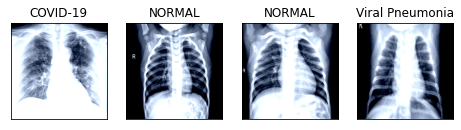

In this notebook, we will try to classify images from the [Covid-19 Radiography Dataset](https://www.kaggle.com/tawsifurrahman/covid19-radiography-database)[1] using a pre-trained [ResNet-18](https://pytorch.org/hub/pytorch_vision_resnet/) network. We will be using the PyTorch library for building our network. 

**Disclaimer:** This model should be used only for learning purposes as Covid-19 diagnosis is an ongoing research topic.

<!--adsense-->

## Download the dataset

Firstly, you need to download the dataset from Kaggle. Check [these steps](https://www.kaggle.com/general/74235) for detailed instructions. 

## Data preprocessing

As a first, step download the dataset from Kaggle and create a new PyTorch dataset using the `ImageFolder` method. 

Also, we are defining a transformer to Resize the images to 224x224 px and then converting the image to a Tensor. 



Next, we. split the dataset into training, validation and testing sets. We would be using 20% of the data for testing and 10% of the data for validation using a `SubsetRandomSampler`. 



Next, lets define the `DataLoader` for training, testing and validation sets. 



Now, that our `DataLoader` is defined, lets use the `train_loader` to visualize a few images along with their classes. 



## Defining the model

Next, lets define the model. We will be using a pre-trained Resnet18 architecture for our classification task. As the number of images in our dataset is relatively less, using a transfer learning will be helpful. 



    Downloading: "https://download.pytorch.org/models/resnet18-5c106cde.pth" to /root/.cache/torch/checkpoints/resnet18-5c106cde.pth

    HBox(children=(FloatProgress(value=0.0, max=46827520.0), HTML(value='')))

    
    True



Let's add fully connected layers at the end of the network, to adjust the final layer's output to correspond to the number of classes in our dataset. 





We would be using `CrossEntropyLoss` as the loss function and a learning rate of `3e-5` for training.



## Training

Finally, lets train the network for 20 epochs



    Epoch: 1 	Training Loss: 0.569099 	Validation Loss: 0.045166
    Validation loss decreased (inf --> 0.045166).  Saving model ...
    Epoch: 2 	Training Loss: 0.447157 	Validation Loss: 0.035986
    .
    .
    .
    .
    Epoch: 19 	Training Loss: 0.229328 	Validation Loss: 0.016049
    Epoch: 20 	Training Loss: 0.248973 	Validation Loss: 0.013585
    Validation loss decreased (0.014983 --> 0.013585).  Saving model ...

## Evaluation

Now, that the training is complete, lets evaluate the performance of the network by predicting the classes for test dataset. 



    Test Loss: 0.037036
    
    Test Accuracy of COVID-19: 100% (48/48)
    Test Accuracy of NORMAL: 97% (268/276)
    Test Accuracy of Viral Pneumonia: 91% (233/256)
    
    Test Accuracy (Overall): 94% (549/580)

## Conclusion

We used a pre-trained ResNet18 architecture for classifying images from the Radiography dataset. Our model gives a good accuracy of around 94% without reinventing the wheel. This demonstrates the power of transfer learning and shows how new problems can be tackled using existing models pre-trained on much larger datasets. With some minor enhancements like data augmentation, the accuracy can further be improved. 

# References

[1] M.E.H. Chowdhury, T. Rahman, A. Khandakar, R. Mazhar, M.A. Kadir, Z.B. Mahbub, K.R. Islam, M.S. Khan, A. Iqbal, N. Al-Emadi, M.B.I. Reaz, “Can AI help in screening Viral and COVID-19 pneumonia?” arXiv preprint, 29 March 2020, https://arxiv.org/abs/2003.13145. https://www.kaggle.com/tawsifurrahman/covid19-radiography-database
