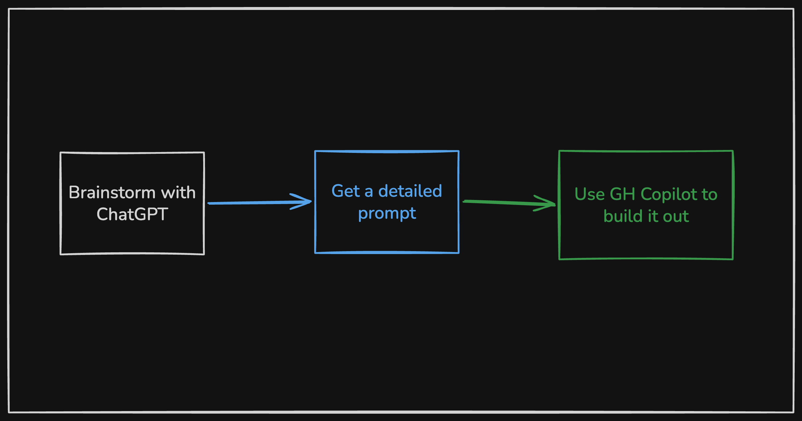
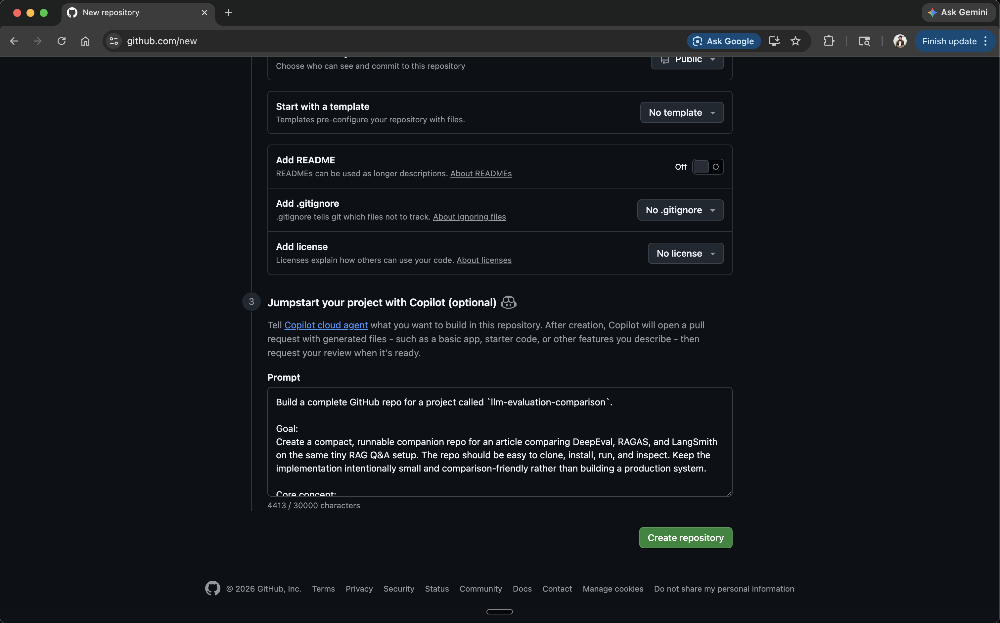
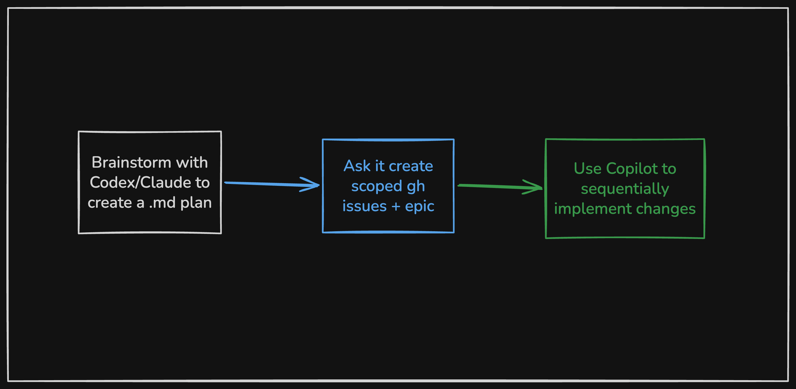
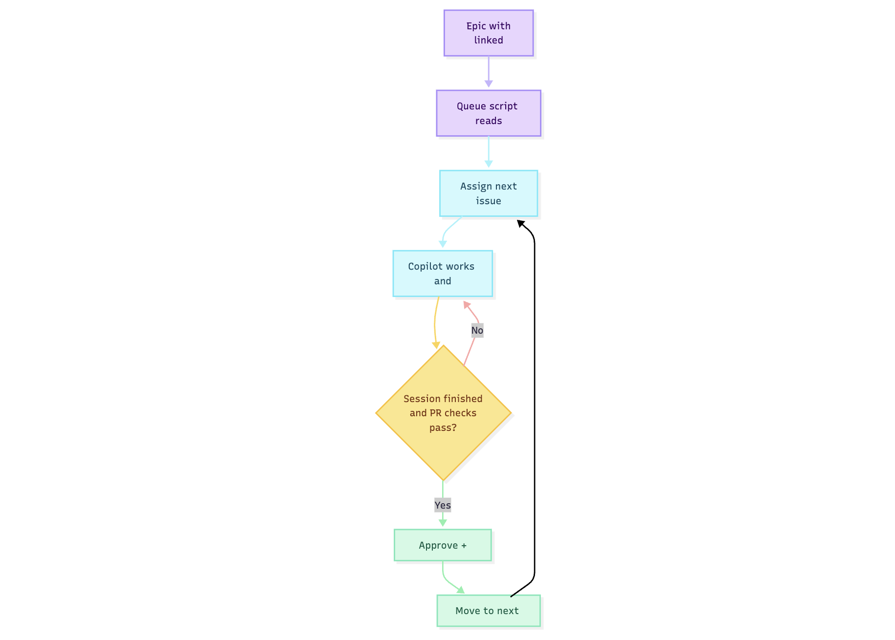

Lately, [GitHub Copilot's coding agent](https://github.com/features/copilot) has become one of my favorite ways to build prototypes.

For brand new repos, my workflow is simple: brainstorm in ChatGPT or Claude, turn that into a detailed prompt, let Copilot generate the first working version.



GitHub supports this directly at repo creation: you can paste a full project spec into the Copilot agent prompt field and it'll scaffold the entire repo before you write a single line yourself.



For existing projects, it needs more structure. I use Claude or Codex to create a markdown plan, then have it generate scoped GitHub issues grouped under an epic. Instead of one giant pass, Copilot works through them one by one.



The epic is just a GitHub issue with a task checklist linking to the individual issues:

```markdown
## Tasks
- [ ] #101 Add login page UI
- [ ] #102 Wire login form to /api/auth/login endpoint
- [ ] #103 Redirect to /dashboard on success
- [ ] #104 Add logout and session expiry handling
```

That pattern ended up being useful enough that I turned it into a tiny script: [`copilot-auto-queue`](https://github.com/maskaravivek/copilot-auto-queue). It reads an epic checklist, assigns the next issue to Copilot, waits for the agent session and PR checks to finish, merges the PR, then moves to the next issue — built on [GitHub CLI](https://cli.github.com/) and [jq](https://jqlang.github.io/jq/).

```bash
./epic-queue.sh --epics 42 --repo maskaravivek/llm-evaluation-comparison --auto-merge --watch
```

`--watch` keeps the script running continuously until the epic is done. Swap in `--dry-run` first to preview which issues would be queued without actually assigning anything.

## Why sequential beats one big pass

When I point an agent at an existing codebase and ask it to make a large set of related changes, a few things go wrong quickly.

**Reviewability.** One giant PR is hard to inspect and annoying to unwind.

**Context drift.** Even good agents get sloppy when scope is broad, especially across multiple areas of the repo.

**Quota efficiency.** I'd rather spend the expensive planning budget on proper decomposition, then use Copilot to execute individual issues.

None of this is novel. It's just applying normal engineering hygiene to AI-assisted development: small units of work, explicit scope, and frequent merge points.

## The automation loop



The loop runs like this: the script reads unchecked items from the epic (`- [ ] #123`), assigns the next one to Copilot, then polls until the agent session goes idle and all PR checks pass. Once they do, it approves and merges the PR, marks the checklist item done, and moves to the next issue. It repeats until the epic is complete.

There's also a watch mode for continuous automation, dry-run support, and a configurable minimum idle time before merge.

## What this is good for

I wouldn't use this for every production codebase. But for toy projects, tutorial repos, migrations, internal tools, and side-project MVPs, it hits a nice balance.

Each issue becomes a narrow implementation unit. Copilot only needs to solve one scoped task at a time. If something goes sideways, I only need to inspect one PR. And the epic plus issues create a natural audit trail — what I intended, how I decomposed it, what actually changed.

Much easier to reason about than "I asked an agent to refactor the whole thing and now I have a 4,000-line diff."

## Where I'd be cautious

This doesn't work as well when:

* the codebase has poor test coverage
* changes have subtle cross-cutting effects
* the issue decomposition is weak
* merge safety depends heavily on human review

The queue helps when the real work is decomposable and the repo already has guardrails.

**When the queue stalls.** The script waits for the Copilot session to go idle and PR checks to pass before merging. If checks never pass — say, a test fails or Copilot opens a PR that doesn't compile — the queue pauses rather than force-merging. You review the PR, fix or close it manually, then re-run. The script is a sequencer, not a safety net.

## Cost and quota

One reason I've been leaning into Copilot for this is how [premium requests are priced](https://docs.github.com/en/copilot/managing-copilot/monitoring-usage-and-entitlements/about-premium-requests) — one per session, multiplied by the model's rate, with steering comments during an active session costing extra.

That changes where I spend expensive agent time. I'd rather use Claude or ChatGPT to scope the work up front, then hand off a stream of smaller, well-defined tasks to Copilot. In practice, that feels more efficient than running a large implementation thread in a general-purpose chat tool.

## What actually matters

A few things make or break this workflow.

**Issue quality.** If the issues are vague, the queue just automates vague work. The better the issue body and acceptance criteria, the better Copilot does.

**Task size.** Too broad and Copilot drifts. Too narrow and you're basically writing the implementation in the issue body. The right level is a single reviewable unit of behavior.

I used this on [`llm-evaluation-comparison`](https://github.com/maskaravivek/llm-evaluation-comparison), a repo that benchmarks DeepEval, RAGAS, and LangSmith against the same RAG test suite. Each framework got its own issue. Compare how the scoping changes what Copilot actually produces:

* Too vague: *"Add RAGAS support"*
* Too narrow: *"Create the ragas.py file"*
* About right: *"Add RAGAS evaluation implementation using the existing test dataset in `tests/dataset/`. Output scores as JSON to `results/ragas.json`. Match the structure of the existing DeepEval implementation. No new test data needed."*

**Upfront investment.** Since [steering an active session costs extra](https://docs.github.com/en/copilot/using-github-copilot/using-claude-sonnet-in-github-copilot), it pays to spend more time on issue quality and less time course-correcting mid-run. A well-written issue body is cheaper than a steering comment.

## The broader point

The interesting part isn't the script.

It's the pattern: use one model to reason about scope, turn that into explicit work items, use another agent to execute them in small batches, merge continuously. Keep humans focused on planning and spot checks, not repetitive handoffs.

That's a more useful mental model to me than "pick one super-agent and let it do everything."

Small issues. Small PRs. Continuous movement. It ends up feeling a lot more like software engineering, and a lot less like gambling on one huge prompt.

---
