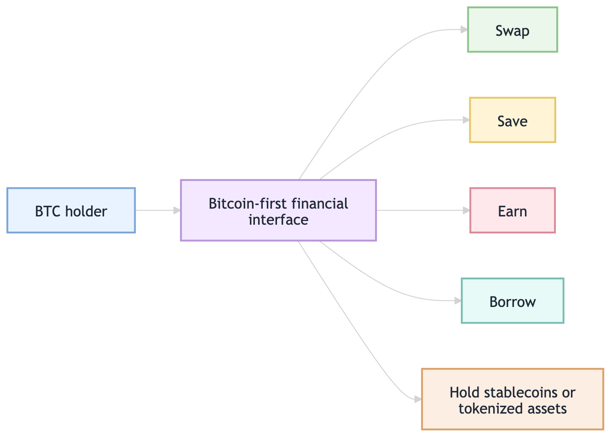
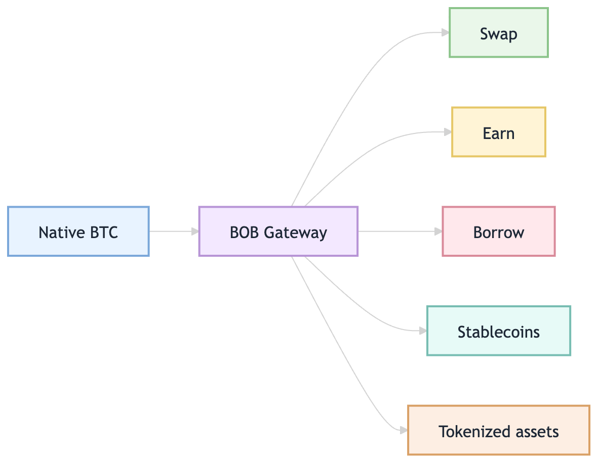
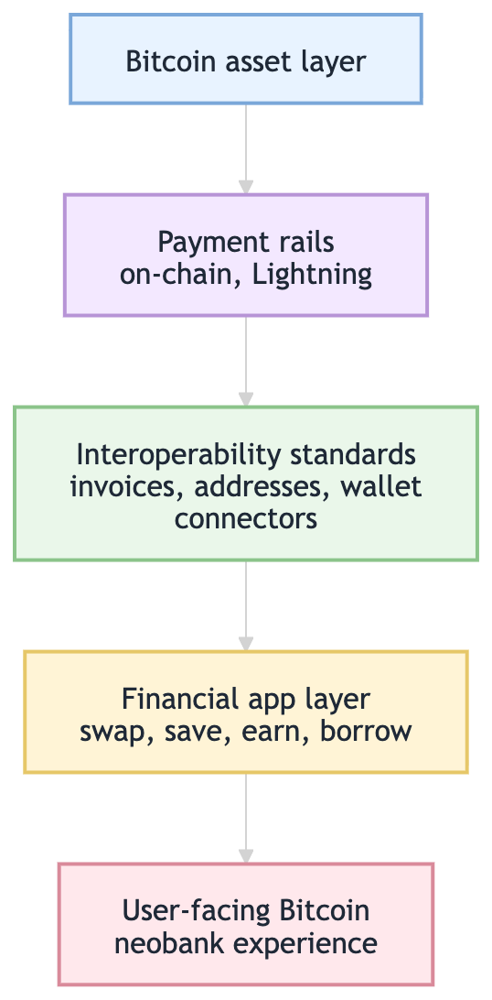

Bitcoin has already won the asset narrative. It is the most recognizable crypto asset, the default store-of-value story in the industry, and the asset many users want to hold for the long term.

But holding BTC is still much easier than *using* BTC.

If a Bitcoin holder wants to do anything beyond cold storage, the experience quickly becomes fragmented. Swapping BTC into stablecoins, accessing DeFi, earning yield, borrowing against BTC, moving across chains, or holding tokenized assets like gold often means thinking in bridges, wrappers, liquidity venues, wallets, fees, and trust assumptions.

That is not how normal financial products are supposed to feel.

This is why Bitcoin needs a “neobank moment.” Not because Bitcoin should become custodial, closed, or bank-like in the traditional sense. The useful analogy is product design: neobanks did not reinvent money, but they dramatically improved the interface around it. They made financial actions easier to start, easier to understand, and easier to repeat.

Bitcoin needs the same kind of product-layer upgrade.

[BOB](https://www.gobob.xyz/), the “Bank of Bitcoin,” is one attempt to build that layer. Its thesis is simple: BTC holders should be able to swap, save, earn, and borrow on Bitcoin rails without stitching together a dozen separate products. [BOB Gateway](https://www.gobob.xyz/) is the front door into that idea.

**TL;DR:** Bitcoin is the strongest store-of-value asset in crypto, but using it is still fragmented and infrastructure-heavy. BOB Gateway is a Bitcoin-first financial layer that lets BTC holders swap, save, earn, and borrow — including native BTC routes via BitVM, 1-click DeFi deposits across 11+ chains, and direct BTC-to-tokenized-gold swaps — without bridges, wrappers, or protocol engineering.

## Bitcoin’s UX is still too infra-shaped

Bitcoin’s user experience often feels like operating infrastructure.

For simple holding, this is mostly fine. You can buy BTC, move it to a wallet, and wait. But the moment you want to do anything more active, the product surface becomes much less elegant.

A BTC holder who wants to use their asset usually has to answer questions that feel more like infrastructure decisions than financial decisions. Which bridge should I use? Which version of BTC do I need on which chain? Is this route liquid enough? What are the trust assumptions behind this wrapped asset? Where do I go if I want stablecoins? Where do I go if I want to borrow instead of sell? What happens if I want to come back to native BTC later?

These are reasonable questions for power users. They are terrible defaults for mainstream users.

On-chain Bitcoin has its own version of this problem. Users implicitly interact with [UTXOs](https://bitcoinops.org/en/topics/utxo/), fee markets, coin selection, and probabilistic confirmation timing. Lightning improves payment speed, but it introduces its own operational details: inbound liquidity, routing reliability, channel state, backups, and wallet compatibility. Standards like [BOLT11](https://github.com/lightning/bolts/blob/master/11-payment-encoding.md), [LNURL-pay](https://github.com/lnurl/luds/blob/luds/06.md), [Lightning Address](https://github.com/andrerfneves/lightning-address), [WebLN](https://webln.dev/), and [Nostr Wallet Connect](https://github.com/nostr-protocol/nips/blob/master/47.md) all help, but the broader pattern is clear: too much of Bitcoin still leaks infrastructure into the user experience.

The same problem shows up in BTCFi. The user’s intent may be simple: “I want to use my BTC.” The workflow often becomes a route-planning exercise.

A neobank-style experience would invert that flow. The user should start with the financial action they want to take, while the product absorbs more of the routing, compatibility, and risk-disclosure work behind the scenes.

The point is not to hide every tradeoff. The point is to stop making infrastructure navigation the first step of the experience.

## What a “neobank moment” means for Bitcoin

A Bitcoin neobank moment does not mean recreating a custodial bank on top of BTC. That would miss the entire point.

The better analogy is that neobanks made existing financial primitives feel coherent. They improved onboarding, balances, payments, cards, notifications, budgeting, savings, and integrations. Most users did not care which banking rails ran underneath. They cared that the app gave them a predictable place to start.

Bitcoin has the opposite problem. The asset is extremely strong, but the app layer around it is still early. The product experience often treats BTC as something you either hold passively or move into another ecosystem before doing anything useful.

A better Bitcoin financial layer would make BTC feel like a usable base asset. A user should be able to move from BTC into stablecoins when needed, borrow against BTC without immediately selling it, access earning opportunities with clear risk disclosures, and return to self-custody without feeling trapped inside an app or exchange.

That is where the “Bank of Bitcoin” framing is precise. BOB is not saying Bitcoin needs to become a bank account. It is saying BTC needs a product layer that gives holders access to the kinds of financial actions people expect from a bank-like interface, while keeping Bitcoin at the center of the experience.

BOB’s homepage describes the product direction directly: “Swap, save, earn and borrow — all on Bitcoin rails.” That is the neobank analogy in one sentence. The goal is not only payments. It is a broader financial surface area around BTC.

## The Bank of Bitcoin thesis

BOB’s thesis is that Bitcoin should not remain isolated from the rest of crypto’s financial activity.

Bitcoin is conservative by design. It optimizes for security, simplicity, durability, and monetary credibility. Those are the reasons people trust it. But that also means much of the experimentation around lending, stablecoins, vaults, and composable applications has historically happened elsewhere, especially in EVM ecosystems.

BOB tries to connect these worlds: Bitcoin as the base asset and trust anchor, Ethereum-style DeFi as the programmable financial environment, and a gateway layer that makes moving BTC into useful financial actions feel simpler.

This framing matters because most BTC holders do not wake up wanting “more chains.” They want better outcomes. They want to use BTC without turning every action into a bridge-and-wrapper puzzle. They want a clearer path from native BTC to stablecoins, tokenized assets, earning opportunities, borrowing, and broader DeFi.

That is a different mental model from “bridge to chain X, wrap asset Y, then find protocol Z.”

The bank analogy works because banks are not defined by one feature. A bank is a place where financial actions begin. You do not open your banking app because you want to admire the routing system behind cards, wires, FX, or transfers. You open it because you want to move, store, borrow, save, or pay.

BOB is trying to become that kind of starting point for BTC.

## BOB Gateway as the front door

If BOB is the Bank of Bitcoin thesis, BOB Gateway is the front door.

Gateway matters because the first step in most Bitcoin DeFi workflows is still the most painful: moving native BTC into the asset, chain, or product where it can actually be used. When BOB launched Gateway in 2024, the positioning was specifically around reducing the friction of swapping BTC into wrapped BTC and L2 BTC through a unified interface so users could reach BTC yield opportunities faster. The launch announcement described the product as hiding bridge complexity rather than forcing users to manually assemble the path themselves.

That distinction is important. Gateway is not just a bridge product. It is the place where a BTC holder starts a financial workflow — and BOB has built specific capabilities around that starting point: native BTC routes powered by BitVM that retain Bitcoin security without custodians or wrappers, 1-click DeFi deposits across 11+ chains, and direct swaps between native BTC and tokenized gold onchain.

The old flow looks like this:

The Gateway-style flow is closer to this:

If a user wants to move from BTC into USDC or USDT, they should not need to understand every route behind the scenes. If they want tokenized gold exposure, they should not need to leave the Bitcoin-first context and manually assemble the path. If they want to earn on BTC, the experience should feel closer to selecting a financial product than debugging a cross-chain flow.

That is the product-layer opportunity: make BTC usable without making the user feel like a protocol engineer.

## From passive BTC to productive BTC

The deeper point is that Bitcoin’s next product frontier may not be payments alone.

Payments matter, and Lightning, LSPs, splicing, invoices, and wallet connectors all play a role in making Bitcoin easier to send and receive. [Bitcoin Design’s liquidity guide](https://bitcoin.design/guide/how-it-works/liquidity/) explains why Lightning onboarding often needs service-provider help, and [LDK’s Cash App case study](https://lightningdevkit.org/blog/cashapp/) shows how production reliability can be improved with probing, route discovery, and durable state. Those are important pieces of the Bitcoin UX stack.

But the “neobank moment” is broader than payments. BTC holders often care about a wider set of financial actions: preserving BTC exposure, borrowing without selling, moving temporarily into stable assets, accessing DeFi liquidity, holding tokenized assets, and earning where the risks are understood and acceptable.

For many users, BTC is a long-term asset. Selling it creates tax consequences, emotional friction, and opportunity cost. But holding it passively means the asset is not very useful in day-to-day financial workflows.

A Bitcoin financial layer changes the question from “Should I sell my BTC to do something else?” to “Can I use my BTC as the starting point for the financial action I want to take?”

That could mean borrowing against BTC. It could mean swapping a portion into stablecoins. It could mean moving into BTC DeFi. It could mean allocating to tokenized gold. It could mean earning yield where the risks are clear.

This is what “productive BTC” means in practice. Not reckless yield chasing. Not blindly trusting every bridge or vault. Not pretending every DeFi product is safe. It simply means BTC should not be trapped in a binary state of “cold storage or sell.”

## Why this matters for builders

This is also a developer and product problem.

A lot of crypto UX improves when the product exposes the right abstraction. Users do not need to know every liquidity venue. They need quotes, fees, risks, settlement expectations, and recovery paths. Developers do not want to integrate every bridge, wrapper, vault, and chain separately. They want a coherent surface area.

BOB’s positioning is well-suited to builders for the same reason. The long-term opportunity is not just another consumer app. It is an application layer where BTC can become a default asset for financial products.

A wallet could use BOB-like rails to offer BTC swaps. A DeFi app could reach BTC holders without sending them through a confusing bridge flow. A portfolio app could help users manage BTC, stablecoins, tokenized assets, and DeFi positions in one place. An AI agent or treasury tool could eventually treat BTC as a usable base asset rather than a passive balance.

This is where the neobank analogy becomes more than branding. Neobanks became valuable because they gave users a coherent financial surface area and gave other products predictable rails to integrate with. Bitcoin needs something similar if BTC is going to become more than an asset people hold outside the app economy.

## The broader Bitcoin UX stack

BOB does not replace the rest of Bitcoin’s UX work. It sits on top of a broader stack that is still evolving.

On-chain Bitcoin remains the settlement and self-custody foundation. Lightning improves real-time payments. LSPs help make receiving easier by abstracting liquidity management. Splicing can reduce surprise channel-management fees. Standards like BOLT11, LNURL, Lightning Address, WebLN, and Nostr Wallet Connect make wallet and app interoperability better. [Output descriptors](https://github.com/bitcoin/bitcoin/blob/master/doc/descriptors.md) help infrastructure teams make wallet policy and recovery more explicit.

Those layers improve the pay/receive side of Bitcoin. BOB is focused on a different but complementary layer: what happens when a BTC holder wants to swap, save, earn, borrow, or access DeFi.

The full stack looks something like this:

A good Bitcoin financial experience needs all of these layers. But the missing piece for many BTC holders today is the financial app layer.

## What still needs to be proven

The Bank of Bitcoin thesis is compelling, but it is not automatically solved by putting a clean interface on top.

The first question is custody and trust. Non-custodial design matters, but users still need to understand what they are trusting. Is a route relying on a bridge, a wrapped asset, a solver, a vault, a multisig, a light-client model, or a particular chain’s security assumptions? The UX should hide unnecessary complexity, but it should not hide risk.

The second question is execution quality. A gateway is only as good as the routes behind it. Users care about price, fees, slippage, speed, and reliability. If the product says “one click,” the route still needs to be competitive and transparent.

The third question is security. Cross-chain systems have historically been some of the biggest attack surfaces in crypto. Bitcoin DeFi needs strong security assumptions because the asset being moved is valuable and often long-held.

The fourth question is product clarity. “Earn” and “borrow” are powerful words. They also carry risk. A neobank-style Bitcoin interface should explain what is happening in plain language: where funds go, what can go wrong, how liquidity works, what costs are involved, and how users exit.

The final question is demand. Some Bitcoin users only want cold storage. Others are comfortable with DeFi. Many are somewhere in the middle: interested in using BTC more, but skeptical of complexity and risk. BOB’s opportunity is to make that middle category larger.

## Bitcoin as a financial operating system

Bitcoin’s first major product-market fit was holding. That will not disappear. In fact, it is probably the foundation for everything else.

But the next layer of Bitcoin adoption may come from making BTC useful without forcing users to abandon the reasons they held it in the first place. A neobank moment for Bitcoin means better interfaces, fewer fragmented workflows, clearer fees, simpler access to stable assets, safer borrowing and earning paths, more transparent risk, and a real path back to self-custody.

BOB is one example of this direction. It is trying to make Bitcoin feel less like an isolated asset and more like the center of a financial system.

That does not mean every BTC holder will use DeFi. It does not mean Bitcoin should become Ethereum. It does not mean yield is automatically good or that every bridge is safe.

It means the app layer around Bitcoin is still early.

If Bitcoin is going to become more than a store of value, the next product challenge is not only scaling transactions. It is turning BTC into a usable financial starting point.

That is the neobank moment Bitcoin still needs.

## Frequently Asked Questions

**What is BOB Gateway?**
BOB Gateway is the entry point into BOB, the Bank of Bitcoin. It lets BTC holders swap, save, earn, and borrow on Bitcoin rails through a single interface — using native BTC routes powered by BitVM, with no custodians, no wrappers, and 1-click access to DeFi across 11+ chains.

**What does "Bank of Bitcoin" mean?**
It does not mean a custodial bank built on Bitcoin. It means a product layer that gives BTC holders access to the financial actions — swapping, saving, earning, borrowing — that banks normally provide, while keeping Bitcoin as the base asset and self-custody as an option at every step.

**Can I use BOB Gateway without wrapping my BTC?**
Yes. BOB Gateway uses BitVM technology to route native BTC onto BOB while retaining Bitcoin security. You do not need to pre-wrap your BTC or trust a custodian before transacting.

**Does BOB Gateway support tokenized gold?**
Yes. BOB Gateway supports direct onchain swaps between native BTC and tokenized gold — described by BOB as "hard money swaps" between the two assets.

**How is BOB different from a bridge or swap protocol?**
BOB is not only a bridge or swap protocol. It is a full financial app layer: swap, borrow, earn, and save, all starting from BTC. The gateway handles routing and chain compatibility behind the scenes so users can focus on the financial action they want to take, not the infrastructure underneath it.

If you want to see what the product layer looks like today, [BOB Gateway](https://www.gobob.xyz/) is the place to start. Swap, save, earn, and borrow on Bitcoin rails — no bridges to assemble, no wrappers to source, no protocol engineering required.
