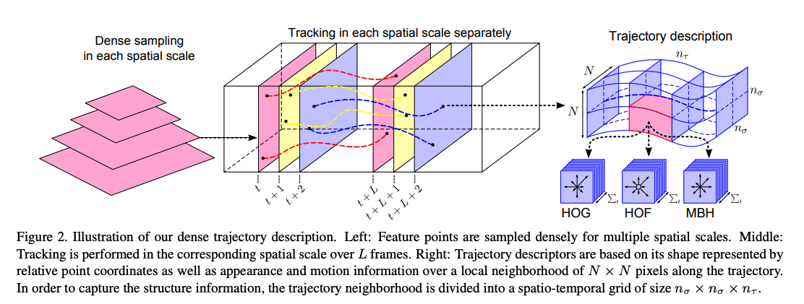
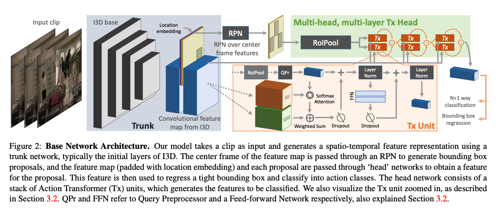

Over the last couple of months, I have been going through a lot of literature about human action recognition using computer vision. In this post, I will share a brief survey of Human Action Recognition. I will focus on literature from 2012–2019, as most of the earlier literature, relied on feature extraction and for the past few years neural networks have been outperforming the manual techniques. 

### **Background**

Human action recognition is a standard Computer Vision problem and has been well studied. The fundamental goal is to analyze a video to identify the actions taking place in the video. Essentially a video has a spatial aspect to it ie. the individual frames and a temporal aspect ie. the ordering of the frames. Some actions (eg. standing, running, etc.) can probably be identified by using just a single frame but for more complex actions(eg. walking vs running, bending vs falling) might require more than 1 frame’s information to identify it correctly. Local temporal information plays an important role in differentiating between such actions. Moreover, for some use cases, local temporal information isn’t sufficient and you might need long duration temporal information to correctly identify the action or classify the video. 

### **Introduction**

The problem of action recognition in videos can vary widely and there’s no single approach that suits all the problem statements. In this post, I will briefly touch upon a few approaches to get a sense of the existing research in this field. Traditional approaches to action recognition rely on object detection, pose detection, dense trajectories, or structural information. 

### [ConvNet Architecture Search for Spatiotemporal Feature Learning](https://arxiv.org/pdf/1708.05038.pdf)

Key points: 

*   Introduces 3D convolutional networks as feature extractors. It uses 3D convolutions on video frames(where convolution is applied on a spatiotemporal cube). 
*   They trained the network on a large dataset of Sports 1M and then uses the model as feature extractors for other datasets.
*   Their finding was a simple linear classifier like SVM on top of an ensemble of extracted features worked better than the state-of-the-art algorithms.
*   The net focussed on spatial appearance in the first few frames and tracked the motion in the subsequent frames

Issues: 

*   The long-range temporal modeling was still a problem. 
*   Training such huge networks is computationally a problem

### [Action Recognition by Dense Trajectories](https://hal.inria.fr/inria-00583818/document)

Key points: 

*   It introduces an approach to model videos by combining dense sampling with feature tracking. 
*   They introduce an efficient solution to remove camera motion by computing the motion boundaries descriptors along the dense trajectories. 
*   Local descriptors computed in a 3D video volume around interest points have become a popular way for video representation. 
*   To leverage the motion information in our dense trajectories, they compute descriptors within a space-time volume around the trajectory,

Issues tackled:

*   Trajectories tend to drift from their initial location during tracking. 

### [Behavior Recognition via Sparse Spatio-Temporal Features](http://cseweb.ucsd.edu/~gary/pubs/dollar-vs-pets05.pdf)

Key points:

*   Does behavior recognition use behavior in terms of spatiotemporal features? 
*   Introduces a new spatio-temporal interest point detector and analyzes various cuboid descriptors. 
*   Concludes that cuboid prototyping(using K-means clustering) is a good behavior descriptor. 

Futures improvements:

*   Using the spatiotemporal layout of the features
*   Using features detected at multiple scales
*   Incorporate a dynamic model on top of their representation

### [Action Recognition with Improved Trajectories](https://www.cv-foundation.org/openaccess/content_iccv_2013/papers/Wang_Action_Recognition_with_2013_ICCV_paper.pdf)

Key points: 

*   Improves dense trajectories by explicitly estimating camera motion
*   Demonstrates how the performance can be improved by removing background trajectories 
*   It also uses state of the art human detectors to remove potentially inconsistent matches during camera motion estimation. 

### [3D Convolutional Neural Networks for Human Action Recognition](https://ieeexplore.ieee.org/document/6165309)

Key points: 

*   Proposes to perform 3D convolutions to extract spatial and temporal features from the video. 
*   Discusses a 3D CNN model that uses the proposed 3D convolutions. The CNN architecture generates multiple channels of information from adjacent video frames and performs convolution and subsampling separately in each channel
*   Proposes to regularize the 3D CNN models by augmenting the models with auxiliary outputs computed as high-level motion features. 

Issues: 

*   Uses supervised training where labeling of data is a painful job. Number of labeled samples can be significantly reduced when such a model is pre-trained using unsupervised algorithms

### [Large-scale Video Classification with Convolutional Neural Networks](https://static.googleusercontent.com/media/research.google.com/en//pubs/archive/42455.pdf)

Key Points: 

*   Introduces Early fusion, Late fusion, and slow fusion connectivity for fusing time information in CNN models. They conclude that slow fusion consistently performs better. 
*   Introduces a multi-resolution architecture for CNN to reduce the computation cost without affecting performance. It uses 2 separate streams of processing over 2 spatial resolutions. One of the streams is fed with downsampled frames(context) and the other stream is fed with the center portion of the image(fovea). 

Issues:

*   Computationally intensive and very little performance improvement is achieved

Future Improvements: 

*   Consider broader categories in the dataset
*   Investigate approaches that take camera motion into account
*   Explore RNNs for learning global video-level predictions. 

### [Learning hierarchical invariant spatio-temporal features for action recognition with independent subspace analysis](http://ai.stanford.edu/~quocle/LeZouYeungNg11.pdf)

Key points: 

*   Extends Independent Subspace Analysis for learning features from spatio-temporal data.
*   It scales up the ISA algorithm to large receptive fields by convolution and stacking and learning hierarchical representations 

### [Two-Stream Convolutional Networks for Action Recognition in Videos](https://arxiv.org/pdf/1406.2199.pdf)

Key points:

*   It proposes a model that uses separate spatial and temporal recognition streams based on ConvNets. 

Issues: 

*   The spatial pooling in the network does not take the trajectories into account. 
*   The camera motion isn't handled properly. It is compensated by mean displacement subtraction. 

### [Beyond Short Snippets: Deep Networks for Video Classification](https://arxiv.org/pdf/1503.08909.pdf)

Key points: 

*   Explores the idea of incorporating information across longer video sequences
*   Introduces feature pooling method that processes each frame independently and uses max-pooling on local information to combine frame-level information. 
*   Demonstrates the usage of an RNN that uses LSTM cells which are connected to the output of the underlying CNN. 
*   Validates the effectiveness of using Optical flow for motion information. 

Improvements: 

*   An RCNN can be used to generate better features by utilizing its own activations in the last frame in conjunction with the image from the current frame.

### [Long-term Recurrent Convolutional Networks for Visual Recognition and Description](https://arxiv.org/pdf/1411.4389v4.pdf)

>>>>>  gd2md-html alert: inline image link here (to images/image1.png). Store image on your image server and adjust path/filename/extension if necessary.  (<a href="#">Back to top</a>)(<a href="#gdcalert2">Next alert</a>) >>>>> 

Key points: 

*   Proposes the LRCN(Long term Recurrent Convolutional Networks) which combines convolutional layers with long-range temporal recursion. 

Issues: 

*   It gives a single prediction for the entire video. If there are multiple actions in the clip, it takes the average of the probabilities of the softmax layer’s output.  

### [LNCS 7065 - Sequential Deep Learning for Human Action Recognition](https://liris.cnrs.fr/Documents/Liris-5228.pdf)

>>>>>  gd2md-html alert: inline image link here (to images/image2.png). Store image on your image server and adjust path/filename/extension if necessary.  (<a href="#">Back to top</a>)(<a href="#gdcalert3">Next alert</a>) >>>>> 

Key points: 

*   Introduces a 2 step model to classify human actions. In first step, a Conv 3D model is used to extract spatio-temporal features
*   In the second step, RNN with 1 hidden layer of LSTM cells is used to classify action sequences. 

Improvements: 

*   A single step model in which Conv3D and LSTM can be trained at once. 

### [Every Moment Counts: Dense Detailed Labeling of Actions in Complex Videos](https://arxiv.org/pdf/1507.05738.pdf)

Key points: 

*   Introduces a MultiLSTM model that incorporates soft attention input-output temporal context for dense action labeling. 

### [Learning Spatiotemporal Features with 3D Convolutional Networks](https://arxiv.org/pdf/1412.0767.pdf)

>>>>>  gd2md-html alert: inline image link here (to images/image3.png). Store image on your image server and adjust path/filename/extension if necessary.  (<a href="#">Back to top</a>)(<a href="#gdcalert4">Next alert</a>) >>>>> 

 

Key points: 

*   Similar to [5] it uses 3D convolutional networks to learn spatio temporal features. 
*   They demonstrate that 3x3x3 kernel works the best

Improvements: 

*   Long range temporal modeling isn’t addressed 

Implementations: 

[https://github.com/TianzhongSong/C3D-keras](https://github.com/TianzhongSong/C3D-keras)

[https://github.com/texastony/adapting-c3d-keras](https://github.com/texastony/adapting-c3d-keras)

[https://github.com/karolzak/conv3d-video-action-recognition](https://github.com/karolzak/conv3d-video-action-recognition)

### [Describing Videos by Exploiting Temporal Structure](https://arxiv.org/abs/1502.08029)

>>>>>  gd2md-html alert: inline image link here (to images/image4.png). Store image on your image server and adjust path/filename/extension if necessary.  (<a href="#">Back to top</a>)(<a href="#gdcalert5">Next alert</a>) >>>>> 

Key points: 

*   They propose a 3D CNN RNN encoder decoder model to capture local spatio temporal information. 
*   They propose the use of attention mechanism for effective video description as it allows the usage features obtained using global analysis of static frames. 

### [Convolutional Two-Stream Network Fusion for Video Action Recognition](https://arxiv.org/pdf/1604.06573.pdf)

>>>>>  gd2md-html alert: inline image link here (to images/image5.png). Store image on your image server and adjust path/filename/extension if necessary.  (<a href="#">Back to top</a>)(<a href="#gdcalert6">Next alert</a>) >>>>> 

Key points: 

*   Proposes an architecture for two stream networks with a convolutional fusion layer between the networks and a temporal fusion layer. 
*   Doesn’t increase the number of parameters significantly. 

### [Temporal Segment Networks: Towards Good Practices for Deep Action Recognition](https://arxiv.org/abs/1608.00859)

>>>>>  gd2md-html alert: inline image link here (to images/image6.png). Store image on your image server and adjust path/filename/extension if necessary.  (<a href="#">Back to top</a>)(<a href="#gdcalert7">Next alert</a>) >>>>> 

Key points: 

*   Improves the two stream architecture. 
*   Introduces a network that extracts short snippets from the video by using sparse sampling(instead of dense sampling). The samples are distributed uniformly in the video. 
*   The snippets are fed to spatial stream ConvNets and Temporal stream ConvNets. 
*   The predictions from these ConvNets are combined to obtain a video level prediction. 
*   shows the usage of batch normalization, dropout and pre-training as good practices

### [ActionVLAD: Learning spatio-temporal aggregation for action classification](https://arxiv.org/pdf/1704.02895.pdf)

>>>>>  gd2md-html alert: inline image link here (to images/image7.png). Store image on your image server and adjust path/filename/extension if necessary.  (<a href="#">Back to top</a>)(<a href="#gdcalert8">Next alert</a>) >>>>> 

Key points: 

*   It samples frames from the entire video and aggregates features from the appearance and motion streams into a single video level fixed length vector. 
*   It is passed through a classifier that outputs the final classification scores.
*   It explores multiple ways for combining the RGB and motion streams ie. concat fusion, early fusion and late fusion. The late fusion technique performs the best in their experiments. 

### [Hidden Two-Stream Convolutional Networks for Action Recognition](https://arxiv.org/pdf/1704.00389.pdf)

>>>>>  gd2md-html alert: inline image link here (to images/image8.png). Store image on your image server and adjust path/filename/extension if necessary.  (<a href="#">Back to top</a>)(<a href="#gdcalert9">Next alert</a>) >>>>> 

Key points: 

*   Introduces a pre training layer(MotionNet) that generates optical flow from consecutive frames
*   The output from MotionNet is stacked with a temporal stream CNN to map the optical flows to target action labels. 
*   There’s another spatial stream CNN which is combined with the temporal stream CNN using late fusion. 

Improvements: 

*   Optical flow prediction can be improved based on smoothness loss
*   Using joint training instead of late fusion of spatial and temporal streams
*   Removing global camera motion and occlusion

### [Quo Vadis, Action Recognition? A New Model and the Kinetics Dataset](https://arxiv.org/pdf/1705.07750.pdf)

Key points: 

*   It starts where [13] left. It 3D based models into two stream architecture leveraging pre-training

### [Temporal 3D ConvNets: New Architecture and Transfer Learning for Video Classification](https://arxiv.org/pdf/1711.08200.pdf)

>>>>>  gd2md-html alert: inline image link here (to images/image9.png). Store image on your image server and adjust path/filename/extension if necessary.  (<a href="#">Back to top</a>)(<a href="#gdcalert10">Next alert</a>) >>>>> 

Key points: 

*   Introduces architecture to combine temporal information at variable depth. Prior methods used a fixed 3D homogeneous kernel depth. 
*   It also introduces a supervised transfer learning technique. 

### [Action Recognition Using Visual attention](https://arxiv.org/pdf/1511.04119.pdf)

>>>>>  gd2md-html alert: inline image link here (to images/image10.png). Store image on your image server and adjust path/filename/extension if necessary.  (<a href="#">Back to top</a>)(<a href="#gdcalert11">Next alert</a>) >>>>> 

Key points: 

*   It proposes a soft attention based model for action recognition. The model learns to focus selectively on the important parts of the video.
*   Initially the model takes a video frame as input and produces a feature cube. At each time step, the model predicts a softmax over K x K location(lt+1) and a softmax over the label classes(yt). Lt is the probability with which the model believes the corresponding region in the input frame is important. 

### [Attentional Pooling for Action Recognition](https://arxiv.org/pdf/1711.01467.pdf)

>>>>>  gd2md-html alert: inline image link here (to images/image11.png). Store image on your image server and adjust path/filename/extension if necessary.  (<a href="#">Back to top</a>)(<a href="#gdcalert12">Next alert</a>) >>>>> 

Key points: 

*   It proposes a modification to the networks by extending the existing architectures with attention maps that focus computation on specific parts of the input. 
*   The attention map doesn’t require any additional supervision. 
*   It also provides a novel factorization of attention processing into bottom up saliency combined with top-down attention. 
*   They also experiment with adding human pose as an intermediate supervision to train the attention module. It looks for human object interactions. 

### [Global and Local Knowledge-Aware Attention Network for Action Recognition](https://pubmed.ncbi.nlm.nih.gov/32224465/)

>>>>>  gd2md-html alert: inline image link here (to images/image12.png). Store image on your image server and adjust path/filename/extension if necessary.  (<a href="#">Back to top</a>)(<a href="#gdcalert13">Next alert</a>) >>>>> 

>>>>>  gd2md-html alert: inline image link here (to images/image13.png). Store image on your image server and adjust path/filename/extension if necessary.  (<a href="#">Back to top</a>)(<a href="#gdcalert14">Next alert</a>) >>>>> 

Key points: 

*   The article proposes a novel global and local knowledge-aware attention network for action recognition. 
*   The proposed network incorporates two types of attention mechanisms called statistic-based attention (SA) and learning-based attention (LA) to attach higher importance to the crucial elements in each video frame.
*   As global pooling (GP) models capture global information, while attention models focus on the significant details to make full use of their implicit complementary advantages, our network adopts a three-stream architecture, including two attention streams and a GP stream.
*   Each attention stream employs a fusion layer to combine global and local information and produces composite features. Furthermore, global-attention (GA) regularization is proposed to guide two attention streams to better model dynamics of composite features with the reference to the global information.
*   Fusion at the softmax layer is adopted to make better use of the implicit complementary advantages between SA, LA, and GP streams and get the final comprehensive predictions.

Code: [https://github.com/ZhenxingZheng/attention-network](https://github.com/ZhenxingZheng/attention-network)

### [Attention Clusters: Purely Attention Based Local Feature Integration for Video Classification](https://arxiv.org/pdf/1711.09550.pdf)

>>>>>  gd2md-html alert: inline image link here (to images/image14.png). Store image on your image server and adjust path/filename/extension if necessary.  (<a href="#">Back to top</a>)(<a href="#gdcalert15">Next alert</a>) >>>>> 

First, we extract multiple feature sets from the video. For each feature set, we apply independent attention clusters with shifting operations to obtain a modality-specific representation vector. Next, the output of all attention clusters are concatenated to form a global representation vector of the video. Finally, the global representation vector is used for classification through a fully-connected layer.

Key points: 

*   Their idea is to focus on local features instead of trying to capture global features. They argue that using long term temporal information isn’t always needed for video classification. 
*   They use multiple attention mechanisms units(called attention clusters) to capture information from multiple modalities. 
*   They use shifting operations to increase the diversity between attention units. 

Improvements: 

*   Apply this architecture to low-level local features and assess to what extent it can uncover relationships between features in different spatial coordinates. 
*   Integrate it into end-to end-trained networks.

### [Video Action Transformer Network](https://arxiv.org/abs/1812.02707)

Key points: 

*   The paper introduces a transformer based architecture for classifying actions. 
*   They use class agnostic queries by sharing features across different classes. The supporting argument is that the features for all the action classes need not be  learnt from scratch as the object is always a human. 
*   Their attention model learns to focus on hands and faces which is often crucial in differentiating between actions. 
*   They use an action transformer as input for the video feature representation and the box proposal from RPN and maps it into query and memory features.

Issues: 

*   The network doesn’t seem to perform well for all action classes(for eg. smoking) even though there is enough training data for some of those classes. 
*   If the size of the person in the clip is large, then the model is able to predict the classes correctly but for smaller sized objects, it performs poorly. 
*   It fails for modes such as similar action/interaction, identity and temporal positions. 