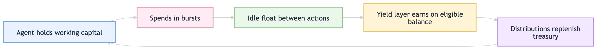
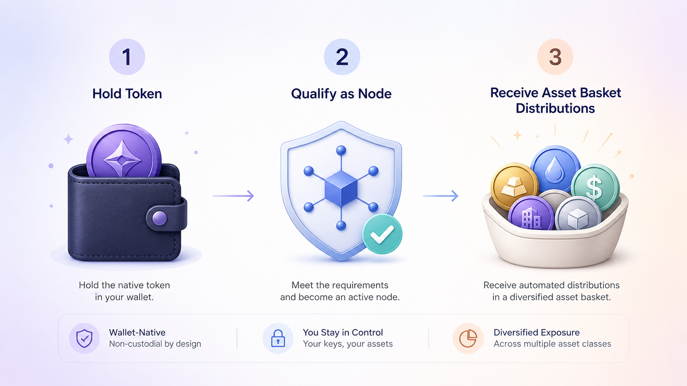
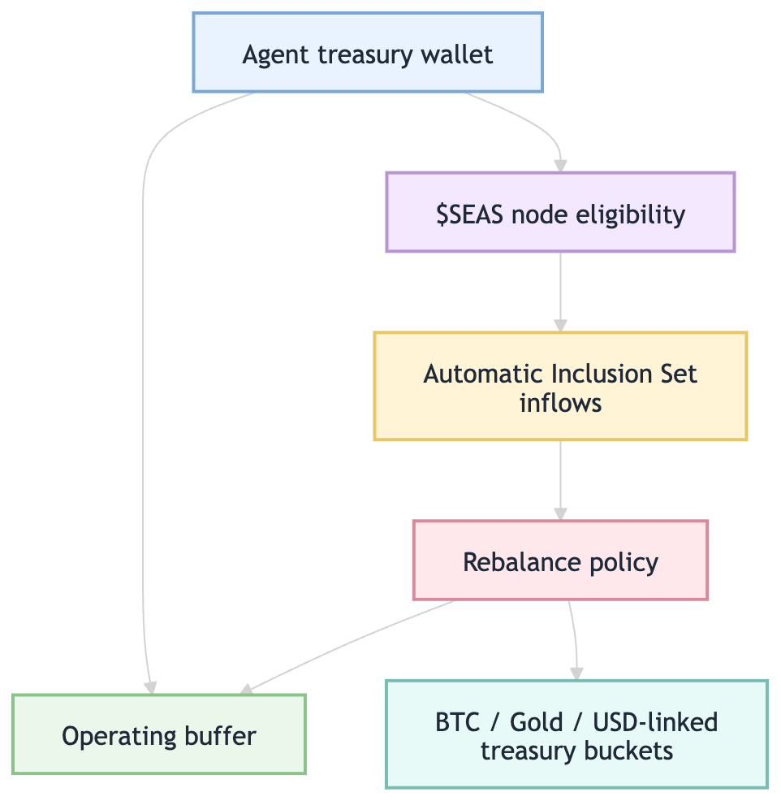

[Yield 3.0
](https://seasons.wtf/blog/the-yield-3-0-engine-part-3-ssym) treats yield as part of an agent’s runtime, not a separate investing workflow. In an agentic internet economy, software receives delegated authority to buy services, pay APIs, subscribe to tools, route treasury balances, and coordinate with other agents. Those actions require balances that move on time, under rules machines can enforce and humans can audit later.

This article explains why yield becomes treasury infrastructure for agents, and examines [Seasons](https://seasons.wtf/)’ Yield 3.0 model as an early production example of wallet-native, automatic yield distribution.

## Why Agents Make Idle Float a Systems Problem

Most finance UX assumes a human moves money intentionally. You open an app, choose a strategy, deposit, wait, claim, and maybe compound.

Agents invert that pattern. An autonomous agent keeps working capital inside a wallet continuously so it can pay for inference, APIs, tool subscriptions, data access, and onchain execution on demand. Recent systems like [Amazon Bedrock AgentCore Payments](https://aws.amazon.com/blogs/machine-learning/agents-that-transact-introducing-amazon-bedrock-agentcore-payments-built-with-coinbase-and-stripe/) show where this is headed: agents that can pay for APIs, MCP servers, web content, and other agents during execution.

That creates a new systems problem: **idle float**.

```text
Agent treasury (weekly)

Starting buffer: $10,000
Minimum liquid balance: $7,000
Monday spend: $1,200 for APIs + inference
Thursday spend: $800 for data + tx fees

Most of the week, $7k–$10k sits idle.
The agent still needs it liquid, but it does not need all of it idle.
```

For humans, idle balances are often ignored. For agents operating continuously, idle balances become infrastructure. If an agent can safely earn on treasury buffers without breaking spendability or delegated permissions, yield becomes runtime optimization, not alpha.



## What Yield 3.0 Means in This Article

I’m not using “Yield 3.0” as a formal industry standard or immutable protocol definition. Here, Yield 3.0 describes a shift away from manual staking and farming toward wallet-native, automatic, policy-aware yield infrastructure.

| Model     | User behavior               | Agent fit                             |
| --------- | --------------------------- | ------------------------------------- |
| Yield 1.0 | Deposit into farms manually | Weak: too many manual steps           |
| Yield 2.0 | Use vaults and aggregators  | Better, but still workflow-based      |
| Yield 3.0 | Hold, qualify, receive      | Stronger: automatic and wallet-native |

Instead of “deposit → wait → claim,” yield shifts to “hold → qualify → receive.” That distinction matters because agents cannot reliably operate like manual DeFi users. Constant claiming, staking, bridging, compounding, and rebalancing introduce permission sprawl and failure modes.

An agent-native yield system needs balances to remain spendable, distributions to happen automatically, treasury policies to be enforceable, and actions to remain auditable.

Seasons addresses this directly.

## Where Seasons Fits Into the Yield 3.0 Model

Seasons is a Solana-based protocol experimenting with what wallet-native yield could look like.

According to the [Seasons docs](https://seasons.gitbook.io/seasons-docs), wallets holding **10,000+ $SEAS** become eligible nodes that receive automatic distributions of Inclusion Set assets on a recurring cadence. The important design choice is not just the yield itself. It is the operational model.

Instead of asking users to manually stake, lock tokens, claim rewards, restake emissions, or manage vault positions, Seasons tries to make yield feel like a default wallet behavior:



Seasons describes distributions occurring twice weekly, on Wednesday and Sunday, with payouts denominated in a quarterly curated basket called the **Inclusion Set**.

The current [Inclusion Set](https://seasons.gitbook.io/seasons-docs/yield-3.0-system/yield-3.0-mechanism/distribution/inclusion-lists) example includes XAUt0/Tether Gold, wBTC/Wormhole Bitcoin, and jlUSDC/Jupiter Lend USDC. That matters because many DeFi systems distribute only inflationary protocol rewards. Seasons instead frames distributions around exposure to assets like Gold, Bitcoin, and USD-linked assets, which positions them as treasury reserve assets rather than purely reflexive reward tokens.

One caveat: Seasons’ docs describe themselves as a working document updated in real time. Details around active-node qualification, snapshots, exclusions, and distribution logic should be treated as versioned system behavior rather than immutable guarantees.


## The Seasons Yield 3.0 Stack

Seasons’ model is easier to understand as a layered treasury system rather than a single yield source.

| Layer                                                                                                |              Status | Role                                                  |
| ---------------------------------------------------------------------------------------------------- | ------------------: | ----------------------------------------------------- |
| [TTT](https://seasons.gitbook.io/seasons-docs/yield-3.0-system/yield-3.0-mechanism/generation/ttt)   |              Active | Uses $SEAS transaction activity to fund distributions |
| [SSYM](https://seasons.gitbook.io/seasons-docs/yield-3.0-system/yield-3.0-mechanism/generation/ssym) |      Not yet active | Routes stablecoin reserves into lending venues        |
| [YAV](https://seasons.gitbook.io/seasons-docs/yield-3.0-system/yield-3.0-mechanism/generation/yav)   |      Not yet active | Deploys Inclusion Set assets into strategy vaults     |
| [YMS](https://seasons.gitbook.io/seasons-docs/yield-3.0-system/yield-3.0-mechanism)                  | Orchestration layer | Coordinates sources, acquisition, and payouts         |

What matters is not that every module is live today. The architecture establishes yield as an orchestrated distribution system, not just a farm.

## TTT: The Active Yield 3.0 Engine

The currently active Yield 3.0 module in Seasons is **TTT**, or Transactional Transfer Tax.

TTT is embedded directly into the $SEAS token contract and applies to buys, sells, and transfers. Per the [TTT docs](https://seasons.gitbook.io/seasons-docs/yield-3.0-system/yield-3.0-mechanism/generation/ttt), entry and exit transactions apply a 10% fee. Those fees accumulate in $SEAS, route through an escrow and distributor pipeline, get converted into Inclusion Set assets, and are then distributed to qualified nodes.

In practical terms, protocol activity becomes the funding source for distributions. That also means the system is reflexive by design. If activity increases, distribution capacity can increase. If activity decreases, distributions can shrink. TTT should therefore not be thought of as a fixed or guaranteed yield stream. It is an activity-dependent mechanism tied to $SEAS movement.

From an agentic treasury perspective, the key advantage is the reduced operational surface. There is no separate staking workflow, no claim loop, and no manual compounding action. Qualification is wallet-native, and payouts are designed to be automatic.

```text
TTT flow

1. $SEAS activity happens
2. Transfer tax accumulates
3. Accrued $SEAS moves into escrow/distribution flow
4. Distributor swaps into Inclusion Set assets
5. Qualified nodes receive payouts
```

For autonomous systems, fewer operational steps usually means fewer places to fail.

## SSYM, YAV, and YMS: Planned Yield Layers and Orchestration

Seasons’ docs also describe two additional Yield 3.0 modules that are currently marked as not yet active.

**SSYM**, or Stakeholder Stablecoin Yield Module, is designed as the slow and steady leg of the system. The idea is to route stablecoin reserves into overcollateralized lending venues like Jupiter and Kamino to generate steadier, rate-driven yield. TTT depends on protocol activity; SSYM depends more on lending markets and rates.

**YAV**, or Yield Asset Vaults, is the higher-complexity strategy layer. The docs describe YAV as a vault system that can deploy Inclusion Set assets into DeFi strategies such as liquidity provision, lending, delta-neutral strategies, and liquidation opportunities.

Above the individual modules sits **YMS**, the Yield Management System. The public docs do not expose full implementation details, but conceptually YMS coordinates yield generation, asset acquisition, reserve routing, Inclusion Set distribution, and payout sequencing.

```text
TTT  = activity engine
SSYM = stability engine
YAV  = strategy engine
YMS  = orchestration engine
```

This is the most significant Yield 3.0 design decision in the system. Yield is no longer one strategy. It becomes a routing and distribution layer that can blend multiple yield sources under a single wallet-native user experience.

## Why Wallet-Native Yield Maps Well to Agentic Finance

Autonomous systems care less about the highest advertised APY and more about liquidity reliability, operational simplicity, predictable interfaces, permission boundaries, automated accounting, and treasury visibility.

That is why Seasons’ wallet-native model is well-suited to agentic finance.

A staking-heavy system introduces claim schedulers, rebalance logic, approval management, lockup handling, bridge coordination, and strategy monitoring. Every additional operational step becomes another failure mode for an agent.

Seasons reduces that operational surface. A wallet can hold operating capital, qualify as a node, receive distributions, rebalance treasury assets, and continue making payments without requiring a separate staking workflow.

That does not mean the system is risk-free. It means the user experience is more compatible with the operational constraints autonomous systems actually face.



## The Control Layer: Delegated Authorization and Programmable Treasury Policy

Automatic yield only becomes useful for agents if the spending side is equally programmable.

Agents should not receive unlimited access to treasury funds. They should receive constrained authority tied to explicit mandates, budgets, and session policies.

```yaml
mandate:
  epoch: 24h
  spend_limit_usd: 1500
  liquidity_buffer_usd: 7000
  allowlist_programs: [Jupiter, Kamino, SeasonsDistributor]
  rebalance:
    target: {stable: 70%, btc: 20%, gold: 10%}
    only_within_buffer: true
  audit:
    policy_id: mandate-v3
    key_id: agent-session-2026-05-25
```

A safe system distinguishes between spending authority, treasury-routing authority, and strategy authority. Without those boundaries, a yield engine becomes a privileged hot wallet.

The important point is not the specific wallet standard. The important point is that autonomous yield systems require programmable controls beneath the yield layer itself. On EVM chains, [ERC-4337 account abstraction](https://eips.ethereum.org/EIPS/eip-4337) is one example of the broader move toward programmable wallet controls; on Solana, similar ideas show up through program-owned accounts, multisigs, and delegated signing patterns.

## Why Liquidity Matters More than APY in the Agentic Economy

Human users can tolerate some friction. Agents usually cannot.

An agent paying for APIs, inference, or streaming subscriptions needs capital available immediately or within a predictable recall window. That means Yield 3.0 systems must optimize for liquidity guarantees, rapid unwind capability, stable treasury buffers, and operational predictability before optimizing for maximum yield.

Higher APY often comes with longer redemption windows, higher tail risk, greater smart-contract complexity, and lower predictability. For agent treasuries, reliability usually matters more than squeezing out a few additional basis points.

| Question                      | Human DeFi user         | Agent treasury                  |
| ----------------------------- | ----------------------- | ------------------------------- |
| Can funds be locked?          | Sometimes acceptable    | Usually dangerous               |
| Can rewards require claiming? | Annoying but manageable | Adds scheduler and failure risk |
| What matters most?            | Yield and upside        | Liquidity, policy, auditability |

## Risks and Open Questions

Yield 3.0 systems introduce a different set of risks.

With Seasons specifically, the most important question is sustainability. TTT is activity-driven, which means distributions can depend on ongoing $SEAS movement. That is powerful when activity is high, but it also means distributions are not fixed or guaranteed.

The next question is governance. The Inclusion Set is quarterly curated, which means users and future integrators need to understand how assets are selected, weighted, and changed over time.

There is also implementation risk. Escrow, distributor flows, swaps, and payouts need to work reliably. Once SSYM and YAV activate, strategy risk expands into lending markets and DeFi vault execution. That adds questions around venue risk, smart-contract risk, liquidation risk, and reserve management. For a deeper look at why APY can vary, Seasons maintains a separate [APY explainer](https://seasons.gitbook.io/seasons-docs/yield-3.0-system/apy).

For builders evaluating agent-native treasury systems, the right question is usually not “What APY does this advertise?” The better question is: **what guarantees does this system make under automation?**

That includes liquidity behavior, authorization boundaries, auditability, failure handling, treasury transparency, and whether the system can keep working safely when market conditions change.

## Conclusion: Yield 3.0 as Treasury Infrastructure for Delegated Software

In an agentic economy, idle balances are not an edge case. They are the default state between actions.

Yield stops looking like an investment feature and starts looking like treasury infrastructure: always-on, policy-aware, wallet-native, non-custodial, automatically distributed, and compatible with delegated software.

Seasons is one of the first production implementations of wallet-native Yield 3.0 infrastructure.

Holding 10,000+ $SEAS activates a wallet-native node model that receives automatic Inclusion Set distributions, while TTT converts protocol activity into recurring treasury flows. SSYM and YAV extend the design toward stablecoin yield and strategy-driven vault systems, with YMS acting as the orchestration layer coordinating the broader treasury pipeline.

Whether this exact architecture becomes dominant is less important than the broader direction it points toward. As AI agents become persistent economic actors, the most useful yield systems will be the ones that minimize operational complexity, preserve spendability, respect treasury policy, remain auditable, and treat idle float as a runtime primitive instead of a manual investing workflow.

That is the real promise behind Yield 3.0.
